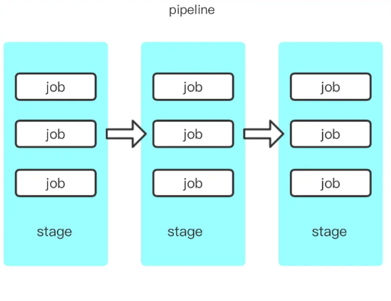

- [SDLC（安全开发生命周期 Security Development Life Cycle）](#sdlc安全开发生命周期-security-development-life-cycle)
  - [SDLC中的安全工作](#sdlc中的安全工作)
    - [准备阶段](#准备阶段)
    - [开发阶段](#开发阶段)
    - [部署阶段](#部署阶段)
    - [运营阶段](#运营阶段)
    - [废弃阶段](#废弃阶段)
    - [微软SDL流程](#微软sdl流程)
  - [三方库漏洞检测](#三方库漏洞检测)
    - [获得应用所依赖的三方库](#获得应用所依赖的三方库)
      - [二次依赖问题](#二次依赖问题)
    - [获得漏洞库](#获得漏洞库)
    - [对比得出结果](#对比得出结果)
      - [和CI/CD流程集成](#和cicd流程集成)
    - [检测工具](#检测工具)
      - [SCA(软件成分分析)](#sca软件成分分析)
      - [OWASP-Dependency-Check](#owasp-dependency-check)
    - [应用安全的风险面](#应用安全的风险面)
  - [参考](#参考)

# SDLC（安全开发生命周期 Security Development Life Cycle）
SDLC主要有以下流程：
1. 软件定义和需求分析
2. 软件设计
3. 软件开发
4. 软件测试
5. 运行维护
## SDLC中的安全工作
### 准备阶段
主要是在软件定义和需求分析，软件设计时针对人员进行相关安全意识培训。
### 开发阶段
1. 控制第三方和开源组件来源，统一制品库，对已知的开源组件，框架及时进行漏洞修复。
2. 建立安全编码规范和安全测试标准。
3. 模糊测试
4. 静态代码扫描（SAST）
5. SCA分析
6. 人工代码审计
### 部署阶段
1. 建立测试环境
2. DAST(IAST)
3. 渗透测试
### 运营阶段
1. 安全监控
2. RASP保护
3. 应急响应
### 废弃阶段
服务下线，关闭对应环境，域名解绑等。
### 微软SDL流程
1. 培训
> 安全培训
1. 需求
> 确定安全需求，创建安全标志，安全和隐私风险评估
1. 设计
> 分析设计要求，分析攻击面，威胁建模
1. 实施
> 使用安全工具，不使用不安全的第三方组件，函数，静态分析
1. 验证
> 动态分析，模糊测试，渗透测试，攻击面评析
1. 发布
> 事件响应计划，最终的安全评估
1. 响应
> 应急响应
## 三方库漏洞检测
实现机制：应用所依赖的三方库与漏洞库（cve、cnvd等）做对比，看是否有使用有漏洞的三方库版本。
分为三个步骤：
*  获得应用所依赖的三方库。
*  获得漏洞库。
*  做对比得出结果并通知修复。 
### 获得应用所依赖的三方库
应用程序如果使用开源三方库，一般会在配置文件中列出依赖包及其版本。所以最简单的方式就是去读取分析这个配置文件来获取依赖项信息。   
不同的语言有不同的配置文件：  
```
golang：go.sum
java：pom.xml，bulid.gradle
python：requirements.txt
nodejs：package.json
php：composer.lock 
```
#### 二次依赖问题
三方库是最新的，但是三方库的依赖有旧的有漏洞的三方库。  
解决方式：
1. 在业务代码之外维护一个公开项目，手动更新或者修复第三方依赖的问题，并定期用脚本对比自己维护的代码与第三方代码的差异，及时在第三方修复bug或者漏洞后把依赖再迁移回去。
### 获得漏洞库
定时拉取CVE,CNVD数据库，并实现一个三方库漏洞检测服务，当传入三方库的信息时能够返回是否有漏洞存在。
### 对比得出结果
检测时间最好在平时commit时就触发检测，如果在build的时候才检测留给研发再次修改的时间会比较紧，当使用了有漏洞的三方库时将消息推送到对应的开发人员，根据实际情况可以决定是否中断CI/CD流程。
#### 和CI/CD流程集成
CICD是基于自动化脚本的，我们需要将相关检测流程根据开发使用的CI/CD平台工具进行脚本化，然后插入当其自动触发流程中。  
以gitlib为例：  
* pipeline：是一个概念—任务流，没有具体的实体。构建中的阶段（stages）集合，比如自动构建、自动进行单元测试、代码审计等等，会按照顺序执行，所有阶段（stages）执行成功后，才算构建任务（pipeline）执行成功；如果某一个stage失败，后续不再执行，构建任务失败；而一个阶段（stage）可以包含多个job，这些job可以并行执行，某个失败即stage失败；这些stages、job都是定义在.gitlab-ci.yml中的。  
   
* runner：jobs的执行器。参考：https://www.cnblogs.com/cnundefined/p/7095368.html    
* .gitlab-ci.yml：用来指定构建、测试和部署流程、以及CI触发条件的脚本。Gitlab检测到.gitlab-ci.yml文件，若当前提交（commit）符合文件中指定的触发条件，则会使用配置的gitlab-runner服务运行该脚本进行测试等工作。
### 检测工具
#### SCA(软件成分分析)
SCA工具可以识别特定的开源版本，并关联相关的安全漏洞和许可证信息。高级的SCA工具可以自动化整个过程，从检测和识别组件到漏洞或许可证关联和潜在风险的修补。  
* 开源漏洞管理  
SCA工具将检测到的组件版本与已知的开源漏洞数据库（如NVD）进行撞库比对
* 开源许可证管理  
SCA可以检测与开发人员创建的软件中的开源组件相关联的许可证，并帮助规避其中潜在的开源风险。
* SBOM清单  
SCA扫描可以生成与软件和容器一起出现的开源组件的全面列表，包括在应用程序构建阶段解析到项目中的任何依赖项。其输出结果就是SBOM清单，其中包括关于检测到的开源组件的基本信息，通常包括：组件或库名称，版本，来源或分布，扫描项目中的文件路径等等。
#### OWASP-Dependency-Check
参考：https://developer.aliyun.com/article/698621
### 应用安全的风险面
1. Web通用漏洞
2. API安全
3. 业务逻辑漏洞
4. 开源组件安全
5. 容器镜像安全
6. 安全合规
## 参考
https://www.bilibili.com/read/cv10419374/  
https://www.bilibili.com/read/cv11528596/?spm_id_from=333.999.0.0