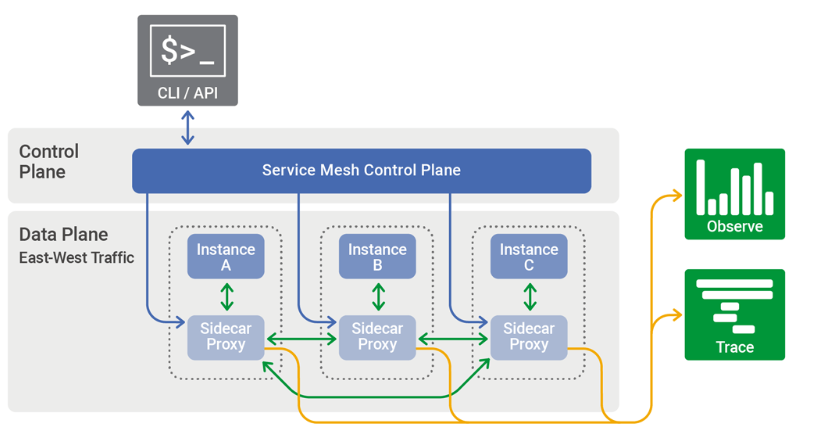
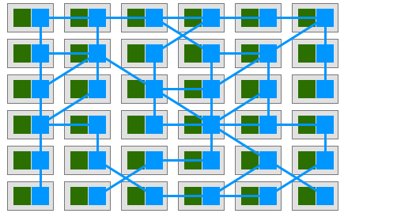
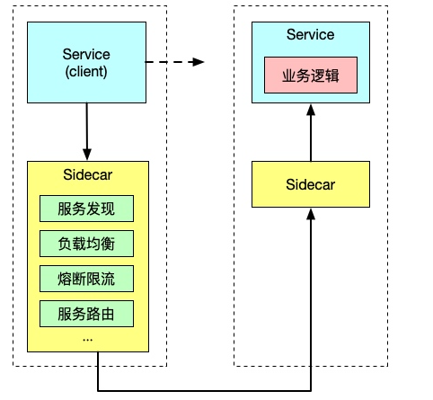

- [Service Mesh](#service-mesh)
  - [基础](#基础)
    - [Sidecar模式](#sidecar模式)
      - [部署方式](#部署方式)
    - [iptables](#iptables)
  - [参考](#参考)

# Service Mesh
## 基础
Service Mesh中文译名服务网格，是用以处理服务与服务之间通信的基础设施层。功能在于处理服务间通信，职责是实现请求的可靠传递。在实践中，Service Mesh通常由服务与轻量级网络代理（Sidecar，与服务部署在一起）组合而成。它在原有的客户端和服务端之间加了一个代理，但对应用程序透明。  
  
当其扩大到一定规模后，就会形成网格状（Mesh），即形成了Service Mesh的形态  

### Sidecar模式
实际上Sidecar就是一个部署在本地的代理服务器。它能接管入口和出口流量，类比Web Server中Nginx+php-fpm这种模式，只是协议由HTTP变为了FastCGI，不过Nginx只是代理了入口流量，并没有出口流量。  

#### 部署方式
在Sidecar部署方式中，每个应用的容器旁都会部署一个伴生容器（如 Envoy 或 MOSN），这个容器称之为Sidecar容器。  
Sidecar接管进出应用容器的所有流量。在Kubernetes的Pod中，在原有的应用容器旁边注入一个Sidecar容器，两个容器共享存储、网络等资源，可以广义的将这个包含了Sidecar容器的Pod理解为一台主机，两个容器共享主机资源。
### iptables
## 参考
http://rui0.cn/archives/1619