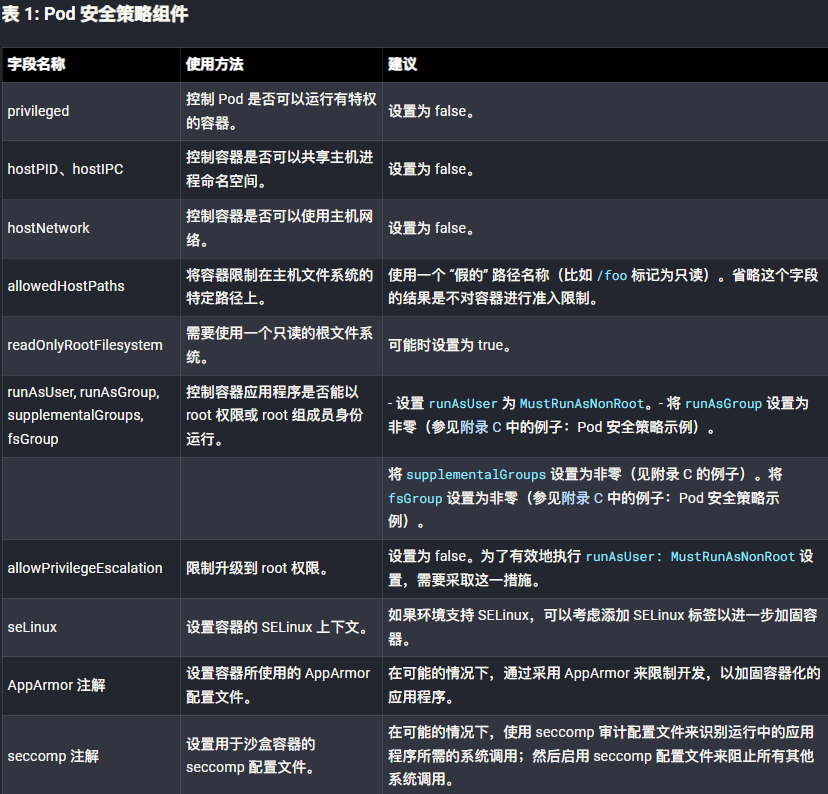
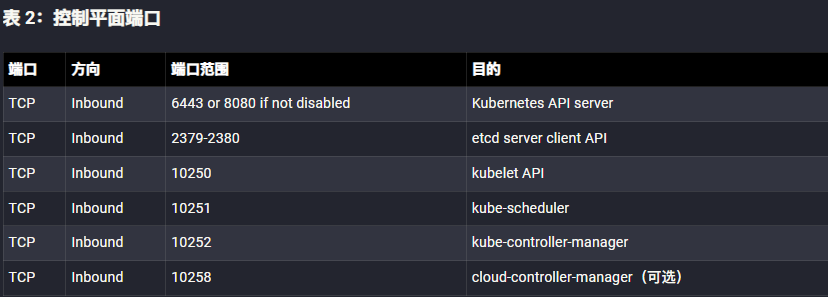
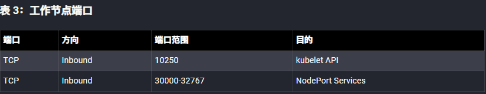

- [容器安全](#容器安全)
  - [Docker](#docker)
  - [Kubernetes](#kubernetes)
    - [架构](#架构)
      - [命令空间和集群](#命令空间和集群)
      - [节点(node)](#节点node)
        - [master 节点](#master-节点)
        - [work 节点](#work-节点)
      - [Pod](#pod)
      - [service](#service)
      - [ReplicationController(ReplicaSet)](#replicationcontrollerreplicaset)
      - [Kubectl](#kubectl)
    - [kubernetes Ingress \& Egress](#kubernetes-ingress--egress)
      - [Ingress Controller](#ingress-controller)
    - [Replica 和 ReplicaSet](#replica-和-replicaset)
    - [服务网格 (Service Mesh)](#服务网格-service-mesh)
  - [容器安全加固](#容器安全加固)
    - [Pod安全](#pod安全)
      - [限制root权限](#限制root权限)
      - [不可变的容器文件系统](#不可变的容器文件系统)
      - [基础镜像管理](#基础镜像管理)
        - [镜像存储](#镜像存储)
        - [镜像扫描](#镜像扫描)
      - [Pod 安全策略](#pod-安全策略)
      - [Pod 服务账户令牌](#pod-服务账户令牌)
      - [加固容器引擎](#加固容器引擎)
    - [网络隔离加固](#网络隔离加固)
      - [命名空间](#命名空间)
      - [网络策略](#网络策略)
      - [资源政策](#资源政策)
      - [控制平面加固](#控制平面加固)
        - [Etcd](#etcd)
        - [Kubeconfig 文件](#kubeconfig-文件)
      - [工作节点划分](#工作节点划分)
      - [加密](#加密)
      - [Secret](#secret)
    - [认证授权](#认证授权)
      - [认证](#认证)
      - [基于角色的访问控制](#基于角色的访问控制)
    - [日志审计](#日志审计)
  - [参考](#参考)

# 容器安全
容器是继虚拟机之后更高层次的抽象，在这层抽象中，整个应用程序的每个组件被单独打包成一个个独立的单元，这个单元就是所谓的容器。通过这种方式，可以将代码和应用服务从底层架构中分离出来，实现了完全的可移植性（在任何操作系统或环境上运行应用的能力）。
## Docker
Docker 是最常用的容器化工具，也是最流行的容器运行时。
## Kubernetes 
Kubernetes 可以一次性将变更传递给所有受控容器的方法，同时也可以轻松地调度可用容器，对容器进行编排、管理和监控容器化环境。  
>使用 Kubernetes 而不是直接使用 Docker 的原因之一，是因为 Kubernetes 能够自动扩展应用实例的数量以满足工作负载的需求。  
>自动缩放是通过集群设置来实现的，当服务需求增加时，增加节点数量，当需求减少时，则减少节点数量。  
### 架构
 Kubernetes 利用了“期望状态”原则。就是说，你定义了组件的期望状态，而 Kubernetes 要将它们始终调整到这个状态。  
 >例如，你想让你的 Web 服务器始终运行在 4 个容器中，以达到负载均衡的目的，你的数据库复制到 3 个不同的容器中，以达到冗余的目的。这就是你想要的状态。如果这 7 个容器中的任何一个出现故障，Kubernetes 引擎会检测到这一点，并自动创建出一个新的容器，以确保维持所需的状态。
#### 命令空间和集群
设置Kubernetes时可以设置命令空间(namespace)，命令空间之下还可以创建集群，而集群就是由各个容器组件组成，如果没有明确定义的命名空间，那么集群将始终在默认的命令空间中创建。  
#### 节点(node)
Kubernetes 运行在节点 (node) 上，节点是集群中的单个机器。一般一个节点对应一个虚拟机(云上环境)。
>  如果你有自己的硬件，节点可能对应于物理机器，但更可能对应于在云中运行的虚拟机。
> 
节点是部署应用或服务的地方，是 Kubernetes 工作的地方。有 2 种类型的节点master 节点和 worker 节点，所以说 Kubernetes 是主从结构的。
##### master 节点
主节点是一个控制其他所有节点的特殊节点。一方面，它和集群中的任何其他节点一样，这意味着它只是另一台机器或虚拟机。另一方面，它运行着控制集群其他部分的软件。  
它向集群中的所有其他节点发送消息，将工作分配给它们，工作节点向主节点上的 API Server 汇报。  
Master 节点本身也包含一个名为 API Server 的组件。这个 API 是节点与控制平面通信的唯一端点。API Server 至关重要，因为这是 worker 节点和 master 节点就 pod、deployment 和所有其他 Kubernetes API 对象的状态进行通信的点。
##### work 节点
Woker 节点是 Kubernetes 中真正干活的节点。当你在应用中部署容器或 pod时，其实是在将它们部署到 worker 节点上运行。Worker 节点托管和运行一个或多个容器的资源。
#### Pod
Kubernetes 中的逻辑而非物理的工作单位称为 pod。一个 pod 类似于 Docker 中的容器。  
一个 pod 允许你把多个容器，并指定它们如何组合在一起来创建应用程序。  
一个 Kubernetes pod 通常包含一个或多个 Docker 容器，所有的容器都作为一个单元来管理。比如要创建复杂的应用程序，比如 Web 服务器，你经常需要结合多个容器，然后在一个 pod 中一起运行和管理。
#### service 
Kubernetes 中的 service 是一组逻辑上的 pod。把一个 service 看成是一个 pod 的逻辑分组，它提供了一个单一的 IP 地址和 DNS 名称，你可以通过它访问服务内的所有 pod。
#### ReplicationController(ReplicaSet) 
ReplicationController 或 ReplicaSet 是 Kubernetes 的另一个关键功能。它是负责实际管理 pod 生命周期的组件——当收到指令时或 pod 离线或意外停止时启动 pod，也会在收到指示时杀死 pod。
#### Kubectl
kubectl 是一个命令行工具，用于与 Kubernetes 集群和其中的 pod 通信。使用它你可以查看集群的状态，列出集群中的所有 pod，进入 pod 中执行命令等。
### kubernetes Ingress & Egress
进入 Kubernetes pod 的流量称为 Ingress，而从 pod 到集群外的出站流量称为 egress。  
而我们需要设置安全规则允许哪些流量可以进入和离开“服务器”，创建入口策略和出口策略的目的是限制不需要的流量进入和流出服务。而这些策略也是定义 pod 使用的端口来接受传入和传输传出数据/流量的地方。
#### Ingress Controller
在定义入口和出口策略之前，必须首先启动被称为 Ingress Controller（入口控制器）的组件；这个在集群中默认不启动。有不同类型的入口控制器，Kubernetes 项目默认只支持 Google Cloud 和开箱即用的 Nginx 入口控制器。通常云供应商都会提供自己的入口控制器。
###  Replica 和 ReplicaSet
为了保证应用程序的弹性，需要在不同节点上创建多个 pod 的副本。这些被称为 Replica。
>假设你所需的状态策略是“让名为 webserver-1 的 pod 始终维持在 3 个副本”，这意味着 ReplicationController 或 ReplicaSet 将监控活动副本的数量，如果其中有任何一个 replica 因任何原因不可用（例如节点的故障），那么 Deployment Controller 将自动创建一个新的系统。
### 服务网格 (Service Mesh) 
服务网格 (Service Mesh) 用于管理服务之间的网络流量，是云原生的网络基础设施层，服务网格利用容器之间的网络设置来控制或改变应用程序中不同组件之间的交互。  
## 容器安全加固
### Pod安全
#### 限制root权限
默认情况下，许多容器服务以有特权的 root 用户身份运行，应用程序在容器内以 root 用户身份执行，尽管不需要有特权的执行。通过使用非 root 容器或无 root 容器引擎来防止 root 执行，可以限制容器受损的影响。需要确保兼容性
* 非 root 容器：
  
  容器引擎允许容器以非 root 用户和非 root 组成员身份运行应用程序。通常情况下，这种非默认设置是在构建容器镜像的时候配置的。
```dockerfile
FROM ubuntu:latest
# 升级和安装 make 工具
RUN apt update && apt install -y make
# 从一个名为 code 的文件夹中复制源代码，并使用 make 工具构建应用程序。
COPY ./code
RUN make /code
# 创建一个新的用户（user1）和新的组（group1）；然后切换到该用户的上下文中。
RUN useradd user1 && groupadd group1
USER user1:group1
# 设置容器的默认入口
CMD /code/app
```
* 非 root 用户：
  
    Kubernetes 可以在 SecurityContext:runAsUser 指定一个非root用户的情况下，将容器加载到 Pod。虽然 runAsUser 指令在部署时有效地强制非 root 执行。

* 无 root 的容器引擎：  

    一些容器引擎可以在无特权的上下文中运行，而不是使用以 root 身份运行的守护程序。在这种情况下，从容器化应用程序的角度来看，执行似乎是使用 root 用户，但执行被重新映射到主机上的引擎用户上下文。
#### 不可变的容器文件系统
默认情况下，容器在自己的上下文中被允许不受限制地执行。在容器中获得执行权限的网络行为者可以在容器中创建文件、下载脚本和修改应用程序。Kubernetes 管理员可以为应用程序需要写访问的特定目录挂载二级读 / 写文件系统。  
```yaml
apiVersion: apps/v1
kind: Deployment
metadata:
  labels:
    app: web
    name: web
  spec:
    selector:
      matchLabels:
        app: web
    template:
      metadata:
        labels:
          app: web
          name: web
      spec:
        containers:
        - command: ["sleep"]
          args: ["999"]
          image: ubuntu:latest
          name: web
          securityContext:
            readOnlyRootFilesystem: true #使容器的文件系统成为只读
          volumeMounts:
            - mountPath: /writeable/location/here #创建一个可写卷
              name: volName
        volumes:
        - emptyDir: {}
          name: volName
```
#### 基础镜像管理
##### 镜像存储
容器是基于一个或多个存储库中存储的映像构建的。 这些存储库可以属于公共注册表（例如 Docker Hub），也可以属于专用注册表。公用的容器映像不保证安全性。 容器映像包括多个软件层，每个软件层可能有漏洞。 为帮助减少攻击风险，应使用可信的存储库构建映像。  
##### 镜像扫描
在整个容器构建工作流程中，应该对镜像进行扫描，以识别过时的库、已知的漏洞或错误配置，如不安全的端口或权限。  
> 实现镜像扫描的一种方法是使用准入控制器。准入控制器是 Kubernetes 的原生功能，可以在对象的持久化之前，但在请求被验证和授权之后，拦截和处理对 Kubernetes API 的请求。可以实现一个自定义或专有的 webhook，以便在集群中部署任何镜像之前执行扫描。如果镜像符合 webhook 配置中定义的组织的安全策略，这个准入控制器可以阻止部署。
#### Pod 安全策略
Pod 安全策略（PSP）是一个集群范围内的策略，它规定了 Pod 在集群内执行的安全要求 / 默认值。PSP 建立了一个所有 Pod 必须遵守的最低安全门槛。一些 PSP 字段提供默认值，当 Pod 的配置省略某个字段时使用。其他 PSP 字段被用来拒绝创建不符合要求的 Pod。  
PSP 是通过 Kubernetes 准入控制器执行的，所以 PSP 只能在 Pod 创建期间执行要求。PSP 并不影响已经在集群中运行的 Pod。
>Pod 的创建应遵守最小授权原则。  

  

查看命名空间所有pod的安全策略： 
`kubectl get psp -n <namespace>`  
官方pod策略文档：  
```yaml
apiVersion: policy/v1beta1
kind: PodSecurityPolicy
metadata:
  name: restricted
  annotations:
    seccomp.security.alpha.kubernetes.io/allowedProfileNames: 'docker/default,runtime/default'
    apparmor.security.beta.kubernetes.io/allowedProfileNames: 'runtime/default'
    seccomp.security.alpha.kubernetes.io/defaultProfileName: 'runtime/default'
    apparmor.security.beta.kubernetes.io/defaultProfileName: 'runtime/default'
spec:
  privileged: false # 需要防止升级到 root
    allowPrivilegeEscalation: false
    requiredDropCapabilities:
      - ALL
  volumes:
    - 'configMap'
    - 'emptyDir'
    - 'projected'
    - 'secret'
    - 'downwardAPI'
    - 'persistentVolumeClaim' # 假设管理员设置的 persistentVolumes 是安全的
  hostNetwork: false
  hostIPC: false
  hostPID: false
  runAsUser:
    rule: 'MustRunAsNonRoot' # 要求容器在没有 root 的情况下运行 seLinux
    rule: 'RunAsAny' # 假设节点使用的是 AppArmor 而不是 SELinux
    supplementalGroups:
      rule: 'MustRunAs'
      ranges: # 禁止添加到 root 组
        - min: 1
          max: 65535
    runAsGroup:
      rule: 'MustRunAs'
      ranges: # 禁止添加到 root 组
        - min: 1
          max: 65535
    fsGroup:
      rule: 'MustRunAs'
      ranges: # 禁止添加到 root 组
        - min: 1
          max: 65535
  readOnlyRootFilesystem: true
```
#### Pod 服务账户令牌
默认情况下，Kubernetes 在创建 Pod 时自动提供一个服务账户（Service Account），并在运行时在 Pod 中挂载该账户的秘密令牌（token）。  
当应用程序不需要直接访问服务账户时，Kubernetes 管理员应确保 Pod 规范禁用正在加载的秘密令牌。  
可以通过 Pod 的 YAML 规范中的`automountServiceAccountToken: false`指令来完成。
#### 加固容器引擎
一些平台和容器引擎提供了额外的选项来加固容器化环境。比如使用管理程序来提供容器隔离。
### 网络隔离加固
配置网络策略用来隔离资源，防止集群被破坏时的横向移动或升级，主要通过资源隔离和加密的方式。
#### 命名空间
默认情况下，命名空间不会被自动隔离。然而，命名空间确实为一个范围分配了一个标签，这可以用来通过 RBAC 和网络策略指定授权规则。  
默认有三个命名空间，它们不能被删除：
* kube-system（用于 Kubernetes 组件）
* kube-public（用于公共资源）
* default（针对用户资源）  
* 
用户 Pod 不应该放在 kube-system 或 kube-public 中，因为这些都是为集群服务保留的。  
创建命令空间：
```yaml
apiVersion: v1
kind: Namespace
metadata:
  name: <insert-namespace-name-here>
```  
或`kubectl create namespace <insert-namespace-name-here>`
不同命名空间中的 Pod 和服务仍然可以相互通信，除非有额外的隔离措施，如网络策略。
#### 网络策略
默认情况下，没有网络策略应用于 Pod 或命名空间，导致 Pod 网络内的入口和出口流量不受限制。通过适用于 Pod 或 Pod 命名空间的网络策略，Pod 将被隔离。一旦一个 Pod 在网络策略中被选中，它就会拒绝任何适用的策略对象所不允许的任何连接。  
要创建网络策略，需要一个支持 NetworkPolicy API 的网络插件。使用 podSelector 和 / 或 namespaceSelector 选项来选择 Pod。  
最好的方式是创建一个默认选择所有Pod的网络策略来拒绝所有进站和出站流量，再根据Pod的实际需求创建额外策略来允许其通信。  
一个默认的拒绝所有入口的策略：
```yaml
apiVersion: networking.k8s.io/v1
kind: NetworkPolicy
metadata:
  name: deny-all-ingress
spec:
  podSelector: {}
  policyType:
    - Ingress
```
一个默认的拒绝所有出口的策略：
```yaml
apiVersion: networking.k8s.io/v1
kind: NetworkPolicy
metadata:
  name: deny-all-egress
spec:
  podSelector: {}
  policyType:
  - Egress
```
#### 资源政策
LimitRange 和 ResourceQuota 是两个可以限制命名空间或节点的资源使用的策略。LimitRange 策略限制了特定命名空间内每个 Pod 或容器的单个资源，ResourceQuotas 是对整个命名空间的资源使用总量的限制，例如对 CPU 和内存使用总量的限制。  
如果用户试图创建一个违反 LimitRange 或 ResourceQuota 策略的 Pod，则 Pod 创建失败。  
#### 控制平面加固
Kubernetes API 服务器运行在 6443 和 8080 端口上，这些端口应该受到防火墙的保护，只接受预期的流量。8080 端口，默认情况下，可以在没有 TLS 加密的情况下从本地机器访问，请求绕过认证和授权模块。  
不安全的端口可以使用 API 服务器标志 --insecure-port=0 来禁用。    

##### Etcd
etcd 后端数据库存储状态信息和集群 Secret。它是一个关键的控制平面组件，获得对 etcd 的写入权限可以使网络行为者获得对整个集群的 root 权限。  
Etcd 只能通过 API 服务器访问，集群的认证方法和 RBAC 策略可以限制用户。  
etcd 数据存储可以在一个单独的控制平面节点上运行，允许防火墙限制对 API 服务器的访问。  
管理员应该设置 TLS 证书以强制执行 etcd 服务器和 API 服务器之间的 HTTPS 通信。etcd 服务器应被配置为只信任分配给 API 服务器的证书。
##### Kubeconfig 文件
kubeconfig 文件包含关于集群、用户、命名空间和认证机制的敏感信息。Kubectl 使用存储在工作节点的 $HOME/.kube 目录下的配置文件，未经认证的非 root 用户应该被阻止访问这些文件。
#### 工作节点划分
管理员应主动限制攻击面，将工作节点与其他不需要与工作节点或 Kubernetes 服务通信的网段分开。  
  
#### 加密
管理员应配置 Kubernetes 集群中的所有流量 —— 包括组件、节点和控制计划之间的流量（使用 TLS 1.2 或 1.3 加密）。

加密可以在安装过程中设置，也可以在安装后使用 TLS 引导来创建并向节点分发证书。对于所有的方法，必须在节点之间分发证书，以便安全地进行通信。  
详见 Kubernetes 文档：https://kubernetes.io/docs/tasks/administer-cluster/securing-a-cluster/  
#### Secret
Kubernetes Secret 维护敏感信息，如密码、OAuth 令牌和 SSH 密钥。
>默认情况下，Secret 被存储为未加密的 base64 编码的字符串，并且可以被任何有 API 权限的人检索。
可以通过在 API 服务器上配置静态数据加密或使用外部密钥管理服务（KMS）来对秘密进行加密，该服务可以通过云提供商提供。  
要启用使用 API 服务器的 Secret 数据静态加密，管理员应修改 kube-apiserver 清单文件，以执行使用 --encryption-provider-config 参数执行。
```yaml
apiVersion: apiserver.config.k8s.io/v1
kind: EncryptionConfiguration
resources:
- resources:
  - secrets
  providers:
  - aescbc:
    keys:
    - name: key1
      secret: <base 64 encoded secret>
  - identity: {}
```
使用 KMS 提供者可以防止原始加密密钥被存储在本地磁盘上。要用 KMS 提供者加密 Secret，encryption-provider-config 文件中应指定 KMS 提供者，  
```yaml
apiVersion: apiserver.config.k8s.io/v1
kind: EncryptionConfiguration
resources:
- resources:
  - secrets
  providers:
  - kms:
    name: myKMSPlugin
    endpoint: unix://tmp/socketfile.sock
    cachesize: 100
    timeout: 3s
  - identity: {}
```
管理员可以运行以下命令来读取和加密所有的 Secret。
`kubectl get secrets --all-namespaces -o json | kubectl replace -f -`
### 认证授权
#### 认证
Kubernetes 集群有两种类型的用户：服务账户和普通用户账户。  
服务账户代表 Pod 处理 API 请求。  
认证通常由 Kubernetes 通过 ServiceAccount Admission Controller 使用承载令牌自动管理。不记名令牌被安装到 Pod 中约定俗成的位置，如果令牌不安全，可能会在集群外使用。正因为如此，对 Pod Secret 的访问应该限制在那些需要使用 Kubernetes RBAC 查看的人身上。  
用户认证的方法包括客户端证书、承载令牌、认证插件和其他认证协议。
#### 基于角色的访问控制
RBAC 是根据组织内个人的角色来控制集群资源访问的一种方法。在 Kubernetes 1.6 和更新的版本中，RBAC 是默认启用的。  
检查集群中是否启用了 RBAC：  
`kubectl api-version`  
RBAC可以设置两种类型的权限：Roles 和 ClusterRoles，Roles 和 ClusterRoles 只能用于添加权限。没有拒绝规则。  
>如果一个集群被配置为使用 RBAC，并且匿名访问被禁用，Kubernetes API 服务器将拒绝没有明确允许的权限。

Roles： 特定命名空间设置权限。  
ClusterRoles： 为所有集群资源设置权限，而不考虑命名空间。  
而RoleBindings 和 ClusterRoleBindings 用于将一个 Roles 或 ClusterRoles 与一个用户、组或服务账户联系起来。  
RoleBindings 和 ClusterRoleBindings 用于将一个 Roles 或 ClusterRoles 与一个用户、组或服务账户联系起来。
### 日志审计
在 Kubernetes 环境中，管理员应监控 / 记录以下内容：
```
API 请求历史
性能指标
部署情况
资源消耗
操作系统调用
协议、权限变化
网络流量
```
管理员应该针对该信息创建一个基线，来确定异常活动。
## 参考
https://jimmysong.io/blog/must-read-for-cloud-native-beginner/  
https://lib.jimmysong.io/kubernetes-hardening-guidance/kubernetes-pod-security/