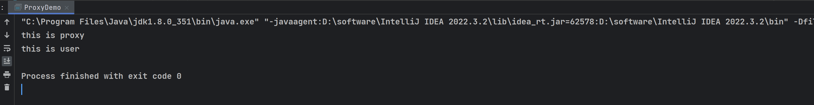
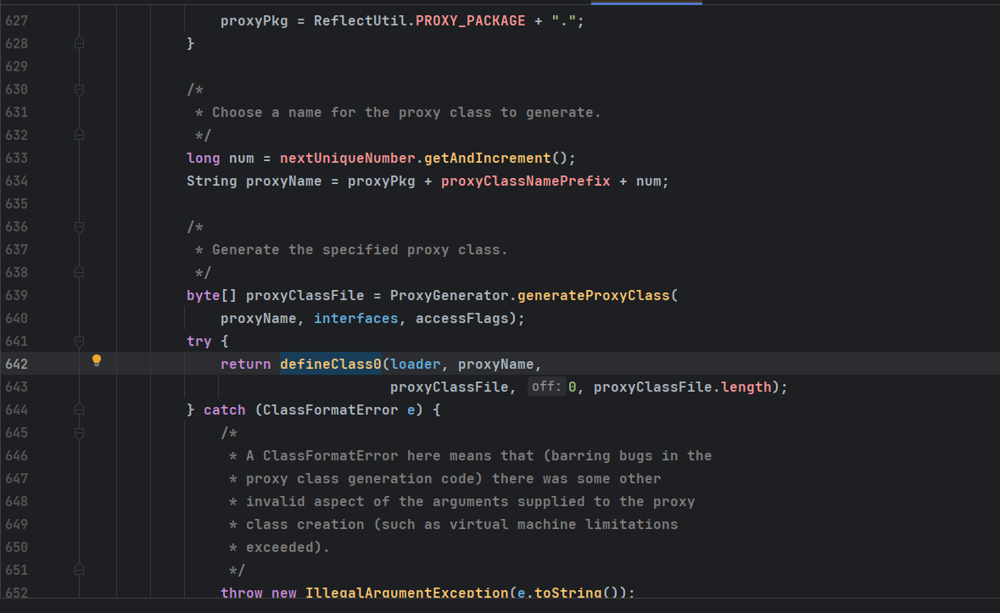

# JAVA代理机制
JAVA中代理的作用即可以在不修改一个类的源码情况下,对该类其相关方法进行增强.
## 静态代理
如一个UserImpl实现了User接口.
```java
package org.example;

public interface User {
    public void sayHi();
}

package org.example;

public class UserImpl implements User{
    @Override
    public void sayHi() {
        System.out.println("this is user");
    }
}
```  
现在想要在其sayHi方法前再增加一些操作,那么在不修改源码的情况下,我们可以创建一个代理类,其同样实现Userinterface接口,同时在其构造函数中接受一个User对象,然后再其实现的接口方法中加入增强的代码,然后再调用User对象原本的sayHi方法.
```java
package org.example;

public class UserProxy implements User{
    private User user;
    public UserProxy(User user){
        this.user = user;
    }

    @Override
    public void sayHi() {
        System.out.println("this is proxy");
        this.user.sayHi();
    }
}

```
现在如果要调用UserImpl的sayHi方法就可以通过调用代理的sayHi()方法,就实现了在不修改UserImpl的`sayHi`方法的情况下添加了额外的代码.
```java
package org.example;

public class ProxyDemo {
    public static void main(String[] args) {
        User user = new UserImpl();
        User userProxy = new UserProxy(user);
        userProxy.sayHi();
    }
}
```
  
思路即将被代理对象作为参数传给另一个实现了同样接口的代理对象中,在代理对象中对应的接口方法实现中加入额外的代码之后再调用传入的被代理对象的该方法.
## 动态代理
静态代理因为在代理类的接口方法实现时将要代理的方法写死了,如果在接口方法变化的情况下,那么需要同时修改被代理类和代理类的代码,同时如果有多个被代理对象需要代理,那么则需要针对每个被代理对象创建代理对象,或者在编译时并不知道接口方法的实现,在运行时才实现.

通过动态代理则可以在运行时针对实际情况创建对应的代理类对象，而不用在代码中显式的为被代理类对象一一手动创建代理类对象，其中利用Java的反射技术(Java Reflection)，在运行时创建一个实现某些给定接口的新类(也称"动态代理类")及其实例(对象)，代理的是接口(Interfaces)，不是类(Class)，更不是抽象类

## 调用处理器(InvocationHanlder)

调用处理器`InvocationHandlder`是一个接口类,该接口只有一个`invoke`方法,无论何时调用代理对象的方法,调用处理器的`invoke`方法都会被调用,并向其传递Method对象和原始的调用参数.

```java
Object invoke(Object proxy,Method method,Object[] args)
```

## 创建代理对象(Proxy.newProxyInstance)
使用`Proxy`类的`newProxyInstance`方法创建代理对象.

这个Porxy代理类的原理如下:  
通过Proxy.newProxyInstance创建一个代理类,其中接受三个参数,ClassLoader,被代理类的全部接口(如A数组),InvocationHandlder的实例.  

这个代理类是通过传入的ClassLoader来生成了一个实现了A数组全部接口并且含有一个属性为传入的InvocationHandlder的实例,而该实例是怎么实现A数组接口的呢,就是在所有接口的方法实现中都去调用传入的InvocationHandlder的invoke方法,其中将该接口的方法作为参数传入InvocationHandlder的invoke方法中,最后在InvocationHandlder的invoke方法中通过反射来调用被代理对象的执行方法.  

简单来说这个代理类的代码类似于这样:
`Proxy`类的`newProxyInstance`方法创建的代理类proxy$的代码类似于如下
```java
package dynamicproxy;

import module.User;

import java.lang.reflect.InvocationHandler;
import java.lang.reflect.Method;

public class proxy implements User {
    private InvocationHandler invocationHandler;
    public proxy(InvocationHandler invocationHandler){
        this.invocationHandler = invocationHandler;
    }
    private static Method m;
    static {
        try {
            m =  Class.forName("module.User").getMethod("sayHi");
        } catch (NoSuchMethodException e) {
            throw new RuntimeException(e);
        } catch (ClassNotFoundException e) {
            throw new RuntimeException(e);
        }
    }
    @Override
    public void sayHi() {
        try {
            this.invocationHandler.invoke(this, m, null);
        } catch (Throwable e) {
        }
    }
}
```
只不过在java的Proxy类里通过在`ProxyClassFactory`中使用defineClass字节码的方法来动态生成的这个Proxy$.  

所以动态代理的流程如下:
1. 有一个被代理对象User实现了接口Userinterface.
2. 我们自己创建一个InvacationHandler的子类,重写其invoke方法中加入我们想要加入的额外代码,其同时将被代理对象通过构造方法传入该子类中,invoke如下.  
```java
    private User user;
    public UserInvocationHandler(User user){
        this.user  = user;
    }

    @Override
    public Object invoke(Object proxy, Method method, Object[] args) throws Throwable {
        System.out.println("invoke running");
        method.invoke(user,args);
        System.out.println("invoke done");
        return null;
    }
```
3. 通过Proxy.newProxyInstance()创建一个代理类,将接口Userinterface和实现的InvacationHandler的子类传入,JAVA会通过字节码的方法来生成一个代理类,这个代理类有一个属性就是我们传入的InvacationHandler的子类,同时会实现传入的所有接口,实现方法就是去将当前方法作为参数去调用传入的InvacationHandler的子类的invoke方法.
4. 最终在我们实现的InvacationHandler的子类的invoke方法中根据传入的method参数反射来动态执行被代理对象的相应方法.


Demo:

```java
package dynamicproxy;

import module.User;

import java.lang.reflect.InvocationHandler;
import java.lang.reflect.Method;

public class UserInvocationHandler implements InvocationHandler {
    private User user;
    public UserInvocationHandler(User user){
        this.user  = user;
    }

    @Override
    public Object invoke(Object proxy, Method method, Object[] args) throws Throwable {
        System.out.println("invoke running");
        method.invoke(user,args);
        System.out.println("invoke done");
        return null;
    }
}


package dynamicproxy;

import module.User;

import java.lang.reflect.Proxy;

public class UserProxy {
    private User user;
    public UserProxy(User user){
        this.user = user;
    }
    public User getProxy(){
        final Class<?>[] interfaces = new Class[]{User.class};
        final UserInvocationHandler userInvocationHandler = new UserInvocationHandler(this.user);
        return (User) Proxy.newProxyInstance(User.class.getClassLoader(),interfaces,userInvocationHandler);
    }
}

import module.User;
import module.UserImpl;
import dynamicproxy.UserProxy;

public class ProxyDemo {
    public static void main(String[] args) {
        User user = new UserImpl();
        UserProxy userProxy =new UserProxy(user);
        User p = userProxy.getProxy();
        p.sayHi();

    }
}
```