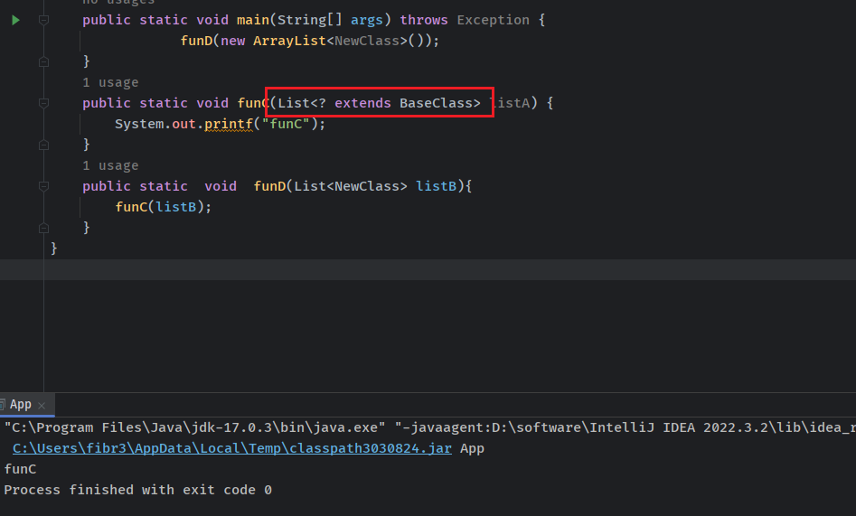

- [泛型](#泛型)
  - [泛型使用方法](#泛型使用方法)
    - [泛型类](#泛型类)
    - [泛型接口](#泛型接口)
    - [泛型方法](#泛型方法)
  - [泛型边界](#泛型边界)
  - [类型擦除](#类型擦除)
  - [参考](#参考)

# 泛型
泛型的作用在于进行代码复用，当某个方法适用于多种数据类型时不需要对每种数据类型都编写对应的实现，使用泛型可以只实现一次即可。  
如实现加法操作，参数可以是int，float，double类型，正常情况下需要根据不同类型实现对应的方法。  
```java
private static int add(int a, int b) {
    System.out.println(a + "+" + b + "=" + (a + b));
    return a + b;
}

private static float add(float a, float b) {
    System.out.println(a + "+" + b + "=" + (a + b));
    return a + b;
}

private static double add(double a, double b) {
    System.out.println(a + "+" + b + "=" + (a + b));
    return a + b;
}
```  
使用泛型则只需要实现一次：  
```java
private static <T extends Number> double add(T a, T b) {
    System.out.println(a + "+" + b + "=" + (a.doubleValue() + b.doubleValue()));
    return a.doubleValue() + b.doubleValue();
}
```  
另一个作用是提供类型的约束，提供编译前的检查，泛型中的类型在使用时指定，不需要强制类型转换（类型安全，编译器会检查类型）。
```java
List<String> list = new ArrayList<String>();
```
编译器会检查放入类型是否为String。
## 泛型使用方法
### 泛型类
由外部决定变量类型。使用<>关键字进行标识，字母随便取。
```java
    public class User<T> {//如果有多个变量，<K,V>即可
        private T details;
        public T getDetails() {
            return details;
        }
        public void setDetails(T details) {
            this.details = details;
        }
    }


    public static void main(String[] args){
            User<String> strUser = new User<String>();
            strUser.setDetails("details");
            System.out.println(strUser.getDetails());
            User<Integer> intUser = new User<Integer>();
            intUser.setDetails(2);
            System.out.println(intUser.getDetails().toString());
    }
```
### 泛型接口
```java
//Interface
public interface Product<T> {

    public T getProduct();
}


//Impl
public class ProductImpl<T> implements Product<T>{
    private T product;
    public ProductImpl(T product){
        this.product = product;
    }
    @Override
    public T getProduct() {
        return product;
    }
    public void setProduct(T product) {
        this.product = product;
    }
}


    public static void main(String[] args){
        Product<String> product = new ProductImpl<String>("test");
        System.out.printf(product.getProduct());
    }
```
### 泛型方法
在之前的泛型类中，如果想要换其它类型则需要重新new一个该泛型类，而泛型方法可以在调用的时候执定具体类型创建实例而不用重新创建泛型类。
```java
    public <T> T getObject(Class<T> c) throws Exception{
        T t = c.newInstance();
        return t;
    }

    public static void main(String[] args) throws Exception {
        ProductImpl<String> product = new ProductImpl<String>("test");
        System.out.println(product.getProduct());
        User ob = (User)product.getObject(Class.forName("User"));
        ob.setDetails("product create user");
        System.out.println(ob.getDetails().toString());
    }


输出：
test
product create user
```
## 泛型边界
在泛型中默认不会对类型进行自动转换，如下代码
```java
public class BaseClass {
}

public class NewClass  extends BaseClass{
}

    public static void main(String[] args) throws Exception {
                funD(new ArrayList<NewClass>());
    }
    public static void funC(List<BaseClass> listA) {
        System.out.printf("funC");
    }
    public static  void  funD(List<NewClass> listB){
        funC(listB);
    }
```
  
编译器会报错。
通过指定边界，即指定该泛型类型可以是某A类的子类（该情况下，A类为上边界）或者父类（该情况下，A类为下边界），可以让泛型在识别时将传入的类型视为上下边界类进行处理。  
  
**总结：**  
* <?> 无限制通配符。
* <? extends E> extends 关键字声明了类型的上界，表示参数化的类型可能是所指定的类型，或者是此类型的子类。
* <? super E> super 关键字声明了类型的下界，表示参数化的类型可能是指定的类型，或者是此类型的父类。
## 类型擦除
其实JAVA中的泛型是伪泛型，在语法上支持泛型语法，但在编译时会进行类型擦除，即确定所有泛型的具体类型。  
* 消除类型参数声明，即删除<>及其包围的部分。
* 根据类型参数的上下界推断并替换所有的类型参数为原生态类型：如果类型参数是无限制通配符或没有上下界限定则替换为Object，如果存在上下界限定则根据子类替换原则取类型参数的最左边限定类型（即父类）。
* 为了保证类型安全，必要时插入强制类型转换代码。
* 自动产生“桥接方法”以保证擦除类型后的代码仍然具有泛型的“多态性”。
## 参考
https://pdai.tech/md/java/basic/java-basic-x-generic.html