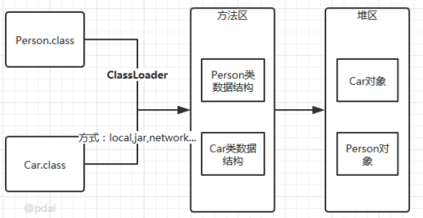

- [Java类加载机制](#java类加载机制)
  - [加载流程](#加载流程)
    - [加载](#加载)
    - [连接](#连接)
      - [验证](#验证)
      - [准备](#准备)
      - [解析](#解析)
    - [初始化](#初始化)
    - [使用](#使用)
    - [卸载](#卸载)
  - [类加载器](#类加载器)
    - [类的唯一性和类加载器](#类的唯一性和类加载器)
    - [三种类加载器](#三种类加载器)
    - [加载方式](#加载方式)
    - [JVM类加载机制](#jvm类加载机制)
      - [双亲委派模型](#双亲委派模型)
        - [打破方式](#打破方式)
    - [自定义类加载器](#自定义类加载器)
  - [参考](#参考)

# Java类加载机制
JAVA虚拟机把描述一个类的数据从class文件加载到内存中,对其进行校验,解析,初始化为一个可以被JAVA虚拟机使用的java类型即为类加载过程.

## 加载流程
### 加载
1. 通过全限定类名来获取定义此类的二进制字节流。
2. 将这个字节流所代表的静态存储结构转化为方法区的运行时数据结构。
3. 在内存中生成一个代表这个类的 java.lang.Class 对象，作为方法区这个类的各种数据的访问入口。  

  
>加载阶段(准确地说，是加载阶段获取类的二进制字节流的动作)是可控性最强的阶段，因为开发人员既可以使用系统提供的类加载器来完成加载，也可以自定义自己的类加载器来完成加载。
### 连接
#### 验证
1. 文件格式验证:文件头为0xCAFEBABY,主次版本号是否与虚拟机符合.
2. 元数据校验:主要检测是否符合语言规范.
3. 字节码验证:确定程序执行逻辑正确合法.
4. 符号引用验证:验证是否可以把符号引用转化为直接引用.
   `-Xverify:none`开关可以关闭大部分验证措施来提高加载速度.
#### 准备
为类变量分配内存并且初始化为默认值.
>这里所设置的初始值通常情况下是数据类型默认的零值(如0、0L、null、false等)，而不是被在Java代码中被显式地赋予的值。
#### 解析
虚拟机将常量池内的符号引用替换为直接引用的过程。
解析动作主要针对类或接口、字段、类方法、接口方法、方法类型、方法句柄和调用点限定符 7 类符号引用进行。
>直接引用就是直接指向目标的指针、相对偏移量或一个间接定位到目标的句柄。
### 初始化
初始化，为类的静态变量赋予正确的初始值，JVM负责对类进行初始化，主要对类变量进行初始化。在Java中对类变量进行初始值设定有两种方式:  
* 声明类变量是指定初始值
* 使用静态代码块为类变量指定初始值

**初始化步骤:**
* 假如这个类还没有被加载和连接，则程序先加载并连接该类
* 假如该类的直接父类还没有被初始化，则先初始化其直接父类
* 假如类中有初始化语句，则系统依次执行这些初始化语句

**类初始化时机:**  
只有当对类的主动使用的时候才会导致类的初始化（类加载器并不需要等到某个类被“首次主动使用”时再加载它，JVM规范允许类加载器在预料某个类将要被使用时就预先加载它），类的主动使用包括以下六种:
* 创建类的实例，也就是new的方式
* 访问某个类或接口的静态变量，或者对该静态变量赋值
* 调用类的静态方法
* 反射(如Class.forName("com.xxx.xx.Test"))
* 初始化某个类的子类，则其父类也会被初始化
* Java虚拟机启动时被标明为启动类的类(Java Test)，直接使用java.exe命令来运行某个主类
### 使用
类访问方法区内的数据结构的接口， 对象是Heap区的数据。
### 卸载  
Java虚拟机将结束生命周期的几种情况
* 执行了System.exit()方法
* 程序正常执行结束
* 程序在执行过程中遇到了异常或错误而异常终止
* 由于操作系统出现错误而导致Java虚拟机进程终止
## 类加载器
把实现类加载阶段中的“通过一个类的全限定名来获取描述此类的二进制字节流”这个动作的代码模块称为"类加载器",将 class 文件二进制数据放入方法区内，然后在堆内（heap）创建一个 java.lang.Class 对象，Class 对象封装了类在方法区内的数据结构，并且向开发者提供了访问方法区内的数据结构的接口.
### 类的唯一性和类加载器
对于任意一个类，都需要由加载它的类加载器和这个类本身一同确立其在Java虚拟机中的唯一性.
即使两个类来源于同一个 Class 文件，被同一个虚拟机加载，只要加载它们的类加载器不同，那这两个类也不相等.
这里所指的“相等”，包括代表类的 Class 对象的 equals() 方法、 isAssignableFrom() 方法、isInstance() 方法的返回结果，也包括使用 instanceof 关键字做对象所属关系判定等情况.
### 三种类加载器
Java 中的类加载器从开发角度大致可以分成三类。
>但从Java虚拟机的角度来讲，只存在两种不同的类加载器: 
> 1. 启动类加载器: 它使用C++实现(这里仅限于Hotspot，也就是JDK1.5之后默认的虚拟机，有很多其他的虚拟机是用Java语言实现的)，是虚拟机自身的一部分；
> 2. 所有其他的类加载器: 这些类加载器都由Java语言实现，独立于虚拟机之外，并且全部继承自抽象类java.lang.ClassLoader，这些类加载器需要由启动类加载器加载到内存中之后才能去加载其他的类。

* **引导类加载器(Bootstrap ClassLoader)：**  
它是由本地代码(c/c++)实现的，负责加载存放在JDK\jre\lib(JDK代表JDK的安装目录，下同)下，或被-Xbootclasspath参数指定的路径中的，并且能被虚拟机识别的类库(如rt.jar，所有的java.*开头的类均被Bootstrap ClassLoader加载)。他是用原生代码来实现的，并不继承自 java.lang.ClassLoader。

* **扩展类加载器(Extension ClassLoader)：**  
该加载器由sun.misc.Launcher$ExtClassLoader实现，它负责加载JDK\jre\lib\ext目录中，或者由java.ext.dirs系统变量指定的路径中的所有类库(如javax.*开头的类)，开发者可以直接使用扩展类加载器。
* **系统类加载器(Application  ClassLoader)：**  
该类加载器由sun.misc.Launcher$AppClassLoader来实现，它负责加载用户类路径(ClassPath)所指定的类，或者用到的第三方包,如jdbc驱动包等。开发者可以直接使用该类加载器，如果应用程序中没有自定义过自己的类加载器，一般情况下这个就是程序中默认的类加载器，除了系统提供的类加载器以外，开发人员可以通过继承 java.lang.ClassLoader类的方式实现自己的类加载器。  

如果编写了自己的ClassLoader，便可以做到如下几点:  
1. 在执行非置信代码之前，自动验证数字签名。
2. 动态地创建符合用户特定需要的定制化构建类。
3. 从特定的场所取得java class，例如数据库中和网络中。
### 加载方式
类的加载方式主要有三种。  
* 静态加载
通过new 关键字创建实例对象.
```java
User user = new User();
```
* 动态加载  

通过class.forName()加载,获取Class,然后调用Class的newInstance()创建实例.
```java
//会执行static代码块的内容
Class UserClass = Class.forName("com.test.User");
User user = UserClass.newInstance();
```
* ClassLoader.loadClass()方法动态加载  

通过类加载器的loadClass()方法来加载类,然后调用Class的newInstance()创建实例.
```java
//此时不执行static代码块的内容
Class UserClass = classLoader.loadClass("com.test.User");

User user = UserClass.newInstance();
```
> 使用ClassLoader.loadClass()来加载类，不会执行初始化块   
> 使用Class.forName()来加载类，默认会执行初始化块   
> 使用Class.forName()来加载类，并指定ClassLoader，初始化时不执行静态块 

Class.forName()和ClassLoader.loadClass()区别
> Class.forName(): 将类的.class文件加载到jvm中之外，还会对类进行解释，执行类中的static块；ClassLoader.loadClass(): 只干一件事情，就是将.class文件加载到jvm中，不会执行static中的内容,只有在newInstance才会去执行static块。
### JVM类加载机制
* **全盘负责：**  
当一个类加载器负责加载某个Class时，该Class所依赖的和引用的其他Class也将由该类加载器负责载入，除非显示使用另外一个类加载器来载入。
* **父类委托：**  
先让父类加载器试图加载该类，只有在父类加载器无法加载该类时才尝试从自己的类路径中加载该类。
* **缓存机制：**  
缓存机制将会保证所有加载过的Class都会被缓存，当程序中需要使用某个Class时，类加载器先从缓存区寻找该Class，只有缓存区不存在，系统才会读取该类对应的二进制数据，并将其转换成Class对象，存入缓存区。这就是为什么修改了Class后，必须重启JVM，程序的修改才会生效。
* **双亲委派机制：**  
如果一个类加载器收到了类加载的请求，它首先不会自己去尝试加载这个类，而是把请求委托给父加载器去完成，依次向上，因此，所有的类加载请求最终都应该被传递到顶层的启动类加载器中，只有当父加载器在它的搜索范围中没有找到所需的类时，即无法完成该加载，子加载器才会尝试自己去加载该类。
#### 双亲委派模型

如果一个类加载器收到了类加载的请求，它首先不会自己去尝试加载这个类，而是把这个请求委派给父类加载器去完成，每一个层次的类加载器都是如此，因此所有的加载请求最终都应该传送到顶层的启动类加载器中，只有当父加载器反馈自己无法完成这个加载请求（它的搜索范围中没有找到所需的类）时，子加载器才会尝试自己去加载。
  

1. 当AppClassLoader加载一个class时，它首先不会自己去尝试加载这个类，而是把类加载请求委派给父类加载器ExtClassLoader去完成。
2. 当ExtClassLoader加载一个class时，它首先也不会自己去尝试加载这个类，而是把类加载请求委派给BootStrapClassLoader去完成。
3. 如果BootStrapClassLoader加载失败(例如在$JAVA_HOME/jre/lib里未查找到该class)，会使用ExtClassLoader来尝试加载；
4. 若ExtClassLoader也加载失败，则会使用AppClassLoader来加载，如果AppClassLoader也加载失败，则会报出异常ClassNotFoundException。  
  
双亲委派优势
* 系统类防止内存中出现多份同样的字节码
* 保证Java程序安全稳定运行
##### 打破方式
* 自定义类加载，重写loadclass方法
因为双亲委派的机制都是通过这个方法实现的，这个方法可以指定类通过什么类加载器来进行加载，所有如果改写他的加载规则，相当于打破双亲委派机制

* 使用线程上下文类
引入线程上下类加载器，通过java.lang.Thread类的setContextClassLoader()方法进行设置,再如果创建线程是还未设置，它会从父线程继承一个，如果在应用程序全局范围内没有设置，那么这个线程上下类加载器就是应用程序类加载器.
通过`ClassLoader cl = Thread.currentThread().getContextClassLoader();`就可以得到应用程序类加载器,然后使用这个线程上下类加载器去加载所需的spi代码，就实现了在BootstrapClassLoader中去加载用户自定义代码，即提供了父类加载器中获取到子类加载器的方法,再通过该子类加载器去加载第三方代码.  
### 自定义类加载器
自定义类加载器一般都是继承自 ClassLoader 类，只需要重写 findClass 方法即可。需要注意不能把class文件放在类路径下，因为这样会由于双亲委托机制导致该类被AppClassLoader加载而不会被自定义类加载器加载。  
```java
package com.pdai.jvm.classloader;
import java.io.*;

public class MyClassLoader extends ClassLoader {

    private String root;

    protected Class<?> findClass(String name) throws ClassNotFoundException {
        byte[] classData = loadClassData(name);
        if (classData == null) {
            throw new ClassNotFoundException();
        } else {
            return defineClass(name, classData, 0, classData.length);
        }
    }

    private byte[] loadClassData(String className) {
        String fileName = root + File.separatorChar
                + className.replace('.', File.separatorChar) + ".class";
        try {
            InputStream ins = new FileInputStream(fileName);
            ByteArrayOutputStream baos = new ByteArrayOutputStream();
            int bufferSize = 1024;
            byte[] buffer = new byte[bufferSize];
            int length = 0;
            while ((length = ins.read(buffer)) != -1) {
                baos.write(buffer, 0, length);
            }
            return baos.toByteArray();
        } catch (IOException e) {
            e.printStackTrace();
        }
        return null;
    }

    public String getRoot() {
        return root;
    }

    public void setRoot(String root) {
        this.root = root;
    }

    public static void main(String[] args)  {

        MyClassLoader classLoader = new MyClassLoader();
        classLoader.setRoot("D:\\temp");

        Class<?> testClass = null;
        try {
            testClass = classLoader.loadClass("com.pdai.jvm.classloader.Test2");
            Object object = testClass.newInstance();
            System.out.println(object.getClass().getClassLoader());
        } catch (ClassNotFoundException e) {
            e.printStackTrace();
        } catch (InstantiationException e) {
            e.printStackTrace();
        } catch (IllegalAccessException e) {
            e.printStackTrace();
        }
    }
}
```
## 参考
https://www.cnblogs.com/czwbig/p/11127222.html  
https://baijiahao.baidu.com/s?id=1718315759630025016&wfr=spider&for=pc  
https://pdai.tech/md/java/jvm/java-jvm-classload.html