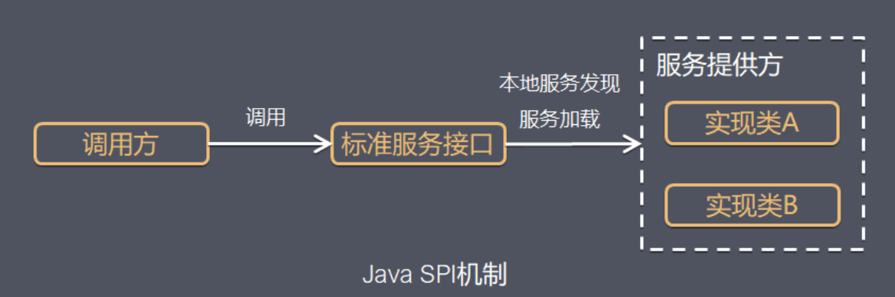
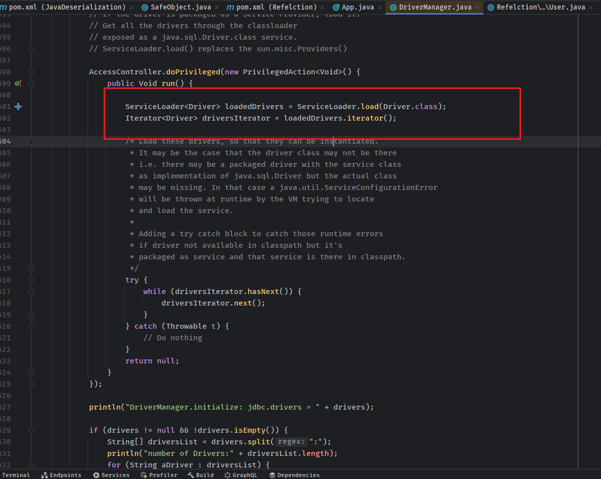

- [SPI机制](#spi机制)
  - [实现标准](#实现标准)
  - [常见使用场景](#常见使用场景)
    - [JDBC DriveManager](#jdbc-drivemanager)
    - [插件体系](#插件体系)
  - [参考](#参考)

# SPI机制
JAVA的SPI机制(Service Provider Interface服务提供接口机制)即可拔插机制，是JDK内置的一种服务提供发现机制，可以用来启用框架扩展和替换组件，为了实现各个模块之间能够基于接口编程，模块之间不对实现类进行硬编码，调用方只保留相关接口即可，再通过一种机制去加载其它模块的具体实现类。  
  
## 实现标准
**SPI具体约定：**  
当服务的提供者提供了服务接口的一种实现之后，在jar包的META-INF/services/目录里同时创建一个以服务接口命名的文件。该文件里就是实现该服务接口的具体实现类。而当外部程序装配这个模块的时候，就能通过该jar包META-INF/services/里的配置文件找到具体的实现类名，并装载实例化，完成模块的注入。基于这样一个约定就能很好的找到服务接口的实现类，而不需要再代码里制定。jdk提供服务实现查找的一个工具类：java.util.ServiceLoader。

SPI机制则也是使用了线程上下文类提供的加载器去加载用户ClassPath下的代码，这样也打破了双亲委派机制，通过线程上下文类得到应用加载器后使用`java.util.ServiceLoader.load(service，cl)`去加载用户代码。
## 常见使用场景
### JDBC DriveManager
在`java/sql/DriverManager.java#ensureDriversInitialized()`中就是使用了SPI机制来加载类路径下的数据库驱动。  
  
  
### 插件体系
通过SPI机制可以很好的开发插件体系，只需要定义好接口，开发者基于接口开发不同的功能插件，在META-INF/services/中配置对应的类名，应用就可以将对应的代码添加到jvm中。
## 参考
https://pdai.tech/md/java/advanced/java-advanced-spi.html