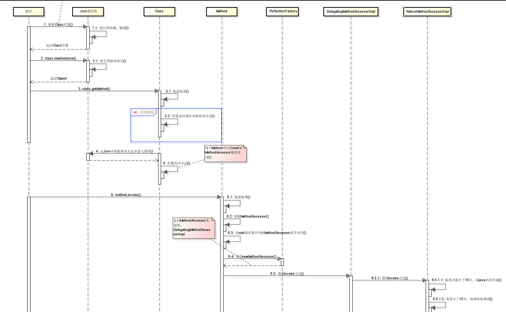

- [反射](#反射)
  - [Class类](#class类)
  - [使用方式](#使用方式)
    - [描述方法Method](#描述方法method)
    - [描述字段Field](#描述字段field)
    - [描述构造器Constructor](#描述构造器constructor)
  - [反射执行流程](#反射执行流程)
  - [参考](#参考)

# 反射
JAVA反射机制是指可以在程序运行时，对于任意一个类，都能够知道这个类的所有属性和方法；对于任意一个对象，都能够调用它的任意一个方法和属性，这种动态获取的信息以及动态调用对象的方法的功能称为Java语言的反射机制。
## Class类
Class也是一个类，只是它是一个描述类的类，也可以生成对象，在程序运行时，对于每个类而言，在JRE中有且仅有一个不变的Class类型的对象，而这个Class类型的对象只能由系统建立，封装了当前对象所对应的类的信息，有哪些属性、方法、构造器以及实现了哪些接口等。  
* 手动编写的类被编译后会产生一个Class对象，其表示的是创建的类的类型信息，而且这个Class对象保存在同名.class的文件中(字节码文件)  
* 每个通过关键字class标识的类，在内存中有且只有一个与之对应的Class对象来描述其类型信息，无论创建多少个实例对象，其依据的都是用一个Class对象。
* Class类只存私有构造函数，因此对应Class对象只能有JVM创建和加载。
* Class类的对象作用是运行时提供或获得某个对象的类型信息。

>在Java中，Class类与java.lang.reflect类库一起对反射技术进行了全力的支持。通过java.lang.reflect类库可以获取Class对象的各个属性和方法。

获取Class对象的三种方式:
1. 通过类名获取，类名.class。
2. 通过对象获取，对象.getClass()。
3. 通过全类名获取，Class.forName（全类名）。

Class类常用方法:
  
## 使用方式
### 描述方法Method
Method 提供关于类或接口上单独某个方法（以及如何访问该方法）的信息，所反映的方法可能是类方法或实例方法（包括抽象方法）。  
描述方法主要是4个获取方法（getMethods、getMethod、getDeclaredMethods、getDeclaredMethod）和1个调用方法（invoke）。

* getMethods：获取clazz对应类中的所有方法，不能获取private方法，且获取从父类继承来的所有方法，包括私有父类的私有方法。
* getMethod：获取clazz对应类中指定方法名和参数类型的方法，不能获取private方法，且获取从父类继承来的所有方法，包括私有父类的私有方法。因为存在同方法名不同参数这种情况，所以只有同时指定方法名和参数类型才能唯一确定一个方法。
* getDeclaredMethods：获取所有方法，包括私有方法，所有声明的方法，都可以获取到，且只获取当前类的方法。
* getDeclaredMethod：获取clazz对应类中指定方法名和参数类型的方法，包括私有方法，所有声明的方法，都可以获取到，且只获取当前类的方法。
* invoke：执行方法，第一个参数表示执行哪个对象的方法，剩下的参数是执行方法时需要传入的参数，私有方法的执行必须在调用invoke之前加上一句“method.setAccessible(true);”。
```java
Class clazz = Class.forName("reflect.Circle");
//创建对象
Circle circle = (Circle) clazz.newInstance();
//获取指定参数的方法对象Method
Method method = clazz.getMethod("draw",int.class,String.class);
//通过Method对象的invoke(Object obj,Object... args)方法调用
method.invoke(circle,15,"圈圈");
```
### 描述字段Field
Field 提供有关类或接口的单个字段的信息，以及对它的动态访问权限。反射的字段可能是一个类（静态）字段或实例字段。  
四个获取字段的方法（getFields、getField、getDeclaredFields、getDeclaredField）。
* getFields：获得某个类的所有公共（public）字段，包括父类中的字段。
* getField：获取某个类public成员变量中指定变量名的字段，包括基类。
* getDeclaredFields：获得某个类所有声明的字段，包括public、private和protected，但是不包括父类的声明字段。
* getDeclaredField：获取某个类的所有成员变量指定变量名的字段，不包括基类。
```java
Class<?> clazz = Class.forName("reflect.Student");
Student st= (Student) clazz.newInstance();
//获取父类public字段并赋值
Field ageField = clazz.getField("age");
ageField.set(st,18);
```
>如果字段是私有的，那么不管是读值还是写值，都必须先调用setAccessible(true)方法.
### 描述构造器Constructor
Constructor类存在于反射包(java.lang.reflect)中，反映的是Class对象所表示的类的构造方法。

常用的几个方法：getConstructors、getDeclaredConstructors、getConstructor、getDeclaredConstructor。  
* getConstructors：获取对应类中public类型的构造函数，且只获取当前类的构造函数。
* getConstructor：获取对应类中public指定参数类型的构造函数，且只获取当前类的构造函数。
* getDeclaredConstructors：获取对应类中所有构造函数，包括私有构造函数，且只获取当前类的构造函数。
* getDeclaredConstructor：获取对应类中指定参数类型的方法，包括私有构造函数，且只获取当前类的方法。
```java
        clazz = Class.forName("com.example.javabase.User");
        //获取带String参数的public构造函数
        Constructor cs1 =clazz.getConstructor(String.class);
        //创建User
        User user1= (User) cs1.newInstance("test");
```
>针对prviate构造函数，获取到之后需要执行cs1.setAccessible(true);设置为可访问。
## 反射执行流程  
  

反射的实现原理：
1. 反射类及反射方法的获取，都是通过从列表中搜寻查找匹配的方法，所以查找性能会随类的大小方法多少而变化；
2. 每个类都会有一个与之对应的Class实例，从而每个类都可以获取method反射方法，并作用到其他实例身上；
3. 反射也是考虑了线程安全的，放心使用；
4. 反射使用软引用relectionData缓存class信息，避免每次重新从jvm获取带来的开销；
5. 反射调用多次生成新代理Accessor, 而通过字节码生存的则考虑了卸载功能，所以会使用独立的类加载器；
6. 当找到需要的方法，都会copy一份出来，而不是使用原来的实例，从而保证数据隔离；
7. 调度反射方法，最终是由jvm执行invoke0()执行；
## 参考
https://pdai.tech/md/java/basic/java-basic-x-reflection.html