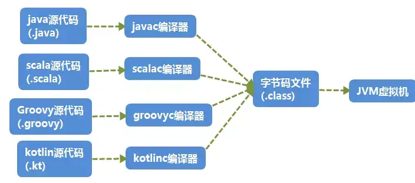
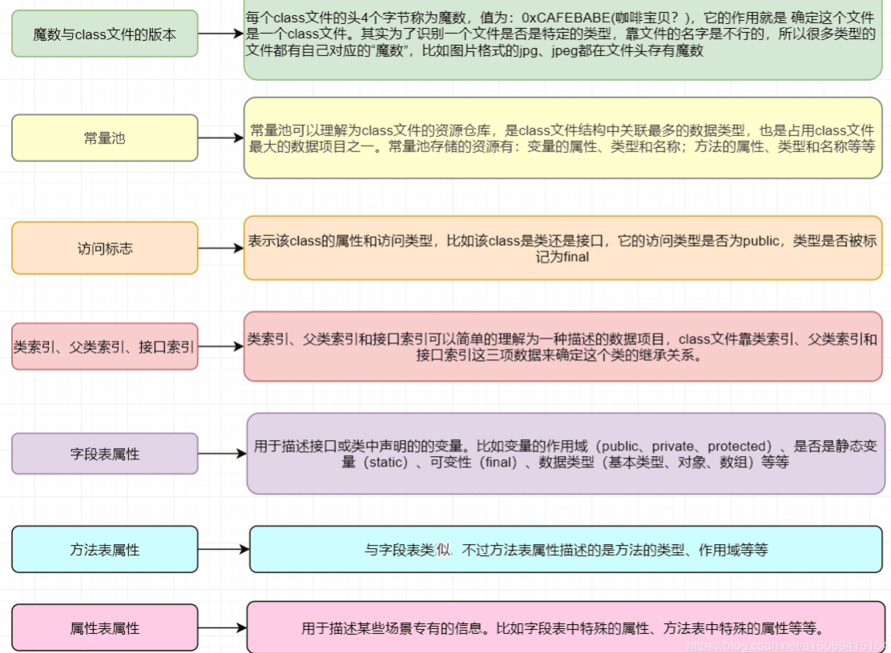
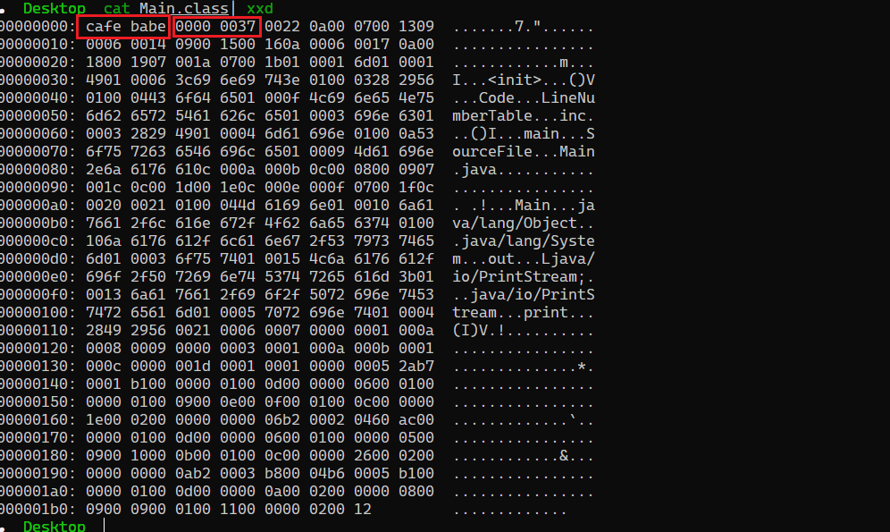

- [字节码](#字节码)
  - [字节码文件结构](#字节码文件结构)
  - [字节码操作工具](#字节码操作工具)
    - [Javassist](#javassist)
  - [参考](#参考)

# 字节码
计算机是不能直接运行java代码的，必须要先运行java虚拟机，再由java虚拟机运行编译后的java代码。这个编译后的java代码，就是java字节码。
j* Java代码间接翻译成字节码，储存字节码的文件再交由运行于不同平台上的JVM虚拟机去读取执行，从而实现一次编写，到处运行的目的。
* JVM也不再只支持Java，由此衍生出了许多基于JVM的编程语言，如Groovy, Scala, Koltin等等。
  
也就说jvm虚拟机只识别字节码文件，并不关心字节码文件怎么生成的，只要符合字节码文件标准就能在jvm虚拟机中运行。
## 字节码文件结构
class文件本质上是一个以8位字节为基础单位的二进制流，各个数据项目严格按照顺序紧凑的排列在class文件中。jvm根据其特定的规则解析该二进制数据，从而得到相关信息。 
  
```java
public class Main{
	private static int m;

	public static int inc(){
	return m+1;}

	public static void main(){
    	System.out.print(inc());
	}
}
```  
使用javac Main.java即可编译该java源代码为字节码文件，在当前目录生成Main.class文件。用16查看其内容如下。  
  
查看前8个字节分别是cafebabe 4字节的魔术字符和4字节的版本信息，0000为jdk编译器次版本，0037为十进制的55，java的版本号从45开始，除1.0和1.1都是使用45.x外,以后每升一个大版本，版本号加一，可以得到该class文件是用jdk 11.0编译。  
而Java自带了反编译工具javap可以反编译class文件。执行javap -verbose -p Main.class。
```java
Classfile /mnt/c/Users/xxx/Desktop/Main.class
  Last modified Nov 6, 2023; size 445 bytes
  MD5 checksum 81dc553c02777476ebb6ea562c80c537
  Compiled from "Main.java"
public class Main
  minor version: 0
  major version: 55
    //前7行包括Class文件当前所在位置，最后修改时间，文件大小，MD5值，编译自哪个文件，类的全限定名，jdk次版本号，主版本号。
  flags: (0x0021) ACC_PUBLIC, ACC_SUPER
    //该类的访问标志
    //标志名称标志值含义
    //ACC_PUBLIC0x0001是否为Public类型
    //ACC_FINAL0x0010是否被声明为final，只有类可以设置、
    //ACC_SUPER0x0020是否允许使用invokespecial字节码指令的新语义．
    //ACC_INTERFACE0x0200标志这是一个接口
    //ACC_ABSTRACT0x0400是否为abstract类型，对于接口或者抽象类来说，次标志值为真，其他类型为假
    //ACC_SYNTHETIC0x1000标志这个类并非由用户代码产生
    //ACC_ANNOTATION0x2000标志这是一个注解
    //ACC_ENUM0x4000标志这是一个枚举
  this_class: #6                          // Main
  super_class: #7                         // java/lang/Object
  interfaces: 0, fields: 1, methods: 3, attributes: 1
  //该类的一些统计，定义的字段，方法，属性等。
Constant pool:
//常量池，主要保存该类的所有资源，比如定义的常量还有一些符号引用。
//JVM是在加载Class文件的时候才进行的动态链接，也就是说这些字段和方法符号引用只有在运行期转换后才能获得真正的内存入口地址。
//当虚拟机运行时，需要从常量池获得对应的符号引用，再在类创建或运行时解析并翻译到具体的内存地址中。
   #1 = Methodref          #7.#19         // java/lang/Object."<init>":()V
   #2 = Fieldref           #6.#20         // Main.m:I
   #3 = Fieldref           #21.#22        // java/lang/System.out:Ljava/io/PrintStream;
   #4 = Methodref          #6.#23         // Main.inc:()I
   #5 = Methodref          #24.#25        // java/io/PrintStream.print:(I)V
   #6 = Class              #26            // Main
   #7 = Class              #27            // java/lang/Object
   #8 = Utf8               m
   #9 = Utf8               I
  #10 = Utf8               <init>
  #11 = Utf8               ()V
  #12 = Utf8               Code
  #13 = Utf8               LineNumberTable
  #14 = Utf8               inc
  #15 = Utf8               ()I
  #16 = Utf8               main
  #17 = Utf8               SourceFile
  #18 = Utf8               Main.java
  #19 = NameAndType        #10:#11        // "<init>":()V
  #20 = NameAndType        #8:#9          // m:I
  #21 = Class              #28            // java/lang/System
  #22 = NameAndType        #29:#30        // out:Ljava/io/PrintStream;
  #23 = NameAndType        #14:#15        // inc:()I
  #24 = Class              #31            // java/io/PrintStream
  #25 = NameAndType        #32:#33        // print:(I)V
  #26 = Utf8               Main
  #27 = Utf8               java/lang/Object
  #28 = Utf8               java/lang/System
  #29 = Utf8               out
  #30 = Utf8               Ljava/io/PrintStream;
  #31 = Utf8               java/io/PrintStream
  #32 = Utf8               print
  #33 = Utf8               (I)V
  //常量池之后是方法表集合
  //这里主要描述该类的方法和涉及的堆栈操作。
{
  private static int m;
    descriptor: I
    flags: (0x000a) ACC_PRIVATE, ACC_STATIC

  public Main();
    descriptor: ()V
    flags: (0x0001) ACC_PUBLIC
    Code:
      stack=1, locals=1, args_size=1
         0: aload_0
         1: invokespecial #1                  // Method java/lang/Object."<init>":()V
         4: return
      LineNumberTable:
        line 1: 0

  public static int inc();
    descriptor: ()I
    flags: (0x0009) ACC_PUBLIC, ACC_STATIC
    Code:
      stack=2, locals=0, args_size=0
         0: getstatic     #2                  // Field m:I
         3: iconst_1
         4: iadd
         5: ireturn
      LineNumberTable:
        line 5: 0

  public static void main();
    descriptor: ()V
    flags: (0x0009) ACC_PUBLIC, ACC_STATIC
    Code:
      stack=2, locals=0, args_size=0
         0: getstatic     #3                  // Field java/lang/System.out:Ljava/io/PrintStream;
         3: invokestatic  #4                  // Method inc:()I
         6: invokevirtual #5                  // Method java/io/PrintStream.print:(I)V
         9: return
      LineNumberTable:
        line 8: 0
        line 9: 9
}
SourceFile: "Main.java"
```  

## 字节码操作工具
### Javassist
Javassist是一个用来处理Java字节码的类库.

```java
    public static void main(String[] args) throws Exception{
            ClassPool pool = ClassPool.getDefault();
            CtClass cc = pool.makeClass("poctest");
            cc.setSuperclass((pool.get(AbstractTranslet.class.getName())));
            CtConstructor cons = new CtConstructor(new CtClass[]{},cc);
            cons.setBody("{ Runtime.getRuntime().exec(\"calc.exe\");}");
            cc.addConstructor(cons);
            byte[] bytecodes=cc.toBytecode();
```
## 参考
https://pdai.tech/md/java/jvm/java-jvm-class.html