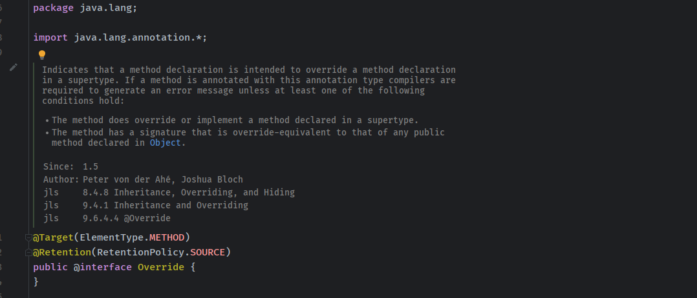
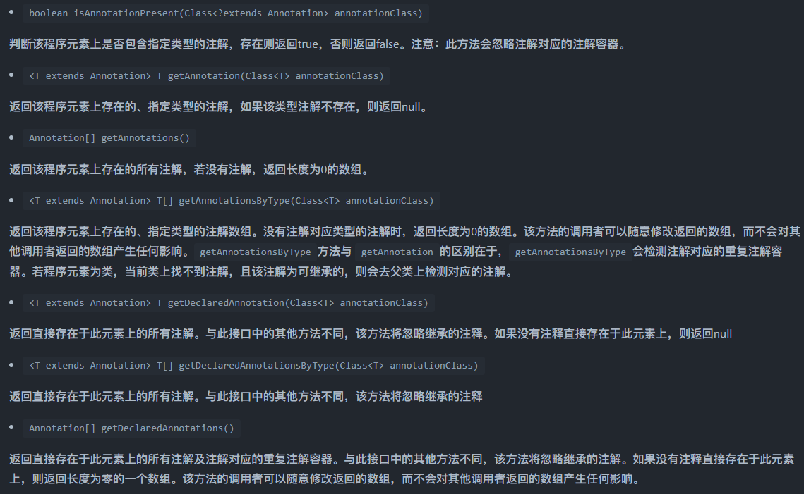

- [注解](#注解)
  - [注解类型](#注解类型)
    - [元注解](#元注解)
    - [内置注解](#内置注解)
    - [自定义注解](#自定义注解)
  - [使用反射获取注解](#使用反射获取注解)
  - [使用场景](#使用场景)
  - [参考](#参考)

# 注解
注解是JDK1.5版本开始引入的一个特性，用于对代码进行说明，可以对包、类、接口、字段、方法参数、局部变量等进行注解。  
* 生成文档，通过代码里标识的元数据生成javadoc文档。
* 编译检查，通过代码里标识的元数据让编译器在编译期间进行检查验证。编
* 译时动态处理，编译时通过代码里标识的元数据动态处理，例如动态生成代码。
* 运行时动态处理，运行时通过代码里标识的元数据动态处理，例如使用反射注入实例。

## 注解类型
常见注解分类：  
* **Java自带的内置标准注解:**   
  包括@Override、@Deprecated和@SuppressWarnings，分别用于标明重写某个方法、标明某个类或方法过时、标明要忽略的警告，用这些注解标明后编译器就会进行检查。
* **元注解:**  
  元注解是用于定义注解的注解，包括@Retention、@Target、@Inherited、@Documented，@Retention用于标明注解被保留的阶段，@Target用于标明注解使用的范围，@Inherited用于标明注解可继承，@Documented用于标明是否生成javadoc文档。
* **自定义注解:**  
  可以根据自己的需求定义注解，并可用元注解对自定义注解进行注解。
### 元注解
元注解负责注解自定义注解。java.lang.annotation提供了5种元注解，专门注解其他的注解
* @Retention：什么时候使用该注解。
* @Target：注解用于什么地方。
* @Documented：注解是否将包含在JavaDoc中。
* @Inherited：是否允许子类继承该注解。
* @Repeatable：指定注解可重复使用。
### 内置注解
* @Deprecated:编译器遇到该注解时会提醒这是一个过时的元素。
* @Override: 提示要复写父类的方法。
  
* @SuppressWarnings: 阻止警告,即忽略如@Deprecated产生的警告。
* @SafeVarargs: 参数安全类型注解。它的目的是提醒开发者不要用参数做一些不安全的操作，它的存在会阻止编译器产生unchecked这样的警告。
* @FunctionalInterface：函数式接口注解，函数式接口（FunctionalInterface）就是一个具有一个方法的普通接口。
### 自定义注解
自定义注解时是有一些规则限制的，具体如下： 
* Annotation型定义为@interface，所有的Annotation会自动继承java.lang.Annotation这一接口，并且不能再去继承别的类或是接口。
* 参数成员只能用public或默认（default）这两个访问权修饰。
* 参数成员只能用基本类型byte、short、char、int、long、float、double、boolean八种基本数据类型和String、Enum、Class、annotations等数据类型，以及这一些类型的数组.
* 要获取类方法和字段的注解信息，必须通过Java的反射技术来获取Annotation对象，因为除此之外没有其他获取注解对象的方法。
* 注解也可以没有定义成员。
## 使用反射获取注解
反射包java.lang.reflect下的AnnotatedElement接口提供获取注解中的内容的方法，只有注解被定义为RUNTIME后，该注解才能是运行时可见，当class文件被装载时被保存在class文件中的Annotation才会被虚拟机读取。常见接口方法如下：    

## 使用场景
1. 使用注解做bean的属性值校验，例如在开发Java服务器端代码时，会要求对外部传来的参数合法性进行验证。hibernate-validator提供了一些常用的参数校验注解。
2. 使用注解做权限控制。例如，shiro框架中有5个权限注解，我们也可以自定义注解进行权限控制.
3. 代替配置文件功能，像Spring基于注解的配置，减少了xml的配置
4. 可以生成文档，像Java代码注释中的@see、@param等。


常见使用步骤:
1. 反射获取全部Methods。
2. 遍历Method查找指定注解。  
```java
if (method.isAnnotationPresent(MyMethodAnnotation.class))
```
3. 遍历方法上的所有指定注解。  
```java
  for (Annotation anno : method.getDeclaredAnnotations())
```
4. 获取指定注解对象信息
```java
    MyMethodAnnotation methodAnno = method .getAnnotation(MyMethodAnnotation.class);
    System.out.println(methodAnno.title());
```
## 参考
https://www.cnblogs.com/-zhong/p/14961183.html  
https://pdai.tech/md/java/basic/java-basic-x-annotation.html