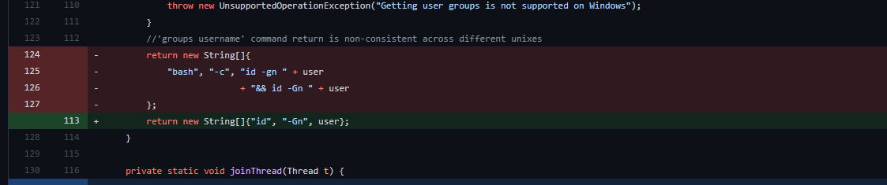

- [Web漏洞修复方案](#web漏洞修复方案)
  - [XSS](#xss)
    - [过滤](#过滤)
    - [黑白名单](#黑白名单)
    - [配置](#配置)
    - [Referer XSS](#referer-xss)
      - [Referrer-Policy](#referrer-policy)
  - [点击劫持](#点击劫持)
    - [浏览器端](#浏览器端)
    - [X-Frame-Options](#x-frame-options)
    - [CSP](#csp)
  - [CSRF](#csrf)
  - [SSRF](#ssrf)
    - [黑白名单](#黑白名单-1)
    - [过滤响应](#过滤响应)
    - [禁止跳转](#禁止跳转)
    - [获取访问的真实IP](#获取访问的真实ip)
  - [CORS](#cors)
    - [JSONP](#jsonp)
  - [HTTP 请求走私](#http-请求走私)
  - [缓存中毒](#缓存中毒)
  - [XXE](#xxe)
  - [XPath注入](#xpath注入)
    - [过滤](#过滤-1)
    - [预编译](#预编译)
  - [SQL注入](#sql注入)
    - [使用预编译](#使用预编译)
      - [MyBatis](#mybatis)
      - [orderby](#orderby)
      - [模糊查询](#模糊查询)
    - [强制转换类型](#强制转换类型)
    - [黑(白)名单](#黑白名单-2)
  - [文件上传](#文件上传)
  - [目录遍历](#目录遍历)
  - [身份验证](#身份验证)
  - [越权](#越权)
    - [权限校验](#权限校验)
  - [RCE](#rce)
    - [系统命令执行](#系统命令执行)
    - [动态调用](#动态调用)
    - [脚本语言](#脚本语言)
      - [Groovy](#groovy)
      - [脚本引擎](#脚本引擎)
  - [表达式注入](#表达式注入)
    - [SPEL](#spel)
    - [OGNL\&EL](#ognlel)
    - [白名单过滤](#白名单过滤)
  - [反序列化](#反序列化)
    - [校验过滤](#校验过滤)
      - [Apache Commons IO](#apache-commons-io)
    - [SnakeYaml](#snakeyaml)
    - [更新组件](#更新组件)
  - [SSTI](#ssti)
    - [Freemarker](#freemarker)
    - [Velocity](#velocity)
    - [组件漏洞](#组件漏洞)
      - [Xstream](#xstream)
      - [FastJson](#fastjson)
      - [Jackson](#jackson)
  - [JNDI 注入](#jndi-注入)
  - [OpenRedict](#openredict)
    - [白名单](#白名单)
  - [Spring系列配置错误](#spring系列配置错误)
    - [Actuator未授权访问](#actuator未授权访问)
    - [安全配置](#安全配置)
  - [参考](#参考)
# Web漏洞修复方案
## XSS
### 过滤
在Web的Filter或者拦截器设置过滤或者使用工具包(xssProtect)
* 黑名单对常见标签和关键字过滤,正则匹配.
* 转义编码(HTML实体,URL编码)常见特殊字符.  
```java
private static String XssFilter(String content) {
    content = StringUtils.replace(content, "&", "&amp;");
    content = StringUtils.replace(content, "<", "&lt;");
    content = StringUtils.replace(content, ">", "&gt;");
    content = StringUtils.replace(content, "\\", "&quot;");
    content = StringUtils.replace(content, "'", "&#x27;");
    content = StringUtils.replace(content, "/", "&#x2F;");
    return content;
}   
```
springframework.web.util.HtmlUtils的htmlEscape方法可对特殊字符进行转义.
### 黑白名单
在富文本的场景下,对允许的标签和标签属性和标签属性的值根据业务情况做黑名单和白名单的限制.
```java
    Whitelist whitelist = (new Whitelist())
           .addTags("p", "hr", "div", "img", "span", "textarea")  // 设置允许的标签
           .addAttributes("a", "href", "title")          // 设置标签允许的属性, 避免如nmouseover属性
           .addProtocols("img", "src", "http", "https")  // img的src属性只允许http和https开头
           .addProtocols("a", "href", "http", "https");
```
### 配置
* 正确设置响应包的Content-Type,禁止非HTML类型的响应包设置为“text/html".
* 控制用户登录鉴权的Cookie字段 应当设置HttpOnly属性以防止被XSS漏洞/JavaScript操纵泄漏。
### Referer XSS
#### Referrer-Policy
```
Referrer-Policy: no-referrer——不显示Referrer的任何信息在请求头中。  
Referrer-Policy: no-referrer-when-downgrade——这是默认值。当从https网站跳转到http网站或者请求其资源时（安全降级HTTPS→HTTP）,不显示Referrer的信息,其他情况（安全同级HTTPS→HTTPS,或者HTTP→HTTP）则在Referrer中显示完整的源网站的URL信息。  
Referrer-Policy: origin——表示浏览器在Referrer字段中只显示源网站的源地址（即协议、域名、端口）,而不包括完整的路径。
Referrer-Policy: origin-when-cross-origin——当发请求给同源网站时,浏览器会在Referrer中显示完整的URL信息,发个非同源网站时,则只显示源地址（协议、域名、端口）  
Referrer-Policy: same-origin——表示浏览器只会显示Referrer信息给同源网站,并且是完整的URL信息。所谓同源网站,是协议、域名、端口都相同的网站。 
Referrer-Policy: strict-origin——该策略更为安全些,和origin策略相似,只是不允许Referrer信息显示在从https网站到http网站的请求中（安全降级）。  
Referrer-Policy: strict-origin-when-cross-origin——和origin-when-cross-origin相似,只是不允许Referrer信息显示在从https网站到http网站的请求中（安全降级）。  
Referrer-Policy: unsafe-url——浏览器总是会将完整的URL信息显示在Referrer字段中,无论请求发给任何网站。 
```  
## 点击劫持
### 浏览器端
1. 检查并强制执行当前应用程序窗口是主窗口或顶层窗口.
2. 使所有框架可见.
3. 防止点击不可见的框架.
4. 拦截并标记对用户的潜在点击劫持攻击.
### X-Frame-Options 
通过指定X-Frame-Options头来限制当前页面是否可以被加载到其它域中.  
```
X-Frame-Options: deny //拒绝被加载
X-Frame-Options: sameorigin //只能被同源网站加载
X-Frame-Options: allow-from https://normal-website.com //只能被指定网站加载
```
### CSP
通过CSP来限制其它网站加载当前网站.  
Content-Security-Policy: frame-ancestors 'self';
Content-Security-Policy: frame-ancestors normal-website.com;
Content-Security-Policy: frame-ancestors deny;
## CSRF
* 在敏感页面的请求中加入唯一的Token,后端对敏感请求进行Token校验,而正常情况下(如果存在XSS可获得Token)攻击者无法获得该Token,则无法冒充用户进行敏感操作.

* 验证 HTTP Referer 字段,该方法可轻易绕过.

* 在 HTTP 头中自定义属性并验证,类似于加Token,只是加在HTTP头中,即每个页面都会带上该Token校验头,而不必在每个相关页面代码中都加上Token.
## SSRF
### 黑白名单
* 使用白名单: 只允许访问使用http/https协议访问可信域名和端口
* 使用黑名单: 禁止访问私有地址段及内网域名,禁止访问非常用http端口,禁止其它file:///,gopher://,ftp://协议访问.
### 过滤响应
* 统一错误信息,避免用户可以根据错误信息来判断远端服务器的端口状态。
* 过滤返回信息,验证远程服务器对请求的响应是比较容易的方法。如果web应用是去获取某一种类型的文件。那么在把返回结果展示给用户之前先验证返回的信息是否符合标准。  
### 禁止跳转
* 对已校验通过地址进行访问时，应关闭跟进跳转功能,防止通过短链接等跳转到内网IP.
### 获取访问的真实IP
* 建议通过URL解析函数进行解析，获取host或者domain后通过DNS获取其IP，然后和内网地址进行比较(注意各种进制转换绕过)。
```java
public String HTTPURLConnection(String url) {
    // 校验 url 是否以 http 或 https 开头
    if (!Security.isHttp(url)) {
        log.error("[HTTPURLConnection] 非法的 url 协议：" + url);
        return "不允许非http/https协议!!!";
    }
    // 解析 url 为 IP 地址
    String ip = Security.urltoIp(url);
    log.info("[HTTPURLConnection] SSRF解析IP：" + ip);

    // 校验 IP 是否为内网地址
    if (Security.isIntranet(ip)) {
        log.error("[HTTPURLConnection] 不允许访问内网：" + ip);
        return "不允许访问内网!!!";
    }
    try {
        return HttpClientUtils.HTTPURLConnection(url);
    } catch (Exception e) {
        log.error("[HTTPURLConnection] 访问失败：" + e.getMessage());
        return "访问失败，请稍后再试!!!";
    }
}
// 1. 判断是否为http协议
public static boolean isHttp(String url) {
    return url.startsWith("http://") || url.startsWith("https://");
}
// 2. 解析IP地址
public static String urltoIp(String url) {
    try {
        URI uri = new URI(url);
        String host = uri.getHost().toLowerCase();
        InetAddress ip = Inet4Address.getByName(host);
        return ip.getHostAddress();
    } catch (Exception e) {
        return "127.0.0.1";
    }
}
// 3. 判断是否为内网IP
public static boolean isIntranet(String url) {
    Pattern reg = Pattern.compile("^(127\\.0\\.0\\.1)|(localhost)|^(10\\.\\d{1,3}\\.\\d{1,3}\\.\\d{1,3})|^(172\\.((1[6-9])|(2\\d)|(3[01]))\\.\\d{1,3}\\.\\d{1,3})|^(192\\.168\\.\\d{1,3}\\.\\d{1,3})$");
    Matcher match = reg.matcher(url);
    Boolean a = match.find();
    return a;
}
// 4. 不允许302跳转
HttpURLConnection conn = (HttpURLConnection) u.openConnection();
conn.setInstanceFollowRedirects(false); // 不允许重定向或者对重定向后的地址做二次判断
conn.connect();
```
## CORS
1. 正确配置跨域请求
如果 Web 资源包含敏感信息,则应在标头中正确指定源,配置Access-Control-Allow-Origin字段.
2. 仅允许受信任的站点  
标头中指定的来源应仅是受信任的站点。特别是,动态反映来自跨源请求的源而无需验证是很容易被利用的,应避免使用。Access-Control-Allow-Origin  
3. 避免将空列入白名单
避免使用标头。Access-Control-Allow-Origin: null
4. 避免在内部网络中使用通配符  
当内部浏览器可以访问不受信任的外部域时,仅信任网络配置来保护内部资源是不够的。
1. CORS 不能替代服务器端安全策略  
CORS定义了浏览器行为,绝不能替代服务器端对敏感数据的保护 - 攻击者可以直接伪造来自任何受信任来源的请求。因此,除了正确配置的 CORS 之外,Web 服务器还应继续对敏感数据（如身份验证和会话管理）应用保护。
### JSONP
1. 接受请求时检查referer来源；
2. 在请求中添加token并在后端进行验证；
3. 严格过滤 callback 函数名及 JSON 里数据的输出。
4. 设置SameSite: (https://developer.mozilla.org/zh-CN/docs/Web/HTTP/Headers/Set-Cookie/SameSite)  

SameSite 是 HTTP 响应头 Set-Cookie 的属性之一。它允许您声明该 Cookie 是否仅限于第一方或者同一站点上下文。
SameSite 接受下面三个值:
* Lax:Cookies 允许与顶级导航一起发送,并将与第三方网站发起的 GET 请求一起发送。这是浏览器中的默认值。

* Strict:Cookies 只会在第一方上下文中发送,不会与第三方网站发起的请求一起发送。

* None:Cookie 将在所有上下文中发送,即允许跨站发送。
## HTTP 请求走私
* 禁用代理服务器与后端服务器之间的TCP连接重用。
* 使用HTTP/2协议。
* 前后端使用相同的服务器。
* 使前端服务器规范化不明确的请求，并使后端服务器拒绝任何仍不明确的请求，从而在此过程中关闭 TCP 连接。
* 拒绝标头中包含换行符、标头名称中包含冒号以及请求方法中包含空格的请求。
## 缓存中毒
缓存中毒产生的原因则就是请求中的unkeyed参数会对响应内容造成变化，导致其缓存的响应内容包含了攻击者可控的内容,导致下一个用户请求时也会得到恶意的缓存内容。
* 完全禁用缓存(不现实)。
* 保证缓存的内容为真正的全静态内容，不是动态生成的响应。
## XXE
配置相关FEATURE来关闭DTD解析禁用外部实体。
```java
"http://apache.org/xml/features/disallow-doctype-decl", true //禁止DOCTYPE 声明
"http://apache.org/xml/features/nonvalidating/load-external-dtd", false //禁止导入外部dtd文件
"http://xml.org/sax/features/external-general-entities", false //禁止外部普通实体
"http://xml.org/sax/features/external-parameter-entities", false //禁止外部参数实体
```
```java
XMLConstants.ACCESS_EXTERNAL_DTD, ""
XMLConstants.ACCESS_EXTERNAL_STYLESHEET, ""
```
## XPath注入
### 过滤
* 对用户输入进行转义，以防止攻击者注入恶意内容。例如，可以使用 Apache Commons Text 库中的 StringEscapeUtils.escapeXml10() 方法来转义用户输入中的特殊字符。
* 使用白名单过滤用户输入，只允许用户提交特定的合法字符。例如，可以规定用户只能输入字母、数字和小数点，不能输入特殊字符或 XPath 关键字。
### 预编译
使用预编译的 XPath 查询来替代动态构造的查询。例如，可以预先编译一个 XPath 查询模板，然后使用参数来填充模板中的占位符，最终得到一个完整的查询。
## SQL注入
### 使用预编译
使用预编译功能够在提供运行效率的同时预防大多数得SQL注入, 预编译可以提前将要执行的SQL语句逻辑进行编译,用占位符对参数进行占位,在使用预编译时数据库只会将占位符上传入的参数当作数据进行计算而不是会改变原有的SQL逻辑和结构.  
JAVA:
```java
String sql = "select * from userinfo where id = ？";
ps = conn.prepareStatement(sql);
ps.setInt(1,id);
rs = ps.executeQuery();
```
php:
```php
$sql = "select * from userinfo where id = ？";
$stmt = $pdo->prepare($sql);
$stmt->bindValue(1,"test");
$result = $stmt->execute();
```
#### MyBatis
MyBatis中使用`#{}`表示在底层使用`?`作为占位符使用参数化预编译,`${}`则是使用字符串拼接的方法。
```xml
<mapper namespace="a.v.c.aMapper">
<select id="getUser" result="a.v.c.User">
select * from user where id = #{id}
</select>
</mapper>
```
```java

```
#### orderby
order by后面的语句无法进行预编译,因为prepareStatement使用占位符占位时,传入数据的位置会被单引号包裹，而order by后面跟的只能是字段名字或者位置,如果被单引号包裹则只会被当作字符串,无法进行排序,所以orderby只能进行拼接,需要进行手动过滤.  
或者对字段进行映射.
```xml
<select id="orderBySafe" resultType="com.best.hello.entity.User">
    select * from users
    <choose>
        <when test="field == 'id'">
            order by id desc
        </when>
        <when test="field == 'user'">
            order by user desc
        </when>
        <otherwise>
            order by id desc
        </otherwise>
    </choose>
</select>
               
```
对于表名、列名等无法进行预编译的场景，比如外部数据拼接到order by, group by语句中，需通过白名单的形式对数据进行校验，例如判断传入列名是否存在、升降序仅允许输入“ASC”和“DESC”、表名列名仅允许输入字符、数字、下划线等。
#### 模糊查询
模糊查询如`%`,`_`,主要是预编译不会对`%`,`_`语句进行转义,而这两个是like模糊查询的通配符关键字,可以考虑使用concat进行连接.
```
@Select("select * from users where user like concat('%',#{q},'%')")
List<User> search(String q);
```
### 强制转换类型
对参数的类型进行严格转换,如int类型的参数则只接受int类型的数据.
### 黑(白)名单
对常见的SQL注入关键字建立黑名单,手动转义单双引号等或者在不影响业务的情况下会传入的数据进行白名单校验.
## 文件上传
* 对后缀做白名单校验
```java
// 获取文件后缀名
        String Suffix = fileName.substring(fileName.lastIndexOf("."));

        String[] SuffixSafe = {".jpg", ".png", ".jpeg", ".gif", ".bmp", ".ico"};
        boolean flag = false;

        for (String s : SuffixSafe) {
            if (Suffix.toLowerCase().equals(s)) {
                flag = true;
                break;
            }
        }
```
* 限制回显: 对上传的文件回显相对路径或者不显示路径,文件保存时，将文件名替换为随机字符串。
* 限制上传目录权限: 设置目录权限限制，禁止上传目录的执行权限。
* 存储分离: 在OSS静态服务器上存储文件,将上传的文件和服务器分开.
## 目录遍历
* 文件目录避免外部参数拼接。
* 保存文件目录建议后台写死并对文件名进行校验（字符类型、长度）。
* 建议文件保存时，将文件名替换为随机字符串。
* 过滤..和/,可以防止遍历操作.
## 身份验证
* JWT认证弱密钥: 弱密钥可能导致被爆破.
* 验证码复用: 验证码应该每一次请求后无论成功还是失败都应该销毁重新生成,防止爆破.
## 越权
### 权限校验
对于个人账户操作，应当校验当前访问账号进行操作权限和数据权限校验。
* 验证当前用户的登录态
* 从可信结构中获取经过校验的当前请求账号的身份信息（如：session）。禁止从用户请求参数或Cookie中获取外部传入不可信用户身份直接进行查询。
* 校验当前用户是否具备该操作权限
* 校验当前用户是否具备所操作数据的权限，避免越权。
## RCE
### 系统命令执行
1. 不可信数据仅作为执行命令的参数而非命令。
不要将参数命令和执行命令做拼接,如图所示,将命令和参数分开传入。

1. 对外部传入数据进行过滤。可通过白名单限制字符类型,仅允许字符、数字、下划线；或过滤转义以下符号:|;&$><`（反引号）!.
2. 禁止外部数据直接直接作为操作系统命令执行。
### 动态调用
有时候代码中没有直接执行命令的函数,但支持从输入中的参数中获取数据动态执行.比如php中的call_user_function,JAVA的反射等,需要对用户输入的数据作过滤.
### 脚本语言
#### Groovy
对传入的Groovy代码需要做有效过滤.  
关键类函数特征
```java
groovy.lang.GroovyShell	evaluate
groovy.util.GroovyScriptEngine	run
groovy.lang.GroovyClassLoader	parseClass
javax.script.ScriptEngine	eval
```
####  脚本引擎
```java
// 通过加载远程js文件来执行代码，如果加载了恶意js则会造成任意命令执行
// 远程恶意js: var a = mainOutput(); function mainOutput() { var x=java.lang.Runtime.getRuntime().exec("open -a Calculator");}
// ⚠️ 在Java 8之后移除了ScriptEngineManager的eval

public void jsEngine(String url) throws Exception {
    ScriptEngine engine = new ScriptEngineManager().getEngineByName("JavaScript");
    Bindings bindings = engine.getBindings(ScriptContext.ENGINE_SCOPE);
    String payload = String.format("load('%s')", url);
    engine.eval(payload, bindings);
}
```
## 表达式注入
### SPEL
使用`SimpleEvaluationContext`代替`StandardEvaluationContext`,SimpleEvaluationContext 旨在仅支持 SpEL 语言语法的一个子集。它不包括 Java 类型引用，构造函数和 bean 引用.
[官方文档](https://docs.spring.io/spring-framework/docs/5.0.6.RELEASE/javadoc-api/org/springframework/expression/spel/support/SimpleEvaluationContext.html)  
参考:  
[CVE-2022-22980](https://github.com/spring-projects/spring-data-mongodb/commit/5e241c6ea55939c9587fad5058a07d7b3f0ccbd3)
### OGNL&EL
使用黑名单,对用户输入做严格过滤在不影响业务的情况下使用白名单.
### 白名单过滤
白名单过滤外部输入，仅允许字符、数字、下划线等。
## 反序列化
### 校验过滤
对于来源不可信的序列化数据，不要直接进行反序列化，而应该先进行校验.
#### Apache Commons IO
使用Apache Commons IO的ValidatingObjectInputStream，accept方法来实现反序列化类白/黑名单控制.
```java
        ByteArrayInputStream stream = new ByteArrayInputStream(bytes);
        ValidatingObjectInputStream ois = new ValidatingObjectInputStream(stream);
        // 只允许反序列化Student class
        ois.accept(Student.class);
        ois.readObject();
```
### SnakeYaml
```java
    Yaml y = new Yaml();
    y.load(content);
```
使用SafeConstructor, SafeConstructor 是 SnakeYaml 提供的一个安全的构造器。它可以用来构造安全的对象，避免反序列化漏洞的发生。
```java
    Yaml y = new Yaml(new SafeConstructor());
    y.load(content);
```
### 更新组件
更新创建Gadget利用的组件,如commons-collections、commons-io等第三方库版本。
## SSTI
### Freemarker
`${...}`FreeMarker将会输出真实的值来替换大括号内的表达式,这样的表达式被称为interpolation(插值).
ftl文件中FTL标签的内容会被解析,在用户输入传递到这些标签中时需要做严格过滤.  

利用方式有两种方式  
API: 通过它可以访问底层Java Api Freemarker的 BeanWrappers.该配置在2.3.22版本之后默认不开启,但通过Configurable.setAPIBuiltinEnabled可以开启它。

new: new()函数可创建任意实现了TemplateModel接口的Java对象，同时还可以触发没有实现 TemplateModel接口的类的静态初始化块。官方提供的一种限制方式,使用Configuration.setNewBuiltinClassResolver(TemplateClassResolver)或设置 new_builtin_class_resolver 来限制这个内建函数对类的访问。  
此处官方提供了三个预定义的解析器(从2.3.17版开始)。  
* UNRESTRICTED_RESOLVER: 简单地调用 ClassUtil.forName(String).
* SAFER_RESOLVER: 和第一个类似,但禁止解析 ObjectConstructor,Execute和freemarker.template.utility.JythonRuntime.
* ALLOWS_NOTHING_RESOLVER: 禁止解析任何类。
### Velocity
`#`关键字Velocity关键字都是使用#开头的，如#set、#if、#else、#end、#foreach等,Velocity变量都是使用`$`开头的，如:$name、$msg  
通过`$`获取变量的的class再加载恶意类.  
对传入到vm模板文件`$`中的内容做严格过滤.  
### 组件漏洞
更新安全版本,根据POC对传入的数据做过滤.
#### Xstream
1.4.10后可启用默认安全配置，setupDefaultSecurity.
#### FastJson
通过配置以下参数开启 SafeMode 来防护攻击：ParserConfig.getGlobalInstance().setSafeMode(true).
#### Jackson
    (1) 禁止开启DefaultTyping功能。
    (2) 禁止使用JsonTypeInfo.Id.CLASS注解值。
    (3) 禁止使用JsonTypeInfo.Id.MINIMAL_CLASS注解值.
## JNDI 注入
* 使用高版本JDK.
* 限制出网环境,限制服务器能访问公网(白名单)的范围.
* 过滤本地恶意Facotry.对高版本的JNDI利用可以在内部对Factory类做黑名单过滤.
* 限制协议,只允许java协议
```java
        URI uri = new URI("ldap://127.0.0.1:1389");
        String scheme = uri.getScheme();
        assertTrue(scheme == null || scheme.equals("java"), "Unsupported JNDI URI: ");
        System.out.println(scheme);
```  
## OpenRedict
常出现场景
```java
//
return "redirect:" + url;
//ModelAndView
return new ModelAndView("redirect://" + url);
//HttpServletResponse
response.sendRedirect(url);
```
### 白名单
如果对外部传入域名进行302跳转，必须设置可信域名列表并对传入域名进行校验。
为避免校验被绕过，应避免直接对URL进行字符串匹配。应通过通过URL解析函数进行解析，获取host或者domain后和白名单进行比较。
## Spring系列配置错误
### Actuator未授权访问
错误配置:
```xml
management.endpoints.web.exposure.include=*
```
### 安全配置
* 禁用接口 management.endpoints.enabled-by-default=false
* 使用spring security加个认证

## 参考   
[CVE-2022-25167](https://github.com/apache/flume/commit/dafb26c)  
https://github.com/j3ers3/Hello-Java-Sec  
https://portswigger.net/web-security/request-smuggling