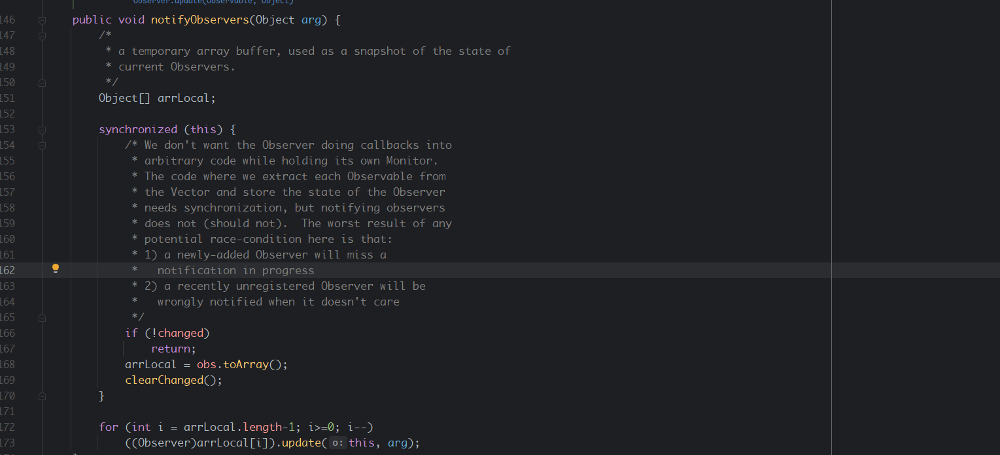
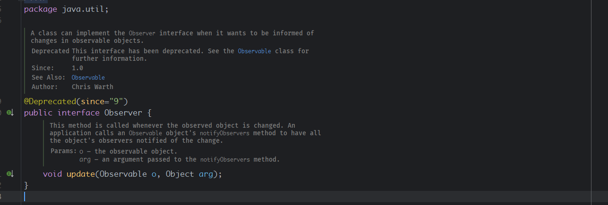

- [观察者模式](#观察者模式)
  - [Demo](#demo)
  - [Java内置观察者模式](#java内置观察者模式)

# 观察者模式
定义对象之间的一(A)对多(B,C,...)的依赖，当一个对象(A)改变时，所有依赖者(B,C,...)都将收到通知。  
主要思路:
* B,C实现处理观察对象改变时的处理方法Method A。
* A维护一个观察者列表，并实现添加和删除观察者对象方法和一个循环调用观察者对象的消息处理方法Method A。
## Demo
1. 首先定义被观察者接口，其中需要定义三个接口
* 添加一个观察者
* 删除一个观察者
* 通知观察者本对象发生改变
```java
package ObserverPattern.interfaces;

public interface Subject {
    /**
     * 注册一个观察者
     */
    public void registerObserver(Observer observer);

    /**
     * 移除一个观察者
     */
    public void removeObserver(Observer observer);

    /**
     * 通知所有观察者
     */
    public void notifyObservers();
}

```
2. 定义观察者接口，主要定义处理被观察者发送的消息接口。
```java
package ObserverPattern.interfaces;

public interface Observer {
    //处理被观察者发送的消息
    public void update(String msg);
}

```
3. 被观察的对象实现被观察接口
```java
package ObserverPattern;

import ObserverPattern.interfaces.Observer;
import ObserverPattern.interfaces.Subject;

import java.util.ArrayList;
import java.util.List;

public class Services implements Subject {
    //定义观察者列表
    private final List<Observer> observers = new ArrayList<Observer>();
    //要发生变化的对象
    private String msg;
    //将一个观察者添加到观察者列表中
    public void registerObserver(Observer observer) {
                observers.add(observer);
    }
    //将一个观察者移除观察者列表
    public void removeObserver(Observer observer) {
            int index = observers.indexOf(observer);
            if(index>=0){
                observers.remove(observer);
            }
    }
    //对象改变
    public void setMes(String mes){
        this.msg = mes;
        //向观察者发送信号
        notifyObservers();
    }
    //调用每一个观察者的处理变化的方法发送信号。
    public void notifyObservers() {
            for(Observer observer : observers){
                observer.update(msg);
            }
    }
}

```
4. 观察者实现处理消息接口，同时在构造函数或者单独的方法中将自己添加到被观察者列表中。
```java
package ObserverPattern;

import ObserverPattern.interfaces.Observer;
import ObserverPattern.interfaces.Subject;

public class ObserverOne implements Observer {
    public ObserverOne(Subject subject){
        subject.registerObserver(this);
    }
    public void update(String msg) {
        System.out.println("This is Ob one get mes "+ msg);
    }
}

package ObserverPattern;

import ObserverPattern.interfaces.Observer;
import ObserverPattern.interfaces.Subject;

public class ObserverTwo implements Observer {
    public ObserverTwo(Subject subject){
        subject.registerObserver(this);
    }
    public void update(String msg) {
        System.out.println("This is Ob two get mes "+ msg);
    }
}

```
5. 将被观察者传给观察者，观察者将自己添加到被观察者的通知列表中。
```java
package ObserverPattern;

import ObserverPattern.interfaces.Observer;

public class ObserverPattern {

    public static void main(String[] args) {
        Services services = new Services();
        //这里观察者将自己添加到通知列表中。
        Observer ob1 = new ObserverOne(services);
        Observer ob2 = new ObserverTwo(services);
        //对象发生变化时，会循环通知观察者。
        services.setMes("Hi!");
    }
}
```
输出:
```
This is Ob one get mes Hi!
This is Ob two get mes Hi!
``` 
## Java内置观察者模式
Java已经实现了观察者模式相关方法，主要有Observable类和Observer接口。
>该类从java 9开始被弃用， Observer和Observable支持的事件模型相当有限，Observable传递通知的顺序是未指定的，并且状态变化与通知不是一一对应的。对于更丰富的事件模型，请考虑使用 java.beans 包。 为了在线程之间实现可靠且有序的消息传递，请考虑使用 java.util.concurrent 包中的并发数据结构之一。 对于反应式流式编程，请参阅 java.util.concurrent.Flow API。

* **java/util/Observable.java**

* **java/util/Observer.java**
   

主要区别在于java对于被观察者相关的方法使用的是类进行定义而不是接口。被观察者直接继承Observable类即可。