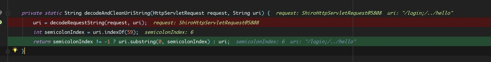
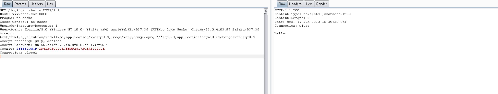

# Shiro CVE-2019-1957 权限绕过
Shiro框架通过拦截器功能来实现对用户访问权限的控制和拦截。Shiro中常见的拦截器有anon,authc等拦截器。
```    
1.anon为匿名拦截器，不需要登录就能访问，一般用于静态资源,或者移动端接口
2.authc为登录拦截器，需要登录认证才能访问的资源。
```
Shiro对url进行解析,对匹配的不同URL请求进行拦截,执行相应的拦截器,而URL路径表达式为ANT格式  

**ANT**  
匹配符|作用  
-|-
? | 匹配任意单字符
* | 匹配0或者任意数量的字符,不包含/
** | 匹配0或者更多数量的目录,不包含/

## 原理
主要是Shiro对url路径的判断与Web框架的的解析差异性导致绕过  
以spring-boot为例,对`/admin/editor`路径来说,shiro的配置规则如下`/admin/*`对admin目录下的访问进行拦截然后进行权限校验,但*和**都不能匹配到`/`字符,所以在后面只要加一个`/`就会导致匹配失败从而使拦截失效,但对于spring-boot来说/admin/editor和/admin/edtior/并没有区别都是指向到editor资源  
### 第一次绕过 Version < 1.5  
配置拦截规则如下,访问除了login页面以外的页面均需要认证
```java
//规则
        Map<String, String> map = new LinkedHashMap<>();
        map.put("/doLogin", "anon");
        map.put("/*", "authc");
        bean.setFilterChainDefinitionMap(map);
        return bean;

//方法
        @GetMapping("/hello")
        public String hello() {
            return "hello";
        }

        @GetMapping("/login")
        public String  login() {
            return "please login!";
        }
}
```
请求hello路径时会被拦截302跳转到dologin要求验证

但是在后面添加一个`/`使得Shiro匹配URL失败导致被绕过


### 第二次绕过 version < 1.5.2
在getChain()函数中,requestURI来源于getPathWithinApplication,而在getPathWithinApplication中是使用了WebUtils.getPathWithinApplication来获取url
```java
    //  getChain
    public FilterChain getChain(ServletRequest request, ServletResponse response, FilterChain originalChain) {
        FilterChainManager filterChainManager = this.getFilterChainManager();
        if (!filterChainManager.hasChains()) {
            return null;
        } else {
            String requestURI = this.getPathWithinApplication(request);
            Iterator var6 = filterChainManager.getChainNames().iterator();

    //getPathWithinApplication
        protected String getPathWithinApplication(ServletRequest request) {
        return WebUtils.getPathWithinApplication(WebUtils.toHttp(request));
    }

```
而在WebUtils.getPathWithinApplication中则使用了getRequestUri()函数来获取uri,并在返回时调用decodeAndCleanUriString()对uri进行清洗
```java
    public static String getPathWithinApplication(HttpServletRequest request) {
        String contextPath = getContextPath(request);
        String requestUri = getRequestUri(request);
    
    //getRequestUri
    public static String getRequestUri(HttpServletRequest request) {
        String uri = (String)request.getAttribute("javax.servlet.include.request_uri");
        if (uri == null) {
            uri = request.getRequestURI();
        }

        return normalize(decodeAndCleanUriString(request, uri));//调用decodeAndCleanUriString
    }
```
而在decodeAndCleanUriString中如果有`;`则删除后面的路径,只返回`;`之前的路径
```java
    private static String decodeAndCleanUriString(HttpServletRequest request, String uri) {
        uri = decodeRequestString(request, uri);
        int semicolonIndex = uri.indexOf(59);//uri.indexOf(';') ASCII ;=59
        //获取;的位置
        return semicolonIndex != -1 ? uri.substring(0, semicolonIndex) : uri;//返回;之前的值为获取的uri
    }
```

所以只要在`;`之前为合法的路径,然后在后面添加一个`;`再通过`..`返回上一级便可以绕过验证了

 


