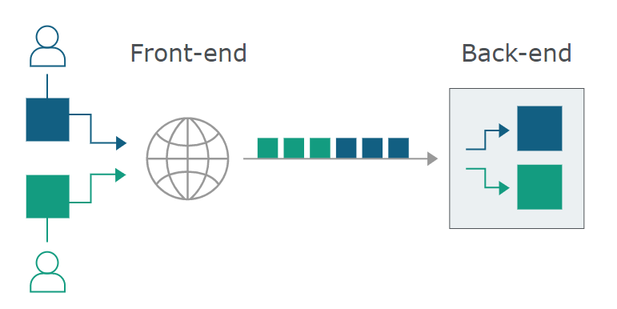

# Http Request Smuggling
## 原理
### 处理差异
链式网络中,前一个服务器于后一个服务器的处理差异导致对相同的内容进行了不同的处理  
如 Front-end(反代服务器) -> Back-end(业务处理服务器)


### Keep-Alive&Pipeline
**Keep-Alive:**  
添加请求头Connection: Keep-Alive,服务端在处理本次请求后不关闭tcp链接,后续对相同服务器的请求重用本次TCP链接从而减少服务器开销，HTTP1.1默认开启  
**Pipeline:**
客户端不必等待服务器响应直接像流水线按顺序发送请求,服务器按请求顺序依此返回响应包
### TCP链接重用
因为nginx地址与后端服务器地址一般固定,反代nginx服务器与后端服务器为了处理效率一般会重用一个tcp链接
## CL&TE
CL: Content-Length  
TE: Transfer-Encoding: chunked

### CL&TE
前端服务器根据Content-Length来确定post数据包大小,并将对应大小的数据发送给后端服务器,但后端服务器根据Transfer-Encoding指定的编码方式来确定post数据大小进行处理  

发送如下请求,前端服务器根据content-length来获取到9个字节并发送到后端服务器,而后端服务器根据Transfer-Encoding: chunked判断是分块传输,而0\r\n\r\n在chunked中被视为是分块传输完成截至,导致剩下的test未被读取,而由于前端服务器和后端服务器重用tcp链接的原因,导致test停留在缓存区中与下一个请求拼接导致下一个请求被破坏
```
Content-Length: 9
Transfer-Encoding: chunked

0

test
```


### TE&CL
前端服务器根据Transfer-Encoding指定的编码方式来确定post数据大小,并将对应大小的数据发送给后端服务器,但后端服务器根据Content-Length来确定post数据包大小进行处理

发送如下请求,前端服务器根据Transfer-Encoding: chunked读取全部字节发送到后端服务器,后端服务器根据Content-Length: 3读取`4\r\n`三个字节,剩下的test0被拼接到下一个请求,导致下一个请求被破坏


### TE&TE
前端和后端都使用Transfer-Encoding指定的编码方式来确定post数据大小,但可以使用两个Transfer-Encoding头,在其中一个Transfer-Encoding头中指定错误的编码方式来使其中某一个服务器识别失败而忽略

发送如下请求,前后端服务器根据Transfer-Encoding: 指定的编码来识别post请求,但其选取的Transfer-Encoding头不一致,选择Transfer-Encoding: aaaa的服务器会因为识别不了编码而直接忽略post数据,导致剩下的数据被拼接到下一个请求,导致下一个请求被破坏


https://paper.seebug.org/1048/#511-cl-te  
https://portswigger.net/web-security/request-smuggling