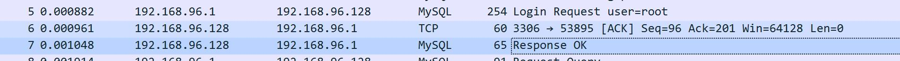
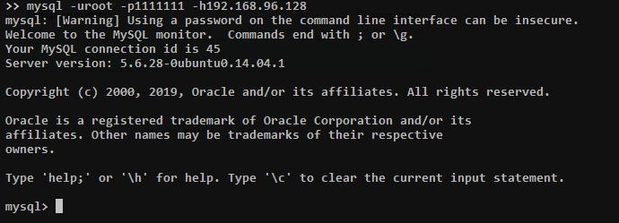

## mysql本地任意文件读取
### 条件
> * 允许使用load data local  
> 可通过标志位确定是否开启  
> 
> * secure_file_priv值为空  
> 
>> 1. 为空表示无限制
>> 2. null表示不允许导入导出(默认值)  
>> 3. 指定文件夹,表示只能导入导出某个文件夹
### 原理
#### LOAD DATA INFILE
和select ... into outfile相反,load data infile [filename] into tables [table]用于把文件中的内容读取到表中  
加上local关键字即load data local infile则是读取客户端本地的文件内容到表中  

#### 认证过程
1. 服务端可以要求客户端读取有可读权限的任何文件
2. 客户端读取文件的路径并不是从客户端指定的，而是服务端制定的
3. 服务端可以在任何查询语句后回复文件传输请求
> * 认证成功
> * 发送查询语句
> * 回复文件传输请求

客户端连接的过程中由服务端确定是否认证成功,所以随便输入一个用户密码,恶意服务端只要回复认证成功即可  
然后客户端就会发生查询语句来初始化信息,如查询版本号  
  
而恶意服务器这时候直接向客户端返回响应文件传输请求来索要某个文件内容  
  
客户端会直接返回相应文件内容
  
### 复现
[恶意服务器脚本](https://github.com/Gifts/Rogue-MySql-Server)  
只要根据官方文档模拟字段发包即可    
文件内容在脚本内指定即可  
    
客户端使用任意用户密码连接恶意服务器:
  
恶意服务器均为返回认证成功,并在初始化查询后响应文件传输请求  
恶意服务器下查看mysql.log文件得到文件内容:
  
      