# Windows认证协议
## NTLM
1. 挑战应答。  
2. NTLM HASH:密码hash,将密码经过一系列转换(密码->hex->unicode->MD4)后使用MD4加密得到。
### 质询过程
1.Client向服务器发送请求(包括一些请求的服务列表和客户端信息)登录。    
2.Server端生成一串16位随机数(challenge)发送返回给客户端(包括服务端支持的服务列表)。  
3.Client端使用自己输入密码转换的NTLM HASH加密得到的challenge得到response和用户名一起发送给Server端。  
4.Server端在数据库中寻找对应用户名的ntlm-hash加密challenge得到一个值,若值与得到的response相等则判断登录成功。  
如图:  
  

1. **Client向服务器发送请求(包括一些请求的服务列表和客户端信息)登录。**  
  

2. **Server端生成一串16位随机数(challenge)发送返回给客户端(包括服务端支持的服务列表)。**  
  
3. **Client端使用自己输入密码转换的NTLM HASH加密得到的challenge生成response和用户名一起发送给Server端。**
  
4. **Server端在数据库中寻找对应用户名的ntlm-hash加密challenge得到一个值,若值与得到的response相等则判断登录成功。**   
 
### Pass-the-hash
原理：认证过程中使用密码hash对challenge进行加密，并非使用原始密码。获取到hash即可完成认证过程。
#### UAC访问控制
默认情况下.pass-the-hash只对rid 500的账户(Administrator)和本地管理员组的域用户有效。这是因为UAC的限制,本地账户通过远程登陆时,非内置管理员和域内账号获得的令牌为被UAC过滤后的令牌,无共享路径的访问权限,所以无法进行pass-the-hash,但可以通过添加注册表`HKLM\SOFTWARE\Microsoft\Windows\CurrentVersion\Policies\System\LocalAccountTokenFilterPolicy`项值为1,该键值设置后则不会过滤令牌，即可绕过。  

Tips:非管理员组的账号本身就没有共享路径(C\$,ADMIN$)的访问权限,所以普通账号HASH本身无法进行hash传递。    

**默认管理员组的非500账号进行pass-the-hash会发现没有ADMIN$和C$的权限**  
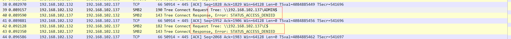 

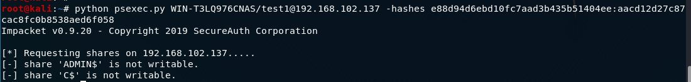  

**添加注册表键值**  

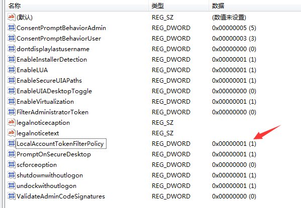  
  
#### 禁用SID500访问
修改注册表键值`HKLM\SOFTWARE\Microsoft\Windows\CurrentVersion\Policies\System\FilterAdministratorToken`为1,即可为500账号也开启UAC过滤。  
  
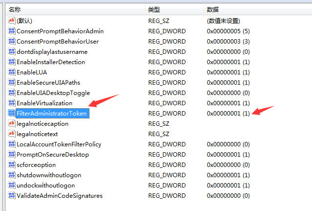  
#### KB2871997
这个补丁并不能修复pass-the-hash攻击方式,只是使防御起来更加方便而已。  
1. 使Protectd Users组的成员强行使用kerberos身份认证。  
2. 用户注销后lsass中除了Wdigest不会再缓存用户凭据。  
可以通过修改`HKEY_LOCAL_MACHINE\System\CurrentControlSet\Control\SecurityProviders\WDigest\`的UseLogonCredential键值为决定是否在内存中存储凭证。  
3. 添加了两个父SID:本地账户(S-1-5-113),本地账户全部继承此SID,本地管理员组成员(S-1-5-114),管理员组的本地用户继承此SID。
将两个SID所在组在组策略中添加拒绝从网络访问这台计算机和拒绝通过远程桌面服务登录设置即可进行防御。但加入本地管理组的域内用户还是可以进行pth。
### ntlm relay
重放攻击:使目标向攻击者主动发起ntlm请求,然后获取到Net-ntlm-hash(含在response中)后使用该hash再向目标进行重放来进行服务认证,需要关闭SMB签名。  
**v1版本格式:**username::hostname:LM response:NTLM response:challenge  

**v2版本格式:**username::domain:challenge:HMAC-MD5:blob  

工具:Responder
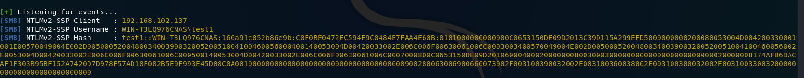  
#### 方式
- 图标
- xss `<script src="//172.16.100.1/x">`
- outlook
- PDF
- office
- mysql
- NBNS,LLMNR
- WPAD,MITM6
- XXE&SSRF
- 打印机
- ...  
[参考](https://www.anquanke.com/post/id/193493#h2-1)
#### 利用
##### 破解  
###### v1版本： 
1. 获取ntlmv1Response:(tips:使用`python Responder.py -I eth0 -wrfv --lm` v1有两种加密方式,可由客户端控制,使用--lm参数可以强制使用比较容易破解的算法)
  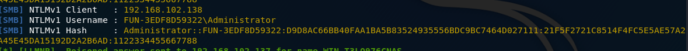 
2. 使用[ntlmv1-multi](https://github.com/evilmog/ntlmv1-multi)转换格式: 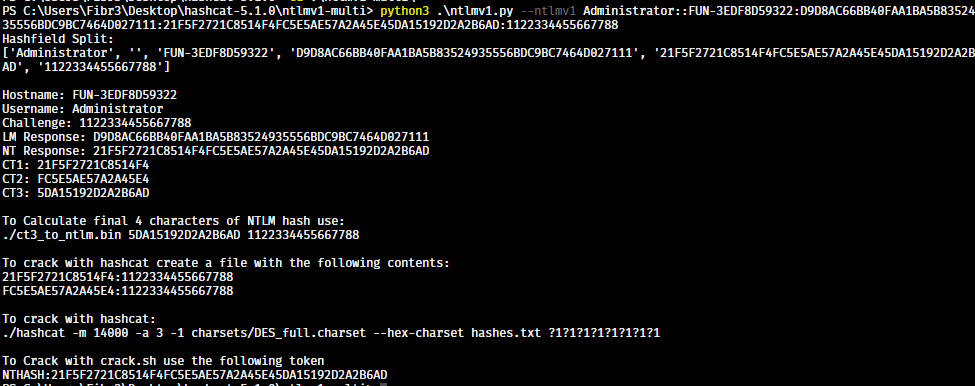 
3. 使用[crack.sh](https://crack.sh/get-cracking/)破解得到hash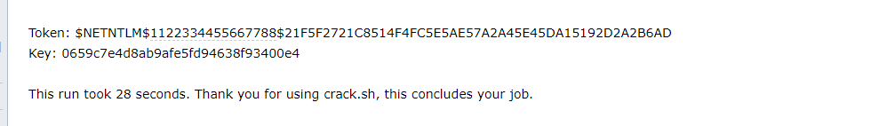  
4. 使用hashcat破解得到密码或者直接使用pth  
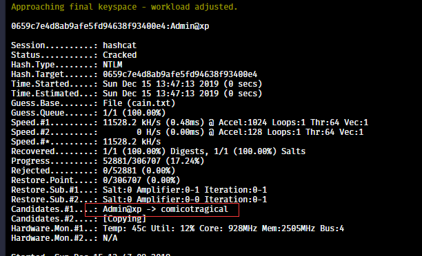 
###### v2版本
使用hashcat进行暴力破解,看缘分。
##### SMB重放 
重放需要服务器没有开启smb签名,但除了域控其余都默认不开启签名。
###### ms08-068-转发回本机
直接将获得到认证信息直接relay到客户端本身去来获得客户端权限  
win03发起SMB请求:`dir \\192.168.102.132\c$`    
**msf:**![1]pic/(201912155.png) 
**ntlmrelayx.py:**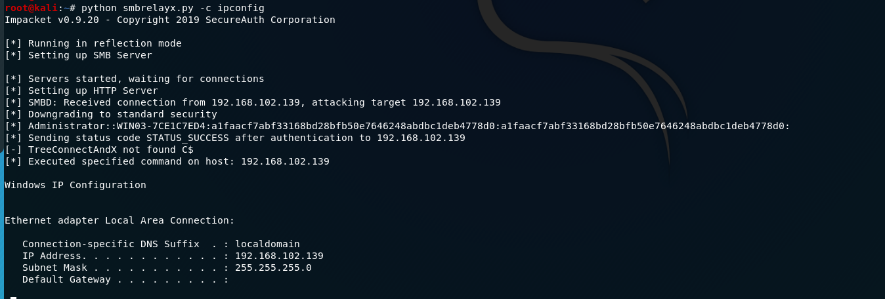

打了补丁之后在协议认证第一步时客户端会在本地lass里面缓存一种凭证,在第三步认证时会检查是否含有该凭证,若有则证明为同一台机子,则会认证失败。
###### 转发到其他机器
因工作组中每台机子只保存自己的账户信息,故在工作组中除了两台机子的账户密码相同不然没有实际作用。但在域环境中,账户信息保存在域控的ntds.dit中,如果没有限定账户登录的机器,则可以使用一个账户信息重放到另一台机器或者用域控的认证信息来登录到其他目标机器。但不能登录其他域控,因为域控默认开启了SMB签名。  
域控机器发起smb请求,使用MultiRelay.py转发到域内另一台192.168.102.3机器上得到system权限,`python MultiRelay.py -t 192.168.102.3 -u ALL`
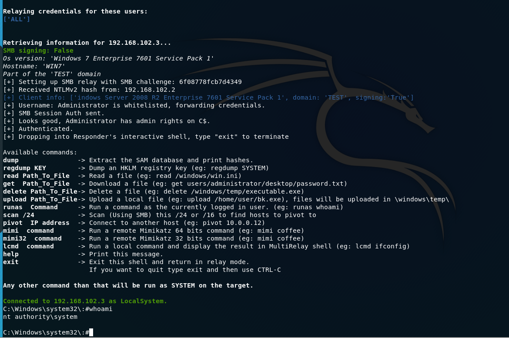
###### MS16-075
MS08-068只是限制了同台机器之间的SMB重放,但没有限制从http到smb的重放,如果拿到http形式的ntlm-hash，还是可以直接relay到本机smb。
获取http形式的ntlm-hash方式:   
- xss   
- NBNS,LLMNR  
- WPAD,MITM6
###### cve-2019-1384
原理:在MS08-068的补丁中,加入的缓存是有300S的时间限制的,超过300S后缓存就会清空,所以等300S之后再relay回去即可  
[POC](https://shenaniganslabs.io/files/impacket-ghostpotato.zip)
## Kerberos
### 角色:  
- Client  
- Server  
- KDC(密钥分发中心)-(KDC包含认证服务(AS)和Ticket Granting Service(TGS票据认证服务))**  
### 流程:
1. Client向KDC(认证服务)发起请求,凭据为**Client-hash加密的时间戳**
2. KDC使用存储的client-hash解密得到的凭据,如果时间戳在允许的时间范围内则返回用**krbtgt-hash加密的TGT票据，TGT票据包含PAC,PAC中包含client的用户信息**。
3. Client使用得到的**TGT**再向KDC(TGS)发起对A服务的请求。
4. KDC使用krbtgt-hash对TGT进行解密,如果结果正确,则**返回使用A服务的hash加密的TGS票据**。
5. Client使用得到的TGS票据向提供A服务的服务器进行请求。
6. 收到请求的Server-A使用自己的hash解密TGS票据,如果解密成功则使用其中的PAC去KDC查看发起请求的client是否有对应服务的访问权限,KDC解密PAC得到Client的用户信息,判断该用户是否有访问权限。
##### AS-REQ
**Client向KDC(AS)发起请求:**  

##### AS-REP
**KDC(AS)返回包含PAC的TGT票据:**

##### TGS-REQ
**Client ---> KDC(TGS)发起对A服务的请求**

##### TGS-REP
**KDC(TGS) --->Client 返回TGS票据**  

##### AP-REQ&AP-REP
**Client ---> Server 请求服务A**
  
**Server--->Client**  

### pass the key
### pass the ticket
### kerberoasting
### 银票据
### 金票据
### PAC
### 委派
