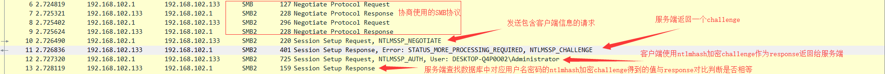
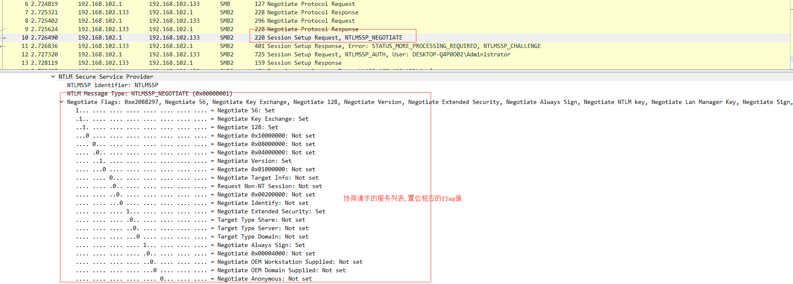
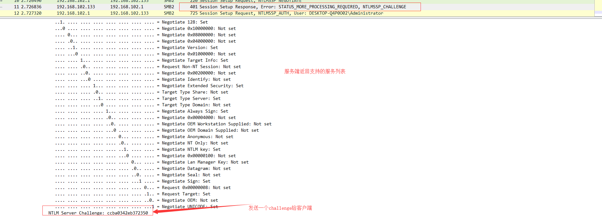
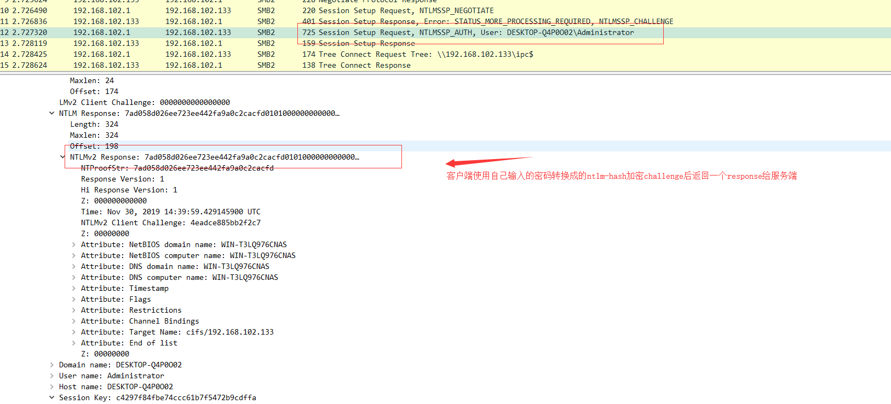
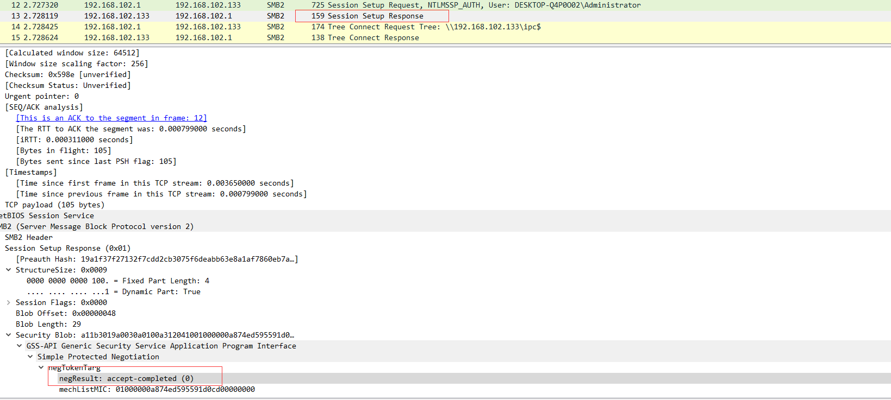
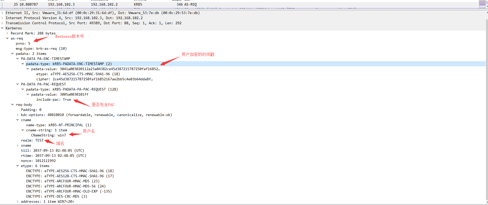
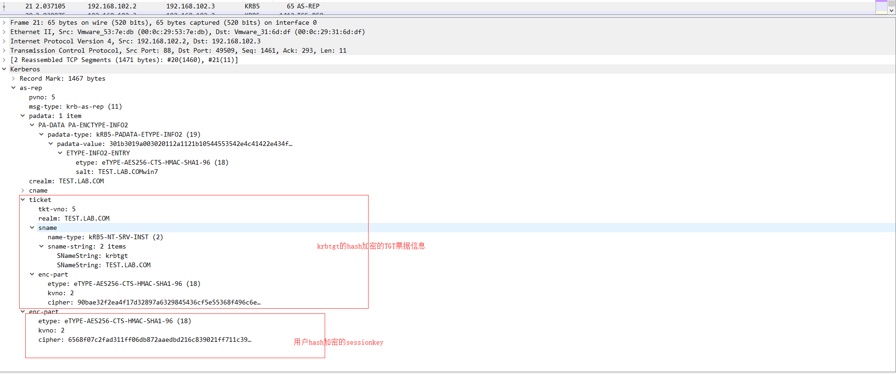
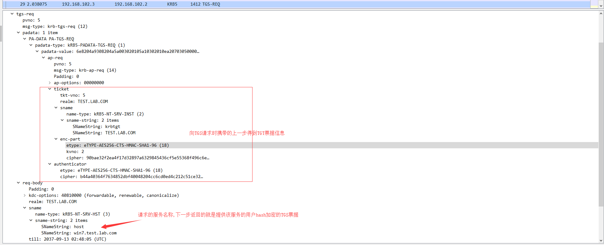
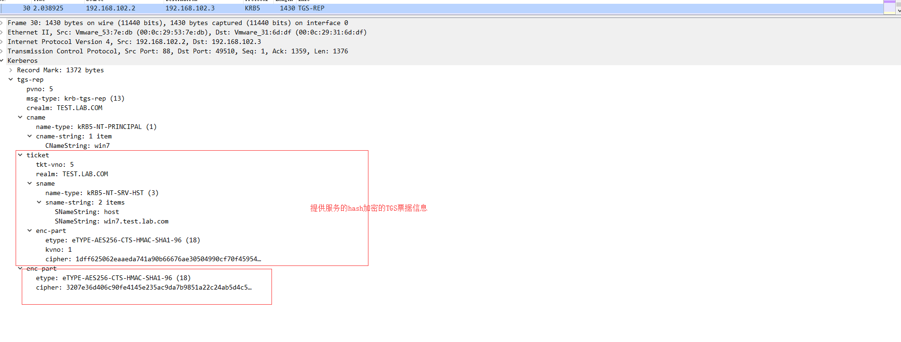
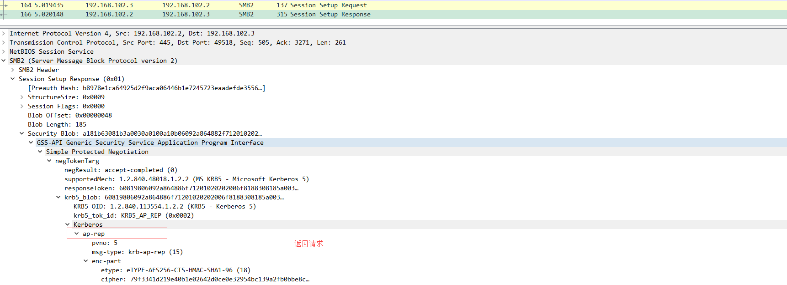

# Windows认证协议
## **NTLM协议**
1. 挑战应答。  
2. NT HASH:密码hash,将密码经过一系列转换(密码->hex->unicode->MD4)后使用MD4加密得到。
### **原理**
1. 本地认证
2. 域用户认证
#### 本地认证
1. Client向服务器发送请求(包括一些请求的服务列表和客户端信息)登录。    
2. Server端生成一串16位随机数(challenge)发送返回给客户端(包括服务端支持的服务列表)。  
3. Client端使用自己输入密码转换的HASH加密得到的challenge生成response和用户名一起发送给Server端。  
4. Server端在数据库(SAM)中寻找对应用户名的NThash加密challenge得到一个值,若值与得到的response相等则判断登录成功。  

SAM数据库在注册表HKLM\SAM\SAM\Domains\Account\Users\下,只有用system权限才可打开查看  
使用psexec查看 `psexec -s -i regedit.exe`  
* -i 交互 -s system权限启动

如图:  
  
Client向服务器发送请求(包括一些请求的服务列表和客户端信息)登录.
  
Server端生成一串16位随机数(challenge)发送返回给客户端(包括服务端支持的服务列表).
  
Client端使用自己输入密码转换的NTLM HASH加密得到的challenge生成response和用户名一起发送给Server端.
  
Server端在数据库中寻找对应用户名的ntlm-hash加密challenge得到一个值,若值与得到的response相等则判断登录成功
 
#### 域用户认证
前面与本地验证类似,但域用户的hash不存储在本地SAM数据库中,而是存储在域控的NTDS.DIT数据库中,因此server端会将信息转交给域控,由域控进行身份校验    
1. Client向服务器发送请求(包括一些请求的服务列表和客户端信息)登录。    
2. Server端生成一串16位随机数(challenge)发送返回给客户端(包括服务端支持的服务列表)。  
3. Client端使用自己输入密码转换的HASH加密得到的challenge生成response和用户名一起发送给Server端。  
4. Server端将得到的response和客户端的信息与之前对客户端发送的challenge一起通过Netlogon服务发送给域控
5. 域控在NTDS数据库中寻找对应用户名的NThash值,用其NThash加密challenge,把结果与得到的reponse进行比较,将验证结果再返回给server端
## **Kerberos**
当用户访问网络上的服务时则使用kerberos协议进行身份校验
### **原理**
三个角色:  
* Client
* Service
* KDC(DC)

三个步骤:
* 身份校验(AS)->得到TGT
* 授予服务票据->得到TGS
* 申请服务->使用TGS访问服务

流程:  
1. Client向KDC(认证服务)发起请求,凭据为Client-hash加密的时间戳
2. KDC使用存储的client-hash解密得到的凭据,如果时间戳在允许的时间范围内则返回用**krbtgt-hash**加密的TGT票据，TGT票据包含PAC,PAC中包含client的用户信息,还会返回一个绑定该用户有时间限制的唯一会话密钥(session key)。
3. Client发送包括其TGT票据,想要请求的服务,一个Authenticator(该字段包含使用session key加密其的用户名和当前时间戳)在内的信息向KDC()发起对A服务的请求。
4. KDC使用krbtgt-hash对TGT进行解密,如果结果正确,则返回使用**运行A服务的账户**的hash加密的TGS票据,TGS则包括对应服务的信息和Client的用户名,PAC,新的会话密钥。
5. Client使用得到的TGS票据生成一个新的Authenticator(由新的会话密钥加密)向提供A服务的服务器进行请求。
6. 收到请求的Server-A使用自己的hash解密TGS票据,如果解密成功则使用其中的PAC去KDC查看发起请求的client是否有对应服务的访问权限,KDC解密PAC得到Client的用户信息,判断该用户是否有访问权限,返回结果给Server-A
7. Server-A根据域控返回决定是否提供服务
##### AS-REQ
Client向KDC(AS)发起请求:  

##### AS-REP
KDC(AS)返回包含PAC的TGT票据:

##### TGS-REQ
Client ---> KDC(TGS)发起对A服务的请求

##### TGS-REP
KDC(TGS) --->Client 返回TGS票据

##### AP-REQ&AP-REP
Client ---> Server 请求服务A
  
Server--->Client
