- [Hessian反序列化](#hessian反序列化)
  - [基础](#基础)
    - [序列化过程](#序列化过程)
    - [反序列化过程](#反序列化过程)
  - [参考](#参考)
# Hessian反序列化
## 基础
示例Demo
```java
import com.caucho.hessian.io.HessianInput;
import com.caucho.hessian.io.HessianOutput;
import java.io.ByteArrayInputStream;
import java.io.ByteArrayOutputStream;
import java.io.IOException;

public class Hessian {
    public static void main(String[] args) throws IOException {
        Hessian hessian = new Hessian();
        Map innerMap = new HashMap<String, Class<Object>>();
        innerMap.put('a',int.class);
        innerMap.put('b',String.class);
        Person person = new Person(innerMap);
        byte[] data = hessian.Serialize(person);
        System.out.println(data);
        System.out.println(hessian.Deserialize(data));

    }
    private byte[] Serialize(Object T) throws IOException {
        ByteArrayOutputStream os = new ByteArrayOutputStream();
        HessianOutput output = new HessianOutput(os);
        output.writeObject(T);
        return os.toByteArray();
    }
    private Object Deserialize(byte[] data) throws IOException {
        ByteArrayInputStream is = new ByteArrayInputStream(data);
        HessianInput input = new HessianInput(is);
        Object ob = input.readObject();
        return ob;
    }
}
```
```java
import java.io.Serializable;

public class Person implements Serializable {
    int age = 18;
    String name = "nick";
    private Map<String, Class<Object>> innerMap ;
    public Person(Map<String, Class<Object>> map){
                this.innerMap = map;
    }

```
### 序列化过程
在`UnsafeSerializer#writeObject10()`中循环对对象的字段进行处理。
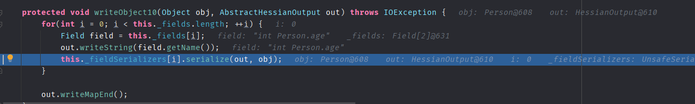
其中会根据字段的类型不同调用不同的序列化器进行转换,字段对应序列化器存储在`this._fieldSerializers`中,该值在`UnsafeSerializer`初始化时就调用了`getFieldSerializer`来根据字段进行了设置对应的序列化器。

`getFieldSerializer`如下,根据类型设置序列化器。
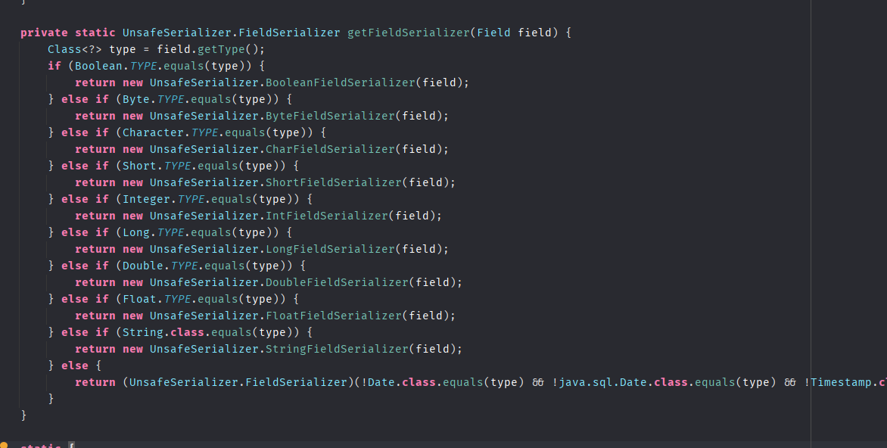
在`UnsafeSerializer`中也实现了各个字段的序列化器。
  
然后就是调用各序列化器进行处理,以int类型为例
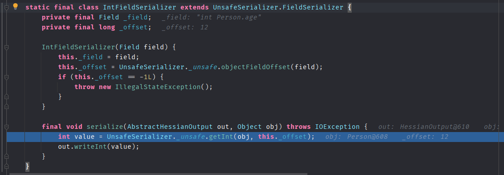
最后`out.writeMapEnd()`结束序列化
### 反序列化过程
刚开始处理数据时,读取数据第一个字节,因为序列化的结果都是map类型,所有第一个都为77。从`this._serializerFactory.readMap(this, type);`开始进入反序列化。


然后在`getDeserializer`中先判断缓存中是否有该类的反序列化器,没有的话再调用`_staticTypeMap.get(type)`获取。
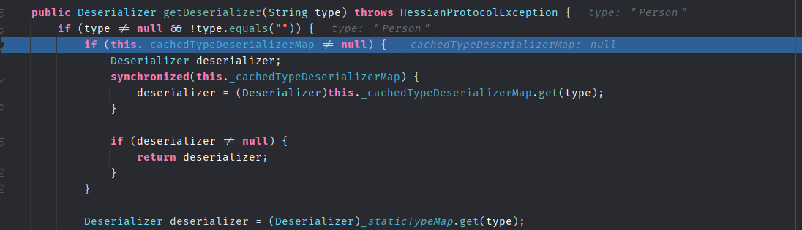
而`_staticTypeMap`是一个map,里面存放了常见已知类型的反序列化器。

当该类也不存在于`staticTypeMap`时,则会使用`Class.forName`来获取该类。

同时有一个黑名单列表。
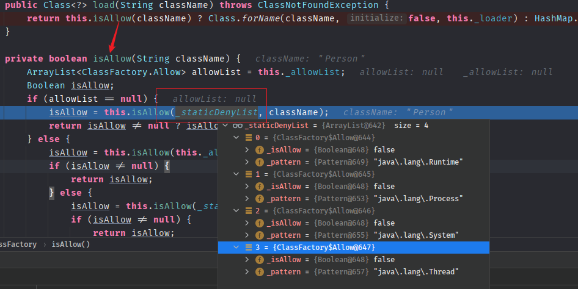
最后经过一系列处理,不在已知类里面的对象最后选取了默认的反序列化器。

在`getDefaultDeserializer`中,因为`this._isEnableUnsafeSerializer`默认为true,默认反序列化器则是`UnsafeDeserializer`.

`UnsafeDeserializer`的构造方法如下,会获取对象类型及该对象的字段类型和对应的反序列化器,还会检测是否该类是否存在`readResolve`方法。
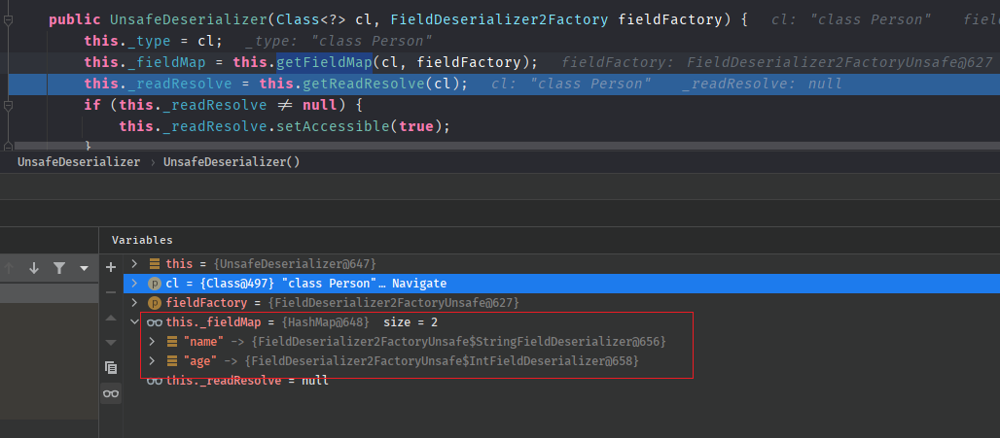
然后将该反序列化器放入缓存后返回。
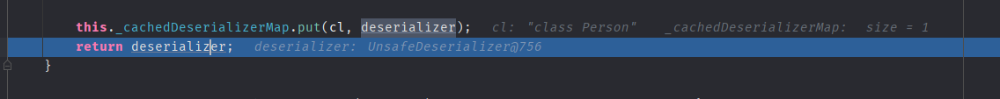
后续就是对字段调用对应的反序列化器进行还原,先调用`this.instantiate()`创建一个该对象，这个时候并不会赋值,各个属性都为字段的默认值,然后调用反序列化器的readMap开始对字段开始还原。
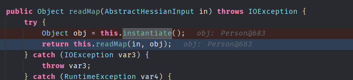
开始循环还原每一个字段。
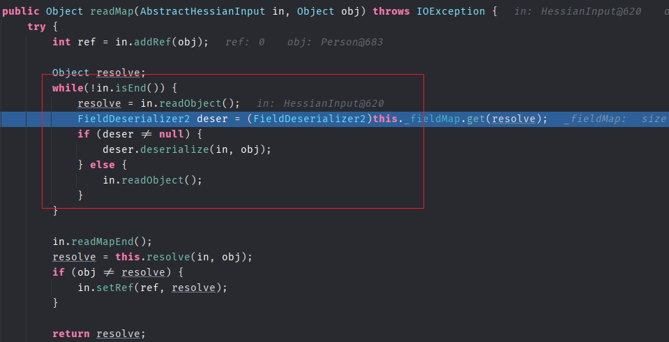
以map类型字段为例,其对应的是`ObjectFieldDeserializer`.先调用`in.readObject`读取对象。

在`readObject()`中因为是map类型,所以使用的还是`MapDeserializer`.
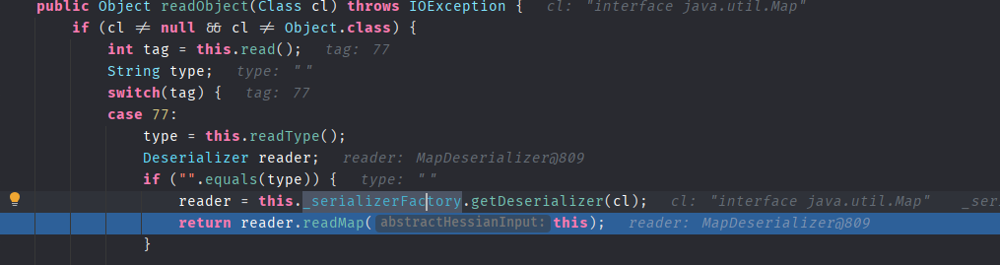
在`MapDeserializer`中根据map用接口不同使用不同的map,然后就会调用map.put来将key,value放入。

而在HashMap的put方法中会调用key的hashcode方法和equals方法,
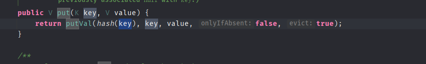
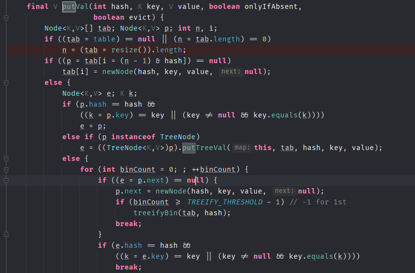
当设置键值对象为恶意的类时即可触发相关利用链。
## 参考
https://f002.backblazeb2.com/file/sec-news-backup/files/writeup/blog.csdn.net/_u011721501_article_details_79443598/index.html  
https://paper.seebug.org/1131/#hessian_2