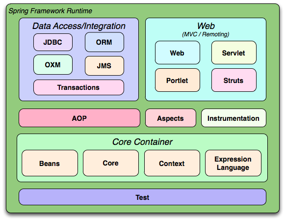
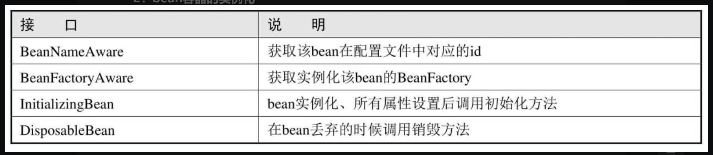

- [Spring Basic](#spring-basic)
  - [SpringFramework](#springframework)
    - [依赖注入(DI)](#依赖注入di)
    - [控制反转(IOC)](#控制反转ioc)
    - [切面编程(AOP)](#切面编程aop)
      - [基于代理的AOP](#基于代理的aop)
      - [AspectJ基于XML的配置](#aspectj基于xml的配置)
    - [IOC容器](#ioc容器)
      - [BeanFactory](#beanfactory)
        - [BeanFactory 启动](#beanfactory-启动)
        - [bean容器的实例化](#bean容器的实例化)
      - [ApplicationContext](#applicationcontext)
      - [Bean配置](#bean配置)
      - [Bean注入](#bean注入)
        - [XML注入](#xml注入)
        - [注解方式注入](#注解方式注入)
    - [DAO](#dao)
      - [JDBC](#jdbc)
        - [Statement](#statement)
        - [PreparedStatement](#preparedstatement)
        - [CallableStatement](#callablestatement)
      - [JdbcDaoSupport](#jdbcdaosupport)
  - [SpringMVC](#springmvc)
    - [HandlerMapping](#handlermapping)
      - [RequestMappingHandlerMapping](#requestmappinghandlermapping)
      - [BeanNameUrlHandlerMapping](#beannameurlhandlermapping)
      - [SimpleUrlHanlderMapping](#simpleurlhanldermapping)
    - [跳转](#跳转)
    - [URL参数传递](#url参数传递)
      - [@RequestParam](#requestparam)
      - [@PathVariable](#pathvariable)
    - [POST参数传递](#post参数传递)
    - [@SessionAttributes](#sessionattributes)
    - [拦截器LoginIntercepter](#拦截器loginintercepter)
      - [配置拦截器](#配置拦截器)
  - [Spring Boot](#spring-boot)
    - [配置文件](#配置文件)
      - [读取配置文件](#读取配置文件)
        - [读取自定义配置文件](#读取自定义配置文件)
      - [Profile配置](#profile配置)
  - [参考](#参考)

# Spring Basic
## SpringFramework

### 依赖注入(DI)
A类使用了B类的属性或者方法,则A类依赖B类.
依赖注入是组件之间依赖关系由容器在运行期决定的,即由容器动态地将某个依赖关系注入到组件之中.
### 控制反转(IOC)
即把对象的控制权交给容器(即Spring),把对象创建交给容器,由容器进行对象创建和管理,不再由开发者手动new对象.
### 切面编程(AOP)
AOP就是将一些无关业务逻辑的功能,如日志,事务管理等进行封装然后使用动态代理技术来嵌入到业务代码中进行调用.
#### 基于代理的AOP
基于代理的AOP主要介绍MethodBeforeAdvice、AfterReturningAdvice、ThrowsAdvice三个接口的使用.
* MethodBeforeAdvice：见名知意,通过方法名就可以猜到它的作用.方法前拦截器在执行指定方法前调用,参数分别为被调用的方法、执行时被传入的参数、被拦截的Bean.
*  AfterReturningAdvice：返回后拦截器,在执行完指定方法并返回之后调用.如果有返回值可以获取到返回值,否则为null.参数分别为方法返回值、被调用的方法、执行时被传入的参数、被拦截的Bean.
* ThrowsAdvice：异常拦截器,在指定方法抛出异常时被调用.该接口并未定义方法,因此不需要实现任何方法.如果在实现该接口的类中定义了public void afterThrowing(Exception ex)、public voidafterThrowing(Method method, Object[] args, Object target, Exception ex)方法抛出异常时就会被调用.

#### AspectJ基于XML的配置
AspectJ是一个面向切面的框架,扩展了Java语言.AspectJ定义了AOP语法,有一个专门的编译器,用来生成遵守Java字节编码规范的Class文件.
### IOC容器
Spring提供了BeanFactory、ApplicationContext两个IOC容器来管理bean对象.
#### BeanFactory
BeanFactory会在bean生命周期的各个阶段中对bean进行管理,并且Spring将这些阶段通过各种接口暴露给我们,让我们可以对bean进行各种处理.我们只要让bean实现对应的接口,那么Spring就会在bean的生命周期调用我们实现的接口来处理该bean.
##### BeanFactory 启动
1. 读取Bean的xml配置文件,然后将xml中每个bean元素分别转换成BeanDefinition对象.
2. 通过BeanDefinitionRegistry将bean注册到beanFactory中.
##### bean容器的实例化
实例化bean主要通过反射和CGLIB两种方式,在bean的实例化过程中,Spring也暴露了一些接口.

#### ApplicationContext
BeanFactory主要是面对Spring框架的基础设施,面对Spring框架自己使用.而Applicationcontext主要面对于Spring使用的开发者,ApplicationContext也实现了BeanFactory接口,用户获取Bean主要通过ApplicationContext.
ApplicationContext对象有两种方式获取.
1. 通过ClassPathXmlApplicationContext方法获取的, ClassPathXmlApplicationContext表示从类路径下加载配置文件.文件路径默认指的是项目的classpath路径下,所以不需要写前缀“classpath:”,如果指向绝对路径,需要加上“file:”.
```
new ClassPathXmlApplicationContext(new String[]{"ApplicationContext.xml"});
```
2. 使用FileSystemXmlApplicationContext方法获取,FileSystemXmlApplicationContext表示从文件系统中加载配置文件.文件路径默认指的是项目的根目录下,若想使用项目的classpath路径,则需要加上“classpath:”.
```
new FileSystemXmlApplicationContext(new String[]{"classpath:ApplicationContext.xml"});
```
#### Bean配置
1. 基于XML配置:Spring通过<bean>配置来实例化、设置bean的属性以及设置bean间的相互依赖性.一个<bean>通常需要定义id和class属性.
2. 使用注解配置:bean定义信息即通过在bean实现类上标注注解实现,使用@Component注解,它可以被Spring容器识别,自动将POJO转换为容器管理的bean.
除了@Component以外,Spring提供了以下3个功能基本和@Component等效的注解,分别用于对DAO、Service及Web层的Controller进行注解,所以也称这些注解为Bean的衍型注解：
* @Repository：用于对DAO实现类进行标注.
* @Service：用于对Service实现类进行标注.
* @Controller：用于对Controller实现类进行标注.

3.基于JAVA类配置:在普通的类中只要标注@Configuration注解,就可以为Spring容器提供bean定义的信息了.每个标注了@Bean的类方法都相当于提供了一个bean的定义信息.我们只需在XML中配置开启context扫描即可实现bean的配置.
#### Bean注入
主要可以通过XML配置进入注入和注解方式进行注入.
##### XML注入
XML注入
* 属性注入:Spring框架会在内部先调用Bean的默认构造函数实例化Bean对象,然后通过反射的方式调用Setter方法注入属性值.
* 构造函数注入:构造函数注入通过自定义构造函数来进行对象的实例化,在XML中,使用<construect-arg>来设置构造函数的参数,index属性设置参数的顺序,参数顺序应该与构造函数一致,ref设置引用bean的id,value设置构造函数参数的值.
* 工厂方法注入:工厂方法注入参考的是工厂设计模式,在工厂类中实现对象的实例化.工厂类负责创建一个或多个目标类实例,一般以接口或抽象类变量的形式返回目标类实例.工厂类对外屏蔽了目标类的实例化步骤,调用者甚至不用知道具体的目标类是什么.
工厂方法也分静态工厂方法和非静态工厂方法.静态工厂方法不用实例化工厂类,直接通过类名调用.非静态工厂方法需要先实例化工厂类,然后通过工厂类对象调用获取对象.这里创建了一个工厂类XMLFactory,在类中定义了一个静态方法和一个实例方法（用来实例化bean对象）.
##### 注解方式注入
开启注入的方式:
1. 在xml配置文件中使用context:annotation-config.
2. 在xml配置文件中使用context:component-scan：

* @Autowired：默认按类型匹配注入bean,可以对类成员变量、方法及构造函数进行标注,完成自动装配的工作.在使用@Autowired时,首先在容器中查询对应类型的bean.如果查询结果刚好为一个,就将该bean装配给@Autowired指定的数据；如果查询的结果不止一个,那么@Autowired会根据名称来查找.如果查询的结果为空,那么会抛出异常.解决方法时,使用required=false.
*  @Required：适用于bean属性setter方法,并表示受影响的bean属性必须在XML配置文件在配置时进行填充；否则,容器会抛出一个BeanInitializationException异常.
*  @Qualifier：@Autowired默认是单实例的,但是在面向接口编程中,如果把一个属性设置为接口类型,一个接口就可能有多个实现,那么到底注入哪一个呢？为了解决这个问题,就有了@Qualifier.
*  @Value：在xml配置属性时可以通过property的value设置默认值,@Value也可以为属性设置默认值.
*  @Resource：默认按名称匹配注入bean.要求提供一个bean名称的属性,如果属性为空,就自动采用标注处的变量名或方法名作为bean的名称.如果我们没有在使用@Resource时指定bean的名字,同时Spring容器中又没有该名字的bean,这时@Resource就会退化为@Autowired,即按照类型注入.
 ### DAO
 #### JDBC
 JDBC（Java DB Connection,Java数据库连接）是一种可用于执行SQL语句的Java API（Application Programming Interface,应用程序设计接口.
 使用步骤:
 1. 驱动引入
 2. 注册驱动
 3. 创建连接
 4. 执行操作
 5. 返回结果
 6. 释放资源
##### Statement
Statement对象用于执行不带参数的简单SQL语句.
##### PreparedStatement
PreparedStatement对象用于执行带或不带IN参数的预编译SQL语句.
##### CallableStatement
CallableStatement对象用于执行对数据库已存在的存储过程的调用
#### JdbcDaoSupport
Spring的DAO模块提供了对JDBC、Hibernate、MyBatis等DAO层支持,JdbcDaoSupport提供了JdbcTemplate对象,通过JdbcTemplate对象进行数据库操作只需使用封装好的JdbcTemplate执行SQL语句.

## SpringMVC
处理流程图:

### HandlerMapping

HandlerMapping的实现类中常用的有3个,分别是RequestMappingHandlerMapping、BeanNameUrlHandlerMapping和SimpleUrlHandlerMapping.
#### RequestMappingHandlerMapping
通过注解映射把URL映射到对应的Controller上
```java
@Controller
@RequestMapping("/index") 
public class IndexController{
  @RequestMapping("/index.do")
  public xxx(){
    
  }
}
```
#### BeanNameUrlHandlerMapping
通过bean将URL映射对应的Controller,需要在springmvc.xml中配置BeanNameUrlHandlerMapping和对应Bean的Controller.
```xml
<bean class="org.springframework.web.servlet.handler.BeanNameUrlHanlderMapping"></bean>
<bean id="/index.do" class="com.demo.Controller.IndexController"></bean>
```
#### SimpleUrlHanlderMapping
SimpleUrlHandlerMapping则是通过url来实现handler的映射,有两种常见的映射方法:一是通过prop key,二是通过value.
在spring-mvc.xml中的配置可以使用props元素来进行配置.prop标签中的key都是url值,后面的为BeanID,如果在地址栏中输入的url与key匹配,则分发到prop标签中指定的beanID所指定的Controller.
```xml
<bean id="indexController" class="com.demo.Controller.HelloController"/>
<bean class="org.springframework.web.servlert.hanlder.SimpleUrlHanlderMapping">
<property name ="mappings">
  <props>
    <prop key="/index.xml">indexController</prop>
  </props>
  <!-- <value>
  /*/hello.html=indexController
  </value> -->
</property>
</bean>
</bean>
```
### 跳转
https://blog.csdn.net/qq_39696115/article/details/112220405
### URL参数传递
Controller接受参数主要使用@RequestParam和@PathVariable.
#### @RequestParam
如果是可选参数设置`required=false`,默认为`true`
```java
public void test (HttpSeverletRequest request,HttpServerletResponse,@RequestParam("name") String name,@RequestParam(value="pwd", required=false) String pwd){
          System.out.println(name+pwd);
}
```
#### @PathVariable
有的url的格式是url/param1/param2,这种获取值可以使用@PathVariable.
```java
@RequestMapping(value="/test/{name}/{pwd}",method=Request.method.GET)
public void test (HttpSeverletRequest request,HttpServerletResponse,PathVariable("name") String name,PathVariable("pwd") String pwd){
          System.out.println(name+pwd);
```
### POST参数传递
1. 直接将请求参数名作为Controller中方法的形参.
2. 使用Pojo对象.
如果请求参数有好多个,都放在Controller方法的形参中时函数会很长,一般情况下会把参数封装成对象进行传递.Spring MVC会按请求参数名和POJO属性名进行自动匹配,自动为该对象填充属性值,支持级联属性,如address.province、address.city等.
3. 使用原生的Servlet API 作为Controller 方法的参数.
HttpServletRequest.request对象获取相关参数
### @SessionAttributes
@SessionAttributes会将模型中的某个属性暂存到HttpSession中,以便多个请求之间可以共享这个属性,只能放在类上面.
```java
@SessionAttributes("user")
```
会将该类的user对象保存在HttpSession中共享.
### 拦截器LoginIntercepter
拦截器要实现HanlderInterceptor接口,重写preHanlde方法.
#### 配置拦截器
在spring-mvc.xml中使用<mvc:interceptors>元素将创建的拦截器类配置到HandlerExecutionChain中.
## Spring Boot
### 配置文件
Spring Boot使用一个全局的配置文件,配置文件名是固定的,application.properties或application.yml,可以用来修改Spring Boot自动配置的默认值.
#### 读取配置文件
一共有两种方式读取配置文件中的值.
1. @Value:在@Value的${}中包含的是核心配置文件中的键名.
2. Environment方式:这种方式是依赖注入Evnironment来完成的，在创建的成员变量上加上@Autowired注解即可完成依赖注入，然后使用env.getProperty("键名")即可读取出对应的值.
##### 读取自定义配置文件
通过@ConfigurationProperties可以将Properties属性和一个Bean及其属性关联，从而实现自定义的类型安全配置。

#### Profile配置
在开发中可能会部署多个环境，每个环境部署的配置可能不一样。可以使用application.properties进行多个环境的配置，通过application-{profile}.properties来控制加载哪个环境的配置，将与环境无关的属性放置到application.properties文件里面，通过spring.profiles.active=profiles的值，加载不同环境的配置，如果不指定，就默认加载application.properties的配置，不会加载带有profile的配置。

## 参考
<<Spring快速入门>>