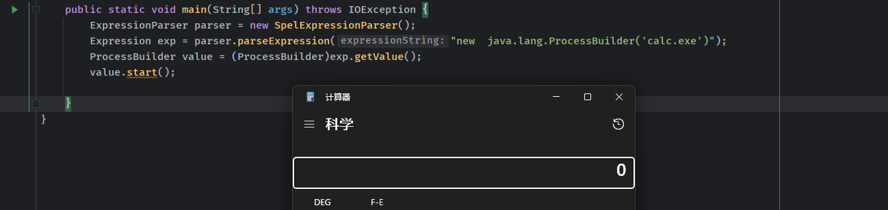

- [SPEL](#spel)
  - [基础](#基础)
    - [语法](#语法)
      - [类表达式 Class expressions()](#类表达式-class-expressions)
      - [方法调用 Method invocation()](#方法调用-method-invocation)
      - [调用构造函数 Calling constructors（）](#调用构造函数-calling-constructors)
      - [Bean引用 Bean references](#bean引用-bean-references)
      - [变量 Variables](#变量-variables)
      - [用户自定义方法 User defined functions](#用户自定义方法-user-defined-functions)
      - [模板表达式 Templated expressions](#模板表达式-templated-expressions)
  - [SPEL 表达式注入](#spel-表达式注入)
    - [StandardEvaluationContext和SimpleEvaluationContext ](#standardevaluationcontext和simpleevaluationcontext)
    - [防御](#防御)
- [参考](#参考)

# SPEL
## 基础
Spring Expression Language（简称SpEL）是一种强大的表达式语言，支持在运行时查询和操作对象图，其中包含很多功能。其中表达式注入主要关注以下几个功能。
```
Class expressions
Method invocation
Calling constructors
Bean references
Variables
User defined functions
Templated expressions
```
### 语法
当在外部定义表达式时，SpEL使用 #{...} 作为定界符，所有在大括号中的字符都将被认为是 SpEL表达式。  
如xml中定义：
```xml
    <property name="randomNumber" value="#{ T(java.lang.Math).random() * 100.0 }"/>
```
我们可以在其中使用运算符，变量以及引用bean，属性和方法如：
> 引用其他对象:#{car}  
> 引用其他对象的属性：#{car.brand}  
> 调用其它方法 , 还可以链式操作：#{car.toString()}
> 属性名称引用：${someProperty}  
> T()运算符会调用类作用域的方法和常量

直接使用SPEL的API对字符串进行解析时就不用定界符了。  主要使用方法，先创建SPEL解析器对象，然后放置表达式字符串，最后调用getValue执行解析获得结果。
```java
        ExpressionParser parser = new SpelExpressionParser();
        Expression exp = parser.parseExpression("T(java.lang.Math).random() * 100.0 ");
        String message =  exp.getValue().toString();
```
#### 类表达式 Class expressions()
SpEL中可以使用特定的Java类型，经常用来访问Java类型中的静态属性或静态方法，需要用T()操作符进行声明。除了java.lang包下的类声明，括号中都需要包含类名的全限定名。  
通过 T() 调用一个类的静态方法，它将返回一个 Class Object，然后再调用相应的方法或属性。  
```java
        ExpressionParser parser = new SpelExpressionParser();
        Expression exp = parser.parseExpression("T(java.lang.Runtime).getRuntime().exec(\"calc.exe\")");
        Object value = exp.getValue();
```
   
还可以直接创建对象实例。  
```java
        ExpressionParser parser = new SpelExpressionParser();
        Expression exp = parser.parseExpression("new  java.lang.ProcessBuilder('calc.exe')");
        Pr、】、ocessBuilder value = (ProcessBuilder)exp.getValue();
        、value.start(】】、
```
  

#### 方法调用 Method invocation()
和正常方法调用一样调用方法，如果是调用其它类的方法需要在Context中放入对应的对象实例才行。  
```java
        ExpressionParser parser = new SpelExpressionParser();
        Expression exp = parser.parseExpression("'abc'.substring(2, 3)");
        String value = (String)exp.getValue();
        Expression exp2 = parser.parseExpression("check('pass')");
        StandardEvaluationContext standardEvaluationContext = new StandardEvaluationContext(new Check());
        Boolean result = exp2.getValue(standardEvaluationContext,boolean.class);
        System.out.println(value);
        System.out.print(result);


        public class Check {
            public Boolean check(String name){
                return Objects.equals(name, "pass");
            }
        }
```
输出
```
c
true
```
#### 调用构造函数 Calling constructors（）
直接使用new可以调用构造器函数，需要使用全限定类名。  
```java
package org.example;

public class ProcessTest {
    public String cmd;
    public ProcessTest(String cmd){
        this.cmd = cmd;
    }
    public void invokeTest()  {
        System.out.printf(cmd);
    }
}


public static void main(String[] args)  {
        ExpressionParser parser = new SpelExpressionParser();
        Expression exp = parser.parseExpression("new org.example.ProcessTest('hi invoke')");
        ProcessTest processTest = (ProcessTest)exp.getValue();
        processTest.invokeTest();

    }
```
输出
```
hi invoke
```

#### Bean引用 Bean references
查找Bean引用，使用@符号即可在上下文中得到已注册的Bean对象。  
```java
Object bean = parser.parseExpression("@foo").getValue(context);
```
#### 变量 Variables
通过上下文context的`setVariable`可以在上下文环境中设置变量，并在表达式中通过`#variableName`进行引用，并且默认可以引用上下文的root对象`(#root)`和上下文对象`(#this)`。  
```java
    public static void main(String[] args)  {
        ExpressionParser parser = new SpelExpressionParser();
        EvaluationContext context = new StandardEvaluationContext("top");
        context.setVariable("v1","apple");
        Expression exp = parser.parseExpression("#v1");
        String result = (String) exp.getValue(context);
        System.out.println(result);
        exp = parser.parseExpression("#root");
        result = (String) exp.getValue(context);
        System.out.println(result);
        exp = parser.parseExpression("#this");
        result = (String) exp.getValue(context);
        System.out.println(result);

    }
```
输出  
```
apple
top
top
```
还可以将context的root对象设置为一个类实例，在表达式中直接通过反射获取或者设置该对象的属性。  
```java
public class ProcessTest {
        public String cmd;
        public ProcessTest(String cmd){
                this.cmd = cmd;
        }
        public String getCmd() {
                return cmd;
        }
        public void setCmd(String cmd) {
                this.cmd = cmd;
        }
}

public static void main(String[] args)  {
        ProcessTest processTest = new ProcessTest("one");
        ExpressionParser parser = new SpelExpressionParser();
        EvaluationContext context = new StandardEvaluationContext(processTest);
        Expression exp = parser.parseExpression("cmd");
        String result = (String) exp.getValue(context);
        System.out.println(result);
        exp.setValue(context,"two");
        result = (String) exp.getValue(context);
        System.out.println(result);
        System.out.println(processTest.getCmd());

    }
```
输出  
```
one
two
two
```
#### 用户自定义方法 User defined functions
可以通过StandardEvaluationContext 中的registerFunction(String name, Method m)方法向上下文中注册自定义函数，在表达式中用过`#MethodName`进行引用。
```java
public class Check {
    public static Boolean check(String name){
        return Objects.equals(name, "pass");
    }
}

    public static void main(String[] args) throws NoSuchMethodException {
        ExpressionParser parser = new SpelExpressionParser();
        StandardEvaluationContext context = new StandardEvaluationContext();
        context.registerFunction("check",Check.class.getDeclaredMethod("check", String.class));
        Boolean result = (Boolean) parser.parseExpression("#check('pass')").getValue(context);
        System.out.printf(String.valueOf(result));
    }
```
输出true。
#### 模板表达式 Templated expressions
主要用于将字符串和表达式混合解析。在解析时需要指定使用`TemplateParserContext`进行模板解析。  
```java
    public static void main(String[] args)  {
        ExpressionParser parser = new SpelExpressionParser();
        TemplateParserContext context = new TemplateParserContext();
        String spel= "random number is #{T(java.lang.Math).random()}";
        Expression result = parser.parseExpression(spel,context);
        System.out.printf(result.getValue(String.class));
    }
```
输出  
```
random number is 0.3673999464308715
```
## SPEL 表达式注入
SPEL 表达式注入主要就是由于上述的几种场景中，如果使用的默认的`StandardEvaluationContext`而且存在表达式内容可以被用户注入恶意表达式进而RCE。
### StandardEvaluationContext和SimpleEvaluationContext 
* SimpleEvaluationContext - 针对不需要SpEL语言语法的全部范围并且应该受到有意限制的表达式类别，公开SpEL语言特性和配置选项的子集。
* StandardEvaluationContext - 公开全套SpEL语言功能和配置选项。您可以使用它来指定默认的根对象并配置每个可用的评估相关策略。

SimpleEvaluationContext旨在仅支持SpEL语言语法的一个子集。它不包括 Java类型引用，构造函数和bean引用。  
常出现SPEL注入的场景主要在于
1. 相关框架中在需要用一种通用的方法获取或者设置某对象中指定属性名的属性值的时候，使用SPEL表达式，而其属性中可以被注入恶意的表达式内容，也就是上面对`变量 Variables`方法的使用。  
2. 双重表达式，如
```xml
<nxu:set var="name"
    value="#{request.getParameter('name')}"
    cache="true">
```  
用户可控内容传入了表达式中进行SPEL解析。


### 防御
所以最好的修复方案就是指定正确的SimpleEvaluationContext。
# 参考
http://rui0.cn/archives/1043
