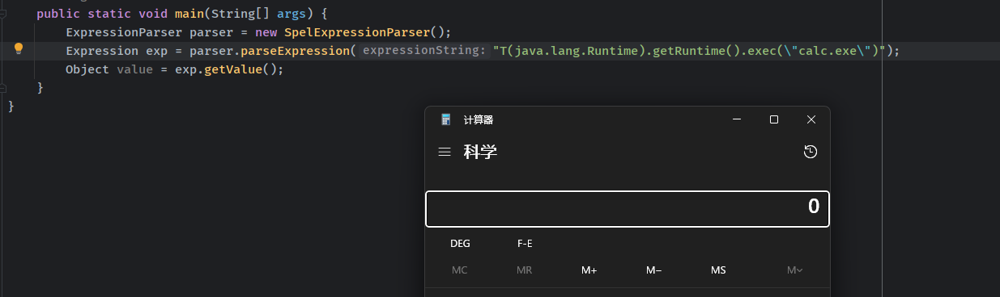

- [SPEL](#spel)
  - [基础](#基础)
    - [语法](#语法)
      - [Class expressions()](#class-expressions)
      - [Method invocation()](#method-invocation)
      - [Calling constructors（）](#calling-constructors)
      - [](#)
- [参考](#参考)

# SPEL
## 基础
Spring Expression Language（简称SpEL）是一种强大的表达式语言，支持在运行时查询和操作对象图，其中包含很多功能。其中表达式注入主要关注以下几个功能。
```
Class expressions
Method invocation
Calling constructors
Bean references
Variables
User defined functions
Templated expressions
```
### 语法
当在外部定义表达式时，SpEL使用 #{...} 作为定界符，所有在大括号中的字符都将被认为是 SpEL表达式。  
如xml中定义：
```xml
    <property name="randomNumber" value="#{ T(java.lang.Math).random() * 100.0 }"/>
```
我们可以在其中使用运算符，变量以及引用bean，属性和方法如：
> 引用其他对象:#{car}  
> 引用其他对象的属性：#{car.brand}  
> 调用其它方法 , 还可以链式操作：#{car.toString()}
> 属性名称引用：${someProperty}  
> T()运算符会调用类作用域的方法和常量

直接使用SPEL的API对字符串进行解析时就不用定界符了。  主要使用方法，先创建SPEL解析器对象，然后放置表达式字符串，最后调用getValue执行解析获得结果。
```java
        ExpressionParser parser = new SpelExpressionParser();
        Expression exp = parser.parseExpression("T(java.lang.Math).random() * 100.0 ");
        String message =  exp.getValue().toString();
```
#### Class expressions()
SpEL中可以使用特定的Java类型，经常用来访问Java类型中的静态属性或静态方法，需要用T()操作符进行声明。除了java.lang包下的类声明，括号中都需要包含类名的全限定名。  
通过 T() 调用一个类的静态方法，它将返回一个 Class Object，然后再调用相应的方法或属性。  
```java
        ExpressionParser parser = new SpelExpressionParser();
        Expression exp = parser.parseExpression("T(java.lang.Runtime).getRuntime().exec(\"calc.exe\")");
        Object value = exp.getValue();
```
   
还可以直接创建对象实例。  
```java
        ExpressionParser parser = new SpelExpressionParser();
        Expression exp = parser.parseExpression("new  java.lang.ProcessBuilder('calc.exe')");
        ProcessBuilder value = (ProcessBuilder)exp.getValue();
        value.start();
```
  

#### Method invocation()
和正常方法调用一样调用方法，如果是调用其它类的方法需要在Context中放入对应的对象实例才行。  
```java
        ExpressionParser parser = new SpelExpressionParser();
        Expression exp = parser.parseExpression("'abc'.substring(2, 3)");
        String value = (String)exp.getValue();
        Expression exp2 = parser.parseExpression("check('pass')");
        StandardEvaluationContext standardEvaluationContext = new StandardEvaluationContext(new Check());
        Boolean result = exp2.getValue(standardEvaluationContext,boolean.class);
        System.out.println(value);
        System.out.print(result);


        public class Check {
            public Boolean check(String name){
                return Objects.equals(name, "pass");
            }
        }
```
输出
```
c
true
```
#### Calling constructors（）

#### 
# 参考
http://rui0.cn/archives/1043
