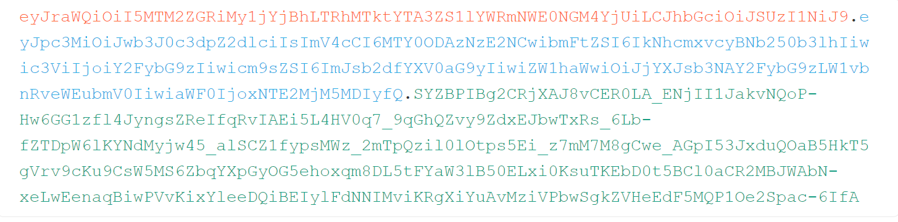

- [JWT attacks](#jwt-attacks)
  - [JWT(Json Web Token)](#jwtjson-web-token)
    - [Header](#header)
    - [Payload](#payload)
    - [signature](#signature)
  - [Attack Type](#attack-type)
    - [不验证签名](#不验证签名)
    - [空算法签名](#空算法签名)
    - [弱密钥](#弱密钥)
# JWT attacks
## JWT(Json Web Token)
组成部分:
1. Header
2. Payload
3. signature  
   
由`.`进行分割,如  
  
### Header
其中Header和Payload部分是由base64+url编码的Json数据.  
Header主要包括该JWT的一些元数据,一般使用较多的alg指定使用的算法,typ指定类型..  
```json
{
    "alg": "HS256",
    "typ": "JWT"
}
```
### Payload
Payload部分是要传递到后端的具体数据,如用户信息等等,过期时间等.
```json
{
    "iss": "portswigger",
    "exp": 1648037164,
    "name": "Carlos Montoya",
    "sub": "carlos",
    "role": "blog_author",
    "email": "carlos@carlos-montoya.net",
    "iat": 1516239022
}
```
### signature
signature部分是对Header和Payload部分使用Header中指定的算法进行Hash计算得到,后端根据这个签名来判断信息是否遭到篡改.  
## Attack Type
### 不验证签名
后端其实并没有验证签名,只是将jwt令牌解码,这种情况可以直接修改payload中的数据.
### 空算法签名
在Header中签名算法由alg进行指定,后端验证时直接根据接受的JWT中指定的alg算法进行验证,如果直接在jwt中将alg指定为空,则会导致直接验证通过.  
```json
{
    "alg": "none",
    "typ": "JWT"
}
```
指定alg为none后,还要删除jwt中的signature部分(但保留最后一个`.`分隔符).
### 弱密钥
用于算法加密的密钥强度较弱可能被hashcat暴力破解,然后伪造任意合法签名.  
` hashcat -a 0 -m 16500 <jwt> <wordlist>`
