- [Prototype Pollution(原型污染)](#prototype-pollution原型污染)
  - [JavaScript 原型和继承](#javascript-原型和继承)
    - [原型](#原型)
    - [继承](#继承)
  - [原型污染](#原型污染)
  - [客户端原型污染](#客户端原型污染)
    - [DOM xss](#dom-xss)
  - [服务端原型污染](#服务端原型污染)
    - [越权](#越权)
    - [RCE](#rce)
    - [服务端原型污染探测](#服务端原型污染探测)
      - [属性反射](#属性反射)
      - [状态码覆盖](#状态码覆盖)
      - [JSON 缩进覆盖](#json-缩进覆盖)
      - [字符集覆盖](#字符集覆盖)
  - [Bypass](#bypass)
    - [双写](#双写)
    - [defineProperty时Value未赋值](#defineproperty时value未赋值)
  - [防御](#防御)
    - [关键字过滤](#关键字过滤)
    - [禁止原型修改](#禁止原型修改)
    - [防止对象继承属性](#防止对象继承属性)
    - [使用对象内置的安全方法](#使用对象内置的安全方法)
  - [参考](#参考)

# Prototype Pollution(原型污染)
## JavaScript 原型和继承
javascript对象实际是属性键值对的集合,比如user对象:
```js
const user =  {
    username: "wiener",
    userId: 01234,
    isAdmin: false,
    exampleMethod: function(){
        // do something
    }
}
```
使用`.`或`[]`来引用其属性.  
```
user.username
user['userId']
```   
区别在于
1. `.`后面不能使用js的关键字,例如:(class,this,function).
2. `.`后面不能有数字.
3. 使用`[]`时如果对象没有该属性,那么会自动添加该属性,而使用`.`时不会.
属性还可能包含可执行函数.在这种情况下,该函数称为"方法".  
### 原型
JavaScript 中的每个对象都链接到某种对象,称为其原型.默认情况下,JavaScript 会自动为新对象分配一个内置原型.
```js
let myObject = {};
Object.getPrototypeOf(myObject);    // Object.prototype
let myString = "";
Object.getPrototypeOf(myString);    // String.prototype
let myArray = [];
Object.getPrototypeOf(myArray);	    // Array.prototype
let myNumber = 1;
Object.getPrototypeOf(myNumber);    // Number.prototype
```
对象会自动继承其分配的原型的所有属性,除非它们已经具有具有相同键的属性.
### 继承
每当你引用一个对象的属性时,JavaScript引擎首先会尝试直接在对象本身上访问它.如果对象没有匹配的属性,JavaScript 引擎会在对象的原型上查找它.  
而一个对象的原型也只是另一个对象,而该对象也有自己的原型,最终构成一条原型链,而最顶层的原型对象就是Object对象,而Object对象没有原型,其原型为null.
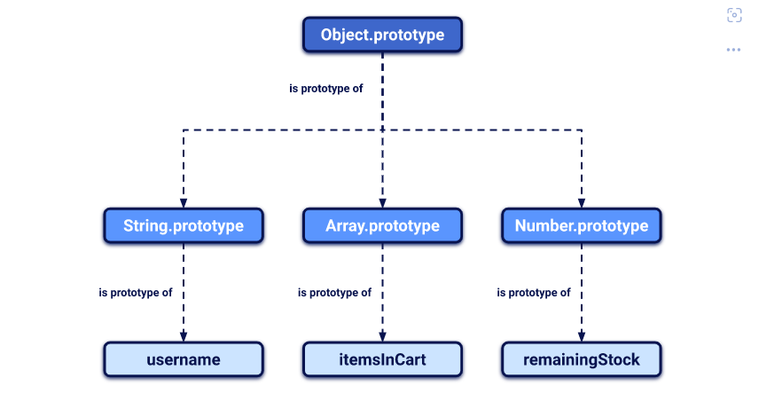  
同时对象不仅从它们的直接原型继承属性,而且从原型链中它们上面的所有对象继承属性.  
每一个对象都有一个属性可以来访问其原型即`__proto__`.  
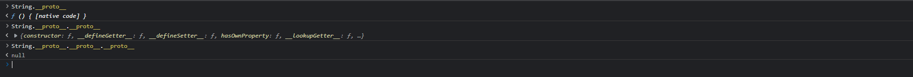  
并且在js中可以像修改其它对象一样修改js的内置原型.  
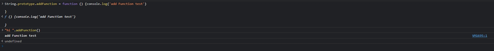  
在js内置的String原型对象中添加了一个addFunction方法,那么所有继承了内置String原型的对象都会拥有该方法.
## 原型污染
当 JavaScript 函数递归地将包含用户可控制属性的对象合并到现有对象中时,容易会出现原型污染漏洞,这可许攻击者注入带有键（如__proto__）的属性以及任意嵌套属性.由于 JavaScript 上下文中__proto__的特殊含义,合并操作可以将嵌套属性分配给对象的原型,而不是目标对象本身.因此,攻击者可以使用包含有害值的属性污染原型,这些属性随后可能被应用程序以危险的方式使用. 

简单来说就是用户可控的输入如URL,Json输入(source)等被赋值给js对象时没有经过过滤导致我们可以通过给`__proto__`属性赋值来向其原型对象添加恶意的属性,然后在另一个继承了该被污染原型的对象(sink点)使用了该恶意属性来执行任意代码.  

关键在于sink点自身要没有定义该属性但引用了该属性,导致其需要从原型来获取该值,那么就会获取到被我们污染的恶意属性.
## 客户端原型污染
### DOM xss
DOM Xss常见于客户端原型污染的利用.  
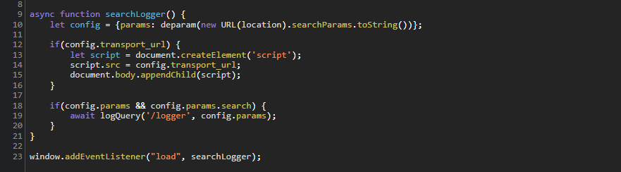  
可以看到在该方法中,将config对象的transport_url属性赋值到了src标签的src属性中,如果我们可以通过原型污染来控制该属性那么就可以进行XSS,而在config的赋值过程中可以看到param参数来源于URL的查询语句,可控.  
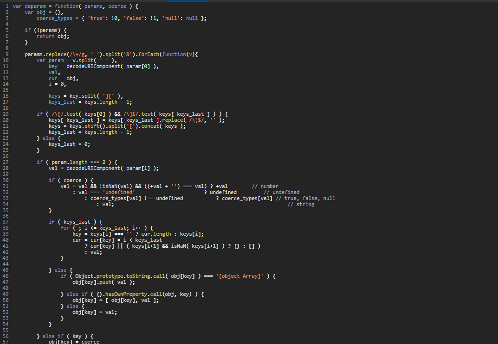  
在参数分隔赋值的过程中没有对属性名进行过滤,导致我们可以注入`__proto__[transport_url]`属性来修改原型对象的`transport_url`属性.  
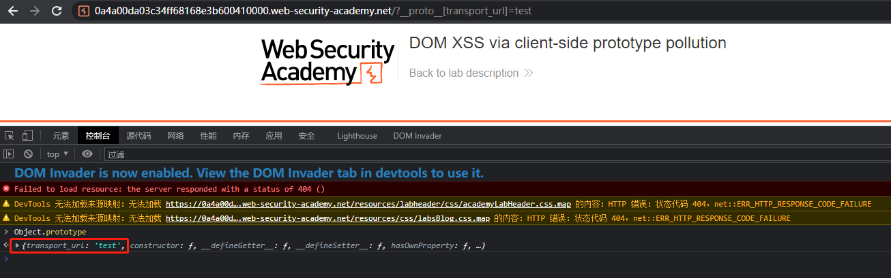  
可以看到Obejct原型对象已经被添加了`transport_url`属性.而config对象在自身没有transport_url属性的情况下就会使用到自己原型的`transport_url`属性.  
通过注入`data:1,alert(1)`来触发DOM XSS.  
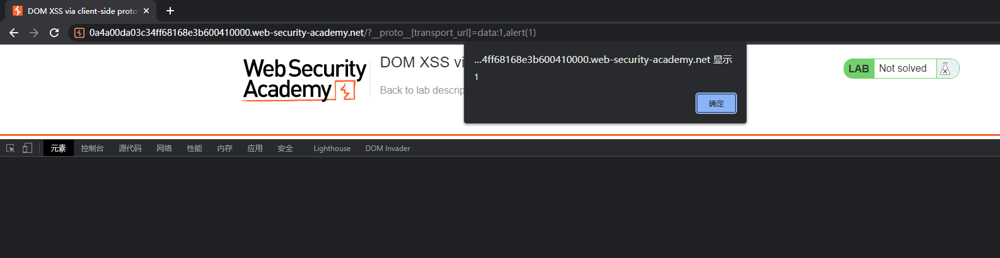  
## 服务端原型污染
服务端原型污染常发生在Node.js 和 Express 框架的服务器中.  
### 越权
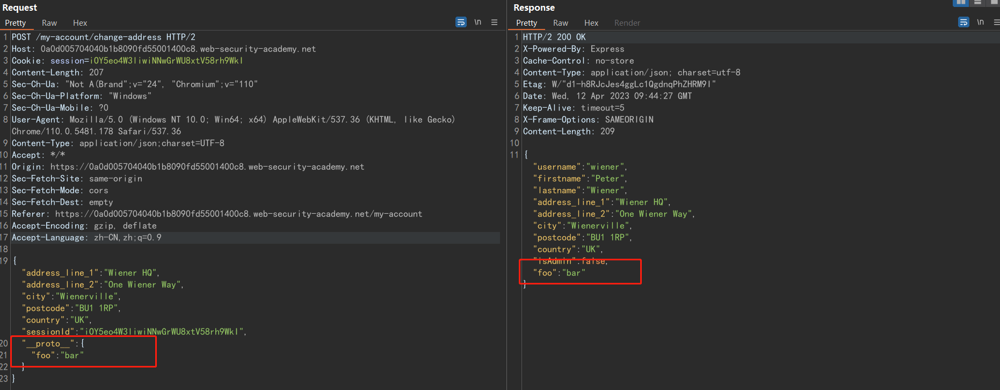
可以看到在json字段中通过注入`__proto__`字段使得在服务器端的该对象原型中注入了foo字段.  
其中如果该对象的的属性中是继承于原型的话那么便可以对原型进行污染,比如从响应可以看到有一个`isAdmin`字段.  
像对象的原型注入`isAdmin`字段,如果该对象本身没有该属性而是从原型继承来的话那么便可以通过原型污染进行权限提升.
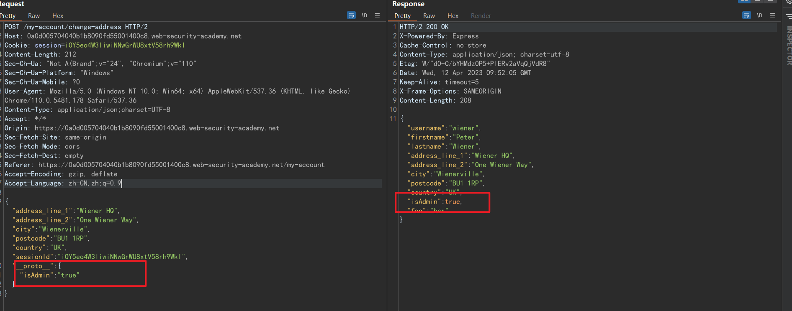  
### RCE
child_process.spoon()和child_process.fork()等方法使开发者能够创建新的Node子进程。fork()方法接受一个选项对象，其中一个默认的选项是execArgv属性。这是一个包含命令行参数的字符串数组，在创建子进程时会使用这些参数。如果它没有被开发者定义，这可能也意味着它可以通过原型污染来控制。
常利用的是--eval参数，它使你能够传递任意的JavaScript，这些JavaScript将被子进程执行。甚至可以加载额外的模块：
```json
"execArgv"： [
    "--eval=require('<module>')"
]
```
除了fork()，child_process模块还包含execSync()方法，该方法将一个任意的字符串作为系统命令执行。  

通过execArgv属性来污染原型，该属性将--eval参数添加到生成的子进程中,然后在后续创建的子进程执行时将会执行--eval属性的代码.  
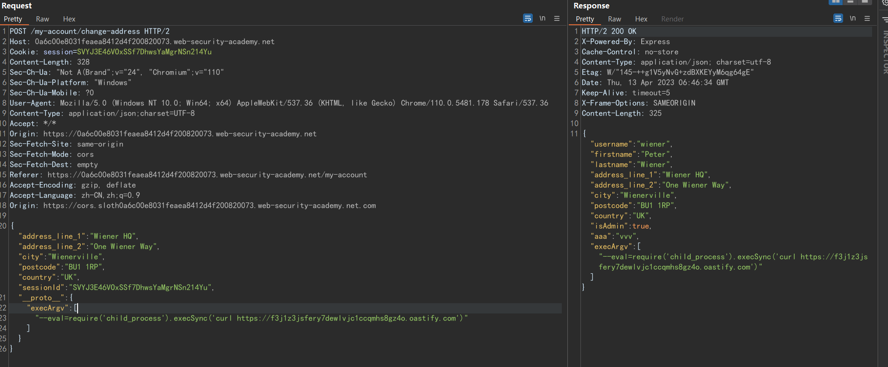  
此时已经污染了创建子进程时的env对象属性,再后续触发子进程执行时,恶意代码被执行.  
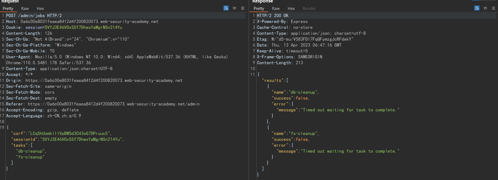  
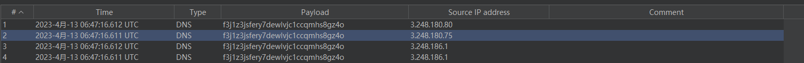   

通过污染shell属性RCE  
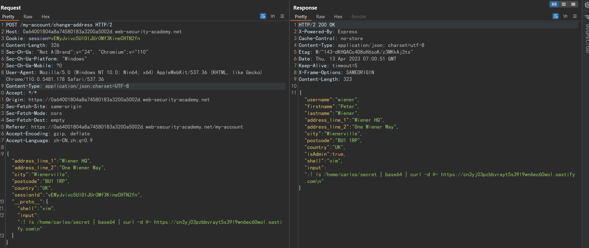  
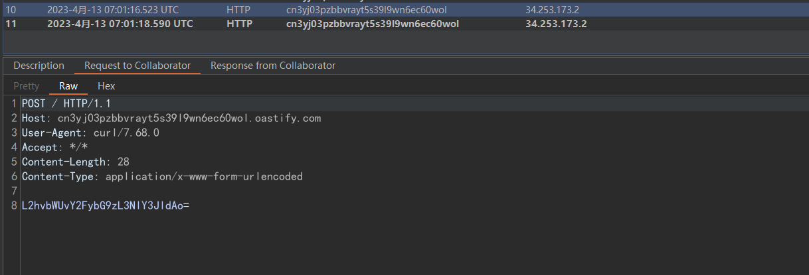
### 服务端原型污染探测
服务端原型污染探测的难度更大,客户端原型污染等于是白盒审计,而服务器端原型污染則是黑盒审计,且一旦污染了原型就会持续到Node整个生命周期,且在容易导致服务器崩溃.  
#### 属性反射
在JS中,除了一些内置属性,对象的属性是可枚举的,包括其从原型继承的属性.  
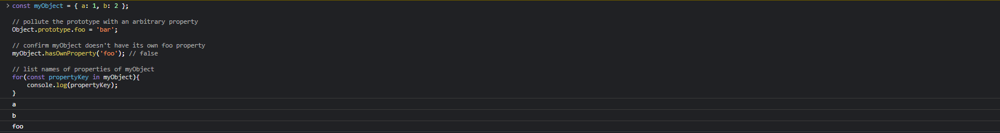  
通过在其Obejct原型设置的foo属性,任何继承于该原型的对象在枚举遍历时都时含有该属性的.  
如果服务器是遍历该对象属性进行返回,那么便可以通过注入一个全局属性,来查看响应中是否返回了该属性.  
```json
POST /user/update HTTP/1.1
Host: vulnerable-website.com
...
{
    "user":"wiener",
    "firstName":"Peter",
    "lastName":"Wiener",
    "__proto__":{
        "foo":"bar"
    }
}

HTTP/1.1 200 OK
...
{
    "username":"wiener",
    "firstName":"Peter",
    "lastName":"Wiener",
    "foo":"bar"
}
```
#### 状态码覆盖
如果服务端不是遍历对象所有属性返回,那么注入的全局属性并不会返回在响应中.  

在Express这样的服务器端JavaScript框架允许开发人员设置自定义HTTP响应状态,而HTTP服务器可能会发出通用的状态码(响应码全为200),而把真实的状态码放在响应中.  
```json
HTTP/1.1 200 OK
...
{
    "error": {
        "success": false,
        "status": 401,
        "message": "You do not have permission to access this resource."
    }
}
```
而该响应码如果是从Error对象的status或者statusCode属性获取的,且没有显式设置该属性,那么可以通过污染状态码来检测是否可以进行原型污染.  
响应中没有显示注入的通用属性.  
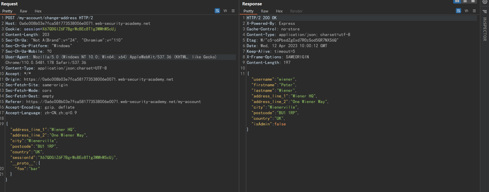  
构造一个错误请求,在响应中可以看到返回的真实状态码为400.  
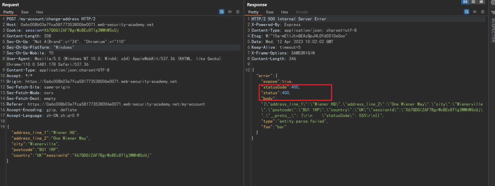  
注入statusCode属性,如果该属性没有被显式定义,那么后续的错误响应中将会使用该原型注入的statusCode属性.
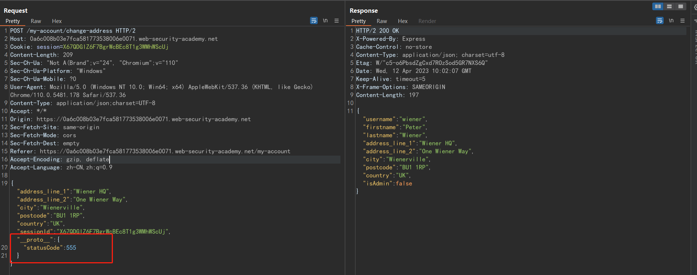  
再次构造错误请求,可以看到statusCode已经被污染为了555.
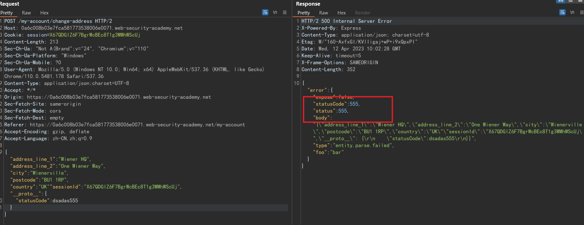
#### JSON 缩进覆盖
Express框架提供了一个json spaces选项,它使你能够配置响应中任何JSON数据的缩进所使用的空格数.在许多情况下,开发人员不定义这个属性,这使得它很容易通过原型链受到污染.
如果你以访问任何类型的JSON响应,可以尝试用你自己的json spaces属性来污染原型,然后重新发出相关请求,看看JSON中的缩进是否相应增加.  
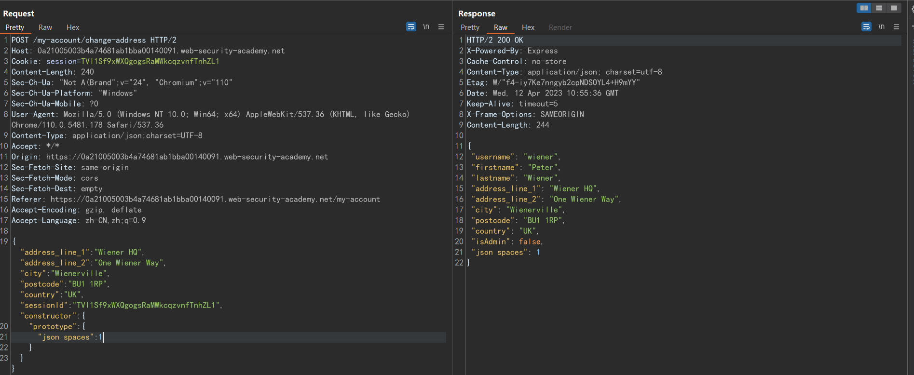  
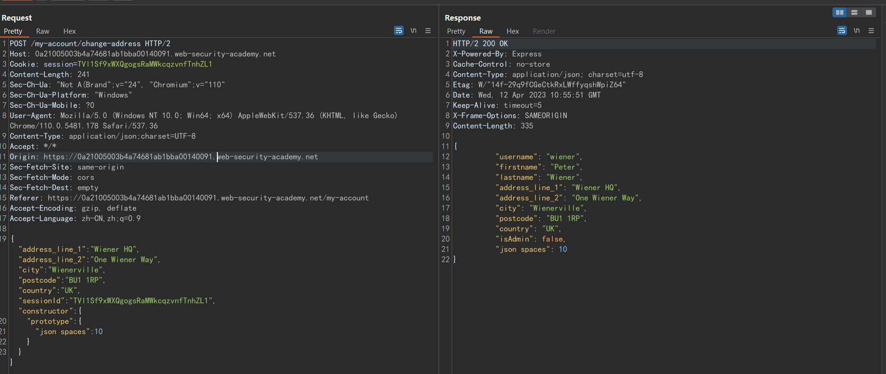
#### 字符集覆盖
Express服务器经常实现所谓的"中间件"模块,使请求在被传递到适当的处理函数之前得到预处理.例如,该模块通常用于解析传入请求的主体,以便生成一个新的对象.而其中在处理请求时设置字符集时如果使从原型继承的话,那么则可以通过修改字符集来探测.  
在`role`字段使用UTF-7编码的值,默认情况下服务端使用的字符集是UTF-8,`+AGYAbwBv-`会直接显示在响应中.
```json
{
    "sessionId":"0123456789",
    "username":"wiener",
    "role":"+AGYAbwBv-"
}
```
注入字符集设置
```json
{
    "sessionId":"0123456789",
    "username":"wiener",
    "role":"default",
    "__proto__":{
        "content-type": "application/json; charset=utf-7"
    }
}
```
此时再次发送第一个请求包,如果被成功污染,那么响应中的role则会是`foo`. 
## Bypass
### 双写
对于这种对关键字替换为空的过滤,直接双写即可绕过.  
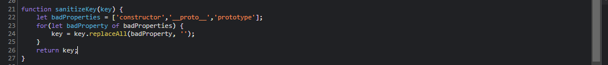   
`?__pro__proto__to__[foo]=bar`
### defineProperty时Value未赋值
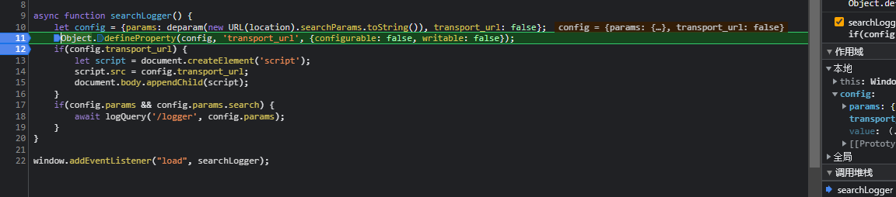  
对于config对象设置了属性,但是defineProperty时只设置了是否可修改和可删除编辑,并没有设置其value.  
```
语法：Object.defineProperty(obj,property,descriptor)

obj:绑定属性的目标对象 property:绑定的属性名 descriptor:属性描述（配置）,且此参数本身为一个对象
属性值1：value
设置属性默认值
属性值2：writable
设置属性是否能够修改
属性值3：enumerable
设置属性是否可以枚举,即是否允许遍历
属性值4：configurable
设置属性是否可以删除或编辑
属性值5：get
获取属性的值
属性值6：set
设置属性的值
```  
导致可以通过污染原型的value属性进行利用.  
`/?__proto__[value]=data%3A%2Calert%281%29`
## 防御
### 关键字过滤
`__proto__`,`constructor`,...
### 禁止原型修改
在对象上调用Object.freeze()方法可确保无法再修改其属性及其值，并且无法添加新属性。
### 防止对象继承属性
手动创建对象并设置其原型,防止默认情况下继承内置原型.
```js
let myObject = Object.create(null);
Object.getPrototypeOf(myObject);    // null
```
### 使用对象内置的安全方法
最安全的方式是使用对象内置的安全方法.比如Map对象的get方法.  
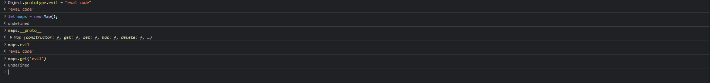  
虽然污染了Object原型,但是在使用了其内置的get方法,其只会返回对象自身定义的属性而不是返回继承的属性.
## 参考
https://portswigger.net/web-security/prototype-pollution  
https://portswigger.net/web-security/prototype-pollution/javascript-prototypes-and-inheritance   
https://portswigger.net/research/widespread-prototype-pollution-gadgets  
https://portswigger.net/web-security/prototype-pollution/server-side#charset-override