- [Race Conditions(条件竞争)](#race-conditions条件竞争)
  - [常见业务场景](#常见业务场景)
    - [重复使用优惠券](#重复使用优惠券)
    - [绕过速率限制](#绕过速率限制)
    - [购物支付结算（多接口条件竞争）](#购物支付结算多接口条件竞争)
      - [多接口响应时间不一致](#多接口响应时间不一致)
    - [邮箱验证绕过（单接口条件竞争）](#邮箱验证绕过单接口条件竞争)
      - [单会话机制](#单会话机制)
    - [邮箱验证绕过(部分业务逻辑存在条件竞争)](#邮箱验证绕过部分业务逻辑存在条件竞争)
    - [只使用了时间戳计算的Token](#只使用了时间戳计算的token)
  - [防御方案](#防御方案)
  - [参考](#参考)

# Race Conditions(条件竞争)
条件竞争一般是由于极短时间内并发请求导致的逻辑问题，在极短时间内对同一个数据进行了重复操作，可能导致该数据被重复使用，或者绕过一些服务器对该数据的访问限制。  
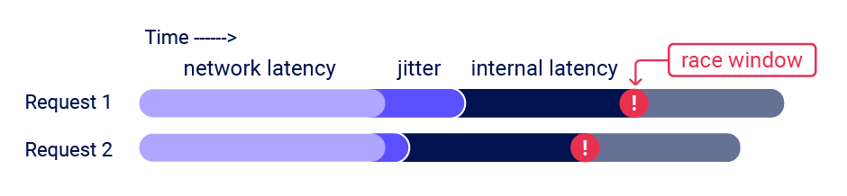  

BurpSuite支持发送Single Pack请求(HTTP2)，即将多个http请求(20~30个)放在一个tcp包中进行发送，来避免多个http请求之间的在到达服务器之前网络波动造成的时间差，使得漏洞利用成功率更高。  
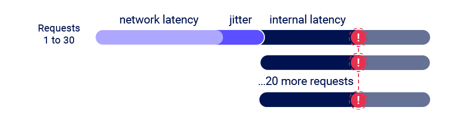  
## 常见业务场景
### 重复使用优惠券
一般一张优惠券只能使用一次，当使用了之后需要将优惠券从数据库中删除或者将可用状态置为false,但这个后续的处理过程中存在一个很短的处理时间差(通常只有几毫秒，甚至可能更短)，如果在这个时间差内该优惠券再次被用户提交，由于该优惠券还未完成删除操作，及优惠券仍处于可用状态，这导致优惠券被重复使用。  
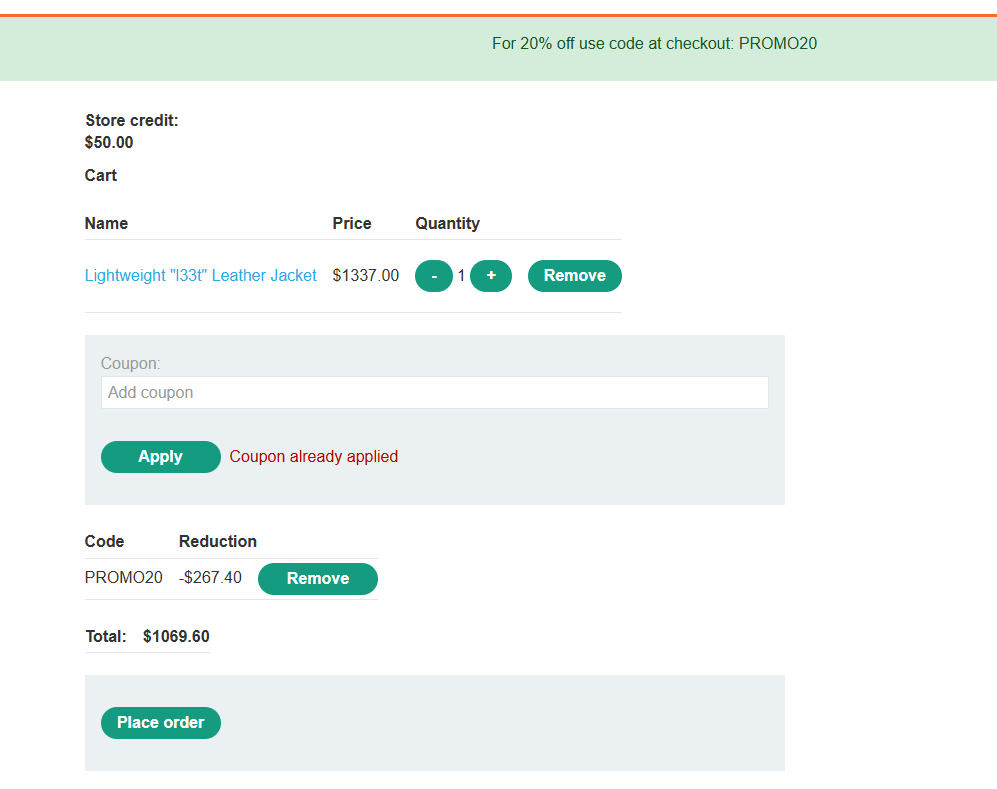
输入一个优惠券可以获得20%折扣，当使用了之后再次输入则会提示已经被使用了，将多个相同使用该优惠券的请求在burp中放到一个group中，使用Single Pack发送，将所有请求使用一个tcp包发送（利用不稳定，需要多次尝试）。  
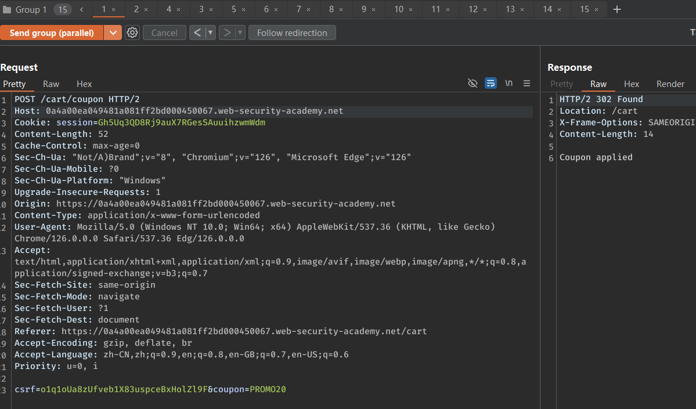  
最后该优惠券被重复使用。  
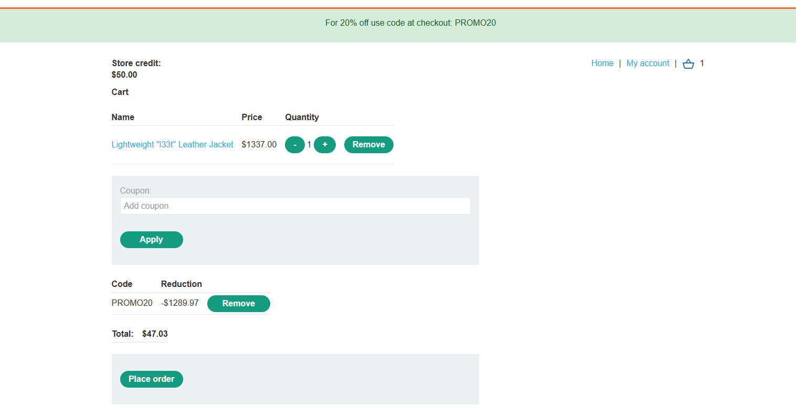
### 绕过速率限制
一般登录时会有防止爆破的保护措施，如对一个账户进行短时间内多次密码尝试失败则会导致账户锁定。  

常见的实现逻辑为当账户登录失败三次后则将该账户的状态置为锁定或者将该账户加入黑名单（可能是数据库的一个表或者是账户的一个字段属性）中，那么在判断该账户是否登录失败三次并修改相关数据库数据的过程中也存在一个极短的时间差，在修改完成之前我们还是可以发送大量登录请求进行爆破来绕过登录失败三次则锁定账户的限制。
使用Turbo Intruder可以实现使用Single Pack请求来爆破密码，其中的每个请求的密码字段都不同，实现一个tcp包中包含多个不同密码的登录请求。  
一分钟输入三次错误密码则被限制登录。  
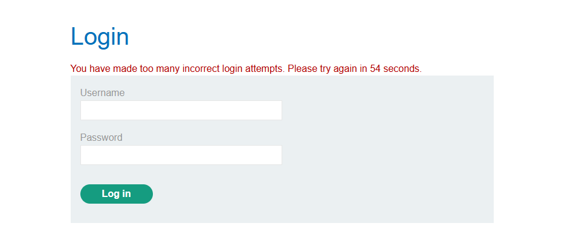  
使用race-single-packet模板
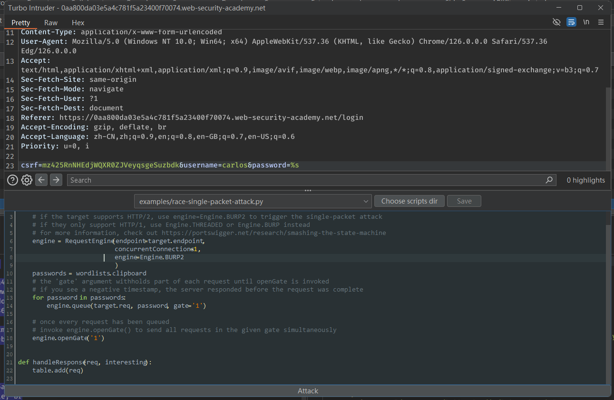   
成功发送大量请求爆破成功。  
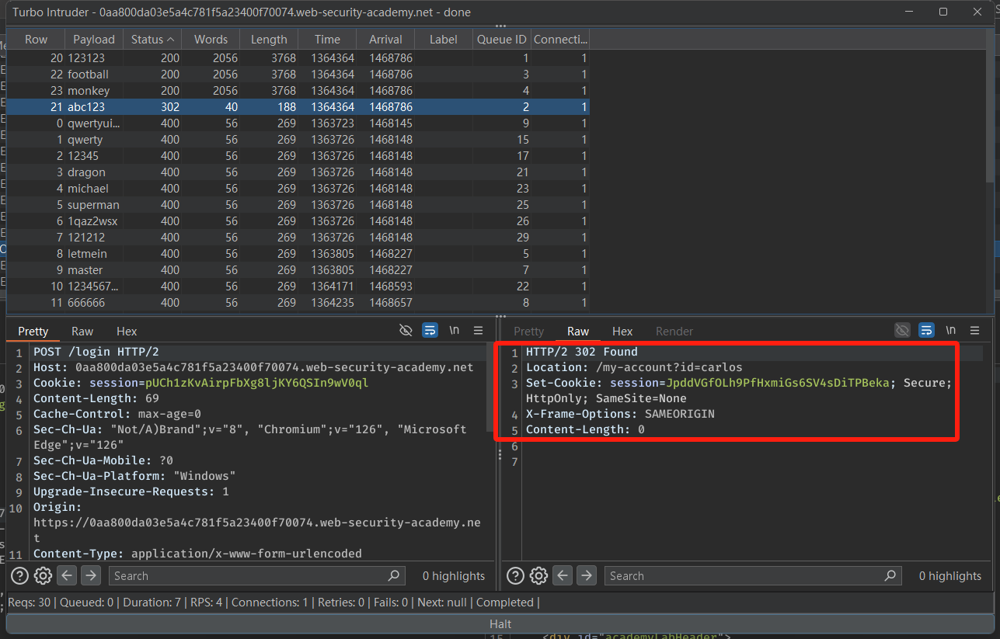  
### 购物支付结算（多接口条件竞争）
参考购物的流程场景。
1. 用户将商品添加到购物车，当前购物车商品信息保存在服务端。  
2. 用户点击结账，服务器验证用户余额是否足够支付购物车商品。
3. 服务端验证余额足够支付商品金额进入下一步。
4. 服务器扣除金额，并将购物车商品添加到用户账户。

那么在服务端验证余额足够之后在购物车商品添加到用户账户之前则存在一个极短的时间差，通过并发请求将额外的商品在服务端验证余额通过之后立刻添加到购物车中，那么则可以免费购买到额外的商品。
#### 多接口响应时间不一致
在多接口条件竞争中还有一个问题即两个处理接口耗费的时间不一致，当同时发送两个接口的请求时，可能A接口的响应时间比B接口的响应时间会长得多，一种可能是服务端架构问题，如第一次建立连接时会需要额外的时间，但其实两个请求还是会几乎同时达到后端服务器，对实际测试影响不大，还有一种情况则两个接口的处理逻辑本就不一样，A接口的逻辑比B接口的处理逻辑更复杂所以需要更多的时间，导致两个接口很难出现同时进入同一个时间差内发生条件竞争。  
  
所以在实际场景中需要判断是由于哪一种原因导致的响应时间不一致。  

针对第一种请求可以在发送两个竞争接口请求之前添加一个额外无关的接口请求，如请求主页的请求，同时发送这三个请求，如果后面两个竞争接口的响应时间较短而第一个主页请求的响应时间明显更久则可以无视该情况正常测试。  

而如果后面两个竞争接口请求的响应时间还是有明显差异则说明是第二种情况，两个接口自身逻辑的处理时间就存在较大差异，这种情况如果服务端存在速率限制的话则可以在逻辑处理时间更短的接口请求前额外发送大量无效请求来触发速率限制，造成服务端延迟处理该接口的请求，从而缩小两个接口请求处理之间的时间差，使得两个请求处理逻辑更容易进入同一个时间差内发生条件竞争。  
  
### 邮箱验证绕过（单接口条件竞争）
参考这样一个修改邮箱的验证流程。
1. 用户编辑当前邮箱，服务端将新邮箱的值存储在用户的某个字段中。
2. 服务端生成一个随机验证token并渲染邮件内容模板，其中包含token链接和新邮箱地址。
3. 调用邮件发送服务读取该字段邮箱地址，向该邮箱发送验证token。

那么在服务端生成token渲染邮件中之后和在读取该用户新邮箱地址发送邮件之间则可能存在一个时间差，通过并发先编辑邮箱地址为受害者邮箱再立刻修改邮箱地址为自己的邮箱，则会导致受害者邮箱的token链接发送到我们的邮箱地址。  
一个请求将邮箱地址修改为受害者邮箱。
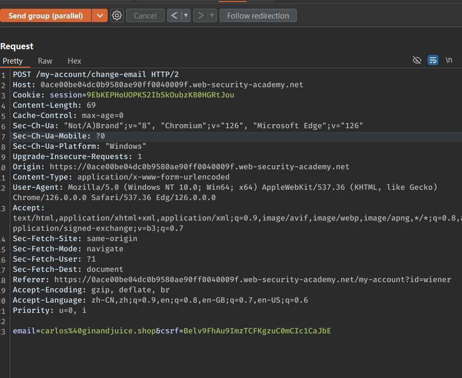   
另一个并发请求将邮箱地址修改为自己的邮箱。
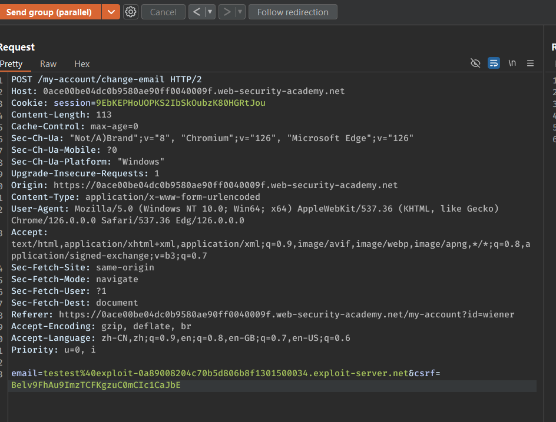  
受害者目标邮箱的token链接发送到了错误地址。  
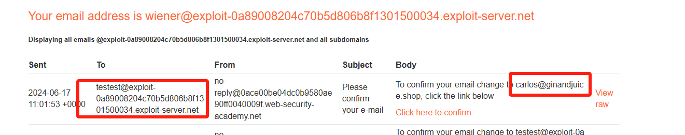  
#### 单会话机制
单会话机制是服务端是根据会话来处理请求的，一个会话的并发请求不会同时进行处理只会按照顺序进行，如PHP的SESSION机制，如果使用同一个SESSION并发两个请求，这两次请求PHP会按顺序进行而不会同时进行处理，这时候需要在两个并发请求中使用两个不同的SESSION。
### 邮箱验证绕过(部分业务逻辑存在条件竞争)
参考这样一个用户注册流程：
1. 用户注册时输入注册邮箱。
2. 服务端创建该用户。
3. 服务端生成一个验证token,并更新该用户的验证token字段。
4. 服务端发送token链接给对应邮箱。

在这个流程中，如果服务端在创建验证token和创建用户不是使用一个SQL语句或者操作进行的而是先创建用户在赋值验证token，那么在创建完用户还未赋值Token前则该用户的token字段则会有一个默认值，如null或者空。  
通过并发发送注册用户请求和发送null token进行验证的请求来利用这个时间差来绕过邮箱验证。  
使用Single Pack,批量注册目标邮箱，每一次注册一个用户名时，同时发送大量NULL Token验证的请求（该场景使用session来确定用户名，大部分场景需要在验证时输入注册用户名或者邮箱）。  
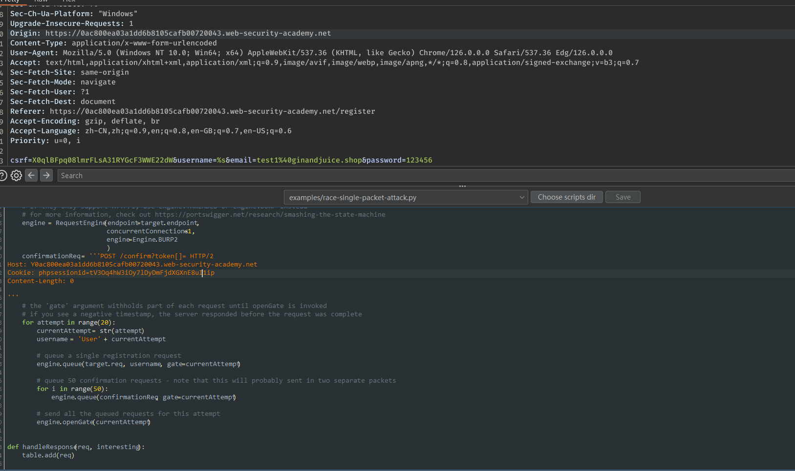  
最终直接验证成功使用别人邮箱注册。
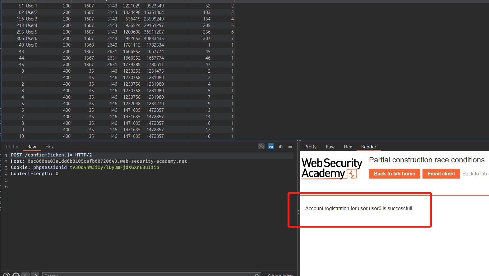  
### 只使用了时间戳计算的Token
这种情况是指在生成随机Token时，使用了不严谨的算法，两个账户的token生成结果只由时间戳作为变量，即如果两个用户几乎同时生成Token,那么则会生成两个相同的Token。
如生成密码重置链接时，并发生成自己账户的密码重置链接和受害者的重置链接，导致向两个账户发送相同的Token链接，然后在重置密码时将重置的账户名修改为受害者的账户即可。

>在单会话机制下，使用同一个会话并行发送重置链接并不会导致Token相同，因为后端会依此处理该会话的请求，导致时间戳会有差异，此时需要使用新的一个Session来发送另一个密码重置链接。

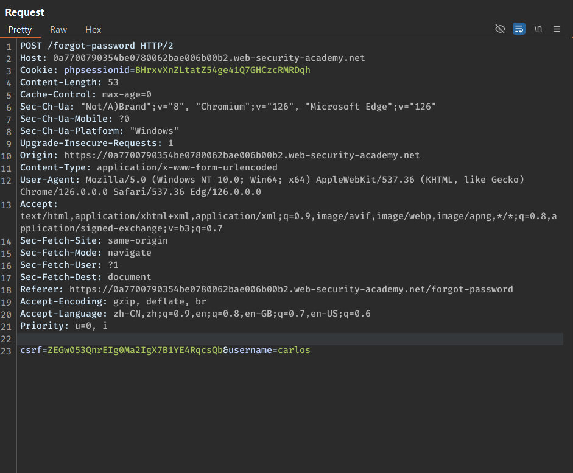  
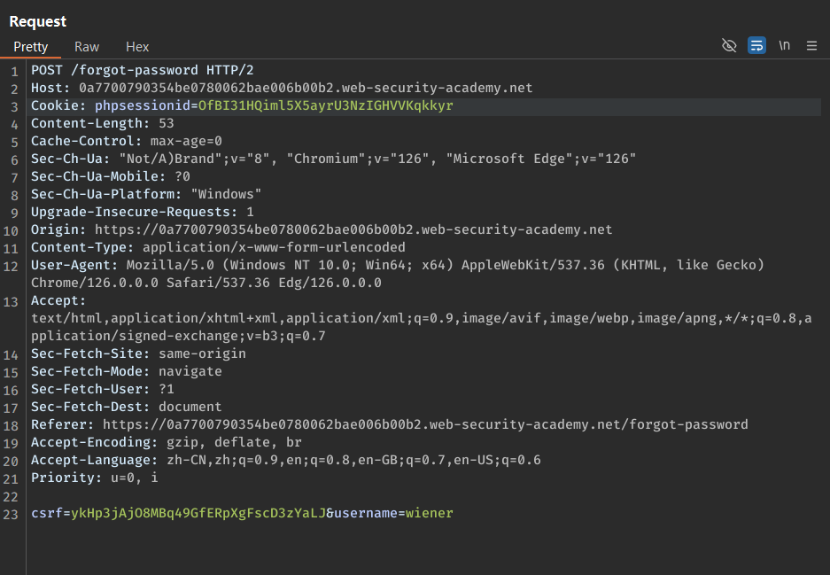  

使用不同的phpsessid来同时发送发送两个账户的密码重置链接。  
最后使用这个相同的Token来修改目标账户密码。
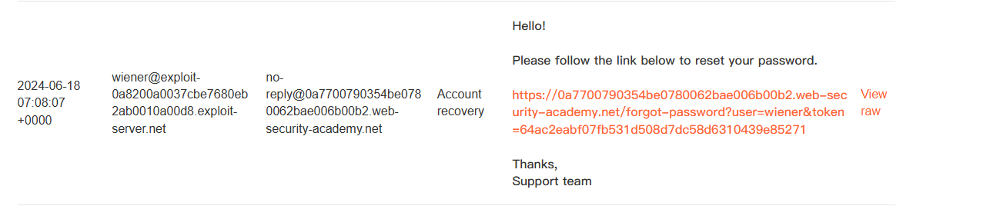  
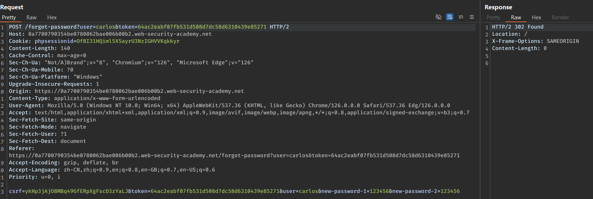  
## 防御方案
1. 字段数据在业务流程中保持一致，避免多次从其它来源获取字段数据，如生成邮件模板时，邮件内容使用的邮箱地址应该和最终要发送的地址来自一个不可更改的字段。  
2. 使用数据库事务来保证敏感操作的原子性。  
3. 使用客户端来保存临时状态，如JWT等。  
## 参考
https://portswigger.net/web-security/race-conditions  
https://portswigger.net/research/smashing-the-state-machine  