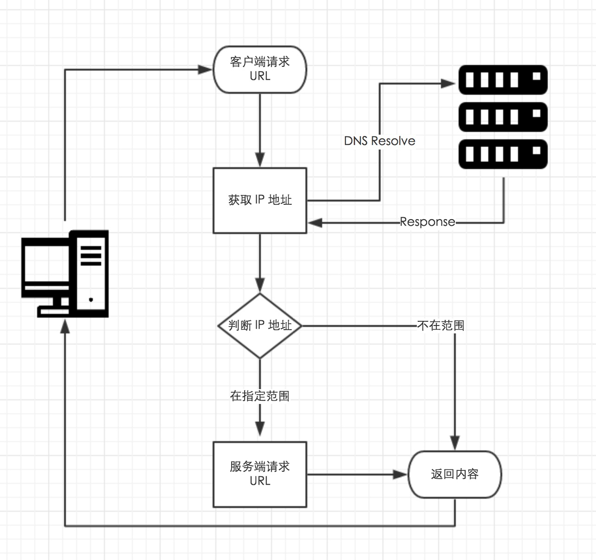

- [Server-side request forgery (SSRF)](#server-side-request-forgery-ssrf)
  - [Impact](#impact)
  - [产生SSRF的函数](#产生ssrf的函数)
    - [php](#php)
    - [SSRF](#ssrf)
  - [SSRF中URL伪协议](#ssrf中url伪协议)
  - [云上SSRF](#云上ssrf)
  - [Bypass](#bypass)
    - [进制转换](#进制转换)
    - [域名欺骗](#域名欺骗)
    - [编码](#编码)
    - [`@`绕过](#绕过)
    - [`#`绕过](#绕过-1)
    - [白名单子域名](#白名单子域名)
    - [302重定向](#302重定向)
    - [短链接](#短链接)
    - [DNS Rebinding](#dns-rebinding)
  - [修复方案](#修复方案)
    - [黑白名单](#黑白名单)
    - [过滤响应](#过滤响应)
    - [禁止跳转](#禁止跳转)
    - [获取访问的真实IP](#获取访问的真实ip)
    - [dns重绑定](#dns重绑定)
    - [参考代码](#参考代码)
  - [参考](#参考)
# Server-side request forgery (SSRF)
服务端请求伪造,简单来说就是可以让目标服务器作为代理去请求指定的任意地址。
## Impact
* 访问本地或者内网服务器监听的端口  
一些监听在本地的端口正常情况下无法被其他人访问，但通过SSRF可以使服务器自身做代理来访问到本地的端口。  
```
redis 6379
fpm 9000
...
```
* 绕过认证  
有一些接口是需要认证才能进行访问的，但是认证只限于其它IP进行访问时，当通过内网来请求这些接口时可能不需要验证。 
* 读取文件
* 直接用已知EXP攻击内网Server(Str2,redis,elastic...).
## 产生SSRF的函数
### php
* file_get_contents
* sockopen()
* curl_exec()
* readfile()
* fopen()
* ...
### SSRF
主要是java.net.URL和java.net.URI类的openConnection()方法。
## SSRF中URL伪协议
当没有限制请求的协议时,可以尝试使用其他的协议扩展攻击面.
file:/// 从文件系统中获取文件内容，如，file:///etc/passwd  
dict:// 字典服务器协议，访问字典资源，如，dict:///ip:6739/info：  
sftp:// SSH文件传输协议或安全文件传输协议  
ldap:// 轻量级目录访问协议   
tftp:// 简单文件传输协议  
gopher:// 分布式文档传递服务，可使用gopherus生成payload  
## 云上SSRF
1. Amazon Elastic Compute Cloud (Amazon EC2)中的每个实例，都可以通过执行`curl -s http://169.254.169.254/user-data/`，对IP 169.254.169.254发出HTTP请求，来获取该云实例自身的元数据。
2. 在容器化架构中还可以攻击Kubernetes API Server。
## Bypass
### 进制转换
127.0.0.1 -> 2130706433 -> 017700000001 -> 127.1
### 域名欺骗
将恶意域名的ip解析为127.0.0.1。Tools:spoofed.burpcollaborator.net
### 编码
将关键字符url编码或大小写混淆。
1. 双字编码
2. URL编码
3. 16进制编码
4. 8进制编码
### `@`绕过
一些白名单中只是匹配了url的起始或者是否包含某些白名单关键字,可以使用url的一些来绕过.
* 通过RFC标准,url`@`前面的部分将会被视为用户密码,而`@`后面的部分才会被视为目标服务器. 
`https://whitelist-host@evil-host`
### `#`绕过
* 通过`#`锚点在恶意host中加入白名单host.
`https://evil-host#whitelist-host`
### 白名单子域名
在自己的域名下注册一个白名单host的恶意子域名.
* `https://whitelist-host.evil-host`
### 302重定向
因为很多防御措施都是在请求前对路径进行过滤和检测,如果该SSRF漏洞后端支持重定向的话则可以利用重定向来绕过很多黑名单,如果应用自身就存在Openredirection漏洞的话也可以绕过大部分白名单,先请求一个合法的远程服务器,通过控制远程服务器返回302状态码在location Header来再次请求任意地址.  

php快速搭建302跳转服务器,默认执行-t指定目录下的index.php.  
`php -s localhost:80 -t ./`  
```php
<?php
Header('Location: http://localhost:8080/console')
?>
```
### 短链接
1. 使用4m短网址或站长工具即可（短链接本质是302跳转）
2. is.gd可以自定义后缀的短网址
百度短地址等等
### DNS Rebinding
DNS Rebinding主要是利用服务端在获取到域名时先对域名进行一次解析获取到其ip地址，判断ip是否合法然后再发出实际http请求，在获取到ip判断是否合法时和实际发出http请求之间存在一个细微的时间差，攻击者需要有一个可控制的dns服务器，然后将自己的域名解析委托给自己的dns服务器，同时将TTL值设为非常短(0)，即客户端不缓存解析记录，通过让服务端先请求自己的域名，攻击者控制的dns服务器先返回正常的ip地址，然后再立即修改域名解析地址为内网ip，在第二次发出实际http请求时从dns服务器解析获取的ip则为内网ip。  
## 修复方案
修复思路
  
### 黑白名单
* 使用白名单: 只允许访问使用http/https协议访问可信域名和端口
* 使用黑名单: 禁止访问私有地址段及内网域名,禁止访问非常用http端口,禁止其它file:///,gopher://,ftp://协议访问.
### 过滤响应
* 统一错误信息,避免用户可以根据错误信息来判断远端服务器的端口状态。
* 过滤返回信息,验证远程服务器对请求的响应是比较容易的方法。如果web应用是去获取某一种类型的文件。那么在把返回结果展示给用户之前先验证返回的信息是否符合标准。  
### 禁止跳转
* 对已校验通过地址进行访问时，应关闭跟进跳转功能,防止通过短链接等跳转到内网IP.
### 获取访问的真实IP
* 建议通过URL解析函数进行解析，获取host或者domain后通过DNS获取其IP，然后和内网地址进行比较(注意各种进制转换绕过)。
### dns重绑定
针对dns重绑定，java默认情况下不受影响，java中DNS请求成功的话默认缓存30s(字段为networkaddress.cache.ttl，默认情况下没有设置)，失败的默认缓存10s。（缓存时间在 /Library/Java/JavaVirtualMachines/jdk /Contents/Home/jre/lib/security/java.security 中配置，修改方式`java.security.Security.setProperty("networkaddress.cache.negative.ttl" , "10");`;
但php默认为0，且Linux 默认也不会进行 DNS 缓存，但mac和windows会缓存，可以修改TTL值大于解析到发起请求这段时间即可。
有些公共DNS服务器，比如114.114.114.114还是会把记录进行缓存，但是8.8.8.8是严格按照DNS协议去管理缓存的，如果设置TTL为0，则不会进行缓存。

1. 如果是域名，将URL中的域名替换IP后再进行校验，直接对IP发起请求，这样则不会受到域名缓存的影响，同时注意手动设置Host头为域名（防止没有Host访问不了）。
2. 还可以在http请求前进行两次域名解析，如果两次的解析ip不一致或者第二次的Ip为内网ip则可以判定为dns Rebinding攻击。
### 参考代码
1. 代码
```java
    private final List<String> list = Arrays.asList("www.baidu.com","www.google.com");
    public String fix(@RequestParam String url) throws IOException, URISyntaxException {
        URL target = new URL(url);
        String host = target.getHost();
        String ip  = ssrfFix(url);
        if(Objects.equals(ip, "false")){
            return "Forbidden";
        }
        //使用IP访问时，因为SSL证书一般对应域名，会报错，手动覆盖SSL校验
        HttpsURLConnection.setDefaultHostnameVerifier((s, sslSession) -> {
            System.out.printf("Warning: URL Host: " + s + " vs. " + sslSession.getPeerHost());
            return true;
        });
        String u = target.toURI().getScheme()+"://"+ip;
        target = new URL(u);
        HttpURLConnection connection = (HttpURLConnection) target.openConnection();
        //使用IP访问，手动设置Host
        connection.setRequestProperty("Host", host);
        //禁止跳转
        connection.setInstanceFollowRedirects(false);
        InputStream inputStream =  connection.getInputStream();
        return getContent(inputStream);
    }
    public String ssrfFix(String url) throws MalformedURLException {
        // 校验 url 是否以 http 或 https 开头
        try {
            if (!isHttp(url)) {
                return "false";
            }
            //白名单校验
            if(!whiteListCheck(new URL(url).getHost())){
                return "false";
            };
            // 解析 url 为 IP 地址
            String ip = urltoIp(url);
            // 校验 IP 是否为内网地址
            if (isIntranet(ip)) {
                return "false";
            }
                //返回解析IP，指定IP访问
                return ip;
            } catch (Exception e) {
                return "false";
        }
    }
    // 1. 判断是否为http协议
    public static boolean isHttp(String url) {
        return url.startsWith("http://") || url.startsWith("https://");
    }
    public  boolean whiteListCheck(String host){
        return (list.contains(host));

    }
    // 2. 解析IP地址
    public static String urltoIp(String url) {
        try {
            URI uri = new URI(url);
            String host = uri.getHost().toLowerCase();
            InetAddress ip = Inet4Address.getByName(host);
            return ip.getHostAddress();
        } catch (Exception e) {
            return "127.0.0.1";
        }
    }
    // 3. 判断是否为内网IP
    public static boolean isIntranet(String url) {
        Pattern reg = Pattern.compile("^(127\\.0\\.0\\.1)|(localhost)|^(10\\.\\d{1,3}\\.\\d{1,3}\\.\\d{1,3})|^(172\\.((1[6-9])|(2\\d)|(3[01]))\\.\\d{1,3}\\.\\d{1,3})|^(192\\.168\\.\\d{1,3}\\.\\d{1,3})$");
        Matcher match = reg.matcher(url);
        return match.find();
    }
```
2. 手动设置缓存时间
## 参考
https://portswigger.net/web-security/ssrf   
https://blog.csdn.net/qq_43378996/article/details/124050308  
https://www.blackhat.com/docs/us-17/thursday/us-17-Tsai-A-New-Era-Of-SSRF-Exploiting-URL-Parser-In-Trending-Programming-Languages.pdf  
https://xz.aliyun.com/t/7198