- [URL解析差异](#url解析差异)
  - [WEB应用中的权限校验](#web应用中的权限校验)
    - [Tomcat](#tomcat)
      - [对分号的处理](#对分号的处理)
      - [Normalization](#normalization)
      - [总结Bypass](#总结bypass)
    - [SpringMVC](#springmvc)
      - [HandlerExecutionChain中对分号的处理](#handlerexecutionchain中对分号的处理)
      - [HandlerAdapter](#handleradapter)
      - [handle](#handle)
      - [总结Bypass](#总结bypass-1)
    - [SpringSecurity](#springsecurity)
    - [Shiro](#shiro)
  - [参考](#参考)

# URL解析差异

## WEB应用中的权限校验
WEB框架中往往是基于请求的URL进行权限校验，而由于容器和框架之间，或者鉴权逻辑和后端路由转发逻辑之间对同一个URL的解析不一致经常会导致权限绕过的漏洞出现。  
通过构造畸形的URL请求导致在鉴权步骤中将其识别为无需认证的请求但在后端路由转发时又能转发到需要认证的Servlet中去。
### Tomcat
Tomcat对URI的规范化处理流程主要是在`org/apache/catalina/connector/CoyoteAdapter#service`中，其中会调用`postParseRequest`来接请求进行解析，其中对URI中一些特殊字符的处理往往会产生绕过。  
以Tocmat 8.5.64，请求servlet`/user/service`URI为例。
#### 对分号的处理
首先会被特殊处理的字符就是`;`，当tomcat在URI遇到`;`时，会将第一个`;`后面截止到下一个`;`或者`/`之前的内容当作路径参数进行处理，相关处理逻辑位于`org/apache/catalina/connector/CoyoteAdapter#parsePathParameters`方法中。  
  
当URI中含有分号时，tomcat会调用ByteChunk.findBytes查找从`;`开始到URI结尾之间的第一个`;`或者`/`,然后tomcat会将该段字符从URI中删除，这之间的字符串如果含有`=`的话，并将该段字符转为请求的pathParamters键值对。  

例如请求`/user;a=b/service`，tomcat会提取出`;`和`/`之间的`a=b`,然后将`a=b`添加到该请求的`pathParamters`，并在原来的URI中删除`;a=b/`。 
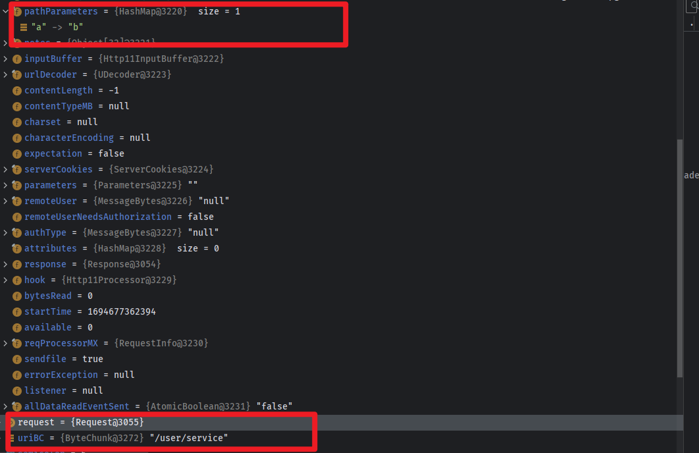
在最后还会再检测uri中是否含有`;`，如果还有`;`,那么会再次进入while循环，也就是会递归处理`;`字符直到请求中不包含`;`为止。  
#### Normalization
在经过`parsePathParameters`处理之后然后会正常进行一次URLDecode，然后就会进入Normalization规范化的处理流程。  
  
相关处理逻辑位于`org/apache/catalina/connector/CoyoteAdapter#normalize`中，主要是对```"\", "//", "/./","/../```这个几个字符的处理。  
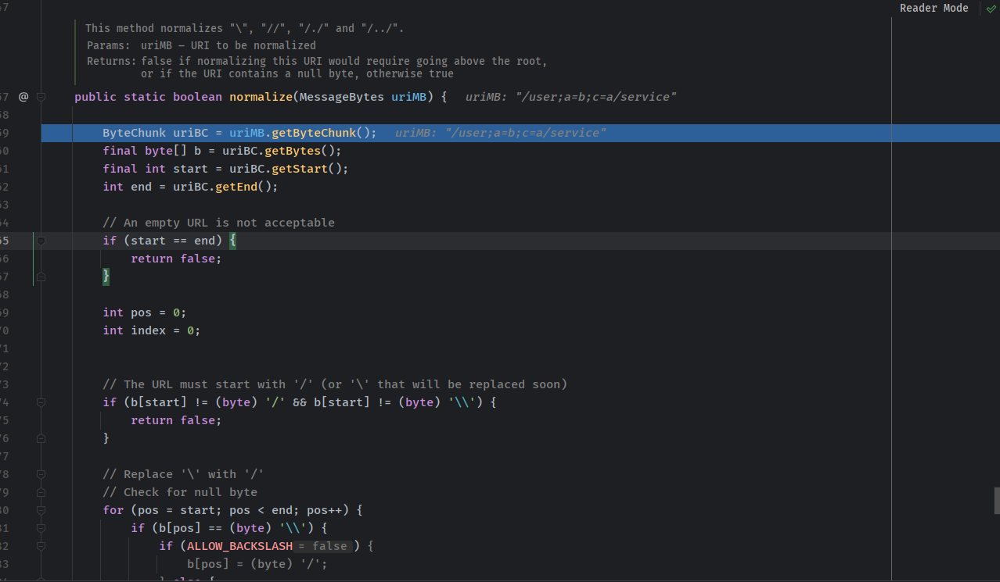   
依次是将`\`替换为`/`。  
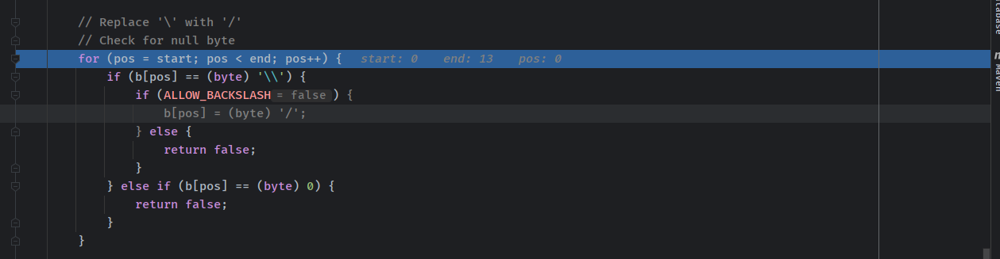  
该处理流程需要`ALLOW_BACKSLASH`为true才行，不然会直接返回false。
将`//`替换`/`。
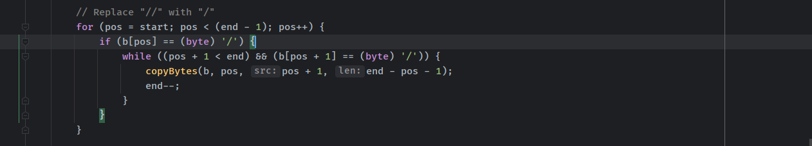   
如果以`/.`或者`/..`结尾的话那么自动在后面再添加一个`/`。
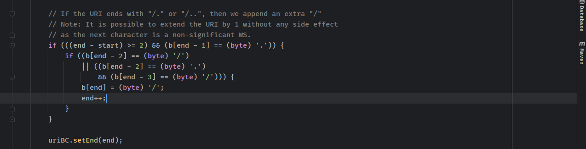
递归将`/.`/和`/../`规范为真实路径。    
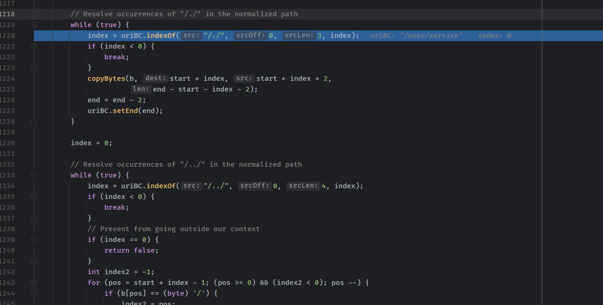  
中当`/../`超出根目录了时会返回400。

#### 总结Bypass
以访问URI：`/user/service`为例。
通过以上处理流程可以得到以下URL也同样可以访问到`/user/service`对应的servlet：
* /user;a=b/service
* /user/service;favicon.ico(一些检测后缀如果为静态文件则放行的绕过)
* /user\service(需要ALLOW_BACKSLASH=true)
* /user//service或者//user/service
* /user/./service
* /user/abc/../service
* /u%73%65r/s%65%72vice  

这在用nginx对请求URI的关键字进行匹配或者Filter中使用getRequestURI进行URI匹配的权限校验可以轻松绕过。因为`HttpServletRequest.getRequestURI()`取得得URI是原生得URI，并没有经过tomcat处理，如果使用该方法获取的URI进行权限校验那么就会产生绕过。  
正确的URI获取应该是使用`HttpServletRequest.getServletPath()`或者`HttpServletRequest.getPathinfo()`,这两种方法返回的URI都是经过处理后的URI。
### SpringMVC
在Spring中路由分发主要是在`org/springframework/web/servlet/DispatcherServlet#doDispatch`中进行的，继承于FrameworkServlet，也是实现Java EE Servlet 接口的一个Servlet。  
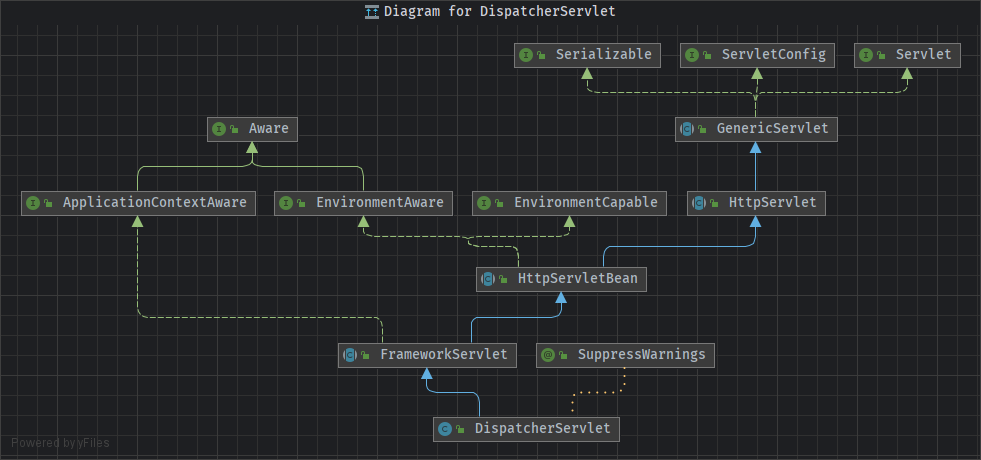  
请求在经过容器处理后便会统一来到`DispatcherServlet`中，由Spring开始真正的路由转发。以spring-boot为例，内嵌tomcat。
在`DispatcherServlet`主要通过以下流程来调用目标controller。
#### HandlerExecutionChain中对分号的处理
第一步是寻找handler，这个handler其实是一个HandlerExecutionChain，也就是处理执行链，其中会包含后续要执行的controller和一些Interpertor：
```java
mappedHandler = getHandler(processedRequest);
```
  
可以看到默认含有六个handler，然后依次从每个mapping中去寻找请求对应的HandlerExecutionChain，其中查找使用 @Controller 修饰的类中的 @RequestMapping方法的mapping对应`RequestMappingHandlerMapping`，其中mapping的getHandler都是执行的父类`org/springframework/web/servlet/handler/AbstractHandlerMapping.java#getHandler`方法。
主要的寻找逻辑在`getHandlerInternal`方法中，首先通过initLookupPath()方法来获取请求的路径，然后再调用`lookupHandlerMethod()`得到对应路径的Handler方法。  
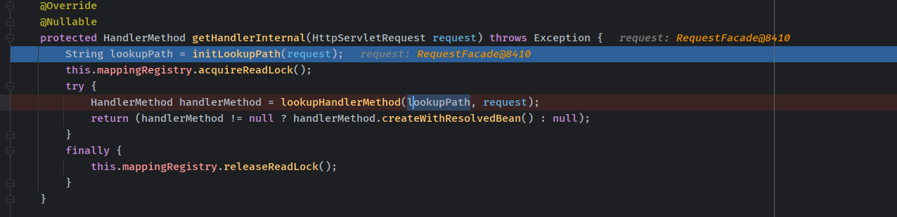  
其中`initLookupPath()`处理如下  
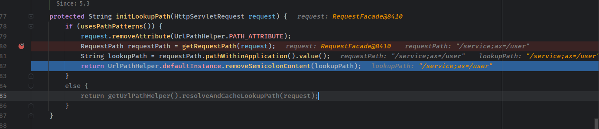  
可以看到最后会有一个`removeSemicolonContent()`方法，也就是和tomcat一样，会删除`;`开头的路径参数。`/service;ax=/user`会转变为`/service/user`。
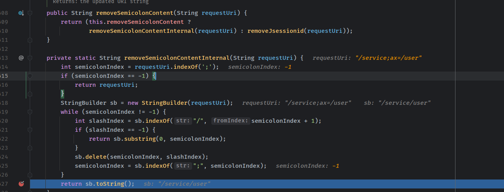  
然后就会根据处理后的URI从所有Method Map中找到匹配的Method，其中会通过三种方式分别来寻找匹配的Method，最后如果寻找到有多个匹配的话会进行比较选出最匹配的一个。  
第一步就是直接从`mappingRegistry#getMappingsByDirectPath()`中寻找相同URI的放入匹配List中。  
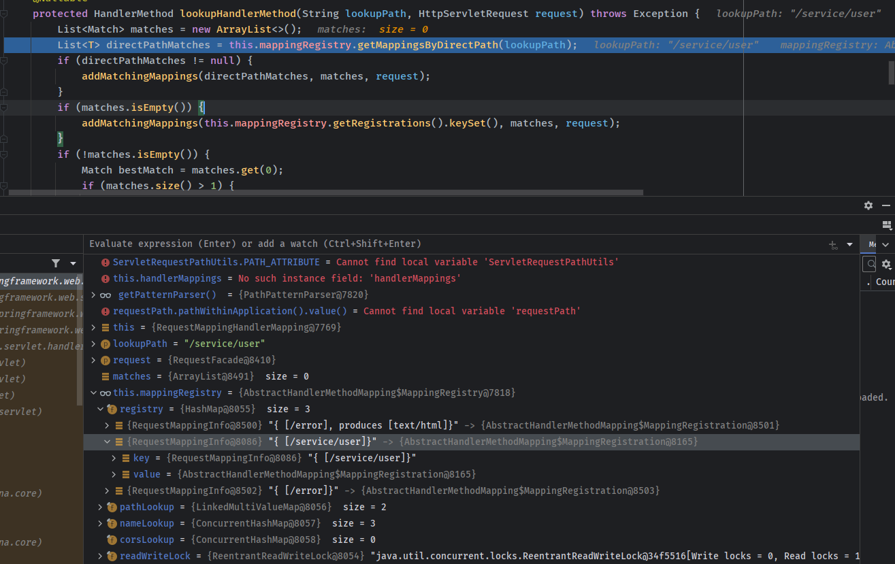  
然后第一步如果有匹配的话会调用`addMatchingMappings`继续匹配。在其中会使用`org/springframework/web/util/pattern/PathPattern.java#match来进行匹配`。 
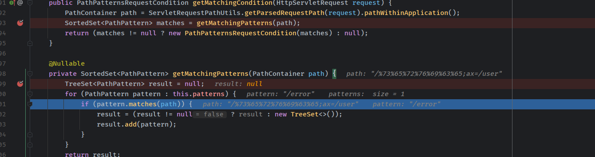  
其中使用的DefaultPathContainer会在请求Dispatch之前对URI进行一次URL解码并将解码后的值放在valueToMatch变量中。  
    
在后续PathPattern的match时使用的就是valueToMatch变量。  
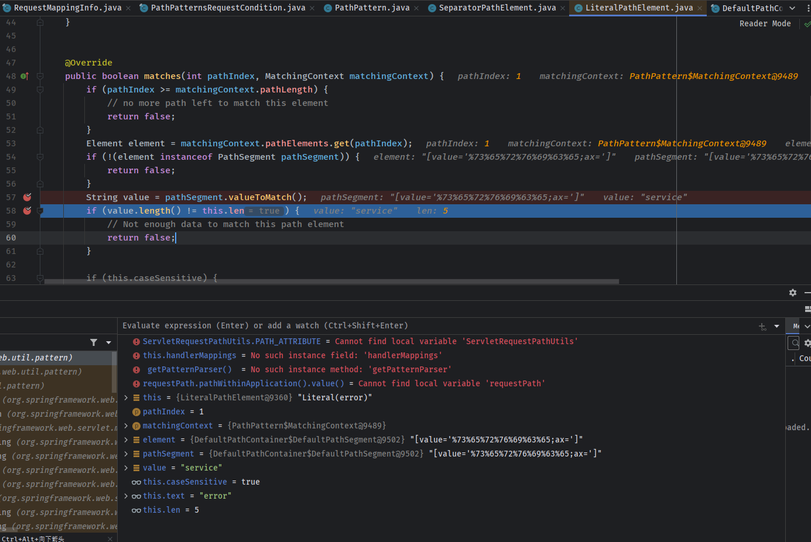  
然后将该Method Handler和注册的Interpertor组合成一个HandlerExecutionChain返回。
#### HandlerAdapter
第二步得到该请求对应的HandlerExecutionChain之后根据该HandlerExecutionChain寻找对应的HandlerAdapter处理适配器。
```java
HandlerAdapter ha = getHandlerAdapter(mappedHandler.getHandler());
```
这个地方根据传入HandlerExecutionChain返回的是`RequestMappingHandlerAdapter`。
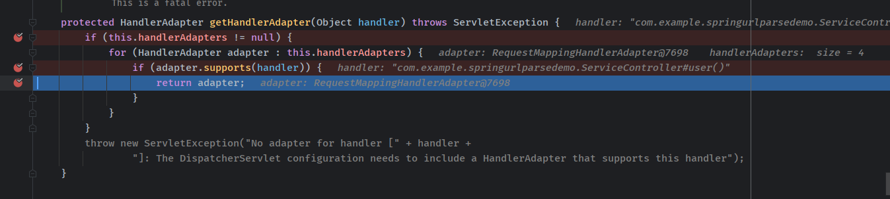  

#### handle
最后通过HandlerAdapter去调用路由真正对应的Method。
```java
mav = invokeHandlerMethod(request, response, handlerMethod);
```
#### 总结Bypass
根据常规通过@RequestMapping路由的情况，可以有以下两种方式进行变形
以/service/user为例
* /ser%76%69%63e/us%65r(URL编码)
* /service;ax=/user(添加路径参数)  

针对其它路由定义模式，由于其对应的Mapping不同，在对应handler会有一些差异。
### SpringSecurity
SpringSecurity作为权限校验框架，当其对同一个URI的解析和后端MVC框架路由时对URI的解析不一致时就容易遭成绕过。  
### Shiro
和SpringSecurity一样，也存在因为URI解析差异性导致的绕过。
## 参考
https://www.blackhat.com/docs/us-17/thursday/us-17-Tsai-A-New-Era-Of-SSRF-Exploiting-URL-Parser-In-Trending-Programming-Languages.pdf  
https://evilpan.com/2023/07/29/url-gotchas/  
https://evilpan.com/2023/08/19/url-gotchas-spring/