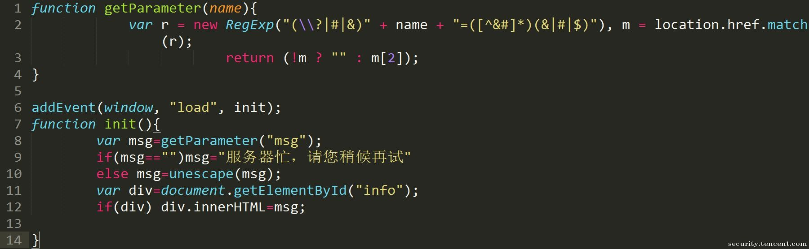
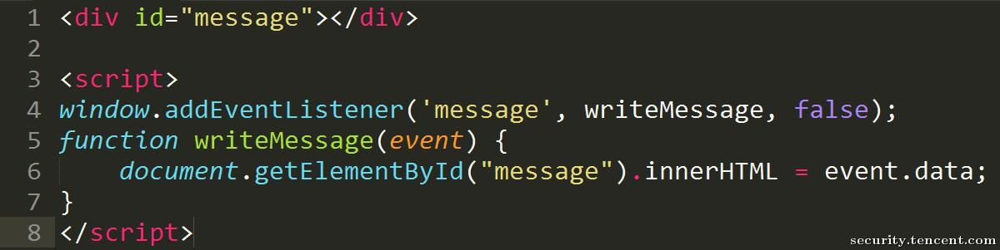
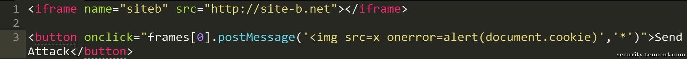
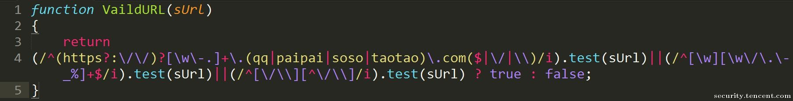
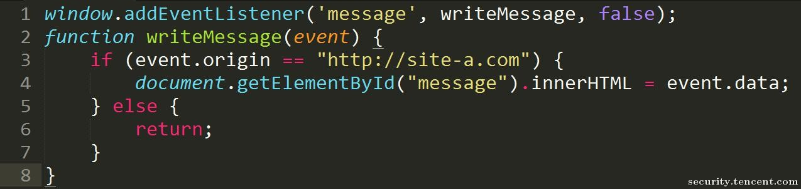

- [XSS](#xss)
  - [类型](#类型)
    - [反射](#反射)
    - [存储](#存储)
    - [DOM XSS](#dom-xss)
      - [跳转场景](#跳转场景)
      - [前端动态渲染](#前端动态渲染)
      - [HTML5 postMessage](#html5-postmessage)
  - [PDF XSS](#pdf-xss)
  - [Bypsss](#bypsss)
    - [关键字绕过](#关键字绕过)
      - [编码](#编码)
    - [注释内绕过](#注释内绕过)
    - [unicode](#unicode)
    - [302+CRLF](#302crlf)
  - [修复方案](#修复方案)
    - [过滤](#过滤)
    - [黑白名单](#黑白名单)
    - [配置](#配置)
      - [正确设置响应ContentType](#正确设置响应contenttype)
      - [正确设置HttpOnly属性](#正确设置httponly属性)
      - [配置 Content-Security-Policy (CSP)](#配置-content-security-policy-csp)
      - [设置 X-XSS-Protection 头](#设置-x-xss-protection-头)
    - [前端框架防御](#前端框架防御)
      - [Vue中的防御方式](#vue中的防御方式)
      - [React中的防御方式](#react中的防御方式)
    - [JSP中的XSS](#jsp中的xss)
    - [Referer XSS](#referer-xss)
      - [Referrer-Policy](#referrer-policy)
    - [DOM XSS 修复方案](#dom-xss-修复方案)
    - [Vue中的防御方式](#vue中的防御方式-1)
    - [React中的防御方式](#react中的防御方式-1)
  - [参考](#参考)

# XSS
## 类型
### 反射
反射型XSS,最简单的XSS类型,直接将用户输入返回在了响应中,导致可以注入恶意JS代码使得浏览器在渲染响应包时恶意的JS代码被执行调用,该方式主要通过诱导受害者点击恶意链接或者加载恶意链接间接的让受害者发送包含恶意JS代码的请求.
### 存储
存储型XSS,即用户输入被保存在了后端,可能并不会返回在该次请求的响应中,但在其它响应页面中该输入被引用输出,同样可以注入恶意JS代码使得浏览器在渲染引用了恶意输入的响应包时恶意的JS代码被执行调用,这导致其它用户只要访问引用了该恶意JS的页面则就会遭到攻击而不需要和反射型XSS一样诱导受害者提交恶意输入.
### DOM XSS
#### 跳转场景
在前端页面需要跳转的业务场景下，前端可能直接获取到URL使用js进行跳转,常见方法如下几种
```js
location.href
location.replace()
location.assign()
```
在该场景下可以利用伪协议注入恶意JS代码，其中可以直接执行脚本的伪协议包括:
```js
javascript:
vbscript:
data:
```
#### 前端动态渲染
为了优化了用户的浏览体验，有一些值会直接在前端通过JS获取，然后直接在前端进行解析展示，从而不经过后端处理。  
在前端常用于接受参数进行动态执行的方法包括:
```js
innerHTML
document.write
eval
```
在前端常用取值属性包括:
```js
localStorage
Referer
Window.name
SessionStorage
```
直接将URL中的值写入前端页面。  
  
POC:`http://xxx.com/xx.xhtml#msg=`  
#### HTML5 postMessage
HTML5引入的postMessage()方法允许来自不同源的脚本采用异步方式进行有限的通信，可以实现跨文本档、多窗口、跨域消息传递.
在正常情况下，无法进行跨域编辑其它页面内容，但借助postMessage()方法，就能实现跨域从site-a.net向site-b.net下页面写入内容。
  
POC:  
未对postMessage的来源event.origin进行限制，导致任意域名下的页面只要通过如下代码，就可以写入恶意内容导致DOM XSS。
  

DOM XSS中常见的输入点:  
```
document.URL
document.documentURI
document.URLUnencoded
document.baseURI
location
document.cookie
document.referrer
window.name
history.pushState
history.replaceState
localStorage
sessionStorage
IndexedDB (mozIndexedDB, webkitIndexedDB, msIndexedDB)
Database
```
DOM XSS中常见的输出点(DOM对象或者JS函数):
```
document.write()
document.writeln()
document.domain
element.innerHTML 
element.outerHTML
element.insertAdjacentHTML
element.onevent
add()
after()
append()
animate()
insertAfter()
insertBefore()
before()
html()
prepend()
replaceAll()
replaceWith()
wrap()
wrapInner()
wrapAll()
has()
constructor()
init()
index()
jQuery.parseHTML()
$.parseHTML()
```
## PDF XSS
通过上传嵌入js代码的pdf文件进行XSS.    
https://github.com/ynsmroztas/pdfsvgxsspayload/blob/main/poc.pdf
## Bypsss
### 关键字绕过
alert(1):
1. alert`1`
2. `window['alert'](document.domain)`
3. prompt(`1`)
#### 编码
不同的位置支持不同的编码方式，通过对关键字进行编码绕过检测。
HTML内：如可以创建HTML标签
HTML标签内：HTML实体编码，如`<a href="javascript:var a='&apos;-alert(1)-&apos;'">a</a>`。
JavaScript标签内：Unicode编码，如\u{61}lert(1),\u0061lert(1),\u{0061}lert(1)。
HTML属性值：
### 注释内绕过
当输出点在注释中,使用%0a换行新起一行绕过.
### unicode
  
### 302+CRLF
* Location: 空的Location响应头可以在Chrome上成功执行内容中的XSS代码。（投稿时在最新版 Chrome v86.0.4240.111测试成功）
* Location: resource://URL 使用resource协议也可以在Firefox 81 上执行payload。（投稿时在最新版 Firefox v82.0.2测试成功）
* ws:// (WebSocket)
* wss:// (Secure WebSocket)
## 修复方案
### 过滤
在Web的Filter或者拦截器设置过滤或者使用工具包(xssProtect)
* 黑名单对常见标签和关键字过滤,正则匹配.
* 转义编码(HTML实体,URL编码)常见特殊字符.  

```java
    public static String sanitize(String input) {
        //input = URLDecoder.decode(input, StandardCharsets.UTF_8);
        input = input.replaceAll("&", "&amp;");
        input = input.replaceAll("<", "&lt;");
        input = input.replaceAll(">", "&gt;");
        input = input.replaceAll("\"", "&quot;");
        input = input.replaceAll("'", "&apos;");

        return input;
    } 
```
`springframework.web.util.HtmlUtils#htmlEscape`方法可对特殊字符进行转义.
```java
    public static String springUnescape(String input) {
        return HtmlUtils.htmlEscape(input);
    }
```
### 黑白名单
在富文本的场景下,对允许的标签和标签属性和标签属性的值根据业务情况做黑名单和白名单的限制,
java下可以使用`jsoup`HTML解析组件,带有一个默认的白名单列表,使用`String res = Jsoup.clean(input, Safelist.basic());`即可完成过滤.  
```java
    public static String richTextUnescape(String input) {
        String res = Jsoup.clean(input, Safelist.basic());
        return res;

    }
//在默认名单的基础上手动添加
Safelist.basic().addTags("p", "hr", "div", "img", "span", "textarea")  // 设置允许的标签
           .addAttributes("a", "href", "title")          // 设置标签允许的属性, 避免如nmouseover属性
           .addProtocols("img", "src", "http", "https")  // img的src属性只允许http和https开头
           .addProtocols("a", "href", "http", "https");
```

### 配置
#### 正确设置响应ContentType
正确设置响应包的Content-Type,禁止非HTML类型的响应包设置为“text/html".
SpringMVC中使用`@RestController`注解会根据返回内容类型自动设置，默认为json格式，但如果方法返回类型为String时，即使是`@RestController`，ContentType也是HTML.  

respones手动设置,手动设置在`@RestController`中无效，在返回响应时会被该注解的逻辑覆盖。
```java
response.setContentType("application/json");
```
#### 正确设置HttpOnly属性
控制用户登录鉴权的Cookie字段 应当设置HttpOnly属性以防止被XSS漏洞/JavaScript操纵泄漏。设置了HttpOnly属性的字段无法被JS访问。
```java
private void  setCookie(HttpServletResponse response){
  Cookie cookie = new Cookie("session","1234342");
  cookie.setHttpOnly(true);
  response.addCookie(cookie);
  }
```
```
HTTP/1.1 200 
Set-Cookie: session=1234342; HttpOnly
Content-Type: text/html;charset=UTF-8
Content-Length: 39
Date: Fri, 22 Nov 2024 03:04:28 GMT
Keep-Alive: timeout=60
Connection: keep-alive
```
#### 配置 Content-Security-Policy (CSP)
1. HTTP 响应标头 Content-Security-Policy 允许站点管理者控制用户代理能够为指定的页面加载哪些资源（`<meta>` 元素也可以被用来配置该策略），限制页面加载的资源来源,只允许加载白名单内的资源文件，防止恶意JS文件加载。  
2. CSP 通过指定有效域——即浏览器认可的可执行脚本的有效来源。一个 CSP 兼容的浏览器将会仅执行从白名单域获取到的脚本文件，忽略所有的其他脚本（**包括内联脚本和 HTML 的事件处理属性**）。

**常见用例:**
```http
//加载内容只允许来自站点的同一个源（不包括其子域名）。
Content-Security-Policy: default-src 'self' 

//加载内容只允许来自站点自身和受信任的子域名。
Content-Security-Policy: default-src 'self' *.trusted.com 

//允许包含来自任何源的图片，但是限制音频或视频只加载信任的域名（media1.com media2.com），可运行脚本仅允许来自于 userscripts.example.com。
Content-Security-Policy: default-src 'self'; img-src *; media-src media1.com media2.com; script-src userscripts.example.com 

//关于script-src指令 'none'表示禁止任何资源执行,
Content-Security-Policy: script-src 'none';
//<source-expression-list>;以空格分隔的源表达式值列表。如果此类型的资源与任何给定的源表达式匹配，则可以加载它们。
Content-Security-Policy: script-src <source-expression-list>;

//强行开启脚本内联执行（不安全）
Content-Security-Policy: script-src 'unsafe-inline';

<!-- 在某些业务场景下需要执行内联脚本，但又需要防止恶意脚本执行
另一种方法是使用文件哈希值指定允许的脚本。使用此方法，只有当 <script> 元素中的外部文件完整性属性中的所有有效哈希值与 CSP 标头中的允许值匹配时，才能加载和执行该文件。子资源完整性功能还会检查下载的文件是否具有指定的哈希值，即文件是否未被修改。这比信任域名更安全，因为即使文件是从受攻击的站点加载的，也只有在文件未经修改的情况下才会被使用。然而，这种方法更细粒度，并且要求每当相关脚本发生更改时，CSP 和脚本元素中的哈希值也必须更新。 -->
Content-Security-Policy: script-src 'sha384-oqVuAfXRKap7fdgcCY5uykM6+R9GqQ8K/uxy9rx7HNQlGYl1kPzQho1wx4JwY8wC' 'sha256-fictional_value'

```

#### 设置 X-XSS-Protection 头
启用浏览器的 XSS 过滤器，当检测到跨站脚本攻击 (XSS) 时，浏览器将停止加载页面。
### 前端框架防御
#### Vue中的防御方式
1. 在vue中使用v-text指令可以将数据作为纯文本插入到DOM中，而不是作为HTML代码插入到DOM中。这样可以防止恶意脚本被执行。而v-html指令可以将数据作为HTML代码插入到DOM中，这种情况下需要对插入的内容进行过滤。  
```js
<template>
//使用v-text指令
  <div v-text="message"></div>
</template>
<script>
export default {
  data() {
    return {
      message: 'Hello, <script>alert("XSS")</script> World!'
    };
  }
};
</script>
```
2. 使用vue的过滤器escape对数据进行过滤和转换。
```js
<template>
  <div>{{ message | escape }}</div>
</template>
<script>
export default {
  data() {
    return {
      message: 'Hello, <script>alert("XSS")</script> World!'
    };
  },
  filters: {
    escape(value) {
      // 对value进行过滤和转换
      return value.replace(/</g, '&lt;').replace(/>/g, '&gt;');
    }
  }
};
</script>
```
#### React中的防御方式
在React中在渲染所有输入内容之前，默认会进行转义。  
但React中有一个dangerouslySetInnerHTML函数，该函数不会对输入进行任何处理并直接渲染到 HTML 中，平时开发时最好避免使用 dangerouslySetInnerHTML，如果不得不使用的话，前端或服务端必须对输入进行相关验证，例如对特殊输入进行过滤、转义等处理。
### JSP中的XSS
在JSP中`<c:out`标签有一个默认属性escapeXML，默认为true，其会将特殊字符进行转义，从而也防止了XSS。
```jsp
 value="<c:out value="${search.node}"/>" //不存在XSS
 value="${search.node}" //可能导致XSS
```
### Referer XSS
#### Referrer-Policy
```
Referrer-Policy: no-referrer——不显示Referrer的任何信息在请求头中。  
Referrer-Policy: no-referrer-when-downgrade——这是默认值。当从https网站跳转到http网站或者请求其资源时（安全降级HTTPS→HTTP）,不显示Referrer的信息,其他情况（安全同级HTTPS→HTTPS,或者HTTP→HTTP）则在Referrer中显示完整的源网站的URL信息。  
Referrer-Policy: origin——表示浏览器在Referrer字段中只显示源网站的源地址（即协议、域名、端口）,而不包括完整的路径。
Referrer-Policy: origin-when-cross-origin——当发请求给同源网站时,浏览器会在Referrer中显示完整的URL信息,发个非同源网站时,则只显示源地址（协议、域名、端口）  
Referrer-Policy: same-origin——表示浏览器只会显示Referrer信息给同源网站,并且是完整的URL信息。所谓同源网站,是协议、域名、端口都相同的网站。 
Referrer-Policy: strict-origin——该策略更为安全些,和origin策略相似,只是不允许Referrer信息显示在从https网站到http网站的请求中（安全降级）。  
Referrer-Policy: strict-origin-when-cross-origin——和origin-when-cross-origin相似,只是不允许Referrer信息显示在从https网站到http网站的请求中（安全降级）。  
Referrer-Policy: unsafe-url——浏览器总是会将完整的URL信息显示在Referrer字段中,无论请求发给任何网站。 
```  
### DOM XSS 修复方案
* 在前端实现页面跳转业务场景下，正确的过滤实现方法是
1. 严格限制跳转范围。一方面要限制能够跳转页面的协议:只能是http、https或是其他指可控协议;
2. 严格限制跳转的范围，如果业务只要跳转到指定的几个页面，可以直接从数组中取值判断是否这几个页面，如果跳转范围稍大，正确使用正则表达式将跳转URL严格限制到可控范围内;  
  
* 写入页面前先转义敏感字符  
* 慎用危险函数(dangerouslySetInnerHTML,eval...)  
* postMessage跨域时需要对postMessage的来源event.origin进行限制  

* 使用安全组件库(filter.js)，安全组件库一般包含了常见黑名单，可根据实际业务需求进行修改，在相关场景中调用过滤函数对输入进行过滤。
### Vue中的防御方式
1. 在vue中使用v-text指令可以将数据作为纯文本插入到DOM中，而不是作为HTML代码插入到DOM中。这样可以防止恶意脚本被执行。而v-html指令可以将数据作为HTML代码插入到DOM中，这种情况下需要对插入的内容进行过滤。  
```js
<template>
//使用v-text指令
  <div v-text="message"></div>
</template>
<script>
export default {
  data() {
    return {
      message: 'Hello, <script>alert("XSS")</script> World!'
    };
  }
};
</script>
```
1. 使用vue的过滤器escape对数据进行过滤和转换。
```js
<template>
  <div>{{ message | escape }}</div>
</template>
<script>
export default {
  data() {
    return {
      message: 'Hello, <script>alert("XSS")</script> World!'
    };
  },
  filters: {
    escape(value) {
      // 对value进行过滤和转换
      return value.replace(/</g, '&lt;').replace(/>/g, '&gt;');
    }
  }
};
</script>
```
### React中的防御方式
在React中在渲染所有输入内容之前，默认会进行转义。但React中有一个dangerouslySetInnerHTML函数，该函数不会对输入进行任何处理并直接渲染到 HTML 中，平时开发时最好避免使用 dangerouslySetInnerHTML，如果不得不使用的话，前端或服务端必须对输入进行相关验证，例如对特殊输入进行过滤、转义等处理。
## 参考
https://tech.meituan.com/2018/09/27/fe-security.html  
https://security.tencent.com/index.php/blog/msg/107  
https://pythonjishu.com/dysdkeypmnkpprc/

