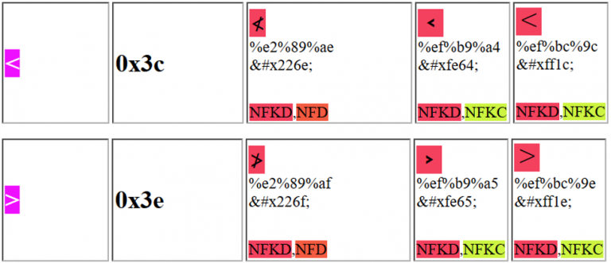

- [XSS](#xss)
  - [0x01 类型](#0x01-类型)
    - [反射](#反射)
    - [存储](#存储)
    - [DOM](#dom)
  - [PDF XSS](#pdf-xss)
  - [Bypsss](#bypsss)
    - [关键字绕过](#关键字绕过)
      - [编码](#编码)
    - [注释内绕过](#注释内绕过)
    - [unicode](#unicode)
    - [302+CRLF](#302crlf)
  - [0x04 防御](#0x04-防御)
    - [Vue中的防御方式](#vue中的防御方式)
    - [React中的防御方式](#react中的防御方式)
  - [参考](#参考)

# XSS
## 0x01 类型
### 反射
反射型XSS,最简单的XSS类型,直接将用户输入返回在了响应中,导致可以注入恶意JS代码使得浏览器在渲染响应包时恶意的JS代码被执行调用,该方式主要通过诱导受害者点击恶意链接或者加载恶意链接间接的让受害者发送包含恶意JS代码的请求.
### 存储
存储型XSS,即用户输入被保存在了后端,可能并不会返回在该次请求的响应中,但在其它响应页面中该输入被引用输出,同样可以注入恶意JS代码使得浏览器在渲染引用了恶意输入的响应包时恶意的JS代码被执行调用,这导致其它用户只要访问引用了该恶意JS的页面则就会遭到攻击而不需要和反射型XSS一样诱导受害者提交恶意输入.
### DOM
DOM型XSS,DOM值文档对象模型(DOM),在Web浏览器中一般指浏览器对整个响应的HTML页面中的各个节点分层表示,而浏览器可以通过JS来操作各个DOM节点和对象,处理相关属性等等.  
同样的DOM XSS一般是在客户端中动态的将用户可控的输入传递给了一个DOM对象或者JS函数中,导致恶意的JS代码被执行,而因为整个过程是在客户端即用户端完成的操作,数据处理并不经过后端,所以该类型的XSS最不容易被检测和防护.  

DOM XSS中常见的输入点:  
```
document.URL
document.documentURI
document.URLUnencoded
document.baseURI
location
document.cookie
document.referrer
window.name
history.pushState
history.replaceState
localStorage
sessionStorage
IndexedDB (mozIndexedDB, webkitIndexedDB, msIndexedDB)
Database
```
DOM XSS中常见的输出点(DOM对象或者JS函数):
```
document.write()
document.writeln()
document.domain
element.innerHTML 
element.outerHTML
element.insertAdjacentHTML
element.onevent
add()
after()
append()
animate()
insertAfter()
insertBefore()
before()
html()
prepend()
replaceAll()
replaceWith()
wrap()
wrapInner()
wrapAll()
has()
constructor()
init()
index()
jQuery.parseHTML()
$.parseHTML()
```
## PDF XSS
通过上传嵌入js代码的pdf文件进行XSS.    
https://github.com/ynsmroztas/pdfsvgxsspayload/blob/main/poc.pdf
## Bypsss
### 关键字绕过
alert(1):
1. alert`1`
2. `window['alert'](document.domain)`
3. prompt(`1`)
#### 编码
不同的位置支持不同的编码方式，通过对关键字进行编码绕过检测。
HTML内：如可以创建HTML标签
HTML标签内：HTML实体编码，如`<a href="javascript:var a='&apos;-alert(1)-&apos;'">a</a>`。
JavaScript标签内：Unicode编码，如\u{61}lert(1),\u0061lert(1),\u{0061}lert(1)。
HTML属性值：
### 注释内绕过
当输出点在注释中,使用%0a换行新起一行绕过.
### unicode
  
### 302+CRLF
* Location: 空的Location响应头可以在Chrome上成功执行内容中的XSS代码。（投稿时在最新版 Chrome v86.0.4240.111测试成功）
* Location: resource://URL 使用resource协议也可以在Firefox 81 上执行payload。（投稿时在最新版 Firefox v82.0.2测试成功）
* ws:// (WebSocket)
* wss:// (Secure WebSocket)
## 0x04 防御
1. Http Only
2. 过滤JS标签
3. CSP
4. 实体编码
5. 正确设置content-type
### Vue中的防御方式
1. 在vue中使用v-text指令可以将数据作为纯文本插入到DOM中，而不是作为HTML代码插入到DOM中。这样可以防止恶意脚本被执行。而v-html指令可以将数据作为HTML代码插入到DOM中，这种情况下需要对插入的内容进行过滤。  
```js
<template>
//使用v-text指令
  <div v-text="message"></div>
</template>
<script>
export default {
  data() {
    return {
      message: 'Hello, <script>alert("XSS")</script> World!'
    };
  }
};
</script>
```
1. 使用vue的过滤器escape对数据进行过滤和转换。
```js
<template>
  <div>{{ message | escape }}</div>
</template>
<script>
export default {
  data() {
    return {
      message: 'Hello, <script>alert("XSS")</script> World!'
    };
  },
  filters: {
    escape(value) {
      // 对value进行过滤和转换
      return value.replace(/</g, '&lt;').replace(/>/g, '&gt;');
    }
  }
};
</script>
```
### React中的防御方式
在React中在渲染所有输入内容之前，默认会进行转义。但React中有一个dangerouslySetInnerHTML函数，该函数不会对输入进行任何处理并直接渲染到 HTML 中，平时开发时最好避免使用 dangerouslySetInnerHTML，如果不得不使用的话，前端或服务端必须对输入进行相关验证，例如对特殊输入进行过滤、转义等处理。
## 参考
https://tech.meituan.com/2018/09/27/fe-security.html  
https://security.tencent.com/index.php/blog/msg/107  
https://pythonjishu.com/dysdkeypmnkpprc/

