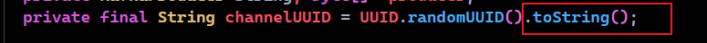
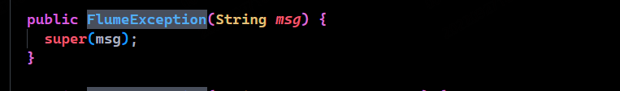

- [CodeQL](#codeql)
  - [创建数据库](#创建数据库)
    - [CodeQL 数据库](#codeql-数据库)
  - [常见Class](#常见class)
    - [Call](#call)
      - [Call::getCallee](#callgetcallee)
      - [Call::getCaller](#callgetcaller)
      - [Call::getAnArgument](#callgetanargument)
      - [Call::getArgument](#callgetargument)
      - [example](#example)
      - [Call::getQualifier](#callgetqualifier)
  - [参考](#参考)
# CodeQL
CodeQL分析包括三个步骤：
1. 通过创建 CodeQL 数据库准备代码
2. 对数据库运行 CodeQL 查询
3. 解释查询结果

## 创建数据库
1. 编译型语言:通过监视编译构建过程来收集源码相关信息,每次编译时源文件时会制作一个该文件的副本.
2. 解释性语言: 直接运行相关源码来获取相关信息.

提取后，所有分析所需的数据（关系数据、复制的源文件和特定语言的数据库模式，它指定数据中的相互关系）被导入到一个目录中，称为CodeQL 数据库。
### CodeQL 数据库
CodeQL 数据库是一个包含以下内容的目录：
* 从代码中提取的可查询数据。
* 一个源引用，用于直接在代码中显示查询结果。
* 查询结果。
* 在数据库创建、查询执行和其他操作期间生成的日志文件。
## 常见Class
### Call
所有被调用了的方法，包括所有method方法的调用和构造方法调用，超类构造方法或者通过实例对象调用的构造方法.  

查询得到的是该方法被调用的地方。
```
import java
 
from Call call select call
```  
1. new Properties()
  
2. toString()


#### Call::getCallee
返回的是被调用方法的具体定义。  
```
import java
 

from Call call select  call.getCallee()
```
1. FlumeException()

#### Call::getCaller
```
import java
 

from Call call select call.getCaller()
```
返回的是调用了方法的方法,查询得到的是方法的具体定义。
#### Call::getAnArgument
```
import java
 

from Call call select  call.getAnArgument()
```
得到该调用的一个参数,如果一个方法有多个参数,每个参数都会被单独列出。
#### Call::getArgument
```
import java

from Call call select  call.getAnArgument(1)
```
得到该调用指定位置的一个参数。
#### example
查询所有名为info,且其中第二个参数为包含一个以`getName()`开头的参数的方法调用。
如下调用:  
  
```
import java
 

from Call call where call.getCallee().getName().matches("info") and call.getArgument(1).toString().matches("getName%") select call
```  
  
#### Call::getQualifier
获取该调用的限定表达式,就是调用该方法的对象.
```
import java
 

from Call call select call,call.getQualifier()
```   
如logger.info()中的info调用,该调用的限定表达式就是logger,返回类型也是Expr.

## 参考
https://codeql.github.com/docs