- [CVE-2021-45232 远程代码执行](#cve-2021-45232-远程代码执行)
  - [影响版本](#影响版本)
  - [原理分析](#原理分析)
    - [权限校验](#权限校验)
    - [路由](#路由)
    - [Migrate](#migrate)
    - [RCE](#rce)
      - [Script](#script)
      - [filter_func](#filter_func)
    - [Exploit](#exploit)
      - [checkSum](#checksum)
  - [补丁](#补丁)
# CVE-2021-45232 远程代码执行
## 影响版本
Apache APISIX Dashboard < 2.10.1
## 原理分析
Apache APISIX Dashboard在`Gin`框架的基础上还使用了`droplet`框架,其中路由部分会交由`droplet`进行处理,而其中也包含了权限校验部分,但有两条用于导出和导入配置的路由未交给`droplet`进行处理,导致可以直接未授权访问,其中导入路由配置时可以修改路由配置,而路由支持Lua的脚本执行,导致可以远程代码执行.
### 权限校验
在`authentication.go`中`Hanlde`为权限校验逻辑. 
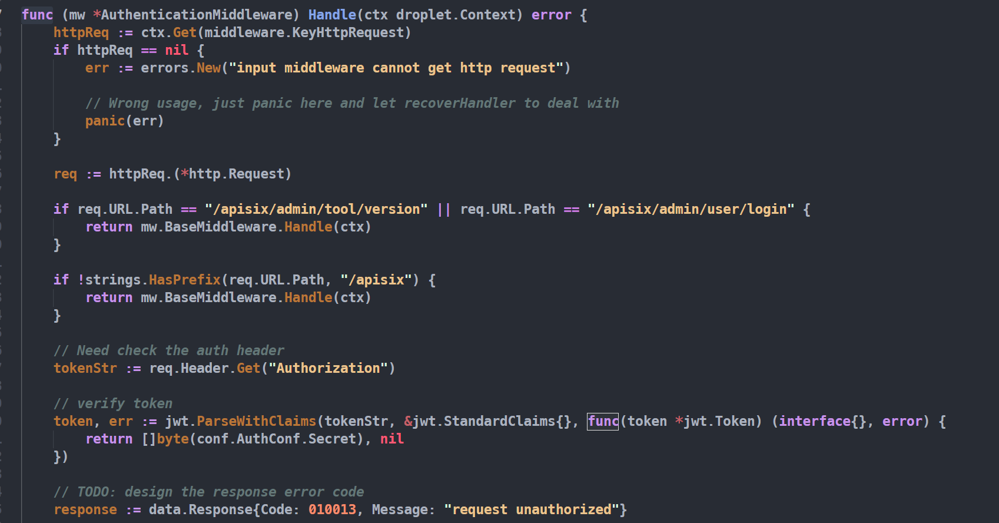
### 路由
其路由逻辑在`route.go#SetUpRouter()`中,其根据不同的路由注册了对应的Hanlder进行处理,然后循环调用对应`Hanlder#ApplyRoute`来应用路由.  
相关代码如下:
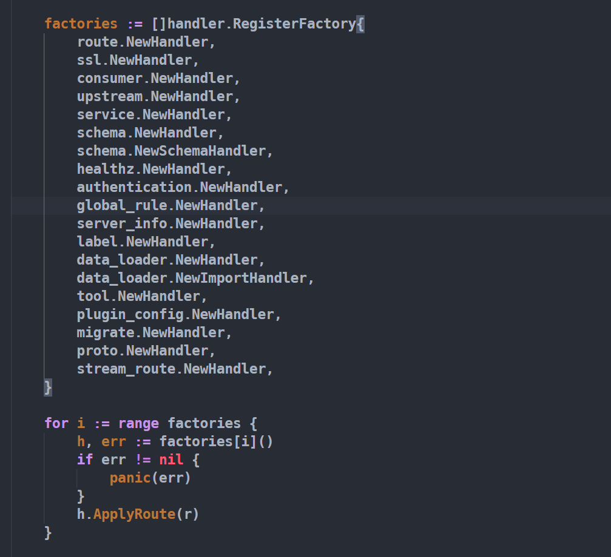
以`route.NewHandler`为例,其`ApplyRoute`函数如下:
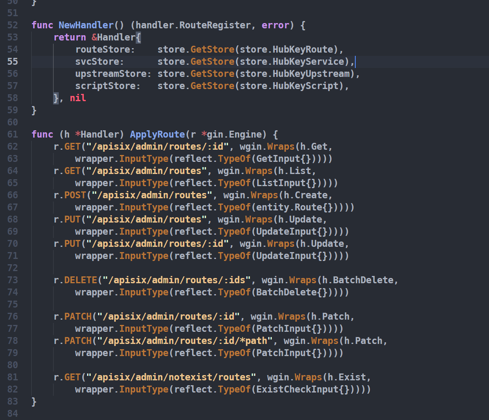
其中根据请求的URL不同,调用了`wgin.Wraps`对相应类型进行包装处理转换为wgin路由然后进入`Handle`进行处理,wgin是`github.com/shiningrush/droplet/wrapper/gin`的别名.  
`	wgin "github.com/shiningrush/droplet/wrapper/gin"`
### Migrate
每一个Hanlder对应的代码都在Hanlder目录下
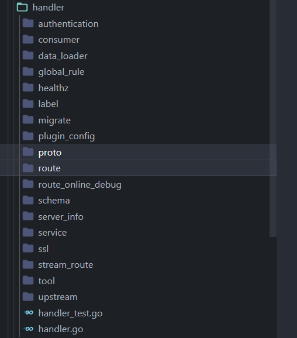
其中在migrate路由中其路由应用代码如下:
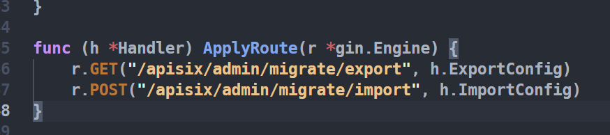
其中并未调用`droplet`框架进行处理,导致这两个接口可以直接进行访问.

而migrate路由主要是用于迁移,用于导入和导出配置,其中包括了路由信息.
```
/apisix/admin/migrate/export
/apisix/admin/migrate/import
```
该接口export为导出,import为导入. 
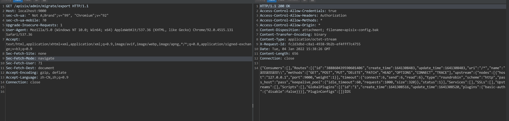
### RCE
利用该接口RCE有两中思路.
* 一种是利用`Script`功能执行lua代码.
* 利用`filter_func`功能执行lua代码.

#### Script
官方说明:https://apisix.apache.org/zh/docs/apisix/2.9/architecture-design/script  

Script 表示将在 HTTP 请求/响应生命周期期间执行的脚本,理论上，在 Script 中可以写任意 lua 代码.   

在管理界面没有该功能点,直接修改路由配置添加`script`标签测试.
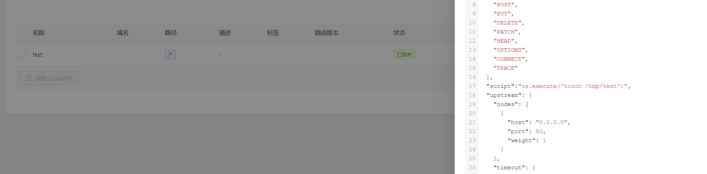
然后访问该路由即可触发.
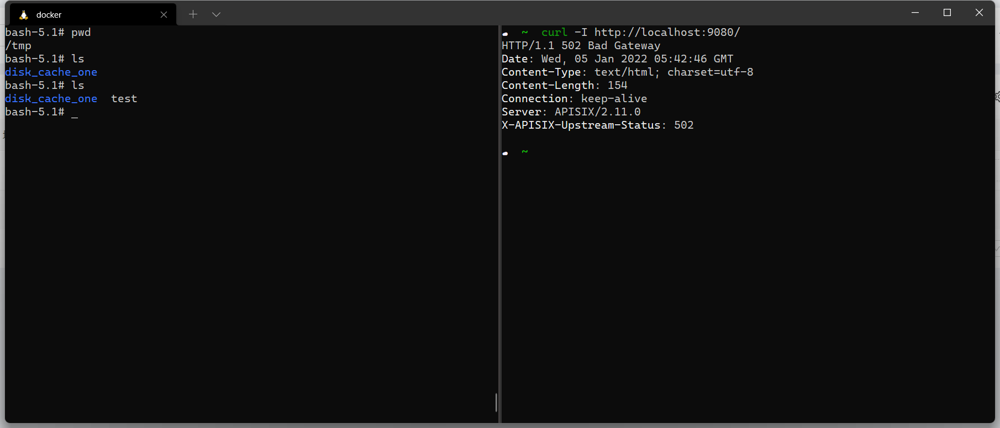
#### filter_func
官方说明:https://www.bookstack.cn/read/apache-apisix-1.4-zh/33860207d6bb4917.md#78csql  
该参数可以用来自定义用户过滤函数,也是支持执行Lua代码.
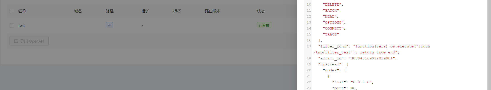
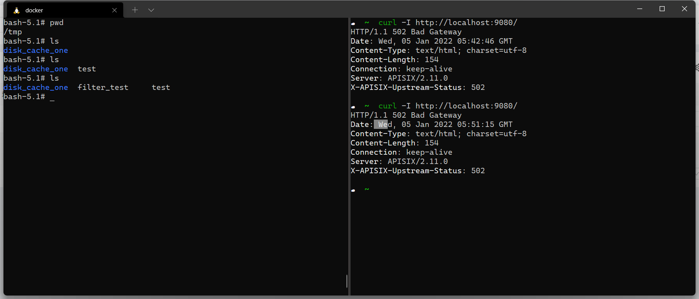
### Exploit
利用思路即先导出目标的配置信息,然后添加`Script`或者`filter_func`后再import回去,触发路由即可.
#### checkSum
在导入配置时,还有一个校验的过程,配置在导出时会对内容进行checkSum计算然后在文件最后添加四个字节的校验码.
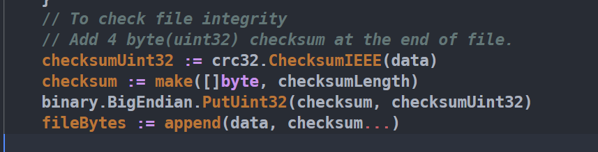
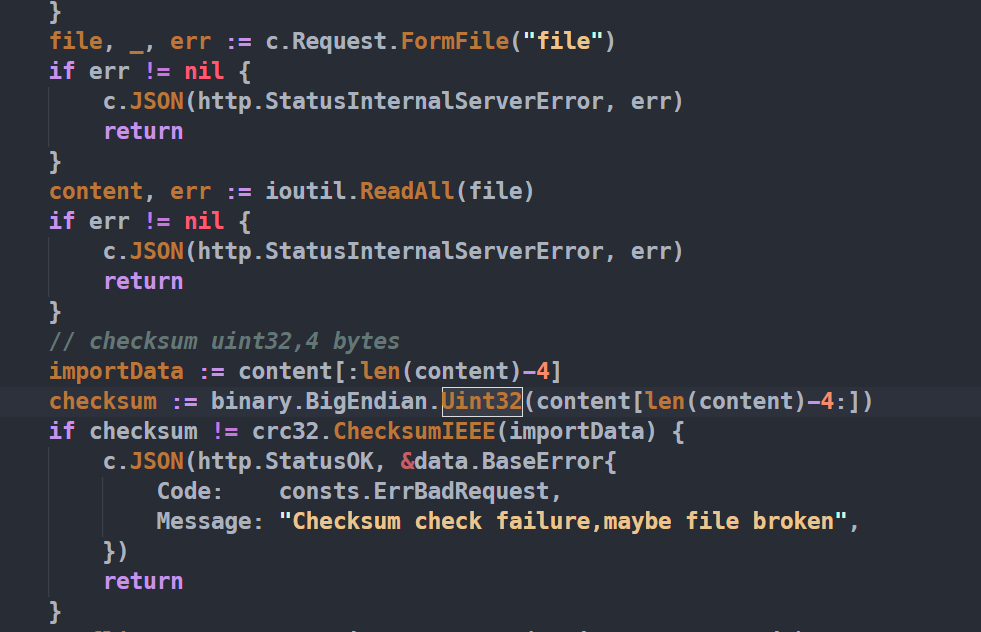

1. 导出目标配置,选择一条路由添加`Script`或者`filter_func`恶意代码.
2. 去掉导出配置文件的后四位字节后重新计算Sum截取后四位添加到该配置文件末尾得到新的配置文件.
3. import接口将配置文件导入目标系统.
4. 访问路由触发恶意Lua代码.
## 补丁 
不再使用`droplet`框架做中间件进行鉴权,直接使用Gin框架.
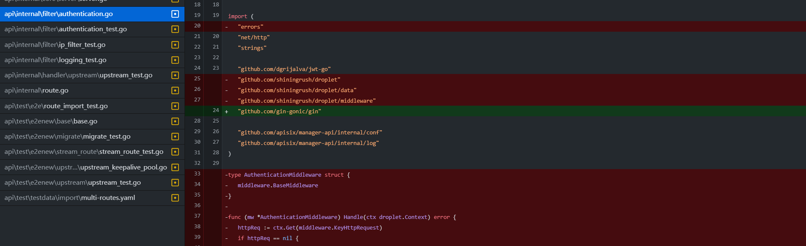
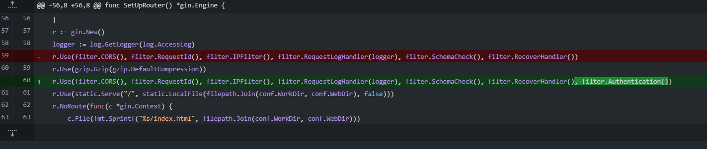