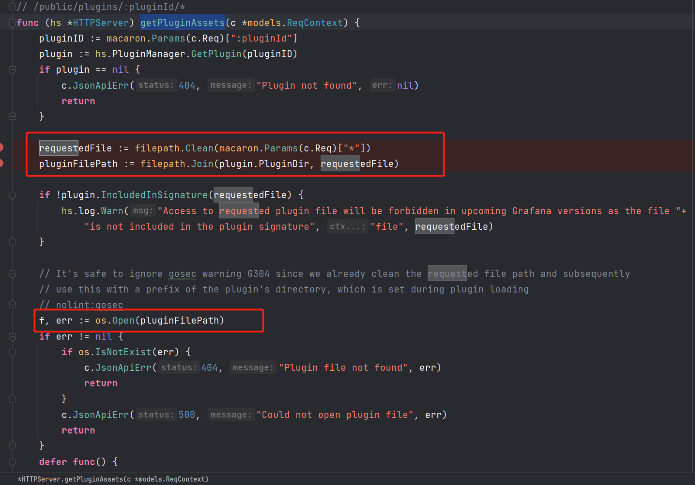
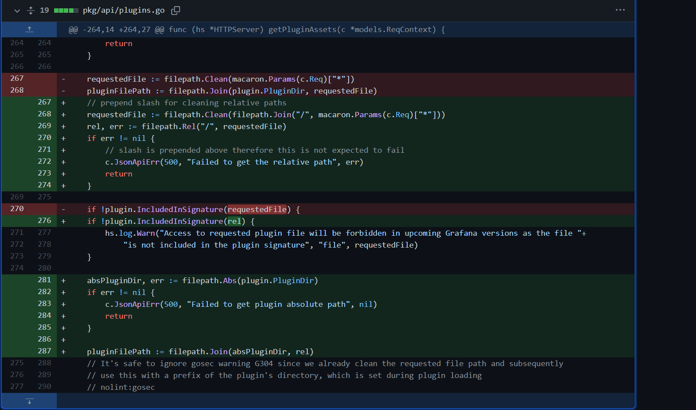

- [CVE-2021-43798 任意文件读取](#cve-2021-43798-任意文件读取)
  - [影响版本](#影响版本)
  - [原理分析](#原理分析)
    - [getPluginAssets()](#getpluginassets)
  - [POC](#poc)
  - [补丁](#补丁)
# CVE-2021-43798 任意文件读取
## 影响版本
Grafana 8.3.x < 8.3.1
Grafana 8.2.x < 8.2.7
Grafana 8.1.x < 8.1.8
Grafana 8.0.x < 8.0.7
## 原理分析
漏洞原理主要是在Grafana API接口中有一个函数`getPluginAssets()`,用于返回插件所需静态文件,如JS,PNG文件等,但该静态文件名未经过滤直接拼接到读取文件的路径中,导致可以路径穿越导致本地任意文件读取,同时该API未经过鉴权导致可以未授权访问该API.
### getPluginAssets()
漏洞代码如下:

从注释可以看到该函数的路由,首先`pluginId`为插件名称,后面跟插件所需资源文件的名称.
首先获取到插件名称后,调用`plugin.PluginDir`得到该插件路径,然后直接和`requestedFile`做拼接得到完整的路径.
```go
	requestedFile := filepath.Clean(macaron.Params(c.Req)["*"])
	pluginFilePath := filepath.Join(plugin.PluginDir, requestedFile)
```
后续直接调用了`os.Open(pluginFilePath)`打开该文件后返回到了Response中.

## POC
Grafana默认可用插件路径如下:
```
/public/plugins/alertGroups/
/public/plugins/alertlist/
/public/plugins/annolist/
/public/plugins/barchart/
/public/plugins/bargauge/
/public/plugins/canvas/
/public/plugins/dashlist/
/public/plugins/debug/
/public/plugins/gauge/
/public/plugins/geomap/
/public/plugins/gettingstarted/
/public/plugins/graph/
/public/plugins/heatmap/
/public/plugins/histogram/
/public/plugins/live/
/public/plugins/logs/
/public/plugins/news/
/public/plugins/nodeGraph/
/public/plugins/piechart/
/public/plugins/pluginlist/
/public/plugins/stat/
/public/plugins/state-timeline/
/public/plugins/status-history/
/public/plugins/table/
/public/plugins/table-old/
/public/plugins/text/
/public/plugins/timeseries/
/public/plugins/welcome/
/public/plugins/xychart/
/public/plugins/alertmanager/
/public/plugins/cloudwatch/
/public/plugins/dashboard/
/public/plugins/elasticsearch/
/public/plugins/grafana/
/public/plugins/grafana-azure-monitor-datasource/
/public/plugins/graphite/
/public/plugins/influxdb/
/public/plugins/jaeger/
/public/plugins/loki/
/public/plugins/mixed/
/public/plugins/mssql/
/public/plugins/mysql/
/public/plugins/opentsdb/
/public/plugins/postgres/
/public/plugins/prometheus/
/public/plugins/tempo/
/public/plugins/testdata/
/public/plugins/zipkin/
```

## 补丁

调用`filepath.Rel`来获取请求文件名相对于`/`的相对路径,也就是类似于`/../../`相当于`/`的相对路径,相当于过滤了`../`.